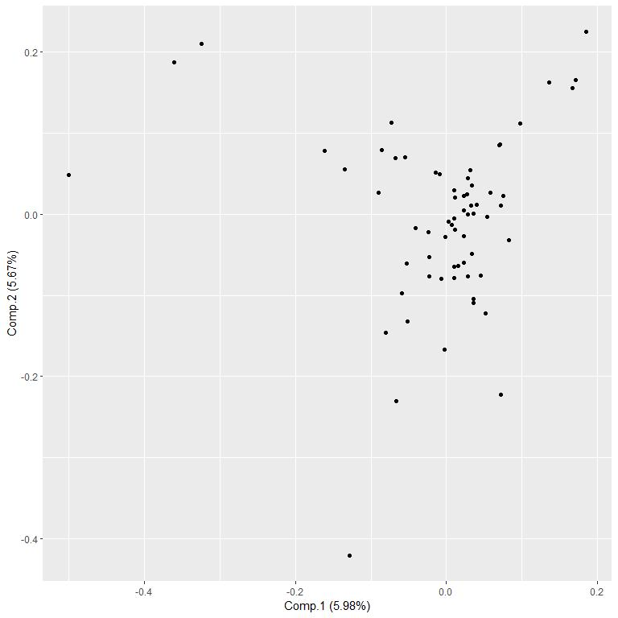

# Load Data


```r
data.loaded <- 
  readr::read_delim(
    file = "data/publications.txt",
    delim = "\t",
    escape_double = FALSE,
    col_names = FALSE,
    trim_ws = TRUE
  )
```

```
## Rows: 97 Columns: 1
```

```
## -- Column specification --------------------------------------------------------
## Delimiter: "\t"
## chr (1): X1
```

```
## 
## i Use `spec()` to retrieve the full column specification for this data.
## i Specify the column types or set `show_col_types = FALSE` to quiet this message.
```
# Format Data into Data Frame


```r
data <- unlist( data.loaded )
```

```
## Warning: One or more parsing issues, see `problems()` for details
```

```r
data <- data[ 1:( length( data ) - 4 ) ]

data <-
  matrix(
    data = unlist( data ),
    ncol = 3,
    byrow = TRUE
  )

colnames( data ) <-
  c(
    "Title",
    "Authors",
    "Journal"
  )

data <-
  data.frame(
    data,
    stringsAsFactors = FALSE
  )
```

# Convert Titles to Lower Case


```r
data$"Title.lower" <-
  tolower( data$"Title" )

# Neutralize plurals and verbs.

# data$"Title.lower" <-
#   stringr::str_replace_all(
#     string = data$"Title.lower",
#     pattern = "(s\\s)",
#     replacement = " "
#   )
# 
# data$"Title.lower" <-
#   stringr::str_replace_all(
#     string = data$"Title.lower",
#     pattern = "(s\\:)",
#     replacement = ""
#   )
# 
# data$"Title.lower" <-
#   stringr::str_replace_all(
#     string = data$"Title.lower",
#     pattern = "(s$)",
#     replacement = ""
#   )

data$"Title.lower" <-
  stringr::str_replace_all(
    string = data$"Title.lower",
    # pattern = "type 1 diabete",
    pattern = "type 1 diabetes",
    replacement = "type_1_diabetes"
  )

data$"Title.lower" <-
  stringr::str_replace_all(
    string = data$"Title.lower",
    # pattern = "type 2 diabete",
    pattern = "type 2 diabetes",
    replacement = "type_2_diabetes"
  )
```

# Omit Punctuation from Titles


```r
words <-
  stringr::str_split(
    string = data[ , "Title.lower" ],
    pattern = "\\s"
  )

words <- 
  lapply(
    X = words,
    FUN = tolower
  )

words <-
  lapply(
    X = words,
    FUN = stringr::str_replace_all,
    pattern = "(\\()|(\\))|(\\:)|(\\,)|(\\.)",
    replacement = ""
  )

table.words <- 
  sort(
    x = table( unlist( words ) ),
    decreasing = TRUE
  )
```
# Extract Unique Words


```r
words.unique <-
  sort(
    unique(
      unlist( words ) )
  )
```

# Define List of Blocked Words


```r
blocklist <-
  c(
    "in",
    "of",
    "and",
    "the",
    "with",
    "for",
    "from",
    "to",
    "...",
    "an",
    "at",
    "on",
    letters,
    "after",
    "are",
    "as",
    "based",
    "by",
    "do",
    "is",
    "not",
    "without",
    "through",
    "during"
  )

# words.unique <- words.unique[ !( words.unique %in% blocklist ) ]

blocklist <- 
  c(
    blocklist,
    words.unique[ grepl( x = words.unique, pattern = "^[0-9]+$" ) ]
  )
```


```r
words <-
  lapply(
    X = words,
    FUN = function( x ) {
      x[ !( x %in% blocklist ) ]
    }
  )
```

# Re-Extract Unique Words


```r
words.unique <-
  sort(
    unique(
      unlist( words ) )
  )
```

# Create the Words-by-Articles Matrix


```r
wba <-
  array(
    data = 0,
    dim = c( length( words.unique ), nrow( data ) )
  )

rownames( wba ) <- words.unique
colnames( wba ) <- data[ , "Title" ]

for ( i in 1:nrow( data ) ) {
  
  wba[ words[[ i ]], i ] <- 1
  
}
```

## Log-Transform Occurrences


```r
wba.log1px <- log10( 1 + wba )
```

## Compute PCA


```r
wba.norm <- scale( wba.log1px )
# wba.norm <- scale( wba )

result.pca <-
  princomp(
    x = wba.norm
  )
```

# Plot PCA


```r
library( "ggfortify" )
```

```
## Warning: package 'ggfortify' was built under R version 4.0.5
```

```
## Loading required package: ggplot2
```

```
## Warning: package 'ggplot2' was built under R version 4.0.5
```

```r
plot <-
  autoplot( 
    result.pca
    ,
    # loadings = TRUE,
    # loadings.label = TRUE
  )

print( plot )
```

<!-- -->

# Cluster Words


```r
result.clustering <-
  cluster::pam(
    x = wba.norm,
    k = 8
  )
```

# Prepare Data for Plot


```r
jitter <- 1

data.plot <-
  data.frame(
    Word = rownames( result.pca$"scores" ),
    result.pca$"scores"
  )

# data.plot$"Comp.1.jittered" <- 
#   data.plot$"Comp.1" + 
#   rnorm(
#     n = nrow( data.plot ),
#     sd = jitter
#   )
# 
# data.plot$"Comp.2.jittered" <- 
#   data.plot$"Comp.2" + 
#   rnorm(
#     n = nrow( data.plot ),
#     sd = jitter
#   )

data.plot$"Distance" <- 
  sqrt( data.plot$"Comp.1"^2 + data.plot$"Comp.2"^2 ) + 1

data.plot$"Term" <-
  stringr::str_replace_all(
    string = data.plot$"Word",
    pattern = "\\-",
    replacement = "-\n"
  )

data.plot$"Term" <-
  stringr::str_replace_all(
    string = data.plot$"Word",
    pattern = "\\_",
    replacement = "\n"
  )

data.plot$"Cluster" <- 
  as.factor( result.clustering$"clustering" )
  # as.factor(
  #   paste(
  #     "C",
  #     result.clustering$"clustering"
  #   )
  # )

data.plot$"Publications" <-
  # tmp <-
  apply(
    X = wba[ data.plot$"Word", ] == 1,
    MAR = 1,
    FUN = function( x ) {
      paste(
        "\n",
        names(
          which( x )
        ),
        collapse = "\n"
      )
      # names( which( x ) )
    }
  )
```

# Define the Figure


```r
palette <- RColorBrewer::brewer.pal( n = 9, "Set1" )[ -6 ]

plot <-
  ggplot2::ggplot(
    data = data.plot,
    mapping =
      ggplot2::aes(
        x = Comp.2,
        y = Comp.1,
        label = Term,
        size = Distance,
        text = Publications
        ,
        color = Cluster,
      )
  ) +
  # ggplot2::geom_point() +
  ggplot2::geom_text(
    position =
      ggplot2::position_jitter(
        height = jitter,
        width = jitter
      )
    # ,
    # show_guide = FALSE
  ) +
  ggplot2::scale_x_continuous( trans = "pseudo_log" ) +
  ggplot2::scale_y_continuous( trans = "pseudo_log" ) +
  ggplot2::theme(
    axis.text = ggplot2::element_blank(),
    axis.ticks = ggplot2::element_blank()
    # ,
    # legend.position = "none"
  ) +
  ggplot2::xlab( label = "" ) +
  ggplot2::ylab( label = "" ) +
  ggplot2::scale_color_manual( values = palette )
#+
  # ggplot2::scale_color_brewer( palette = "Set1" )
# +
  # ggplot2::theme_classic()
```

# Create the Interactive Figure


```r
library( tidyr )

plot.interactive <-
  plotly::ggplotly( 
    p = plot,
    tooltip = c( "label", "Publications" )
  ) %>%
  plotly::layout(
    legend = 
      list(
        orientation = "h",
        title = list( text = "Cluster" ),
        x = quantile( x = data.plot$"Comp.2", probs = 0.67 ),
        y = min( data.plot$"Comp.1" )
      )
  )
```

# View the Interactive Figure


```r
plot.interactive
```

```{=html}
<div id="htmlwidget-074357258281b3e18f05" style="width:768px;height:768px;" class="plotly html-widget"></div>
<script type="application/json" data-for="htmlwidget-074357258281b3e18f05">{"x":{"data":[{"x":[-1.35320406790281,-0.283126405812464,-0.643312099097536,-0.742484056938148,0.202924870712444,0.947683810951278,0.171310072591289,-0.873497106308356,-0.17637846543105,0.55640833621262,0.414765112394228,0.522668907512315,0.196099845053389,-0.916682908484951,-0.354108796628431],"y":[-0.00660660315020553,-0.157679328184742,0.866941412223963,-0.30285623354846,1.10738077085697,1.29420561210455,-0.598367097077432,0.231166544614819,-0.574211815593305,0.275737073982594,1.15359030502149,1.28706959872304,0.488414132280735,-0.616455726081046,-0.483293379878166],"text":["…","avon","blood-based","changes","childhood","development","early","evidence","experiences","integrated","later","longitudinal","point","preceding","proteomics"],"hovertext":["Term: …<br /><br /> Primary fatty amides in plasma associated with brain amyloid burden, hippocampal volume, and memory in the European Medical Information Framework for Alzheimer's Disease …<br /><br /> Metabolomic assessment reveals alteration in polyols and branched chain amino acids associated with present and future renal impairment in a discovery cohort of 637 persons …<br /><br /> Integrated lipidomics and proteomics point to early blood-based changes in childhood preceding later development of psychotic experiences: evidence from the Avon Longitudinal …","Term: avon<br /><br /> Identification of a plasma signature of psychotic disorder in children and adolescents from the Avon Longitudinal Study of Parents and Children (ALSPAC) cohort<br /><br /> Integrated lipidomics and proteomics point to early blood-based changes in childhood preceding later development of psychotic experiences: evidence from the Avon Longitudinal …","Term: blood-based<br /><br /> Integrated lipidomics and proteomics point to early blood-based changes in childhood preceding later development of psychotic experiences: evidence from the Avon Longitudinal …","Term: changes<br /><br /> Integrated lipidomics and proteomics point to early blood-based changes in childhood preceding later development of psychotic experiences: evidence from the Avon Longitudinal …<br /><br /> Changes in the lipidome in type 1 diabetes following low carbohydrate diet: Post-hoc analysis of a randomized crossover trial","Term: childhood<br /><br /> Integrated lipidomics and proteomics point to early blood-based changes in childhood preceding later development of psychotic experiences: evidence from the Avon Longitudinal …","Term: development<br /><br /> Serum metabolite profile associates with the development of metabolic co-morbidities in first-episode psychosis<br /><br /> Molecular Atlas of Postnatal Mouse Heart Development<br /><br /> Integrated lipidomics and proteomics point to early blood-based changes in childhood preceding later development of psychotic experiences: evidence from the Avon Longitudinal …","Term: early<br /><br /> Integrated lipidomics and proteomics point to early blood-based changes in childhood preceding later development of psychotic experiences: evidence from the Avon Longitudinal …","Term: evidence<br /><br /> Integrated lipidomics and proteomics point to early blood-based changes in childhood preceding later development of psychotic experiences: evidence from the Avon Longitudinal …","Term: experiences<br /><br /> Integrated lipidomics and proteomics point to early blood-based changes in childhood preceding later development of psychotic experiences: evidence from the Avon Longitudinal …","Term: integrated<br /><br /> Integrated lipidomics and proteomics point to early blood-based changes in childhood preceding later development of psychotic experiences: evidence from the Avon Longitudinal …","Term: later<br /><br /> Integrated lipidomics and proteomics point to early blood-based changes in childhood preceding later development of psychotic experiences: evidence from the Avon Longitudinal …","Term: longitudinal<br /><br /> Identification of a plasma signature of psychotic disorder in children and adolescents from the Avon Longitudinal Study of Parents and Children (ALSPAC) cohort<br /><br /> Integrated lipidomics and proteomics point to early blood-based changes in childhood preceding later development of psychotic experiences: evidence from the Avon Longitudinal …","Term: point<br /><br /> Integrated lipidomics and proteomics point to early blood-based changes in childhood preceding later development of psychotic experiences: evidence from the Avon Longitudinal …","Term: preceding<br /><br /> Integrated lipidomics and proteomics point to early blood-based changes in childhood preceding later development of psychotic experiences: evidence from the Avon Longitudinal …","Term: proteomics<br /><br /> Integrated lipidomics and proteomics point to early blood-based changes in childhood preceding later development of psychotic experiences: evidence from the Avon Longitudinal …"],"textfont":{"size":[9.99470877539863,9.48745738512215,6.96744524536321,7.81788257593737,6.96744524536321,10.8484656232097,6.96744524536321,6.96744524536321,6.96744524536321,6.96744524536321,6.96744524536321,9.48745738512215,6.96744524536321,6.96744524536321,6.96744524536321],"color":"rgba(228,26,28,1)"},"type":"scatter","mode":"text","hoveron":"points","name":"1","legendgroup":"1","showlegend":true,"xaxis":"x","yaxis":"y","hoverinfo":"text","frame":null},{"x":[-0.371275695677734,0.323027819275302,-0.939962894400634,-0.594004352354285,0.961805261149297,-0.469902334605744,-1.03890004696092,-0.206743284185191,0.705364346850109,-0.625626745287883,1.34648068200465,-0.582573603117891,-1.12460637989323,0.240640398690169,0.739296417202488,0.570439841536305,-0.214231700381317,1.45506800520269,0.537929033184371,-0.717387587883133,-1.09348067040633,0.0615924814449667,-0.363598987237391,-0.286831055358758,0.487358940425777,-0.445433827606749,2.24160895418014,-0.0138032667946217,0.271670589333093,-1.70988335048615,1.38882193983579,1.03580876247349,-0.85147270966742,-0.0492866403111605,1.14879469412351,1.4892627079509,1.3662958110647,-0.951630936517226,1.81689992700262,-1.42678882995662,0.0686563951421207,-0.722866420877007,-0.513245825775522,0.806180636807571,-0.137915023942679,0.0924204250554958,0.272378732576483,1.0394858939291,0.50743972148025,0.846025320516172,-0.663203395793522,-0.288224604028123,0.715681104335379,0.574193723111643,1.15125818482572,-0.165751005393853,0.0147996130247272,0.279641873101233,-0.401057168586232,0.170664260107319,1.79018682904009,-0.754959694537178,-0.728614548929807,-0.421936933290696,0.363156106311051,0.838120710165319,0.262762976798384,-2.07613419122167,-1.39631438630239,0.533963472069395,0.791082459767149,0.323945436441544,0.797578271588003,-0.434366862705959,-0.282932600904196,-0.28542079462539,0.465038717196754,-1.20337122666139,-0.812038184014549,1.38484171741852,0.594789292275204,0.0328504777040444,-1.15166079101852,-0.0534461317736053,0.6083452750787,1.62849026799688,2.46109356632228,-0.517545193495729,-0.0665005475979115,0.336495766825269,-0.643362584229446,-0.0110460209826158,0.260961040792486,1.22192884342259,0.15338008652572,-1.36567224830157,-1.23023308918681,0.273664192249221,-0.32457337716253,0.0252934282656937,0.651514336812687,-0.466754451093577,-0.346869927102529,-0.376993021181581,-0.630062128773267,-0.926716917831338,-1.1412073579159,-0.987550943585888,0.701002504021089,-0.114366820571732,-0.875855783637501,0.189971643163423,0.94082820193625,-0.902050526403596,-0.204653866463542,-1.40481778083137,0.154040099852518,-1.26493934344268,-0.164679968296202,0.992258426837861,0.695272661829739,0.294697218331668,0.166310798186969,0.0563308743594064,-0.101560484491772,-0.620802272321709,0.0527827737864285,-0.219306769995299,1.36484673335252,0.287385669923984,0.512195440838574,-2.90145345515349,0.865367490786283,1.24482446284608],"y":[0.509693913394338,0.70551917000744,0.484209248287533,0.315011425258503,1.13371557676265,-0.380803946640423,-0.862933391577076,-0.514723886931003,0.299000429893615,-0.409580709905592,-1.6878487703203,0.31295771520019,0.287342155324998,0.771268293339378,-0.205008391507591,-0.0152410979649409,0.386867933398042,-1.3183995576357,0.532561024142359,-0.999819009592054,-1.06644663108889,-0.45973043146473,1.09595148669361,0.763152708104192,0.084461104293303,0.536457929674981,0.314397271529767,-0.315963540109487,0.259305849749214,0.463563792679179,-1.26502921328233,0.727966496414842,0.918069597967849,-0.773970727183519,-1.2841029176689,0.201739028304307,0.409538195333774,-0.0430352579467373,-2.57866911788436,0.117162938336167,-0.365914957471229,0.262598143739537,0.760678124121161,-0.229898818498166,0.971147036762295,-0.709122566083517,0.63556190783246,-1.25121119713553,0.0996573476534901,0.829780816338983,0.415125739838547,0.441975553646646,-0.23106924912822,-1.43674921020631,-0.524266598300564,-0.29944817698755,0.60916028895167,-0.726631927195052,-0.27170645682707,0.589790610866933,1.47706333447728,-1.4833589502582,-0.205630691872998,0.210000747983293,0.419621176499517,-0.238414873474009,-0.136004740890472,-1.66660674067193,-0.502364332407268,0.584815952587835,-0.0593668648982086,0.759528329368707,0.105179182797289,0.380903803406586,0.0210142355153968,-0.274549006511686,-0.476553700704722,0.721970308740572,-0.0681687493362337,-0.693331186431962,-0.092031210751725,1.20039012534284,0.476789245975692,-0.0130384389615309,0.396432846969958,-1.37081063990653,-1.65834179172985,0.685593979127111,-0.598193575955787,0.379188855449049,0.135573960141963,-0.541893267194839,-0.32041667991191,1.52077795250839,0.818567140931966,-1.05357732657574,-0.29213331130263,-1.27043773500625,-0.280816016469772,0.543381783418384,0.879369209958943,1.4833195307753,1.23691821598345,-0.371109072346214,-0.128586152024948,-0.838560336502516,-0.225728271868117,-0.239389571265286,1.2561847352007,0.134870004754959,0.57075909408716,0.841505469985226,0.439206039145208,1.29842881373161,0.607725738664476,-0.894229261076521,-1.16926299715504,-0.25676095007218,0.516118412356351,-0.393113796371538,0.861527235537274,-0.57587232316108,0.416033702302123,-0.131425251375051,0.25324908381416,0.321400272617046,1.22096868162605,-0.146541452986675,-1.25715063025853,0.672334556663806,-1.7924660401261,-0.248752400505157,0.338689432892592,0.202040318264957],"text":["abnormalities","acids","adipose","adolescent","adolescents","albuminuria","all-cause","alspac","alteration","amino","analysis","areas","assessment","associates","atlas","bayesian","between","biomarkers","body","branched","carbohydrate","chain","characterization","children","cimt","circulating","clinical","clusters","co-morbidities","cohort","collinear","compound","copenhagen","correlations","cross-organism","cross-species","cross-validation","crossover","data","diabetic","diet","dipis","discovery","disorder","distinct","diversity","effect","factor","findings","finnish","first-episode","following","future","graphical","group","gut","heart","high-dimensional","human","identification","imi-rhapsody","impairment","increased","insulin","level","lipidome","lipidomer","lipidomic","lipids","low","mass","men","metabolic","metabolite","metabolites","metabolomic","metabolomics","metformin","microbiota","modeling","models","molecular","mortality","mouse","multi-peak","multi-source","multi-way","multiple","multivariate","parents","pathogenesis","patients","peaks","people","persons","phosphatidylcholine","polyols","post‐hoc","postnatal","predictive","present","profile","profiling","progression","psychosis","quantitative","randomized","renal","replication","retinopathy","review","selected","serum","signature","signatures","species","spectral","sphingomyelin","stratification","stronger","study","subjects","subtypes","targeted","therapy","tissue","tool","toxicogenomics","translation","trial","two-way","type<br />1<br />diabetes","understanding","variables"],"hovertext":["Term: abnormalities<br /><br /> Lipidomic Abnormalities During the Pathogenesis of Type 1 Diabetes: a Quantitative Review","Term: acids<br /><br /> Metabolomic assessment reveals alteration in polyols and branched chain amino acids associated with present and future renal impairment in a discovery cohort of 637 persons …","Term: adipose<br /><br /> Lipidomics of human adipose tissue reveals diversity between body areas","Term: adolescent<br /><br /> Characterization of plasma lipidomics in adolescent subjects with increased risk for type 1 diabetes in the DiPiS cohort","Term: adolescents<br /><br /> Identification of a plasma signature of psychotic disorder in children and adolescents from the Avon Longitudinal Study of Parents and Children (ALSPAC) cohort","Term: albuminuria<br /><br /> Gut microbiota profile and selected plasma metabolites in type 1 diabetes without and with stratification by albuminuria","Term: all-cause<br /><br /> Lipidomic analysis reveals sphingomyelin and phosphatidylcholine species associated with renal impairment and all-cause mortality in type 1 diabetes","Term: alspac<br /><br /> Identification of a plasma signature of psychotic disorder in children and adolescents from the Avon Longitudinal Study of Parents and Children (ALSPAC) cohort","Term: alteration<br /><br /> Metabolomic assessment reveals alteration in polyols and branched chain amino acids associated with present and future renal impairment in a discovery cohort of 637 persons …","Term: amino<br /><br /> Metabolomic assessment reveals alteration in polyols and branched chain amino acids associated with present and future renal impairment in a discovery cohort of 637 persons …","Term: analysis<br /><br /> Multivariate multi-way analysis of multi-source data<br /><br /> Two-way analysis of high-dimensional collinear data<br /><br /> Lipidomic analysis reveals sphingomyelin and phosphatidylcholine species associated with renal impairment and all-cause mortality in type 1 diabetes<br /><br /> Cross-organism toxicogenomics with group factor analysis<br /><br /> Changes in the lipidome in type 1 diabetes following low carbohydrate diet: Post-hoc analysis of a randomized crossover trial","Term: areas<br /><br /> Lipidomics of human adipose tissue reveals diversity between body areas","Term: assessment<br /><br /> Metabolomic assessment reveals alteration in polyols and branched chain amino acids associated with present and future renal impairment in a discovery cohort of 637 persons …","Term: associates<br /><br /> Serum metabolite profile associates with the development of metabolic co-morbidities in first-episode psychosis","Term: atlas<br /><br /> Molecular Atlas of Postnatal Mouse Heart Development","Term: bayesian<br /><br /> Stronger findings for metabolomics through Bayesian modeling of multiple peaks and compound correlations","Term: between<br /><br /> Lipidomics of human adipose tissue reveals diversity between body areas","Term: biomarkers<br /><br /> Cross-species translation of multi-way biomarkers","Term: body<br /><br /> Lipidomics of human adipose tissue reveals diversity between body areas","Term: branched<br /><br /> Metabolomic assessment reveals alteration in polyols and branched chain amino acids associated with present and future renal impairment in a discovery cohort of 637 persons …","Term: carbohydrate<br /><br /> Changes in the lipidome in type 1 diabetes following low carbohydrate diet: Post-hoc analysis of a randomized crossover trial","Term: chain<br /><br /> Metabolomic assessment reveals alteration in polyols and branched chain amino acids associated with present and future renal impairment in a discovery cohort of 637 persons …","Term: characterization<br /><br /> Characterization of plasma lipidomics in adolescent subjects with increased risk for type 1 diabetes in the DiPiS cohort","Term: children<br /><br /> Identification of a plasma signature of psychotic disorder in children and adolescents from the Avon Longitudinal Study of Parents and Children (ALSPAC) cohort","Term: cimt<br /><br /> Effect of metformin on plasma metabolite profile in the Copenhagen Insulin and Metformin Therapy (CIMT) trial","Term: circulating<br /><br /> Circulating metabolites and lipids are associated to diabetic retinopathy in individuals With type 1 diabetes","Term: clinical<br /><br /> Targeted Clinical Metabolite Profiling Platform for the Stratification of Diabetic Patients<br /><br /> Replication and cross-validation of type 2 diabetes subtypes based on clinical variables: an IMI-RHAPSODY study<br /><br /> Distinct molecular signatures of clinical clusters in people with type 2 diabetes: an IMI-RHAPSODY study","Term: clusters<br /><br /> Distinct molecular signatures of clinical clusters in people with type 2 diabetes: an IMI-RHAPSODY study","Term: co-morbidities<br /><br /> Serum metabolite profile associates with the development of metabolic co-morbidities in first-episode psychosis","Term: cohort<br /><br /> Identification of a plasma signature of psychotic disorder in children and adolescents from the Avon Longitudinal Study of Parents and Children (ALSPAC) cohort<br /><br /> Metabolomic assessment reveals alteration in polyols and branched chain amino acids associated with present and future renal impairment in a discovery cohort of 637 persons …<br /><br /> Characterization of plasma lipidomics in adolescent subjects with increased risk for type 1 diabetes in the DiPiS cohort","Term: collinear<br /><br /> Two-way analysis of high-dimensional collinear data","Term: compound<br /><br /> Stronger findings for metabolomics through Bayesian modeling of multiple peaks and compound correlations","Term: copenhagen<br /><br /> Effect of metformin on plasma metabolite profile in the Copenhagen Insulin and Metformin Therapy (CIMT) trial","Term: correlations<br /><br /> Stronger findings for metabolomics through Bayesian modeling of multiple peaks and compound correlations","Term: cross-organism<br /><br /> Cross-organism toxicogenomics with group factor analysis","Term: cross-species<br /><br /> Cross-species translation of multi-way biomarkers","Term: cross-validation<br /><br /> Replication and cross-validation of type 2 diabetes subtypes based on clinical variables: an IMI-RHAPSODY study","Term: crossover<br /><br /> Changes in the lipidome in type 1 diabetes following low carbohydrate diet: Post-hoc analysis of a randomized crossover trial","Term: data<br /><br /> Multivariate multi-way analysis of multi-source data<br /><br /> Two-way analysis of high-dimensional collinear data<br /><br /> Stronger findings from mass spectral data through multi-peak modeling","Term: diabetic<br /><br /> Targeted Clinical Metabolite Profiling Platform for the Stratification of Diabetic Patients<br /><br /> Circulating metabolites and lipids are associated to diabetic retinopathy in individuals With type 1 diabetes","Term: diet<br /><br /> Changes in the lipidome in type 1 diabetes following low carbohydrate diet: Post-hoc analysis of a randomized crossover trial","Term: dipis<br /><br /> Characterization of plasma lipidomics in adolescent subjects with increased risk for type 1 diabetes in the DiPiS cohort","Term: discovery<br /><br /> Metabolomic assessment reveals alteration in polyols and branched chain amino acids associated with present and future renal impairment in a discovery cohort of 637 persons …","Term: disorder<br /><br /> Identification of a plasma signature of psychotic disorder in children and adolescents from the Avon Longitudinal Study of Parents and Children (ALSPAC) cohort","Term: distinct<br /><br /> Distinct molecular signatures of clinical clusters in people with type 2 diabetes: an IMI-RHAPSODY study","Term: diversity<br /><br /> Lipidomics of human adipose tissue reveals diversity between body areas","Term: effect<br /><br /> Effect of metformin on plasma metabolite profile in the Copenhagen Insulin and Metformin Therapy (CIMT) trial","Term: factor<br /><br /> Cross-organism toxicogenomics with group factor analysis","Term: findings<br /><br /> Stronger findings from mass spectral data through multi-peak modeling<br /><br /> Stronger findings for metabolomics through Bayesian modeling of multiple peaks and compound correlations","Term: finnish<br /><br /> Lipidome as a predictive tool in progression to type 2 diabetes in Finnish men","Term: first-episode<br /><br /> Serum metabolite profile associates with the development of metabolic co-morbidities in first-episode psychosis","Term: following<br /><br /> Changes in the lipidome in type 1 diabetes following low carbohydrate diet: Post-hoc analysis of a randomized crossover trial","Term: future<br /><br /> Metabolomic assessment reveals alteration in polyols and branched chain amino acids associated with present and future renal impairment in a discovery cohort of 637 persons …","Term: graphical<br /><br /> Graphical multi-way models","Term: group<br /><br /> Cross-organism toxicogenomics with group factor analysis","Term: gut<br /><br /> Gut microbiota profile and selected plasma metabolites in type 1 diabetes without and with stratification by albuminuria","Term: heart<br /><br /> Molecular Atlas of Postnatal Mouse Heart Development","Term: high-dimensional<br /><br /> Two-way analysis of high-dimensional collinear data","Term: human<br /><br /> Lipidomics of human adipose tissue reveals diversity between body areas","Term: identification<br /><br /> Identification of a plasma signature of psychotic disorder in children and adolescents from the Avon Longitudinal Study of Parents and Children (ALSPAC) cohort","Term: imi-rhapsody<br /><br /> Replication and cross-validation of type 2 diabetes subtypes based on clinical variables: an IMI-RHAPSODY study<br /><br /> Distinct molecular signatures of clinical clusters in people with type 2 diabetes: an IMI-RHAPSODY study","Term: impairment<br /><br /> Lipidomic analysis reveals sphingomyelin and phosphatidylcholine species associated with renal impairment and all-cause mortality in type 1 diabetes<br /><br /> Metabolomic assessment reveals alteration in polyols and branched chain amino acids associated with present and future renal impairment in a discovery cohort of 637 persons …","Term: increased<br /><br /> Characterization of plasma lipidomics in adolescent subjects with increased risk for type 1 diabetes in the DiPiS cohort","Term: insulin<br /><br /> Effect of metformin on plasma metabolite profile in the Copenhagen Insulin and Metformin Therapy (CIMT) trial","Term: level<br /><br /> Understanding the Lipidome at the Systems Level with lipidomeR","Term: lipidome<br /><br /> Lipidome as a predictive tool in progression to type 2 diabetes in Finnish men<br /><br /> Understanding the Lipidome at the Systems Level with lipidomeR<br /><br /> Changes in the lipidome in type 1 diabetes following low carbohydrate diet: Post-hoc analysis of a randomized crossover trial","Term: lipidomer<br /><br /> Understanding the Lipidome at the Systems Level with lipidomeR","Term: lipidomic<br /><br /> Lipidomic analysis reveals sphingomyelin and phosphatidylcholine species associated with renal impairment and all-cause mortality in type 1 diabetes<br /><br /> Lipidomic Abnormalities During the Pathogenesis of Type 1 Diabetes: a Quantitative Review","Term: lipids<br /><br /> Circulating metabolites and lipids are associated to diabetic retinopathy in individuals With type 1 diabetes","Term: low<br /><br /> Changes in the lipidome in type 1 diabetes following low carbohydrate diet: Post-hoc analysis of a randomized crossover trial","Term: mass<br /><br /> Stronger findings from mass spectral data through multi-peak modeling","Term: men<br /><br /> Lipidome as a predictive tool in progression to type 2 diabetes in Finnish men","Term: metabolic<br /><br /> Serum metabolite profile associates with the development of metabolic co-morbidities in first-episode psychosis","Term: metabolite<br /><br /> Serum metabolite profile associates with the development of metabolic co-morbidities in first-episode psychosis<br /><br /> Effect of metformin on plasma metabolite profile in the Copenhagen Insulin and Metformin Therapy (CIMT) trial<br /><br /> Targeted Clinical Metabolite Profiling Platform for the Stratification of Diabetic Patients","Term: metabolites<br /><br /> Circulating metabolites and lipids are associated to diabetic retinopathy in individuals With type 1 diabetes<br /><br /> Gut microbiota profile and selected plasma metabolites in type 1 diabetes without and with stratification by albuminuria","Term: metabolomic<br /><br /> Metabolomic assessment reveals alteration in polyols and branched chain amino acids associated with present and future renal impairment in a discovery cohort of 637 persons …","Term: metabolomics<br /><br /> Stronger findings for metabolomics through Bayesian modeling of multiple peaks and compound correlations","Term: metformin<br /><br /> Effect of metformin on plasma metabolite profile in the Copenhagen Insulin and Metformin Therapy (CIMT) trial","Term: microbiota<br /><br /> Gut microbiota profile and selected plasma metabolites in type 1 diabetes without and with stratification by albuminuria","Term: modeling<br /><br /> Stronger findings from mass spectral data through multi-peak modeling<br /><br /> Stronger findings for metabolomics through Bayesian modeling of multiple peaks and compound correlations","Term: models<br /><br /> Graphical multi-way models","Term: molecular<br /><br /> Molecular Atlas of Postnatal Mouse Heart Development<br /><br /> Distinct molecular signatures of clinical clusters in people with type 2 diabetes: an IMI-RHAPSODY study","Term: mortality<br /><br /> Lipidomic analysis reveals sphingomyelin and phosphatidylcholine species associated with renal impairment and all-cause mortality in type 1 diabetes","Term: mouse<br /><br /> Molecular Atlas of Postnatal Mouse Heart Development","Term: multi-peak<br /><br /> Stronger findings from mass spectral data through multi-peak modeling","Term: multi-source<br /><br /> Multivariate multi-way analysis of multi-source data","Term: multi-way<br /><br /> Multivariate multi-way analysis of multi-source data<br /><br /> Graphical multi-way models<br /><br /> Cross-species translation of multi-way biomarkers","Term: multiple<br /><br /> Stronger findings for metabolomics through Bayesian modeling of multiple peaks and compound correlations","Term: multivariate<br /><br /> Multivariate multi-way analysis of multi-source data","Term: parents<br /><br /> Identification of a plasma signature of psychotic disorder in children and adolescents from the Avon Longitudinal Study of Parents and Children (ALSPAC) cohort","Term: pathogenesis<br /><br /> Lipidomic Abnormalities During the Pathogenesis of Type 1 Diabetes: a Quantitative Review","Term: patients<br /><br /> Targeted Clinical Metabolite Profiling Platform for the Stratification of Diabetic Patients","Term: peaks<br /><br /> Stronger findings for metabolomics through Bayesian modeling of multiple peaks and compound correlations","Term: people<br /><br /> Distinct molecular signatures of clinical clusters in people with type 2 diabetes: an IMI-RHAPSODY study","Term: persons<br /><br /> Metabolomic assessment reveals alteration in polyols and branched chain amino acids associated with present and future renal impairment in a discovery cohort of 637 persons …","Term: phosphatidylcholine<br /><br /> Lipidomic analysis reveals sphingomyelin and phosphatidylcholine species associated with renal impairment and all-cause mortality in type 1 diabetes","Term: polyols<br /><br /> Metabolomic assessment reveals alteration in polyols and branched chain amino acids associated with present and future renal impairment in a discovery cohort of 637 persons …","Term: post-hoc<br /><br /> Changes in the lipidome in type 1 diabetes following low carbohydrate diet: Post-hoc analysis of a randomized crossover trial","Term: postnatal<br /><br /> Molecular Atlas of Postnatal Mouse Heart Development","Term: predictive<br /><br /> Lipidome as a predictive tool in progression to type 2 diabetes in Finnish men","Term: present<br /><br /> Metabolomic assessment reveals alteration in polyols and branched chain amino acids associated with present and future renal impairment in a discovery cohort of 637 persons …","Term: profile<br /><br /> Serum metabolite profile associates with the development of metabolic co-morbidities in first-episode psychosis<br /><br /> Effect of metformin on plasma metabolite profile in the Copenhagen Insulin and Metformin Therapy (CIMT) trial<br /><br /> Gut microbiota profile and selected plasma metabolites in type 1 diabetes without and with stratification by albuminuria","Term: profiling<br /><br /> Targeted Clinical Metabolite Profiling Platform for the Stratification of Diabetic Patients","Term: progression<br /><br /> Lipidome as a predictive tool in progression to type 2 diabetes in Finnish men","Term: psychosis<br /><br /> Serum metabolite profile associates with the development of metabolic co-morbidities in first-episode psychosis","Term: quantitative<br /><br /> Lipidomic Abnormalities During the Pathogenesis of Type 1 Diabetes: a Quantitative Review","Term: randomized<br /><br /> Changes in the lipidome in type 1 diabetes following low carbohydrate diet: Post-hoc analysis of a randomized crossover trial","Term: renal<br /><br /> Lipidomic analysis reveals sphingomyelin and phosphatidylcholine species associated with renal impairment and all-cause mortality in type 1 diabetes<br /><br /> Metabolomic assessment reveals alteration in polyols and branched chain amino acids associated with present and future renal impairment in a discovery cohort of 637 persons …","Term: replication<br /><br /> Replication and cross-validation of type 2 diabetes subtypes based on clinical variables: an IMI-RHAPSODY study","Term: retinopathy<br /><br /> Circulating metabolites and lipids are associated to diabetic retinopathy in individuals With type 1 diabetes","Term: review<br /><br /> Lipidomic Abnormalities During the Pathogenesis of Type 1 Diabetes: a Quantitative Review","Term: selected<br /><br /> Gut microbiota profile and selected plasma metabolites in type 1 diabetes without and with stratification by albuminuria","Term: serum<br /><br /> Serum metabolite profile associates with the development of metabolic co-morbidities in first-episode psychosis","Term: signature<br /><br /> Identification of a plasma signature of psychotic disorder in children and adolescents from the Avon Longitudinal Study of Parents and Children (ALSPAC) cohort","Term: signatures<br /><br /> Distinct molecular signatures of clinical clusters in people with type 2 diabetes: an IMI-RHAPSODY study","Term: species<br /><br /> Lipidomic analysis reveals sphingomyelin and phosphatidylcholine species associated with renal impairment and all-cause mortality in type 1 diabetes","Term: spectral<br /><br /> Stronger findings from mass spectral data through multi-peak modeling","Term: sphingomyelin<br /><br /> Lipidomic analysis reveals sphingomyelin and phosphatidylcholine species associated with renal impairment and all-cause mortality in type 1 diabetes","Term: stratification<br /><br /> Targeted Clinical Metabolite Profiling Platform for the Stratification of Diabetic Patients<br /><br /> Gut microbiota profile and selected plasma metabolites in type 1 diabetes without and with stratification by albuminuria","Term: stronger<br /><br /> Stronger findings from mass spectral data through multi-peak modeling<br /><br /> Stronger findings for metabolomics through Bayesian modeling of multiple peaks and compound correlations","Term: study<br /><br /> Identification of a plasma signature of psychotic disorder in children and adolescents from the Avon Longitudinal Study of Parents and Children (ALSPAC) cohort<br /><br /> Replication and cross-validation of type 2 diabetes subtypes based on clinical variables: an IMI-RHAPSODY study<br /><br /> Distinct molecular signatures of clinical clusters in people with type 2 diabetes: an IMI-RHAPSODY study","Term: subjects<br /><br /> Characterization of plasma lipidomics in adolescent subjects with increased risk for type 1 diabetes in the DiPiS cohort","Term: subtypes<br /><br /> Replication and cross-validation of type 2 diabetes subtypes based on clinical variables: an IMI-RHAPSODY study","Term: targeted<br /><br /> Targeted Clinical Metabolite Profiling Platform for the Stratification of Diabetic Patients","Term: therapy<br /><br /> Effect of metformin on plasma metabolite profile in the Copenhagen Insulin and Metformin Therapy (CIMT) trial","Term: tissue<br /><br /> Lipidomics of human adipose tissue reveals diversity between body areas","Term: tool<br /><br /> Lipidome as a predictive tool in progression to type 2 diabetes in Finnish men","Term: toxicogenomics<br /><br /> Cross-organism toxicogenomics with group factor analysis","Term: translation<br /><br /> Cross-species translation of multi-way biomarkers","Term: trial<br /><br /> Effect of metformin on plasma metabolite profile in the Copenhagen Insulin and Metformin Therapy (CIMT) trial<br /><br /> Changes in the lipidome in type 1 diabetes following low carbohydrate diet: Post-hoc analysis of a randomized crossover trial","Term: two-way<br /><br /> Two-way analysis of high-dimensional collinear data","Term: type<br />1<br />diabetes<br /><br /> Lipidomic analysis reveals sphingomyelin and phosphatidylcholine species associated with renal impairment and all-cause mortality in type 1 diabetes<br /><br /> Circulating metabolites and lipids are associated to diabetic retinopathy in individuals With type 1 diabetes<br /><br /> Gut microbiota profile and selected plasma metabolites in type 1 diabetes without and with stratification by albuminuria<br /><br /> Lipidomic Abnormalities During the Pathogenesis of Type 1 Diabetes: a Quantitative Review<br /><br /> Changes in the lipidome in type 1 diabetes following low carbohydrate diet: Post-hoc analysis of a randomized crossover trial<br /><br /> Characterization of plasma lipidomics in adolescent subjects with increased risk for type 1 diabetes in the DiPiS cohort","Term: understanding<br /><br /> Understanding the Lipidome at the Systems Level with lipidomeR","Term: variables<br /><br /> Replication and cross-validation of type 2 diabetes subtypes based on clinical variables: an IMI-RHAPSODY study"],"textfont":{"size":[10.834091285832,7.41340652642843,5.76412010584984,10.0741811762057,8.20530765357092,10.8002771272787,10.8896061105856,8.20530765357092,7.41340652642843,7.41340652642843,22.6771653543307,5.76412010584984,7.41340652642843,7.56031083578674,9.07930083895269,9.33156346343536,5.76412010584984,11.6680003215845,5.76412010584984,7.41340652642843,8.86031488892488,7.41340652642843,10.0741811762057,8.20530765357092,8.08385701377704,10.850582375681,16.5851461090282,12.2533261350314,7.56031083578674,12.4081167515685,13.70228936948,9.33156346343536,8.08385701377704,9.33156346343536,11.6051856373019,11.6680003215845,12.3272440709231,8.86031488892488,20.6905833920712,10.9406684352733,8.86031488892488,10.0741811762057,7.41340652642843,8.20530765357092,12.2533261350314,5.76412010584984,8.08385701377704,11.6051856373019,13.2207595112712,9.94584026401473,7.56031083578674,8.86031488892488,7.41340652642843,12.5407586654779,11.6051856373019,10.8002771272787,9.07930083895269,13.70228936948,5.76412010584984,8.20530765357092,15.8041798313968,12.3857022172263,10.0741811762057,8.08385701377704,7.76275119884904,9.17177062286652,7.76275119884904,14.330554907375,10.850582375681,8.86031488892488,11.3110029381096,9.94584026401473,7.56031083578674,11.3570310573125,14.3268804400379,7.41340652642843,9.33156346343536,8.08385701377704,10.8002771272787,13.2207595112712,12.5407586654779,13.759036667372,10.8896061105856,9.07930083895269,11.3110029381096,14.866365290156,20.2396570689893,9.33156346343536,14.866365290156,8.20530765357092,10.834091285832,8.66127674619946,9.33156346343536,12.2533261350314,7.41340652642843,10.8896061105856,7.41340652642843,8.86031488892488,9.07930083895269,9.94584026401473,7.41340652642843,13.144283097115,8.66127674619946,9.94584026401473,7.56031083578674,10.834091285832,8.86031488892488,12.3857022172263,12.3272440709231,10.850582375681,10.834091285832,10.8002771272787,7.56031083578674,8.20530765357092,12.2533261350314,10.8896061105856,11.3110029381096,10.8896061105856,11.2589235379919,13.2207595112712,16.2897069347355,10.0741811762057,12.3272440709231,8.66127674619946,8.08385701377704,5.76412010584984,9.94584026401473,11.6051856373019,11.6680003215845,9.62428245899456,13.70228936948,21.2186861670478,7.76275119884904,12.3272440709231],"color":"rgba(55,126,184,1)"},"type":"scatter","mode":"text","hoveron":"points","name":"2","legendgroup":"2","showlegend":true,"xaxis":"x","yaxis":"y","hoverinfo":"text","frame":null},{"x":[-0.644693032855904,0.0363657241512181,-0.636026687471932,-0.441815193990173,-0.513140984362727,-0.504475056211269,0.742025839147353,0.628474594542021,-0.636064103061444,0.838119775039339,0.591116627138695,-0.580525686516231],"y":[0.983710176495547,-0.507103605011766,1.18192852120631,-0.439622067905172,0.384029420742477,0.089677067191983,1.19566358970263,-0.111962375046974,-0.5642649622438,-0.537667712012594,0.605112202370512,0.167071098645861],"text":["account","glucose","high","individuals","inter-individual","intervention","lifestyle","responses","risk","tolerance","type<br />2<br />diabetes","variability"],"hovertext":["Term: account<br /><br /> Phenotypic Responses to a Lifestyle Intervention Do Not Account for Inter-Individual Variability in Glucose Tolerance for Individuals at High Risk of Type 2 Diabetes","Term: glucose<br /><br /> Phenotypic Responses to a Lifestyle Intervention Do Not Account for Inter-Individual Variability in Glucose Tolerance for Individuals at High Risk of Type 2 Diabetes","Term: high<br /><br /> Phenotypic Responses to a Lifestyle Intervention Do Not Account for Inter-Individual Variability in Glucose Tolerance for Individuals at High Risk of Type 2 Diabetes","Term: individuals<br /><br /> Circulating metabolites and lipids are associated to diabetic retinopathy in individuals With type 1 diabetes<br /><br /> Phenotypic Responses to a Lifestyle Intervention Do Not Account for Inter-Individual Variability in Glucose Tolerance for Individuals at High Risk of Type 2 Diabetes","Term: inter-individual<br /><br /> Phenotypic Responses to a Lifestyle Intervention Do Not Account for Inter-Individual Variability in Glucose Tolerance for Individuals at High Risk of Type 2 Diabetes","Term: intervention<br /><br /> Phenotypic Responses to a Lifestyle Intervention Do Not Account for Inter-Individual Variability in Glucose Tolerance for Individuals at High Risk of Type 2 Diabetes","Term: lifestyle<br /><br /> Phenotypic Responses to a Lifestyle Intervention Do Not Account for Inter-Individual Variability in Glucose Tolerance for Individuals at High Risk of Type 2 Diabetes","Term: responses<br /><br /> Phenotypic Responses to a Lifestyle Intervention Do Not Account for Inter-Individual Variability in Glucose Tolerance for Individuals at High Risk of Type 2 Diabetes","Term: risk<br /><br /> Phenotypic Responses to a Lifestyle Intervention Do Not Account for Inter-Individual Variability in Glucose Tolerance for Individuals at High Risk of Type 2 Diabetes<br /><br /> Characterization of plasma lipidomics in adolescent subjects with increased risk for type 1 diabetes in the DiPiS cohort","Term: tolerance<br /><br /> Phenotypic Responses to a Lifestyle Intervention Do Not Account for Inter-Individual Variability in Glucose Tolerance for Individuals at High Risk of Type 2 Diabetes","Term: type<br />2<br />diabetes<br /><br /> Lipidome as a predictive tool in progression to type 2 diabetes in Finnish men<br /><br /> Phenotypic Responses to a Lifestyle Intervention Do Not Account for Inter-Individual Variability in Glucose Tolerance for Individuals at High Risk of Type 2 Diabetes<br /><br /> Replication and cross-validation of type 2 diabetes subtypes based on clinical variables: an IMI-RHAPSODY study<br /><br /> Distinct molecular signatures of clinical clusters in people with type 2 diabetes: an IMI-RHAPSODY study","Term: variability<br /><br /> Phenotypic Responses to a Lifestyle Intervention Do Not Account for Inter-Individual Variability in Glucose Tolerance for Individuals at High Risk of Type 2 Diabetes"],"textfont":{"size":[8.23996450129806,8.23996450129806,8.23996450129806,10.0924606348041,8.23996450129806,8.23996450129806,8.23996450129806,8.23996450129806,9.73035834686988,8.23996450129806,17.9572626227244,8.23996450129806],"color":"rgba(77,175,74,1)"},"type":"scatter","mode":"text","hoveron":"points","name":"3","legendgroup":"3","showlegend":true,"xaxis":"x","yaxis":"y","hoverinfo":"text","frame":null},{"x":[0.157561251094839,0.317152436955175,0.638820235749981,0.922258043794235,0.944482240958413,0.260698112791678,-0.216644407583127,-0.781075438119672,-0.684211443045834,-0.87305170073696,-1.22601573451666,-0.820835100354353],"y":[-0.00273386246422708,0.682251398480586,0.624165489367299,0.281268348015003,0.207954614452176,-0.661715935886748,0.021426561783157,1.09750897353962,0.20728698049774,-0.0366274930388539,-0.364534349320591,-0.660227667511352],"text":["alcohol","ald","comprehensive","differences","hepatic","intoxication","lipid","lipidomics","nafld","phenotypic","reveals","turnover"],"hovertext":["Term: alcohol<br /><br /> Comprehensive lipidomics reveals phenotypic differences in hepatic lipid turnover in ALD and NAFLD during alcohol intoxication","Term: ald<br /><br /> Comprehensive lipidomics reveals phenotypic differences in hepatic lipid turnover in ALD and NAFLD during alcohol intoxication","Term: comprehensive<br /><br /> Comprehensive lipidomics reveals phenotypic differences in hepatic lipid turnover in ALD and NAFLD during alcohol intoxication","Term: differences<br /><br /> Comprehensive lipidomics reveals phenotypic differences in hepatic lipid turnover in ALD and NAFLD during alcohol intoxication","Term: hepatic<br /><br /> Comprehensive lipidomics reveals phenotypic differences in hepatic lipid turnover in ALD and NAFLD during alcohol intoxication","Term: intoxication<br /><br /> Comprehensive lipidomics reveals phenotypic differences in hepatic lipid turnover in ALD and NAFLD during alcohol intoxication","Term: lipid<br /><br /> Comprehensive lipidomics reveals phenotypic differences in hepatic lipid turnover in ALD and NAFLD during alcohol intoxication","Term: lipidomics<br /><br /> Integrated lipidomics and proteomics point to early blood-based changes in childhood preceding later development of psychotic experiences: evidence from the Avon Longitudinal …<br /><br /> Lipidomics of human adipose tissue reveals diversity between body areas<br /><br /> Comprehensive lipidomics reveals phenotypic differences in hepatic lipid turnover in ALD and NAFLD during alcohol intoxication<br /><br /> Characterization of plasma lipidomics in adolescent subjects with increased risk for type 1 diabetes in the DiPiS cohort","Term: nafld<br /><br /> Comprehensive lipidomics reveals phenotypic differences in hepatic lipid turnover in ALD and NAFLD during alcohol intoxication","Term: phenotypic<br /><br /> Phenotypic Responses to a Lifestyle Intervention Do Not Account for Inter-Individual Variability in Glucose Tolerance for Individuals at High Risk of Type 2 Diabetes<br /><br /> Comprehensive lipidomics reveals phenotypic differences in hepatic lipid turnover in ALD and NAFLD during alcohol intoxication","Term: reveals<br /><br /> Lipidomic analysis reveals sphingomyelin and phosphatidylcholine species associated with renal impairment and all-cause mortality in type 1 diabetes<br /><br /> Metabolomic assessment reveals alteration in polyols and branched chain amino acids associated with present and future renal impairment in a discovery cohort of 637 persons …<br /><br /> Lipidomics of human adipose tissue reveals diversity between body areas<br /><br /> Comprehensive lipidomics reveals phenotypic differences in hepatic lipid turnover in ALD and NAFLD during alcohol intoxication","Term: turnover<br /><br /> Comprehensive lipidomics reveals phenotypic differences in hepatic lipid turnover in ALD and NAFLD during alcohol intoxication"],"textfont":{"size":[5.00498499093759,5.00498499093759,5.00498499093759,5.00498499093759,5.00498499093759,5.00498499093759,5.00498499093759,12.2191467805628,5.00498499093759,8.06978828172275,13.4742612165474,5.00498499093759],"color":"rgba(152,78,163,1)"},"type":"scatter","mode":"text","hoveron":"points","name":"4","legendgroup":"4","showlegend":true,"xaxis":"x","yaxis":"y","hoverinfo":"text","frame":null},{"x":[0.60711926358875,-1.04704121363226,0.502580358154439,-0.321910658877975,-0.793098805964626,-0.0878443308441706,-1.09485256069217,0.591848411570602,-0.938358186770863,-1.00416842850733,0.0475104250678055,-0.656933475778139,-0.369427008581049,-0.520812430843541,-0.704504060120023,-0.03764736934442],"y":[0.303510979430163,0.618393170793885,-0.626123793742276,1.02109940457844,0.473524673057133,0.881968488131994,-0.107644905655301,-0.752193084771401,0.249762475637132,0.646524568234914,0.505163705123001,0.251094943059021,-0.257855558155692,0.445168532003225,-0.767098209674126,0.256004582305783],"text":["alzheimer's","amides","amyloid","brain","burden","disease","european","fatty","framework","hippocampal","information","medical","memory","plasma","primary","volume"],"hovertext":["Term: alzheimer's<br /><br /> Primary fatty amides in plasma associated with brain amyloid burden, hippocampal volume, and memory in the European Medical Information Framework for Alzheimer's Disease …","Term: amides<br /><br /> Primary fatty amides in plasma associated with brain amyloid burden, hippocampal volume, and memory in the European Medical Information Framework for Alzheimer's Disease …","Term: amyloid<br /><br /> Primary fatty amides in plasma associated with brain amyloid burden, hippocampal volume, and memory in the European Medical Information Framework for Alzheimer's Disease …","Term: brain<br /><br /> Primary fatty amides in plasma associated with brain amyloid burden, hippocampal volume, and memory in the European Medical Information Framework for Alzheimer's Disease …","Term: burden<br /><br /> Primary fatty amides in plasma associated with brain amyloid burden, hippocampal volume, and memory in the European Medical Information Framework for Alzheimer's Disease …","Term: disease<br /><br /> Primary fatty amides in plasma associated with brain amyloid burden, hippocampal volume, and memory in the European Medical Information Framework for Alzheimer's Disease …","Term: european<br /><br /> Primary fatty amides in plasma associated with brain amyloid burden, hippocampal volume, and memory in the European Medical Information Framework for Alzheimer's Disease …","Term: fatty<br /><br /> Primary fatty amides in plasma associated with brain amyloid burden, hippocampal volume, and memory in the European Medical Information Framework for Alzheimer's Disease …","Term: framework<br /><br /> Primary fatty amides in plasma associated with brain amyloid burden, hippocampal volume, and memory in the European Medical Information Framework for Alzheimer's Disease …","Term: hippocampal<br /><br /> Primary fatty amides in plasma associated with brain amyloid burden, hippocampal volume, and memory in the European Medical Information Framework for Alzheimer's Disease …","Term: information<br /><br /> Primary fatty amides in plasma associated with brain amyloid burden, hippocampal volume, and memory in the European Medical Information Framework for Alzheimer's Disease …","Term: medical<br /><br /> Primary fatty amides in plasma associated with brain amyloid burden, hippocampal volume, and memory in the European Medical Information Framework for Alzheimer's Disease …","Term: memory<br /><br /> Primary fatty amides in plasma associated with brain amyloid burden, hippocampal volume, and memory in the European Medical Information Framework for Alzheimer's Disease …","Term: plasma<br /><br /> Identification of a plasma signature of psychotic disorder in children and adolescents from the Avon Longitudinal Study of Parents and Children (ALSPAC) cohort<br /><br /> Primary fatty amides in plasma associated with brain amyloid burden, hippocampal volume, and memory in the European Medical Information Framework for Alzheimer's Disease …<br /><br /> Effect of metformin on plasma metabolite profile in the Copenhagen Insulin and Metformin Therapy (CIMT) trial<br /><br /> Gut microbiota profile and selected plasma metabolites in type 1 diabetes without and with stratification by albuminuria<br /><br /> Characterization of plasma lipidomics in adolescent subjects with increased risk for type 1 diabetes in the DiPiS cohort","Term: primary<br /><br /> Primary fatty amides in plasma associated with brain amyloid burden, hippocampal volume, and memory in the European Medical Information Framework for Alzheimer's Disease …","Term: volume<br /><br /> Primary fatty amides in plasma associated with brain amyloid burden, hippocampal volume, and memory in the European Medical Information Framework for Alzheimer's Disease …"],"textfont":{"size":[6.7897961314756,6.7897961314756,6.7897961314756,6.7897961314756,6.7897961314756,6.7897961314756,6.7897961314756,6.7897961314756,6.7897961314756,6.7897961314756,6.7897961314756,6.7897961314756,6.7897961314756,16.3622306897015,6.7897961314756,6.7897961314756],"color":"rgba(255,127,0,1)"},"type":"scatter","mode":"text","hoveron":"points","name":"5","legendgroup":"5","showlegend":true,"xaxis":"x","yaxis":"y","hoverinfo":"text","frame":null},{"x":[-0.0438008099990273,-0.212761858125248,0.531584805696241,0.134021374284259,0.00163029961191766,0.780833723370954,-0.685559808854976,-0.443681390634057,0.623944983704916,0.234673802046328],"y":[0.0643171910219801,1.02915338380495,0.637902085671665,0.090790241027714,1.12414958607638,0.461546949238896,0.951989325697066,0.993144684802344,0.607526935173662,0.981207184591233],"text":["applications","diagnostic","disorders—the","medicine","metsy","platform","project","psychotic","research","systems"],"hovertext":["Term: applications<br /><br /> Platform for systems medicine research and diagnostic applications in psychotic disorders—The METSY project","Term: diagnostic<br /><br /> Platform for systems medicine research and diagnostic applications in psychotic disorders—The METSY project","Term: disorders—the<br /><br /> Platform for systems medicine research and diagnostic applications in psychotic disorders—The METSY project","Term: medicine<br /><br /> Platform for systems medicine research and diagnostic applications in psychotic disorders—The METSY project","Term: metsy<br /><br /> Platform for systems medicine research and diagnostic applications in psychotic disorders—The METSY project","Term: platform<br /><br /> Targeted Clinical Metabolite Profiling Platform for the Stratification of Diabetic Patients<br /><br /> Platform for systems medicine research and diagnostic applications in psychotic disorders—The METSY project","Term: project<br /><br /> Platform for systems medicine research and diagnostic applications in psychotic disorders—The METSY project","Term: psychotic<br /><br /> Identification of a plasma signature of psychotic disorder in children and adolescents from the Avon Longitudinal Study of Parents and Children (ALSPAC) cohort<br /><br /> Integrated lipidomics and proteomics point to early blood-based changes in childhood preceding later development of psychotic experiences: evidence from the Avon Longitudinal …<br /><br /> Platform for systems medicine research and diagnostic applications in psychotic disorders—The METSY project","Term: research<br /><br /> Platform for systems medicine research and diagnostic applications in psychotic disorders—The METSY project","Term: systems<br /><br /> Platform for systems medicine research and diagnostic applications in psychotic disorders—The METSY project<br /><br /> Understanding the Lipidome at the Systems Level with lipidomeR"],"textfont":{"size":[7.86470265659629,7.86470265659629,7.86470265659629,7.86470265659629,7.86470265659629,10.0798691385651,7.86470265659629,10.5813026397026,7.86470265659629,9.34944378435302],"color":"rgba(166,86,40,1)"},"type":"scatter","mode":"text","hoveron":"points","name":"6","legendgroup":"6","showlegend":true,"xaxis":"x","yaxis":"y","hoverinfo":"text","frame":null},{"x":[-1.40639898140051,0.504156622263977,-0.294016031388751,-0.251158702493272,-0.283487354711256,0.872382989312896,0.454869402266481,0.101184867016413,-1.06274027873631,0.0238804199466492,-0.220526852951012],"y":[-1.25485874069537,0.535668359439452,0.458655343226721,0.166309371891995,0.474989291581889,0.378643615938355,0.745115704204519,-0.400659376919637,0.279092755004396,-0.670146574896197,0.800232865217705],"text":["associated","biopsies","deregulation","function","graft","liver","pathway","pre-transplant","purine","survival","transplantation"],"hovertext":["Term: associated<br /><br /> Primary fatty amides in plasma associated with brain amyloid burden, hippocampal volume, and memory in the European Medical Information Framework for Alzheimer's Disease …<br /><br /> Lipidomic analysis reveals sphingomyelin and phosphatidylcholine species associated with renal impairment and all-cause mortality in type 1 diabetes<br /><br /> Metabolomic assessment reveals alteration in polyols and branched chain amino acids associated with present and future renal impairment in a discovery cohort of 637 persons …<br /><br /> Circulating metabolites and lipids are associated to diabetic retinopathy in individuals With type 1 diabetes<br /><br /> Deregulation of the Purine Pathway in Pre-Transplant Liver Biopsies Is Associated with Graft Function and Survival after Transplantation","Term: biopsies<br /><br /> Deregulation of the Purine Pathway in Pre-Transplant Liver Biopsies Is Associated with Graft Function and Survival after Transplantation","Term: deregulation<br /><br /> Deregulation of the Purine Pathway in Pre-Transplant Liver Biopsies Is Associated with Graft Function and Survival after Transplantation","Term: function<br /><br /> Deregulation of the Purine Pathway in Pre-Transplant Liver Biopsies Is Associated with Graft Function and Survival after Transplantation","Term: graft<br /><br /> Deregulation of the Purine Pathway in Pre-Transplant Liver Biopsies Is Associated with Graft Function and Survival after Transplantation","Term: liver<br /><br /> Deregulation of the Purine Pathway in Pre-Transplant Liver Biopsies Is Associated with Graft Function and Survival after Transplantation","Term: pathway<br /><br /> Deregulation of the Purine Pathway in Pre-Transplant Liver Biopsies Is Associated with Graft Function and Survival after Transplantation","Term: pre-transplant<br /><br /> Deregulation of the Purine Pathway in Pre-Transplant Liver Biopsies Is Associated with Graft Function and Survival after Transplantation","Term: purine<br /><br /> Deregulation of the Purine Pathway in Pre-Transplant Liver Biopsies Is Associated with Graft Function and Survival after Transplantation","Term: survival<br /><br /> Deregulation of the Purine Pathway in Pre-Transplant Liver Biopsies Is Associated with Graft Function and Survival after Transplantation","Term: transplantation<br /><br /> Deregulation of the Purine Pathway in Pre-Transplant Liver Biopsies Is Associated with Graft Function and Survival after Transplantation"],"textfont":{"size":[16.5391435996719,3.77952755905512,3.77952755905512,3.77952755905512,3.77952755905512,3.77952755905512,3.77952755905512,3.77952755905512,3.77952755905512,3.77952755905512,3.77952755905512],"color":"rgba(247,129,191,1)"},"type":"scatter","mode":"text","hoveron":"points","name":"7","legendgroup":"7","showlegend":true,"xaxis":"x","yaxis":"y","hoverinfo":"text","frame":null},{"x":[0.439875874039789,0.234145996463557,0.632375423633565,-0.606456787488351,0.941761041362842,1.00292505912956,-0.286529661784808,0.686947806109746],"y":[0.933292588316891,0.03608350698376,0.54124896657193,-0.206498492876944,0.834948512823376,-0.600238710544017,0.573793876548353,0.432257004180047],"text":["collected","cryogenically","describing","fecal","healthy","metabolome","participants","samples"],"hovertext":["Term: collected<br /><br /> Describing the fecal metabolome in cryogenically collected samples from healthy participants","Term: cryogenically<br /><br /> Describing the fecal metabolome in cryogenically collected samples from healthy participants","Term: describing<br /><br /> Describing the fecal metabolome in cryogenically collected samples from healthy participants","Term: fecal<br /><br /> Describing the fecal metabolome in cryogenically collected samples from healthy participants","Term: healthy<br /><br /> Describing the fecal metabolome in cryogenically collected samples from healthy participants","Term: metabolome<br /><br /> Describing the fecal metabolome in cryogenically collected samples from healthy participants","Term: participants<br /><br /> Describing the fecal metabolome in cryogenically collected samples from healthy participants","Term: samples<br /><br /> Describing the fecal metabolome in cryogenically collected samples from healthy participants"],"textfont":{"size":6.96804895201759,"color":"rgba(153,153,153,1)"},"type":"scatter","mode":"text","hoveron":"points","name":"8","legendgroup":"8","showlegend":true,"xaxis":"x","yaxis":"y","hoverinfo":"text","frame":null}],"layout":{"margin":{"t":23.3059360730594,"r":7.30593607305936,"b":10.958904109589,"l":10.958904109589},"plot_bgcolor":"rgba(235,235,235,1)","paper_bgcolor":"rgba(255,255,255,1)","font":{"color":"rgba(0,0,0,1)","family":"","size":14.6118721461187},"xaxis":{"domain":[0,1],"automargin":true,"type":"linear","autorange":false,"range":[-3.16958080622728,2.72922091739607],"tickmode":"array","ticktext":["-20","-10","0","10"],"tickvals":[-2.99822295029797,-2.31243834127275,4.44089209850063e-16,2.31243834127275],"categoryorder":"array","categoryarray":["-20","-10","0","10"],"nticks":null,"ticks":"","tickcolor":null,"ticklen":3.65296803652968,"tickwidth":0,"showticklabels":false,"tickfont":{"color":null,"family":null,"size":0},"tickangle":-0,"showline":false,"linecolor":null,"linewidth":0,"showgrid":true,"gridcolor":"rgba(255,255,255,1)","gridwidth":0.66417600664176,"zeroline":false,"anchor":"y","title":{"text":"","font":{"color":"rgba(0,0,0,1)","family":"","size":14.6118721461187}},"hoverformat":".2f"},"yaxis":{"domain":[0,1],"automargin":true,"type":"linear","autorange":false,"range":[-2.783641471404,1.72575030602803],"tickmode":"array","ticktext":["-15","-10","-5","0","5"],"tickvals":[-2.71246530518434,-2.31243834127275,-1.6472311463711,0,1.6472311463711],"categoryorder":"array","categoryarray":["-15","-10","-5","0","5"],"nticks":null,"ticks":"","tickcolor":null,"ticklen":3.65296803652968,"tickwidth":0,"showticklabels":false,"tickfont":{"color":null,"family":null,"size":0},"tickangle":-0,"showline":false,"linecolor":null,"linewidth":0,"showgrid":true,"gridcolor":"rgba(255,255,255,1)","gridwidth":0.66417600664176,"zeroline":false,"anchor":"x","title":{"text":"","font":{"color":"rgba(0,0,0,1)","family":"","size":14.6118721461187}},"hoverformat":".2f"},"shapes":[{"type":"rect","fillcolor":null,"line":{"color":null,"width":0,"linetype":[]},"yref":"paper","xref":"paper","x0":0,"x1":1,"y0":0,"y1":1}],"showlegend":true,"legend":{"bgcolor":"rgba(255,255,255,1)","bordercolor":"transparent","borderwidth":1.88976377952756,"font":{"color":"rgba(0,0,0,1)","family":"","size":11.689497716895},"y":-10.0231455571157,"orientation":"h","title":{"text":"Cluster"},"x":0.448834434430711},"annotations":[{"text":"Cluster<br />Distance","x":1.02,"y":1,"showarrow":false,"ax":0,"ay":0,"font":{"color":"rgba(0,0,0,1)","family":"","size":14.6118721461187},"xref":"paper","yref":"paper","textangle":-0,"xanchor":"left","yanchor":"bottom","legendTitle":true}],"hovermode":"closest","barmode":"relative"},"config":{"doubleClick":"reset","showSendToCloud":false},"source":"A","attrs":{"496c76a92ac0":{"x":{},"y":{},"label":{},"size":{},"text":{},"colour":{},"type":"scatter"}},"cur_data":"496c76a92ac0","visdat":{"496c76a92ac0":["function (y) ","x"]},"highlight":{"on":"plotly_click","persistent":false,"dynamic":false,"selectize":false,"opacityDim":0.2,"selected":{"opacity":1},"debounce":0},"shinyEvents":["plotly_hover","plotly_click","plotly_selected","plotly_relayout","plotly_brushed","plotly_brushing","plotly_clickannotation","plotly_doubleclick","plotly_deselect","plotly_afterplot","plotly_sunburstclick"],"base_url":"https://plot.ly"},"evals":[],"jsHooks":[]}</script>
```

# Export HTLM Widget


```r
widget <- plotly::partial_bundle( plot.interactive )

dir.create( "output" )
```

```
## Warning in dir.create("output"): 'output' already exists
```

```r
htmlwidgets::saveWidget( widget, "output/index.html" )
```

# View the Exported Widget

<iframe 
  id="igraph" 
  scrolling="no" 
  style="border:none;" 
  seamless="seamless" 
  src="output/index.html" 
  height="800" 
  width="800"
></iframe>

# SessionInfo


```r
utils::sessionInfo()
```

```
## R version 4.0.4 (2021-02-15)
## Platform: x86_64-w64-mingw32/x64 (64-bit)
## Running under: Windows 10 x64 (build 19042)
## 
## Matrix products: default
## 
## locale:
## [1] LC_COLLATE=English_United States.1252 
## [2] LC_CTYPE=English_United States.1252   
## [3] LC_MONETARY=English_United States.1252
## [4] LC_NUMERIC=C                          
## [5] LC_TIME=English_United States.1252    
## 
## attached base packages:
## [1] stats     graphics  grDevices utils     datasets  methods   base     
## 
## other attached packages:
## [1] tidyr_1.1.2      ggfortify_0.4.12 ggplot2_3.3.5   
## 
## loaded via a namespace (and not attached):
##  [1] tidyselect_1.1.1   xfun_0.27          purrr_0.3.4        colorspace_2.0-0  
##  [5] vctrs_0.3.8        generics_0.1.0     htmltools_0.5.1.1  viridisLite_0.4.0 
##  [9] yaml_2.2.1         utf8_1.1.4         plotly_4.9.4.1     rlang_0.4.11      
## [13] jquerylib_0.1.4    pillar_1.6.2       glue_1.4.2         withr_2.4.2       
## [17] bit64_4.0.5        RColorBrewer_1.1-2 lifecycle_1.0.0    stringr_1.4.0     
## [21] munsell_0.5.0      gtable_0.3.0       htmlwidgets_1.5.4  evaluate_0.14     
## [25] labeling_0.4.2     knitr_1.34         tzdb_0.1.2         crosstalk_1.1.1   
## [29] curl_4.3           parallel_4.0.4     fansi_0.4.2        highr_0.9         
## [33] readr_2.0.1        scales_1.1.1       vroom_1.5.5        jsonlite_1.7.2    
## [37] farver_2.1.0       bit_4.0.4          gridExtra_2.3      hms_1.1.0         
## [41] digest_0.6.27      stringi_1.5.3      dplyr_1.0.4        grid_4.0.4        
## [45] cli_3.0.1          tools_4.0.4        magrittr_2.0.1     lazyeval_0.2.2    
## [49] tibble_3.0.6       cluster_2.1.2      crayon_1.4.1       pkgconfig_2.0.3   
## [53] ellipsis_0.3.2     data.table_1.13.6  rmarkdown_2.11     httr_1.4.2        
## [57] rstudioapi_0.13    R6_2.5.1           compiler_4.0.4
```
