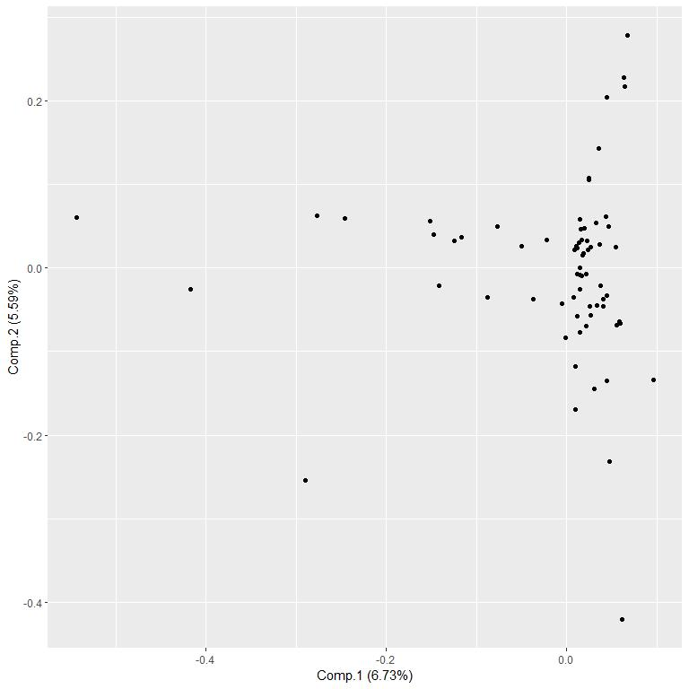

# Preparations

1. Open a Google Scholar profile with browser (e.g., https://scholar.google.com/citations?user=SGgP0VQAAAAJ ).
1. Go to the bottom of the page and click "SHOW MORE" to show all entries on the page.
1. Go again to the bottom of the newly-expanded page.
1. Select everything in the table, starting from the year of the last entry (on the bottom-right corner) and ending at the title of the first entry (on the top-left corner).
1. Copy the selected text.
1. Paste the text to a text editor and save as "data/publications.txt".

# Load the Data


```r
data.loaded <- 
  readr::read_delim(
    file = "data/publications.txt",
    delim = "\t",
    escape_double = FALSE,
    col_names = FALSE,
    trim_ws = TRUE
  )
```

```
## Rows: 96 Columns: 1
```

```
## -- Column specification --------------------------------------------------------
## Delimiter: "\t"
## chr (1): X1
```

```
## 
## i Use `spec()` to retrieve the full column specification for this data.
## i Specify the column types or set `show_col_types = FALSE` to quiet this message.
```

# Format the Data

## Create a Data Frame of Articles

* Create a matrix with articles as rows and title, authors and journal as the three columns.
* Convert to a data frame.


```r
data <- unlist( data.loaded )
```

```
## Warning: One or more parsing issues, see `problems()` for details
```

```r
data <-
  matrix(
    data = unlist( data ),
    ncol = 3,
    byrow = TRUE
  )

colnames( data ) <-
  c(
    "Title",
    "Authors",
    "Journal"
  )

data <-
  data.frame(
    data,
    stringsAsFactors = FALSE
  )
```

## Convert Titles to Lower Case

* To match identical words with different case, convert all to lowercase.


```r
data$"Title.lower" <-
  tolower( data$"Title" )
```

## Define Multi-Word Terms

* Define word sequences that should be considered as a single term by adding replacing whitespace with underscore.
* E.g., "type 1 diabetes" is one term.


```r
data$"Title.lower" <-
  stringr::str_replace_all(
    string = data$"Title.lower",
    # pattern = "type 1 diabete",
    pattern = "type 1 diabetes",
    replacement = "type_1_diabetes"
  )

data$"Title.lower" <-
  stringr::str_replace_all(
    string = data$"Title.lower",
    pattern = "type 2 diabetes",
    replacement = "type_2_diabetes"
  )
```

## Omit Special Characters

* Omit punctuation and special characters from the titles.


```r
words <-
  stringr::str_split(
    string = data[ , "Title.lower" ],
    pattern = "\\s"
  )

words <- 
  lapply(
    X = words,
    FUN = tolower
  )

words <-
  lapply(
    X = words,
    FUN = stringr::str_replace_all,
    pattern = "(\\()|(\\))|(\\:)|(\\,)|(\\.)",
    replacement = ""
  )

table.words <- 
  sort(
    x = table( unlist( words ) ),
    decreasing = TRUE
  )
```

## Extract Unique Words

* List all unique words that appear in the titles.


```r
words.unique <-
  sort(
    unique(
      unlist( words ) )
  )
```

## Define List of Blocked Words

* List general words that are not of interest.
* Add plain numbers to this list.


```r
blocklist <-
  c(
    "in",
    "of",
    "and",
    "the",
    "with",
    "for",
    "from",
    "to",
    "...",
    "an",
    "at",
    "on",
    letters,
    "after",
    "are",
    "as",
    "based",
    "by",
    "do",
    "is",
    "not",
    "without",
    "through",
    "during"
  )

blocklist <- 
  c(
    blocklist,
    words.unique[ grepl( x = words.unique, pattern = "^[0-9]+$" ) ]
  )
```

## Omit Blocked Words

* Omit the blocked words from the words list of each article.


```r
words <-
  lapply(
    X = words,
    FUN = function( x ) {
      x[ !( x %in% blocklist ) ]
    }
  )
```

# Re-Extract Unique Words


```r
words.unique <-
  sort(
    unique(
      unlist( words ) )
  )
```

# Create the Words-by-Articles Occurrence Matrix

* Matrix that has value 1 if the word (row) appears in the article (column) and 0 otherwise.


```r
wba <-
  array(
    data = 0,
    dim = c( length( words.unique ), nrow( data ) )
  )

rownames( wba ) <- words.unique
colnames( wba ) <- data[ , "Title" ]

for ( i in 1:nrow( data ) ) {
  
  wba[ words[[ i ]], i ] <- 1
  
}
```

## Log-Transform the Occurrences

* Trasform the occurrences with log (1+x) for a more Gaussian-like distribution.


```r
wba.log1px <- log10( 1 + wba )
```

## Autoscale the Occurrence Profiles

* Scale the data for PCA.


```r
wba.norm <- scale( wba.log1px )
```

# Principal Component Analysis

## Compute PCA


```r
result.pca <-
  princomp(
    x = wba.norm
  )
```

## Plot PCA


```r
library( "ggfortify" )
```

```
## Warning: package 'ggfortify' was built under R version 4.0.5
```

```
## Loading required package: ggplot2
```

```
## Warning: package 'ggplot2' was built under R version 4.0.5
```

```r
plot <-
  autoplot( 
    result.pca
    # ,
    # loadings = TRUE,
    # loadings.label = TRUE
  )

print( plot )
```

<!-- -->

# Cluster the Words

* Using a fixed number of eight clusters for a suitable visual representation.


```r
result.clustering <-
  cluster::pam(
    x = wba.norm,
    k = 8
  )
```

# Figure

## Prepare Results for the Visualization

* Extract PCA-scores of the two first components.
* Extract cluster assignments for each data point.
* Compute each data point's Euclidean distance from the origin.
* Wrap multi-word terms to multiple lines for better visual impression.
* Create a text string listing all the article titles, where the term appears.


```r
data.plot <-
  data.frame(
    Word = rownames( result.pca$"scores" ),
    result.pca$"scores"
  )

data.plot$"Cluster" <- 
  factor(
    x = result.clustering$"clustering",
    levels = 1:length( unique( result.clustering$"clustering" ) ),
    labels = 
      c(
        "Cluster (C) 1",
        paste( "C", 2:length( unique( result.clustering$"clustering" ) ) )
      )
  )
  
data.plot$"Distance" <- 
  sqrt( data.plot$"Comp.1"^2 + data.plot$"Comp.2"^2 ) + 1

data.plot$"Term" <-
  stringr::str_replace_all(
    string = data.plot$"Word",
    pattern = "\\-",
    replacement = "-\n"
  )

data.plot$"Term" <-
  stringr::str_replace_all(
    string = data.plot$"Word",
    pattern = "\\_",
    replacement = "\n"
  )

data.plot$"Publications" <-
  apply(
    X = wba[ data.plot$"Word", ] == 1,
    MAR = 1,
    FUN = function( x ) {
      paste(
        "\n",
        names(
          which( x )
        ),
        collapse = "\n"
      )
    }
  )
```

## Define the Figure

* Visualization with ggplot2.
* PCA components 1 and 2, respectively, on the y- and x-axes.
* Term name as text label.
* Distance from origin as (increasing) size.
* Cluster assignment as color.
* Add jitter to reduce overlap of similar terms.
* Use pseudo-log-valued axes for reduced outliers.
* 


```r
jitter <- 1

palette <- RColorBrewer::brewer.pal( n = 9, "Set1" )[ -6 ]
palette <- palette[ 1:nlevels( data.plot$"Cluster" ) ]

plot <-
  ggplot2::ggplot(
    data = data.plot,
    mapping =
      ggplot2::aes(
        x = Comp.2,
        y = Comp.1,
        label = Term,
        size = Distance,
        text = Publications
        ,
        color = Cluster,
      )
  ) +
  ggplot2::geom_text(
    position =
      ggplot2::position_jitter(
        height = jitter,
        width = jitter
      )
  ) +
  ggplot2::scale_x_continuous( trans = "pseudo_log" ) +
  ggplot2::scale_y_continuous( trans = "pseudo_log" ) +
  ggplot2::theme(
    axis.text.y = ggplot2::element_blank(),
    axis.ticks = ggplot2::element_blank()
  ) +
  ggplot2::xlab( label = "\n\n\nMap of my research topics" ) +
  ggplot2::ylab( label = "" ) +
  ggplot2::scale_color_manual( values = palette )
```

## Create the Interactive Figure

* Make ggplot2 figure interactive with the *ggplotly*-function from the *plotly*-package.
* Show the term and the articles, where it appears, as text (tooltip) when hovering over a data point.
* Use the layout-function for fine-tuning of the legend.


```r
library( tidyr )

plot.interactive <-
  plotly::ggplotly( 
    p = plot,
    tooltip = c( "label", "Publications" )
  ) %>%
  plotly::layout(
    legend = 
      list(
        orientation = "h",
        title = list( text = "Cluster<br>" ),
        x = quantile( x = data.plot$"Comp.2", probs = 0.67 ),
        y = min( data.plot$"Comp.1" )
      )
  )
```

## View the Interactive Figure


```r
plot.interactive
```

```{=html}
<div id="htmlwidget-cb6813c9578a67a5cc46" style="width:768px;height:768px;" class="plotly html-widget"></div>
<script type="application/json" data-for="htmlwidget-cb6813c9578a67a5cc46">{"x":{"data":[{"x":[0.49492477562509,0.594140031902409,0.906564822918129,0.514264984337363,0.037594946598959,1.13159621304504,0.639900420358729,1.05303567558001,0.442592564536583,0.325751536557776,0.418467093291086,0.196834921432949,0.863849943070066,0.571119108269316,-0.559968057056564],"y":[-0.301318684927309,0.210455373214543,-0.466464162928324,0.916313487722918,-0.362392373041521,0.195130561252914,0.685807019813646,-0.436362848275612,0.932842034256746,-0.585918352132003,-0.00808154524610502,1.33824881101584,0.964806955649246,0.431540742858042,0.219044966964711],"text":["…","avon","blood-based","changes","childhood","development","early","evidence","experiences","integrated","later","longitudinal","point","preceding","proteomics"],"hovertext":["Term: …<br /><br /> Primary fatty amides in plasma associated with brain amyloid burden, hippocampal volume, and memory in the European Medical Information Framework for Alzheimer's Disease …<br /><br /> Metabolomic assessment reveals alteration in polyols and branched chain amino acids associated with present and future renal impairment in a discovery cohort of 637 persons …<br /><br /> Integrated lipidomics and proteomics point to early blood-based changes in childhood preceding later development of psychotic experiences: evidence from the Avon Longitudinal …","Term: avon<br /><br /> Identification of a plasma signature of psychotic disorder in children and adolescents from the Avon Longitudinal Study of Parents and Children (ALSPAC) cohort<br /><br /> Integrated lipidomics and proteomics point to early blood-based changes in childhood preceding later development of psychotic experiences: evidence from the Avon Longitudinal …","Term: blood-based<br /><br /> Integrated lipidomics and proteomics point to early blood-based changes in childhood preceding later development of psychotic experiences: evidence from the Avon Longitudinal …","Term: changes<br /><br /> Integrated lipidomics and proteomics point to early blood-based changes in childhood preceding later development of psychotic experiences: evidence from the Avon Longitudinal …<br /><br /> Changes in the lipidome in type 1 diabetes following low carbohydrate diet: Post-hoc analysis of a randomized crossover trial","Term: childhood<br /><br /> Integrated lipidomics and proteomics point to early blood-based changes in childhood preceding later development of psychotic experiences: evidence from the Avon Longitudinal …","Term: development<br /><br /> Serum metabolite profile associates with the development of metabolic co-morbidities in first-episode psychosis<br /><br /> Molecular Atlas of Postnatal Mouse Heart Development<br /><br /> Integrated lipidomics and proteomics point to early blood-based changes in childhood preceding later development of psychotic experiences: evidence from the Avon Longitudinal …","Term: early<br /><br /> Integrated lipidomics and proteomics point to early blood-based changes in childhood preceding later development of psychotic experiences: evidence from the Avon Longitudinal …","Term: evidence<br /><br /> Integrated lipidomics and proteomics point to early blood-based changes in childhood preceding later development of psychotic experiences: evidence from the Avon Longitudinal …","Term: experiences<br /><br /> Integrated lipidomics and proteomics point to early blood-based changes in childhood preceding later development of psychotic experiences: evidence from the Avon Longitudinal …","Term: integrated<br /><br /> Integrated lipidomics and proteomics point to early blood-based changes in childhood preceding later development of psychotic experiences: evidence from the Avon Longitudinal …","Term: later<br /><br /> Integrated lipidomics and proteomics point to early blood-based changes in childhood preceding later development of psychotic experiences: evidence from the Avon Longitudinal …","Term: longitudinal<br /><br /> Identification of a plasma signature of psychotic disorder in children and adolescents from the Avon Longitudinal Study of Parents and Children (ALSPAC) cohort<br /><br /> Integrated lipidomics and proteomics point to early blood-based changes in childhood preceding later development of psychotic experiences: evidence from the Avon Longitudinal …","Term: point<br /><br /> Integrated lipidomics and proteomics point to early blood-based changes in childhood preceding later development of psychotic experiences: evidence from the Avon Longitudinal …","Term: preceding<br /><br /> Integrated lipidomics and proteomics point to early blood-based changes in childhood preceding later development of psychotic experiences: evidence from the Avon Longitudinal …","Term: proteomics<br /><br /> Integrated lipidomics and proteomics point to early blood-based changes in childhood preceding later development of psychotic experiences: evidence from the Avon Longitudinal …"],"textfont":{"size":[8.92414011734841,8.36330791850921,6.28033846598011,7.44951416531748,6.28033846598011,9.98074916930306,6.28033846598011,6.28033846598011,6.28033846598011,6.28033846598011,6.28033846598011,8.36330791850921,6.28033846598011,6.28033846598011,6.28033846598011],"color":"rgba(228,26,28,1)"},"type":"scatter","mode":"text","hoveron":"points","name":"Cluster (C) 1","legendgroup":"Cluster (C) 1","showlegend":true,"xaxis":"x","yaxis":"y","hoverinfo":"text","frame":null},{"x":[-0.341078118334631,-0.155178333519553,0.0444315733737848,-1.27399752636457,-0.127169280082019,0.0960652028965912,-0.914923126166381,-0.694299160737576,-0.194781607369487,-0.862295700589721,-1.93558880293371,0.530693030112942,0.556288385411198,0.381212880653234,0.204808960844322,0.820224927139612,0.354419086256584,0.371604019807426,-0.126627927136179,0.51575401903834,0.296836867110278,0.398568530793955,0.36301964672416,-0.0813709425089699,1.05346911097687,-0.117366678570529,-1.21568269159824,1.96429969046835,1.13739919589424,0.99638230894217,-1.32142056571148,-0.239533173609949,-0.245977385740038,0.358377519560752,-0.242019418650438,1.15340064249257,0.348319755933302,0.102253705772999,1.42946801196536,-0.366272036224882,-0.463544381361143,-0.268774196835144,-1.04743780964641,-0.316440717997197,0.425609479771401,1.20061376620826,0.0183014257025105,-0.607619531324545,0.164181398204396,-0.395183642328662,0.483689757948416,-0.411600057242765,-0.23249736027336,-0.361277240101526,-0.406540614439701,1.19616994898572,-0.223720241271836,-0.0396606729541757,1.35693340766106,-1.16251284372104,0.739205034577807,0.436250318072705,1.36204982697524,-0.0263014883764874,-0.397353790449147,-0.983275963016917,-0.474189180250492,1.15460472386994,1.03657630148974,-1.77543313364617,0.0286430183966438,-1.18616364268241,-0.374470348012068,0.241940314208762,0.151157883279861,-0.0376269723243419,-0.198494261374373,0.705680830982919,1.26111278838733,0.473342016781549,-0.231124301737998,0.617062102490711,1.24648695975139,1.49127276009784,-0.0596491906882,0.503778479703262,0.603599567424141,-0.483254833494437,1.43874586568327,1.02007534464145,-0.879335568168324,-0.321434251733156,-0.730096400628904,0.23389258176273,0.617240730833952,0.820335627734302,-0.228774677848969,-1.20254599471546,-0.688240866063689,-0.862407984450738,0.189404535282894,0.254383397547201,0.510953070243295,-0.906105676100753,0.287549772636949,0.0384130792484144,0.937448918172063,-1.62691838239051,-0.740550431661586,-0.94542802274533,1.17854075414812,-1.20892262056649,0.243334676691224,-0.652714264876101,0.979951354958953,1.19242942821976,1.39223120614478,-1.10637652670003,-0.273326160859682,-0.227750511197067,-0.223150332984595,1.43295908435215,1.94638484371813,0.353700910946186,1.17462570408112,0.036342164373009,0.1202519093406,-1.00602303758491,-0.290159316009237,-0.515291541748626,-0.176011531871765,-1.02349218529181,-1.10870025096504,-2.70190271126428,0.186644769903991,1.68949175255126],"y":[0.286555161162873,-0.546765582686393,0.915101449428813,-0.126772640222091,-0.36928418100802,-0.107643283002871,0.0335708466958586,0.886614736085853,0.580233010413022,0.137973576733739,-2.10132318034538,-0.462524164044542,1.05587499118027,-0.340801579964052,0.993372795792185,-0.603848858410771,0.0185347166422175,-1.85579678800092,-1.91326918070199,-0.181023947471066,-0.160647125965088,0.898306397556512,0.559644378205658,0.922988020400178,0.235539127057514,-0.532475106606127,-0.463826701324844,1.32510887653352,-0.410422291120928,0.0923740723238483,-0.427291909796781,-0.953735225615981,0.194810600526874,-1.77375414699451,0.172224981056659,-1.17323177815949,0.288683177452704,-1.40093891312363,-0.280594262251344,-0.747249696568401,-1.28824567255713,1.29827889614134,0.27489749232605,-0.451964824875224,1.00108279515606,-0.272026232993134,-0.423103387913149,-0.428261125968082,-0.736980301981659,-0.0147211253492324,-0.54606869648694,0.78185033389264,-0.0506606172702118,-0.792007579167189,0.679077751418472,-1.73172574280689,0.348948655665091,-0.243936391112256,0.0828387380259857,-1.0188221566062,1.13752589882793,-0.0732032336200562,1.39952242480384,-0.125292444698443,-0.254417406344194,1.15319901732555,0.597460196841003,0.47366587982524,0.297221531182023,1.07153064770713,-0.0666195371192329,0.217711466199903,-0.617890896030742,0.617464270544138,0.169560252136846,0.772731882718475,0.304707343860898,-0.24649229837033,-0.86097356579801,-0.741631325522305,0.153127517054928,-1.46604770300462,-1.10239416228168,0.221409590555492,0.884272400908578,-0.307538173938282,-0.634069632959592,-0.593979021131037,-2.57522226321245,-0.221610506023969,-0.797384006499289,0.216025027362725,-0.28750340042297,-0.172464366901725,-0.442324556834753,-0.125702846309584,-0.722891682809322,-0.730081789508056,-0.32301926431629,-0.932387324680389,0.332560788063221,0.455066269830701,0.423485998013885,1.35274039336465,-0.285468527481019,0.203442674231616,-0.2654339769787,0.581977779905905,0.30367720902264,0.446325656861137,-0.685806192414548,-0.649911553878748,-0.575162801031361,-0.446979150206643,0.246833867772777,0.975820425348452,0.901998905485083,-0.959075765996766,-0.992161534016061,-0.83011093860079,1.06667051736457,-1.08398798312544,1.1374289553159,0.795992332095873,0.142145020464722,0.74006514447549,1.05065996600142,-0.833837003489269,0.618945319306937,0.0311055090429099,-0.9082690162813,-0.388982033241396,-1.77114728397313,1.23068415573727,0.157251762713732,0.96613411283708],"text":["abnormalities","acids","adipose","adolescent","adolescents","albuminuria","all-cause","alspac","alteration","amino","analysis","areas","assessment","associates","atlas","bayesian","between","biology","biomarkers","body","branched","carbohydrate","chain","characterization","children","cimt","circulating","clinical","clusters","co-morbidities","cohort","collinear","compound","computational","copenhagen","correlations","cross-organism","cross-species","cross-validation","crossover","data","diabetic","diet","dipis","discovery","disorder","distinct","diversity","effect","factor","findings","finnish","first-episode","following","future","graphical","group","gut","heart","high-dimensional","human","identification","imi-rhapsody","impairment","increased","insulin","level","lipidome","lipidomer","lipidomic","lipids","low","mass","men","metabolic","metabolite","metabolites","metabolomic","metabolomics","metformin","microbiota","modeling","models","molecular","mortality","mouse","multi-peak","multi-source","multi-way","multiple","multivariate","parents","pathogenesis","patients","peaks","people","persons","phosphatidylcholine","polyols","post‐hoc","postnatal","predictive","present","profile","profiling","progression","psychosis","quantitative","randomized","renal","replication","retinopathy","review","selected","serum","signature","signatures","species","spectral","sphingomyelin","stratification","stronger","study","subjects","subtypes","targeted","therapy","tissue","tool","toxicogenomics","translation","trial","two-way","type<br />1<br />diabetes","understanding","variables"],"hovertext":["Term: abnormalities<br /><br /> Lipidomic Abnormalities During the Pathogenesis of Type 1 Diabetes: a Quantitative Review","Term: acids<br /><br /> Metabolomic assessment reveals alteration in polyols and branched chain amino acids associated with present and future renal impairment in a discovery cohort of 637 persons …","Term: adipose<br /><br /> Lipidomics of human adipose tissue reveals diversity between body areas","Term: adolescent<br /><br /> Characterization of plasma lipidomics in adolescent subjects with increased risk for type 1 diabetes in the DiPiS cohort","Term: adolescents<br /><br /> Identification of a plasma signature of psychotic disorder in children and adolescents from the Avon Longitudinal Study of Parents and Children (ALSPAC) cohort","Term: albuminuria<br /><br /> Gut microbiota profile and selected plasma metabolites in type 1 diabetes without and with stratification by albuminuria","Term: all-cause<br /><br /> Lipidomic analysis reveals sphingomyelin and phosphatidylcholine species associated with renal impairment and all-cause mortality in type 1 diabetes","Term: alspac<br /><br /> Identification of a plasma signature of psychotic disorder in children and adolescents from the Avon Longitudinal Study of Parents and Children (ALSPAC) cohort","Term: alteration<br /><br /> Metabolomic assessment reveals alteration in polyols and branched chain amino acids associated with present and future renal impairment in a discovery cohort of 637 persons …","Term: amino<br /><br /> Metabolomic assessment reveals alteration in polyols and branched chain amino acids associated with present and future renal impairment in a discovery cohort of 637 persons …","Term: analysis<br /><br /> Multivariate multi-way analysis of multi-source data<br /><br /> Two-way analysis of high-dimensional collinear data<br /><br /> Lipidomic analysis reveals sphingomyelin and phosphatidylcholine species associated with renal impairment and all-cause mortality in type 1 diabetes<br /><br /> Cross-organism toxicogenomics with group factor analysis<br /><br /> Changes in the lipidome in type 1 diabetes following low carbohydrate diet: Post-hoc analysis of a randomized crossover trial","Term: areas<br /><br /> Lipidomics of human adipose tissue reveals diversity between body areas","Term: assessment<br /><br /> Metabolomic assessment reveals alteration in polyols and branched chain amino acids associated with present and future renal impairment in a discovery cohort of 637 persons …","Term: associates<br /><br /> Serum metabolite profile associates with the development of metabolic co-morbidities in first-episode psychosis","Term: atlas<br /><br /> Molecular Atlas of Postnatal Mouse Heart Development","Term: bayesian<br /><br /> Stronger findings for metabolomics through Bayesian modeling of multiple peaks and compound correlations<br /><br /> Bayesian Multi-Way Models for Data Translation in Computational Biology","Term: between<br /><br /> Lipidomics of human adipose tissue reveals diversity between body areas","Term: biology<br /><br /> Bayesian Multi-Way Models for Data Translation in Computational Biology","Term: biomarkers<br /><br /> Cross-species translation of multi-way biomarkers","Term: body<br /><br /> Lipidomics of human adipose tissue reveals diversity between body areas","Term: branched<br /><br /> Metabolomic assessment reveals alteration in polyols and branched chain amino acids associated with present and future renal impairment in a discovery cohort of 637 persons …","Term: carbohydrate<br /><br /> Changes in the lipidome in type 1 diabetes following low carbohydrate diet: Post-hoc analysis of a randomized crossover trial","Term: chain<br /><br /> Metabolomic assessment reveals alteration in polyols and branched chain amino acids associated with present and future renal impairment in a discovery cohort of 637 persons …","Term: characterization<br /><br /> Characterization of plasma lipidomics in adolescent subjects with increased risk for type 1 diabetes in the DiPiS cohort","Term: children<br /><br /> Identification of a plasma signature of psychotic disorder in children and adolescents from the Avon Longitudinal Study of Parents and Children (ALSPAC) cohort","Term: cimt<br /><br /> Effect of metformin on plasma metabolite profile in the Copenhagen Insulin and Metformin Therapy (CIMT) trial","Term: circulating<br /><br /> Circulating metabolites and lipids are associated to diabetic retinopathy in individuals With type 1 diabetes","Term: clinical<br /><br /> Targeted Clinical Metabolite Profiling Platform for the Stratification of Diabetic Patients<br /><br /> Replication and cross-validation of type 2 diabetes subtypes based on clinical variables: an IMI-RHAPSODY study<br /><br /> Distinct molecular signatures of clinical clusters in people with type 2 diabetes: an IMI-RHAPSODY study","Term: clusters<br /><br /> Distinct molecular signatures of clinical clusters in people with type 2 diabetes: an IMI-RHAPSODY study","Term: co-morbidities<br /><br /> Serum metabolite profile associates with the development of metabolic co-morbidities in first-episode psychosis","Term: cohort<br /><br /> Identification of a plasma signature of psychotic disorder in children and adolescents from the Avon Longitudinal Study of Parents and Children (ALSPAC) cohort<br /><br /> Metabolomic assessment reveals alteration in polyols and branched chain amino acids associated with present and future renal impairment in a discovery cohort of 637 persons …<br /><br /> Characterization of plasma lipidomics in adolescent subjects with increased risk for type 1 diabetes in the DiPiS cohort","Term: collinear<br /><br /> Two-way analysis of high-dimensional collinear data","Term: compound<br /><br /> Stronger findings for metabolomics through Bayesian modeling of multiple peaks and compound correlations","Term: computational<br /><br /> Bayesian Multi-Way Models for Data Translation in Computational Biology","Term: copenhagen<br /><br /> Effect of metformin on plasma metabolite profile in the Copenhagen Insulin and Metformin Therapy (CIMT) trial","Term: correlations<br /><br /> Stronger findings for metabolomics through Bayesian modeling of multiple peaks and compound correlations","Term: cross-organism<br /><br /> Cross-organism toxicogenomics with group factor analysis","Term: cross-species<br /><br /> Cross-species translation of multi-way biomarkers","Term: cross-validation<br /><br /> Replication and cross-validation of type 2 diabetes subtypes based on clinical variables: an IMI-RHAPSODY study","Term: crossover<br /><br /> Changes in the lipidome in type 1 diabetes following low carbohydrate diet: Post-hoc analysis of a randomized crossover trial","Term: data<br /><br /> Multivariate multi-way analysis of multi-source data<br /><br /> Two-way analysis of high-dimensional collinear data<br /><br /> Stronger findings from mass spectral data through multi-peak modeling<br /><br /> Bayesian Multi-Way Models for Data Translation in Computational Biology","Term: diabetic<br /><br /> Targeted Clinical Metabolite Profiling Platform for the Stratification of Diabetic Patients<br /><br /> Circulating metabolites and lipids are associated to diabetic retinopathy in individuals With type 1 diabetes","Term: diet<br /><br /> Changes in the lipidome in type 1 diabetes following low carbohydrate diet: Post-hoc analysis of a randomized crossover trial","Term: dipis<br /><br /> Characterization of plasma lipidomics in adolescent subjects with increased risk for type 1 diabetes in the DiPiS cohort","Term: discovery<br /><br /> Metabolomic assessment reveals alteration in polyols and branched chain amino acids associated with present and future renal impairment in a discovery cohort of 637 persons …","Term: disorder<br /><br /> Identification of a plasma signature of psychotic disorder in children and adolescents from the Avon Longitudinal Study of Parents and Children (ALSPAC) cohort","Term: distinct<br /><br /> Distinct molecular signatures of clinical clusters in people with type 2 diabetes: an IMI-RHAPSODY study","Term: diversity<br /><br /> Lipidomics of human adipose tissue reveals diversity between body areas","Term: effect<br /><br /> Effect of metformin on plasma metabolite profile in the Copenhagen Insulin and Metformin Therapy (CIMT) trial","Term: factor<br /><br /> Cross-organism toxicogenomics with group factor analysis","Term: findings<br /><br /> Stronger findings from mass spectral data through multi-peak modeling<br /><br /> Stronger findings for metabolomics through Bayesian modeling of multiple peaks and compound correlations","Term: finnish<br /><br /> Lipidome as a predictive tool in progression to type 2 diabetes in Finnish men","Term: first-episode<br /><br /> Serum metabolite profile associates with the development of metabolic co-morbidities in first-episode psychosis","Term: following<br /><br /> Changes in the lipidome in type 1 diabetes following low carbohydrate diet: Post-hoc analysis of a randomized crossover trial","Term: future<br /><br /> Metabolomic assessment reveals alteration in polyols and branched chain amino acids associated with present and future renal impairment in a discovery cohort of 637 persons …","Term: graphical<br /><br /> Graphical multi-way models","Term: group<br /><br /> Cross-organism toxicogenomics with group factor analysis","Term: gut<br /><br /> Gut microbiota profile and selected plasma metabolites in type 1 diabetes without and with stratification by albuminuria","Term: heart<br /><br /> Molecular Atlas of Postnatal Mouse Heart Development","Term: high-dimensional<br /><br /> Two-way analysis of high-dimensional collinear data","Term: human<br /><br /> Lipidomics of human adipose tissue reveals diversity between body areas","Term: identification<br /><br /> Identification of a plasma signature of psychotic disorder in children and adolescents from the Avon Longitudinal Study of Parents and Children (ALSPAC) cohort","Term: imi-rhapsody<br /><br /> Replication and cross-validation of type 2 diabetes subtypes based on clinical variables: an IMI-RHAPSODY study<br /><br /> Distinct molecular signatures of clinical clusters in people with type 2 diabetes: an IMI-RHAPSODY study","Term: impairment<br /><br /> Lipidomic analysis reveals sphingomyelin and phosphatidylcholine species associated with renal impairment and all-cause mortality in type 1 diabetes<br /><br /> Metabolomic assessment reveals alteration in polyols and branched chain amino acids associated with present and future renal impairment in a discovery cohort of 637 persons …","Term: increased<br /><br /> Characterization of plasma lipidomics in adolescent subjects with increased risk for type 1 diabetes in the DiPiS cohort","Term: insulin<br /><br /> Effect of metformin on plasma metabolite profile in the Copenhagen Insulin and Metformin Therapy (CIMT) trial","Term: level<br /><br /> Understanding the Lipidome at the Systems Level with lipidomeR","Term: lipidome<br /><br /> Lipidome as a predictive tool in progression to type 2 diabetes in Finnish men<br /><br /> Understanding the Lipidome at the Systems Level with lipidomeR<br /><br /> Changes in the lipidome in type 1 diabetes following low carbohydrate diet: Post-hoc analysis of a randomized crossover trial","Term: lipidomer<br /><br /> Understanding the Lipidome at the Systems Level with lipidomeR","Term: lipidomic<br /><br /> Lipidomic analysis reveals sphingomyelin and phosphatidylcholine species associated with renal impairment and all-cause mortality in type 1 diabetes<br /><br /> Lipidomic Abnormalities During the Pathogenesis of Type 1 Diabetes: a Quantitative Review","Term: lipids<br /><br /> Circulating metabolites and lipids are associated to diabetic retinopathy in individuals With type 1 diabetes","Term: low<br /><br /> Changes in the lipidome in type 1 diabetes following low carbohydrate diet: Post-hoc analysis of a randomized crossover trial","Term: mass<br /><br /> Stronger findings from mass spectral data through multi-peak modeling","Term: men<br /><br /> Lipidome as a predictive tool in progression to type 2 diabetes in Finnish men","Term: metabolic<br /><br /> Serum metabolite profile associates with the development of metabolic co-morbidities in first-episode psychosis","Term: metabolite<br /><br /> Serum metabolite profile associates with the development of metabolic co-morbidities in first-episode psychosis<br /><br /> Effect of metformin on plasma metabolite profile in the Copenhagen Insulin and Metformin Therapy (CIMT) trial<br /><br /> Targeted Clinical Metabolite Profiling Platform for the Stratification of Diabetic Patients","Term: metabolites<br /><br /> Circulating metabolites and lipids are associated to diabetic retinopathy in individuals With type 1 diabetes<br /><br /> Gut microbiota profile and selected plasma metabolites in type 1 diabetes without and with stratification by albuminuria","Term: metabolomic<br /><br /> Metabolomic assessment reveals alteration in polyols and branched chain amino acids associated with present and future renal impairment in a discovery cohort of 637 persons …","Term: metabolomics<br /><br /> Stronger findings for metabolomics through Bayesian modeling of multiple peaks and compound correlations","Term: metformin<br /><br /> Effect of metformin on plasma metabolite profile in the Copenhagen Insulin and Metformin Therapy (CIMT) trial","Term: microbiota<br /><br /> Gut microbiota profile and selected plasma metabolites in type 1 diabetes without and with stratification by albuminuria","Term: modeling<br /><br /> Stronger findings from mass spectral data through multi-peak modeling<br /><br /> Stronger findings for metabolomics through Bayesian modeling of multiple peaks and compound correlations","Term: models<br /><br /> Graphical multi-way models<br /><br /> Bayesian Multi-Way Models for Data Translation in Computational Biology","Term: molecular<br /><br /> Molecular Atlas of Postnatal Mouse Heart Development<br /><br /> Distinct molecular signatures of clinical clusters in people with type 2 diabetes: an IMI-RHAPSODY study","Term: mortality<br /><br /> Lipidomic analysis reveals sphingomyelin and phosphatidylcholine species associated with renal impairment and all-cause mortality in type 1 diabetes","Term: mouse<br /><br /> Molecular Atlas of Postnatal Mouse Heart Development","Term: multi-peak<br /><br /> Stronger findings from mass spectral data through multi-peak modeling","Term: multi-source<br /><br /> Multivariate multi-way analysis of multi-source data","Term: multi-way<br /><br /> Multivariate multi-way analysis of multi-source data<br /><br /> Graphical multi-way models<br /><br /> Cross-species translation of multi-way biomarkers<br /><br /> Bayesian Multi-Way Models for Data Translation in Computational Biology","Term: multiple<br /><br /> Stronger findings for metabolomics through Bayesian modeling of multiple peaks and compound correlations","Term: multivariate<br /><br /> Multivariate multi-way analysis of multi-source data","Term: parents<br /><br /> Identification of a plasma signature of psychotic disorder in children and adolescents from the Avon Longitudinal Study of Parents and Children (ALSPAC) cohort","Term: pathogenesis<br /><br /> Lipidomic Abnormalities During the Pathogenesis of Type 1 Diabetes: a Quantitative Review","Term: patients<br /><br /> Targeted Clinical Metabolite Profiling Platform for the Stratification of Diabetic Patients","Term: peaks<br /><br /> Stronger findings for metabolomics through Bayesian modeling of multiple peaks and compound correlations","Term: people<br /><br /> Distinct molecular signatures of clinical clusters in people with type 2 diabetes: an IMI-RHAPSODY study","Term: persons<br /><br /> Metabolomic assessment reveals alteration in polyols and branched chain amino acids associated with present and future renal impairment in a discovery cohort of 637 persons …","Term: phosphatidylcholine<br /><br /> Lipidomic analysis reveals sphingomyelin and phosphatidylcholine species associated with renal impairment and all-cause mortality in type 1 diabetes","Term: polyols<br /><br /> Metabolomic assessment reveals alteration in polyols and branched chain amino acids associated with present and future renal impairment in a discovery cohort of 637 persons …","Term: post-hoc<br /><br /> Changes in the lipidome in type 1 diabetes following low carbohydrate diet: Post-hoc analysis of a randomized crossover trial","Term: postnatal<br /><br /> Molecular Atlas of Postnatal Mouse Heart Development","Term: predictive<br /><br /> Lipidome as a predictive tool in progression to type 2 diabetes in Finnish men","Term: present<br /><br /> Metabolomic assessment reveals alteration in polyols and branched chain amino acids associated with present and future renal impairment in a discovery cohort of 637 persons …","Term: profile<br /><br /> Serum metabolite profile associates with the development of metabolic co-morbidities in first-episode psychosis<br /><br /> Effect of metformin on plasma metabolite profile in the Copenhagen Insulin and Metformin Therapy (CIMT) trial<br /><br /> Gut microbiota profile and selected plasma metabolites in type 1 diabetes without and with stratification by albuminuria","Term: profiling<br /><br /> Targeted Clinical Metabolite Profiling Platform for the Stratification of Diabetic Patients","Term: progression<br /><br /> Lipidome as a predictive tool in progression to type 2 diabetes in Finnish men","Term: psychosis<br /><br /> Serum metabolite profile associates with the development of metabolic co-morbidities in first-episode psychosis","Term: quantitative<br /><br /> Lipidomic Abnormalities During the Pathogenesis of Type 1 Diabetes: a Quantitative Review","Term: randomized<br /><br /> Changes in the lipidome in type 1 diabetes following low carbohydrate diet: Post-hoc analysis of a randomized crossover trial","Term: renal<br /><br /> Lipidomic analysis reveals sphingomyelin and phosphatidylcholine species associated with renal impairment and all-cause mortality in type 1 diabetes<br /><br /> Metabolomic assessment reveals alteration in polyols and branched chain amino acids associated with present and future renal impairment in a discovery cohort of 637 persons …","Term: replication<br /><br /> Replication and cross-validation of type 2 diabetes subtypes based on clinical variables: an IMI-RHAPSODY study","Term: retinopathy<br /><br /> Circulating metabolites and lipids are associated to diabetic retinopathy in individuals With type 1 diabetes","Term: review<br /><br /> Lipidomic Abnormalities During the Pathogenesis of Type 1 Diabetes: a Quantitative Review","Term: selected<br /><br /> Gut microbiota profile and selected plasma metabolites in type 1 diabetes without and with stratification by albuminuria","Term: serum<br /><br /> Serum metabolite profile associates with the development of metabolic co-morbidities in first-episode psychosis","Term: signature<br /><br /> Identification of a plasma signature of psychotic disorder in children and adolescents from the Avon Longitudinal Study of Parents and Children (ALSPAC) cohort","Term: signatures<br /><br /> Distinct molecular signatures of clinical clusters in people with type 2 diabetes: an IMI-RHAPSODY study","Term: species<br /><br /> Lipidomic analysis reveals sphingomyelin and phosphatidylcholine species associated with renal impairment and all-cause mortality in type 1 diabetes","Term: spectral<br /><br /> Stronger findings from mass spectral data through multi-peak modeling","Term: sphingomyelin<br /><br /> Lipidomic analysis reveals sphingomyelin and phosphatidylcholine species associated with renal impairment and all-cause mortality in type 1 diabetes","Term: stratification<br /><br /> Targeted Clinical Metabolite Profiling Platform for the Stratification of Diabetic Patients<br /><br /> Gut microbiota profile and selected plasma metabolites in type 1 diabetes without and with stratification by albuminuria","Term: stronger<br /><br /> Stronger findings from mass spectral data through multi-peak modeling<br /><br /> Stronger findings for metabolomics through Bayesian modeling of multiple peaks and compound correlations","Term: study<br /><br /> Identification of a plasma signature of psychotic disorder in children and adolescents from the Avon Longitudinal Study of Parents and Children (ALSPAC) cohort<br /><br /> Replication and cross-validation of type 2 diabetes subtypes based on clinical variables: an IMI-RHAPSODY study<br /><br /> Distinct molecular signatures of clinical clusters in people with type 2 diabetes: an IMI-RHAPSODY study","Term: subjects<br /><br /> Characterization of plasma lipidomics in adolescent subjects with increased risk for type 1 diabetes in the DiPiS cohort","Term: subtypes<br /><br /> Replication and cross-validation of type 2 diabetes subtypes based on clinical variables: an IMI-RHAPSODY study","Term: targeted<br /><br /> Targeted Clinical Metabolite Profiling Platform for the Stratification of Diabetic Patients","Term: therapy<br /><br /> Effect of metformin on plasma metabolite profile in the Copenhagen Insulin and Metformin Therapy (CIMT) trial","Term: tissue<br /><br /> Lipidomics of human adipose tissue reveals diversity between body areas","Term: tool<br /><br /> Lipidome as a predictive tool in progression to type 2 diabetes in Finnish men","Term: toxicogenomics<br /><br /> Cross-organism toxicogenomics with group factor analysis","Term: translation<br /><br /> Cross-species translation of multi-way biomarkers<br /><br /> Bayesian Multi-Way Models for Data Translation in Computational Biology","Term: trial<br /><br /> Effect of metformin on plasma metabolite profile in the Copenhagen Insulin and Metformin Therapy (CIMT) trial<br /><br /> Changes in the lipidome in type 1 diabetes following low carbohydrate diet: Post-hoc analysis of a randomized crossover trial","Term: two-way<br /><br /> Two-way analysis of high-dimensional collinear data","Term: type<br />1<br />diabetes<br /><br /> Lipidomic analysis reveals sphingomyelin and phosphatidylcholine species associated with renal impairment and all-cause mortality in type 1 diabetes<br /><br /> Circulating metabolites and lipids are associated to diabetic retinopathy in individuals With type 1 diabetes<br /><br /> Gut microbiota profile and selected plasma metabolites in type 1 diabetes without and with stratification by albuminuria<br /><br /> Lipidomic Abnormalities During the Pathogenesis of Type 1 Diabetes: a Quantitative Review<br /><br /> Changes in the lipidome in type 1 diabetes following low carbohydrate diet: Post-hoc analysis of a randomized crossover trial<br /><br /> Characterization of plasma lipidomics in adolescent subjects with increased risk for type 1 diabetes in the DiPiS cohort","Term: understanding<br /><br /> Understanding the Lipidome at the Systems Level with lipidomeR","Term: variables<br /><br /> Replication and cross-validation of type 2 diabetes subtypes based on clinical variables: an IMI-RHAPSODY study"],"textfont":{"size":[10.0227562300786,6.86831884568736,5.2796184295226,8.67900209830133,7.16262442080878,9.24618494461737,10.2433622158286,7.16262442080878,6.86831884568736,6.86831884568736,19.2684559993431,5.2796184295226,6.86831884568736,6.511764177495,8.39404138157446,13.674224371609,5.2796184295226,12.5437114641505,12.2744429228418,5.2796184295226,6.86831884568736,7.89774846019875,6.86831884568736,8.67900209830133,7.16262442080878,6.23092615454284,9.79436965627137,15.4703955062867,11.3786268573125,6.511764177495,10.6258578201705,11.104557149373,7.7747130133892,12.5437114641505,6.23092615454284,7.7747130133892,8.74649302849887,12.2744429228418,11.4471158713255,7.89774846019875,20.2549018723122,9.27544247860767,7.89774846019875,8.67900209830133,6.86831884568736,7.16262442080878,11.3786268573125,5.2796184295226,6.23092615454284,8.74649302849887,10.8982491808933,9.04435097450964,6.511764177495,7.89774846019875,6.86831884568736,13.4120300727054,8.74649302849887,9.24618494461737,8.39404138157446,11.104557149373,5.2796184295226,7.16262442080878,14.7100211477783,11.7338996139862,8.67900209830133,6.23092615454284,6.68963511276678,6.50544941584095,6.68963511276678,13.5005737442335,9.79436965627137,7.89774846019875,9.08424340947336,9.04435097450964,6.511764177495,9.30324412776946,12.6656296655831,6.86831884568736,7.7747130133892,6.23092615454284,9.24618494461737,10.8982491808933,17.208630020291,12.8242526914013,10.2433622158286,8.39404138157446,9.08424340947336,13.0856658439002,22.6771653543307,7.7747130133892,13.0856658439002,7.16262442080878,10.0227562300786,7.79729215409558,7.7747130133892,11.3786268573125,6.86831884568736,10.2433622158286,6.86831884568736,7.89774846019875,8.39404138157446,9.04435097450964,6.86831884568736,10.6006891089719,7.79729215409558,9.04435097450964,6.511764177495,10.0227562300786,7.89774846019875,11.7338996139862,11.4471158713255,9.79436965627137,10.0227562300786,9.24618494461737,6.511764177495,7.16262442080878,11.3786268573125,10.2433622158286,9.08424340947336,10.2433622158286,9.00209143430284,10.8982491808933,15.1913643777023,8.67900209830133,11.4471158713255,7.79729215409558,6.23092615454284,5.2796184295226,9.04435097450964,8.74649302849887,16.4120163170569,9.01741614892878,11.104557149373,19.6199155085839,6.68963511276678,11.4471158713255],"color":"rgba(55,126,184,1)"},"type":"scatter","mode":"text","hoveron":"points","name":"C 2","legendgroup":"C 2","showlegend":true,"xaxis":"x","yaxis":"y","hoverinfo":"text","frame":null},{"x":[1.07745762098588,0.935610820297225,0.484669581279231,-0.743564396848908,0.498284998107774,0.0288180021942391,-0.079790661353545,1.13676863232635,-0.499940209595481,0.860739192217661,1.88861942274634,0.108950144834889],"y":[-0.576321542703016,-0.418006510448111,0.258404575313972,0.335964225379557,0.808425338964509,1.02375621863415,0.849384930010485,-0.298930505730612,0.775072189643273,-0.563459706932707,1.15560524122488,0.663057638357924],"text":["account","glucose","high","individuals","inter-individual","intervention","lifestyle","responses","risk","tolerance","type<br />2<br />diabetes","variability"],"hovertext":["Term: account<br /><br /> Phenotypic Responses to a Lifestyle Intervention Do Not Account for Inter-Individual Variability in Glucose Tolerance for Individuals at High Risk of Type 2 Diabetes","Term: glucose<br /><br /> Phenotypic Responses to a Lifestyle Intervention Do Not Account for Inter-Individual Variability in Glucose Tolerance for Individuals at High Risk of Type 2 Diabetes","Term: high<br /><br /> Phenotypic Responses to a Lifestyle Intervention Do Not Account for Inter-Individual Variability in Glucose Tolerance for Individuals at High Risk of Type 2 Diabetes","Term: individuals<br /><br /> Circulating metabolites and lipids are associated to diabetic retinopathy in individuals With type 1 diabetes<br /><br /> Phenotypic Responses to a Lifestyle Intervention Do Not Account for Inter-Individual Variability in Glucose Tolerance for Individuals at High Risk of Type 2 Diabetes","Term: inter-individual<br /><br /> Phenotypic Responses to a Lifestyle Intervention Do Not Account for Inter-Individual Variability in Glucose Tolerance for Individuals at High Risk of Type 2 Diabetes","Term: intervention<br /><br /> Phenotypic Responses to a Lifestyle Intervention Do Not Account for Inter-Individual Variability in Glucose Tolerance for Individuals at High Risk of Type 2 Diabetes","Term: lifestyle<br /><br /> Phenotypic Responses to a Lifestyle Intervention Do Not Account for Inter-Individual Variability in Glucose Tolerance for Individuals at High Risk of Type 2 Diabetes","Term: responses<br /><br /> Phenotypic Responses to a Lifestyle Intervention Do Not Account for Inter-Individual Variability in Glucose Tolerance for Individuals at High Risk of Type 2 Diabetes","Term: risk<br /><br /> Phenotypic Responses to a Lifestyle Intervention Do Not Account for Inter-Individual Variability in Glucose Tolerance for Individuals at High Risk of Type 2 Diabetes<br /><br /> Characterization of plasma lipidomics in adolescent subjects with increased risk for type 1 diabetes in the DiPiS cohort","Term: tolerance<br /><br /> Phenotypic Responses to a Lifestyle Intervention Do Not Account for Inter-Individual Variability in Glucose Tolerance for Individuals at High Risk of Type 2 Diabetes","Term: type<br />2<br />diabetes<br /><br /> Lipidome as a predictive tool in progression to type 2 diabetes in Finnish men<br /><br /> Phenotypic Responses to a Lifestyle Intervention Do Not Account for Inter-Individual Variability in Glucose Tolerance for Individuals at High Risk of Type 2 Diabetes<br /><br /> Replication and cross-validation of type 2 diabetes subtypes based on clinical variables: an IMI-RHAPSODY study<br /><br /> Distinct molecular signatures of clinical clusters in people with type 2 diabetes: an IMI-RHAPSODY study","Term: variability<br /><br /> Phenotypic Responses to a Lifestyle Intervention Do Not Account for Inter-Individual Variability in Glucose Tolerance for Individuals at High Risk of Type 2 Diabetes"],"textfont":{"size":[7.56532227254429,7.56532227254429,7.56532227254429,8.9608783809658,7.56532227254429,7.56532227254429,7.56532227254429,7.56532227254429,8.19677691281695,7.56532227254429,16.6909245850854,7.56532227254429],"color":"rgba(77,175,74,1)"},"type":"scatter","mode":"text","hoveron":"points","name":"C 3","legendgroup":"C 3","showlegend":true,"xaxis":"x","yaxis":"y","hoverinfo":"text","frame":null},{"x":[0.798491585687187,-0.0202498448412752,0.506722753554966,-0.100038758791599,0.694275744878139,0.255587571453687,0.82042441625559,0.273990728660071,0.881859221183147,-0.735361855452207,-0.630755652264346,-0.384966807286802],"y":[0.686246413710265,-0.262842720401736,0.502518367460667,0.727506269673555,-0.303037423202099,-0.440920673338027,-0.541234973379673,0.290053474420597,0.978629439576267,0.47711534826975,0.109127320395415,0.9975552116248],"text":["alcohol","ald","comprehensive","differences","hepatic","intoxication","lipid","lipidomics","nafld","phenotypic","reveals","turnover"],"hovertext":["Term: alcohol<br /><br /> Comprehensive lipidomics reveals phenotypic differences in hepatic lipid turnover in ALD and NAFLD during alcohol intoxication","Term: ald<br /><br /> Comprehensive lipidomics reveals phenotypic differences in hepatic lipid turnover in ALD and NAFLD during alcohol intoxication","Term: comprehensive<br /><br /> Comprehensive lipidomics reveals phenotypic differences in hepatic lipid turnover in ALD and NAFLD during alcohol intoxication","Term: differences<br /><br /> Comprehensive lipidomics reveals phenotypic differences in hepatic lipid turnover in ALD and NAFLD during alcohol intoxication","Term: hepatic<br /><br /> Comprehensive lipidomics reveals phenotypic differences in hepatic lipid turnover in ALD and NAFLD during alcohol intoxication","Term: intoxication<br /><br /> Comprehensive lipidomics reveals phenotypic differences in hepatic lipid turnover in ALD and NAFLD during alcohol intoxication","Term: lipid<br /><br /> Comprehensive lipidomics reveals phenotypic differences in hepatic lipid turnover in ALD and NAFLD during alcohol intoxication","Term: lipidomics<br /><br /> Integrated lipidomics and proteomics point to early blood-based changes in childhood preceding later development of psychotic experiences: evidence from the Avon Longitudinal …<br /><br /> Lipidomics of human adipose tissue reveals diversity between body areas<br /><br /> Comprehensive lipidomics reveals phenotypic differences in hepatic lipid turnover in ALD and NAFLD during alcohol intoxication<br /><br /> Characterization of plasma lipidomics in adolescent subjects with increased risk for type 1 diabetes in the DiPiS cohort","Term: nafld<br /><br /> Comprehensive lipidomics reveals phenotypic differences in hepatic lipid turnover in ALD and NAFLD during alcohol intoxication","Term: phenotypic<br /><br /> Phenotypic Responses to a Lifestyle Intervention Do Not Account for Inter-Individual Variability in Glucose Tolerance for Individuals at High Risk of Type 2 Diabetes<br /><br /> Comprehensive lipidomics reveals phenotypic differences in hepatic lipid turnover in ALD and NAFLD during alcohol intoxication","Term: reveals<br /><br /> Lipidomic analysis reveals sphingomyelin and phosphatidylcholine species associated with renal impairment and all-cause mortality in type 1 diabetes<br /><br /> Metabolomic assessment reveals alteration in polyols and branched chain amino acids associated with present and future renal impairment in a discovery cohort of 637 persons …<br /><br /> Lipidomics of human adipose tissue reveals diversity between body areas<br /><br /> Comprehensive lipidomics reveals phenotypic differences in hepatic lipid turnover in ALD and NAFLD during alcohol intoxication","Term: turnover<br /><br /> Comprehensive lipidomics reveals phenotypic differences in hepatic lipid turnover in ALD and NAFLD during alcohol intoxication"],"textfont":{"size":[4.67686510450572,4.67686510450572,4.67686510450572,4.67686510450572,4.67686510450572,4.67686510450572,4.67686510450572,10.7115110536004,4.67686510450572,7.5540948874866,12.8164634648796,4.67686510450572],"color":"rgba(152,78,163,1)"},"type":"scatter","mode":"text","hoveron":"points","name":"C 4","legendgroup":"C 4","showlegend":true,"xaxis":"x","yaxis":"y","hoverinfo":"text","frame":null},{"x":[0.239925925940778,-0.186677424381916,-0.138792667682711,-0.573204872343186,0.289054856956508,-0.206468827235941,-0.262653964250777,0.302137954015788,0.766477078520264,-0.392090413398538,0.0508963333857618,0.141119366366919,0.855468641356137,-0.390052901503451,-0.121157242595647,0.265096553922202],"y":[-0.0560216109940047,-0.759371211540067,1.1236635746694,1.10787626796205,1.00620298993576,-0.022143966771775,0.517106416381783,0.772658912211544,-0.0966777166092033,0.936051100704706,0.665545682169384,0.0262140331118172,-0.765511624768489,1.88427743750312,0.937242516063041,0.937963347162939],"text":["alzheimer's","amides","amyloid","brain","burden","disease","european","fatty","framework","hippocampal","information","medical","memory","plasma","primary","volume"],"hovertext":["Term: alzheimer's<br /><br /> Primary fatty amides in plasma associated with brain amyloid burden, hippocampal volume, and memory in the European Medical Information Framework for Alzheimer's Disease …","Term: amides<br /><br /> Primary fatty amides in plasma associated with brain amyloid burden, hippocampal volume, and memory in the European Medical Information Framework for Alzheimer's Disease …","Term: amyloid<br /><br /> Primary fatty amides in plasma associated with brain amyloid burden, hippocampal volume, and memory in the European Medical Information Framework for Alzheimer's Disease …","Term: brain<br /><br /> Primary fatty amides in plasma associated with brain amyloid burden, hippocampal volume, and memory in the European Medical Information Framework for Alzheimer's Disease …","Term: burden<br /><br /> Primary fatty amides in plasma associated with brain amyloid burden, hippocampal volume, and memory in the European Medical Information Framework for Alzheimer's Disease …","Term: disease<br /><br /> Primary fatty amides in plasma associated with brain amyloid burden, hippocampal volume, and memory in the European Medical Information Framework for Alzheimer's Disease …","Term: european<br /><br /> Primary fatty amides in plasma associated with brain amyloid burden, hippocampal volume, and memory in the European Medical Information Framework for Alzheimer's Disease …","Term: fatty<br /><br /> Primary fatty amides in plasma associated with brain amyloid burden, hippocampal volume, and memory in the European Medical Information Framework for Alzheimer's Disease …","Term: framework<br /><br /> Primary fatty amides in plasma associated with brain amyloid burden, hippocampal volume, and memory in the European Medical Information Framework for Alzheimer's Disease …","Term: hippocampal<br /><br /> Primary fatty amides in plasma associated with brain amyloid burden, hippocampal volume, and memory in the European Medical Information Framework for Alzheimer's Disease …","Term: information<br /><br /> Primary fatty amides in plasma associated with brain amyloid burden, hippocampal volume, and memory in the European Medical Information Framework for Alzheimer's Disease …","Term: medical<br /><br /> Primary fatty amides in plasma associated with brain amyloid burden, hippocampal volume, and memory in the European Medical Information Framework for Alzheimer's Disease …","Term: memory<br /><br /> Primary fatty amides in plasma associated with brain amyloid burden, hippocampal volume, and memory in the European Medical Information Framework for Alzheimer's Disease …","Term: plasma<br /><br /> Identification of a plasma signature of psychotic disorder in children and adolescents from the Avon Longitudinal Study of Parents and Children (ALSPAC) cohort<br /><br /> Primary fatty amides in plasma associated with brain amyloid burden, hippocampal volume, and memory in the European Medical Information Framework for Alzheimer's Disease …<br /><br /> Effect of metformin on plasma metabolite profile in the Copenhagen Insulin and Metformin Therapy (CIMT) trial<br /><br /> Gut microbiota profile and selected plasma metabolites in type 1 diabetes without and with stratification by albuminuria<br /><br /> Characterization of plasma lipidomics in adolescent subjects with increased risk for type 1 diabetes in the DiPiS cohort","Term: primary<br /><br /> Primary fatty amides in plasma associated with brain amyloid burden, hippocampal volume, and memory in the European Medical Information Framework for Alzheimer's Disease …","Term: volume<br /><br /> Primary fatty amides in plasma associated with brain amyloid burden, hippocampal volume, and memory in the European Medical Information Framework for Alzheimer's Disease …"],"textfont":{"size":[5.64600560912639,5.64600560912639,5.64600560912639,5.64600560912639,5.64600560912639,5.64600560912639,5.64600560912639,5.64600560912639,5.64600560912639,5.64600560912639,5.64600560912639,5.64600560912639,5.64600560912639,13.5327992522234,5.64600560912639,5.64600560912639],"color":"rgba(255,127,0,1)"},"type":"scatter","mode":"text","hoveron":"points","name":"C 5","legendgroup":"C 5","showlegend":true,"xaxis":"x","yaxis":"y","hoverinfo":"text","frame":null},{"x":[-0.382728760249069,0.617798622579226,-0.613956504154107,0.339798252911219,0.994868644860486,1.11476049382675,0.283525131058792,0.303562132988349,0.50820625887523,0.476146976902982],"y":[-0.324467772986379,-0.34673334974387,-0.523855367578205,0.702386898551497,0.488061895225558,-0.499148008268336,-0.0557116148021188,-0.195237308272885,1.02927551987058,1.07398903617459],"text":["applications","diagnostic","disorders—the","medicine","metsy","platform","project","psychotic","research","systems"],"hovertext":["Term: applications<br /><br /> Platform for systems medicine research and diagnostic applications in psychotic disorders—The METSY project","Term: diagnostic<br /><br /> Platform for systems medicine research and diagnostic applications in psychotic disorders—The METSY project","Term: disorders—the<br /><br /> Platform for systems medicine research and diagnostic applications in psychotic disorders—The METSY project","Term: medicine<br /><br /> Platform for systems medicine research and diagnostic applications in psychotic disorders—The METSY project","Term: metsy<br /><br /> Platform for systems medicine research and diagnostic applications in psychotic disorders—The METSY project","Term: platform<br /><br /> Targeted Clinical Metabolite Profiling Platform for the Stratification of Diabetic Patients<br /><br /> Platform for systems medicine research and diagnostic applications in psychotic disorders—The METSY project","Term: project<br /><br /> Platform for systems medicine research and diagnostic applications in psychotic disorders—The METSY project","Term: psychotic<br /><br /> Identification of a plasma signature of psychotic disorder in children and adolescents from the Avon Longitudinal Study of Parents and Children (ALSPAC) cohort<br /><br /> Integrated lipidomics and proteomics point to early blood-based changes in childhood preceding later development of psychotic experiences: evidence from the Avon Longitudinal …<br /><br /> Platform for systems medicine research and diagnostic applications in psychotic disorders—The METSY project","Term: research<br /><br /> Platform for systems medicine research and diagnostic applications in psychotic disorders—The METSY project","Term: systems<br /><br /> Platform for systems medicine research and diagnostic applications in psychotic disorders—The METSY project<br /><br /> Understanding the Lipidome at the Systems Level with lipidomeR"],"textfont":{"size":[7.2121917950828,7.2121917950828,7.2121917950828,7.2121917950828,7.2121917950828,9.30190863595287,7.2121917950828,9.63548771832759,7.2121917950828,8.57393433506607],"color":"rgba(166,86,40,1)"},"type":"scatter","mode":"text","hoveron":"points","name":"C 6","legendgroup":"C 6","showlegend":true,"xaxis":"x","yaxis":"y","hoverinfo":"text","frame":null},{"x":[-1.99413048681266,0.835003434555825,0.262137940028902,-0.137130205644075,-0.259114977096919,-0.324146743522737,-0.238067747218315,-0.508697614198331,-0.1608348615782,0.680117874281701,0.0737175875028929],"y":[1.464195427206,-0.637841022469811,-0.692028101430051,-0.0448169623396916,0.733375756173618,1.03874706533853,0.451058237451352,0.105633598390259,0.975662647850104,-0.477148178861253,0.651137425202169],"text":["associated","biopsies","deregulation","function","graft","liver","pathway","pre-transplant","purine","survival","transplantation"],"hovertext":["Term: associated<br /><br /> Primary fatty amides in plasma associated with brain amyloid burden, hippocampal volume, and memory in the European Medical Information Framework for Alzheimer's Disease …<br /><br /> Lipidomic analysis reveals sphingomyelin and phosphatidylcholine species associated with renal impairment and all-cause mortality in type 1 diabetes<br /><br /> Metabolomic assessment reveals alteration in polyols and branched chain amino acids associated with present and future renal impairment in a discovery cohort of 637 persons …<br /><br /> Circulating metabolites and lipids are associated to diabetic retinopathy in individuals With type 1 diabetes<br /><br /> Deregulation of the Purine Pathway in Pre-Transplant Liver Biopsies Is Associated with Graft Function and Survival after Transplantation","Term: biopsies<br /><br /> Deregulation of the Purine Pathway in Pre-Transplant Liver Biopsies Is Associated with Graft Function and Survival after Transplantation","Term: deregulation<br /><br /> Deregulation of the Purine Pathway in Pre-Transplant Liver Biopsies Is Associated with Graft Function and Survival after Transplantation","Term: function<br /><br /> Deregulation of the Purine Pathway in Pre-Transplant Liver Biopsies Is Associated with Graft Function and Survival after Transplantation","Term: graft<br /><br /> Deregulation of the Purine Pathway in Pre-Transplant Liver Biopsies Is Associated with Graft Function and Survival after Transplantation","Term: liver<br /><br /> Deregulation of the Purine Pathway in Pre-Transplant Liver Biopsies Is Associated with Graft Function and Survival after Transplantation","Term: pathway<br /><br /> Deregulation of the Purine Pathway in Pre-Transplant Liver Biopsies Is Associated with Graft Function and Survival after Transplantation","Term: pre-transplant<br /><br /> Deregulation of the Purine Pathway in Pre-Transplant Liver Biopsies Is Associated with Graft Function and Survival after Transplantation","Term: purine<br /><br /> Deregulation of the Purine Pathway in Pre-Transplant Liver Biopsies Is Associated with Graft Function and Survival after Transplantation","Term: survival<br /><br /> Deregulation of the Purine Pathway in Pre-Transplant Liver Biopsies Is Associated with Graft Function and Survival after Transplantation","Term: transplantation<br /><br /> Deregulation of the Purine Pathway in Pre-Transplant Liver Biopsies Is Associated with Graft Function and Survival after Transplantation"],"textfont":{"size":[15.4318806572183,3.77952755905512,3.77952755905512,3.77952755905512,3.77952755905512,3.77952755905512,3.77952755905512,3.77952755905512,3.77952755905512,3.77952755905512,3.77952755905512],"color":"rgba(247,129,191,1)"},"type":"scatter","mode":"text","hoveron":"points","name":"C 7","legendgroup":"C 7","showlegend":true,"xaxis":"x","yaxis":"y","hoverinfo":"text","frame":null},{"x":[-0.66441710961145,-0.755732072210876,0.182616058112116,0.115393793051125,0.748945017651649,1.20646760317403,-0.405408593519596,-0.22277507853788],"y":[-0.218042836004278,0.830593514310786,-0.153877009583047,-0.120164820404133,-0.0598486456473975,-0.476055587587288,0.0997962435322197,-0.0462245637936203],"text":["collected","cryogenically","describing","fecal","healthy","metabolome","participants","samples"],"hovertext":["Term: collected<br /><br /> Describing the fecal metabolome in cryogenically collected samples from healthy participants","Term: cryogenically<br /><br /> Describing the fecal metabolome in cryogenically collected samples from healthy participants","Term: describing<br /><br /> Describing the fecal metabolome in cryogenically collected samples from healthy participants","Term: fecal<br /><br /> Describing the fecal metabolome in cryogenically collected samples from healthy participants","Term: healthy<br /><br /> Describing the fecal metabolome in cryogenically collected samples from healthy participants","Term: metabolome<br /><br /> Describing the fecal metabolome in cryogenically collected samples from healthy participants","Term: participants<br /><br /> Describing the fecal metabolome in cryogenically collected samples from healthy participants","Term: samples<br /><br /> Describing the fecal metabolome in cryogenically collected samples from healthy participants"],"textfont":{"size":6.10014971150858,"color":"rgba(153,153,153,1)"},"type":"scatter","mode":"text","hoveron":"points","name":"C 8","legendgroup":"C 8","showlegend":true,"xaxis":"x","yaxis":"y","hoverinfo":"text","frame":null}],"layout":{"margin":{"t":23.3059360730594,"r":7.30593607305936,"b":37.2602739726027,"l":10.958904109589},"plot_bgcolor":"rgba(235,235,235,1)","paper_bgcolor":"rgba(255,255,255,1)","font":{"color":"rgba(0,0,0,1)","family":"","size":14.6118721461187},"xaxis":{"domain":[0,1],"automargin":true,"type":"linear","autorange":false,"range":[-2.93521283135091,2.19760981055498],"tickmode":"array","ticktext":["-10","0"],"tickvals":[-2.31243834127275,0],"categoryorder":"array","categoryarray":["-10","0"],"nticks":null,"ticks":"","tickcolor":null,"ticklen":3.65296803652968,"tickwidth":0,"showticklabels":true,"tickfont":{"color":"rgba(77,77,77,1)","family":"","size":11.689497716895},"tickangle":-0,"showline":false,"linecolor":null,"linewidth":0,"showgrid":true,"gridcolor":"rgba(255,255,255,1)","gridwidth":0.66417600664176,"zeroline":false,"anchor":"y","title":{"text":"<br /><br /><br />Map of my research topics","font":{"color":"rgba(0,0,0,1)","family":"","size":14.6118721461187}},"hoverformat":".2f"},"yaxis":{"domain":[0,1],"automargin":true,"type":"linear","autorange":false,"range":[-2.79819724824822,2.10725242253889],"tickmode":"array","ticktext":["-15","-10","-5","0","5"],"tickvals":[-2.71246530518434,-2.31243834127275,-1.6472311463711,0,1.6472311463711],"categoryorder":"array","categoryarray":["-15","-10","-5","0","5"],"nticks":null,"ticks":"","tickcolor":null,"ticklen":3.65296803652968,"tickwidth":0,"showticklabels":false,"tickfont":{"color":null,"family":null,"size":0},"tickangle":-0,"showline":false,"linecolor":null,"linewidth":0,"showgrid":true,"gridcolor":"rgba(255,255,255,1)","gridwidth":0.66417600664176,"zeroline":false,"anchor":"x","title":{"text":"","font":{"color":"rgba(0,0,0,1)","family":"","size":14.6118721461187}},"hoverformat":".2f"},"shapes":[{"type":"rect","fillcolor":null,"line":{"color":null,"width":0,"linetype":[]},"yref":"paper","xref":"paper","x0":0,"x1":1,"y0":0,"y1":1}],"showlegend":true,"legend":{"bgcolor":"rgba(255,255,255,1)","bordercolor":"transparent","borderwidth":1.88976377952756,"font":{"color":"rgba(0,0,0,1)","family":"","size":11.689497716895},"y":-11.7902098622378,"orientation":"h","title":{"text":"Cluster<br>"},"x":0.458383569834937},"annotations":[{"text":"Distance<br />Cluster","x":1.02,"y":1,"showarrow":false,"ax":0,"ay":0,"font":{"color":"rgba(0,0,0,1)","family":"","size":14.6118721461187},"xref":"paper","yref":"paper","textangle":-0,"xanchor":"left","yanchor":"bottom","legendTitle":true}],"hovermode":"closest","barmode":"relative"},"config":{"doubleClick":"reset","showSendToCloud":false},"source":"A","attrs":{"277069f04a9":{"x":{},"y":{},"label":{},"size":{},"text":{},"colour":{},"type":"scatter"}},"cur_data":"277069f04a9","visdat":{"277069f04a9":["function (y) ","x"]},"highlight":{"on":"plotly_click","persistent":false,"dynamic":false,"selectize":false,"opacityDim":0.2,"selected":{"opacity":1},"debounce":0},"shinyEvents":["plotly_hover","plotly_click","plotly_selected","plotly_relayout","plotly_brushed","plotly_brushing","plotly_clickannotation","plotly_doubleclick","plotly_deselect","plotly_afterplot","plotly_sunburstclick"],"base_url":"https://plot.ly"},"evals":[],"jsHooks":[]}</script>
```

## Export HTML Widget

* Create a stand-alone html-widget of the figure with the *partial_bundle* function from the *plotly*-package.
* Save the widget with the *saveWidget*-function from the *htmlWidgets*-package.


```r
widget <- plotly::partial_bundle( plot.interactive )

dir.create( "output" )
```

```
## Warning in dir.create("output"): 'output' already exists
```

```r
htmlwidgets::saveWidget( widget, "output/index.html" )
```

# View the Exported Widget

* View the exported (saved) stand-alone widget with in an *iframe* in a html-document.

<iframe 
  id="igraph" 
  scrolling="no" 
  style="border:none;" 
  seamless="seamless" 
  src="output/index.html" 
  height="800" 
  width="800"
>
widget
</iframe>

# Figure with a Dark Layout

## Define the Figure

* Create the same figure with a dark layout, suitable for dark webpages.


```r
plot.dark <-
  plot +
  ggplot2::theme(
    axis.text = ggplot2::element_blank(),
    axis.ticks = ggplot2::element_blank(),
    axis.title = ggplot2::element_text( color = "gray" ),
    legend.background = ggplot2::element_rect( color = NA, fill = "black" ),
    legend.key = ggplot2::element_rect( color = "gray",  fill = "gray" ),      
    legend.text = ggplot2::element_text( color = "gray" ),
    legend.title = ggplot2::element_text( color = "gray" ),
    panel.background = ggplot2::element_rect( fill = "black", color  = NA ),
    panel.grid = ggplot2::element_blank(),
    plot.background = ggplot2::element_rect( color = "black", fill = "black" )
  )
```

## Create the Interactive Figure


```r
library( tidyr )

plot.dark.interactive <-
  plotly::ggplotly( 
    p = plot.dark,
    tooltip = c( "label", "Publications" )
  ) %>%
  plotly::layout(
    legend = 
      list(
        orientation = "h",
        title = list( text = "Cluster<br>" ),
        x = quantile( x = data.plot$"Comp.2", probs = 0.67 ),
        y = min( data.plot$"Comp.1" )
      )
  )
```

## View the Interactive Figure


```r
plot.dark.interactive
```

```{=html}
<div id="htmlwidget-9ecfbd1d1cb7b44a0ad4" style="width:768px;height:768px;" class="plotly html-widget"></div>
<script type="application/json" data-for="htmlwidget-9ecfbd1d1cb7b44a0ad4">{"x":{"data":[{"x":[-0.682845196852018,0.0918753110489914,0.250158935351622,0.632725354565057,-0.576218733066368,0.539523937112159,0.629979648659331,0.908813372752023,0.501806361632747,-0.474064778504568,-0.693470122260648,0.0551971537678609,0.203370276870531,0.649316269470704,1.09884274614449],"y":[-0.0271112260959388,-0.407947092497736,0.651485635309209,-0.505957411915615,-0.294283351053755,0.747571615742378,0.0635382485265924,0.078641077845086,-0.102326991160672,0.37970006406932,-0.40595229494692,0.73020565491727,-0.163413991810094,-0.00189946697400076,-0.353241397657703],"text":["…","avon","blood-based","changes","childhood","development","early","evidence","experiences","integrated","later","longitudinal","point","preceding","proteomics"],"hovertext":["Term: …<br /><br /> Primary fatty amides in plasma associated with brain amyloid burden, hippocampal volume, and memory in the European Medical Information Framework for Alzheimer's Disease …<br /><br /> Metabolomic assessment reveals alteration in polyols and branched chain amino acids associated with present and future renal impairment in a discovery cohort of 637 persons …<br /><br /> Integrated lipidomics and proteomics point to early blood-based changes in childhood preceding later development of psychotic experiences: evidence from the Avon Longitudinal …","Term: avon<br /><br /> Identification of a plasma signature of psychotic disorder in children and adolescents from the Avon Longitudinal Study of Parents and Children (ALSPAC) cohort<br /><br /> Integrated lipidomics and proteomics point to early blood-based changes in childhood preceding later development of psychotic experiences: evidence from the Avon Longitudinal …","Term: blood-based<br /><br /> Integrated lipidomics and proteomics point to early blood-based changes in childhood preceding later development of psychotic experiences: evidence from the Avon Longitudinal …","Term: changes<br /><br /> Integrated lipidomics and proteomics point to early blood-based changes in childhood preceding later development of psychotic experiences: evidence from the Avon Longitudinal …<br /><br /> Changes in the lipidome in type 1 diabetes following low carbohydrate diet: Post-hoc analysis of a randomized crossover trial","Term: childhood<br /><br /> Integrated lipidomics and proteomics point to early blood-based changes in childhood preceding later development of psychotic experiences: evidence from the Avon Longitudinal …","Term: development<br /><br /> Serum metabolite profile associates with the development of metabolic co-morbidities in first-episode psychosis<br /><br /> Molecular Atlas of Postnatal Mouse Heart Development<br /><br /> Integrated lipidomics and proteomics point to early blood-based changes in childhood preceding later development of psychotic experiences: evidence from the Avon Longitudinal …","Term: early<br /><br /> Integrated lipidomics and proteomics point to early blood-based changes in childhood preceding later development of psychotic experiences: evidence from the Avon Longitudinal …","Term: evidence<br /><br /> Integrated lipidomics and proteomics point to early blood-based changes in childhood preceding later development of psychotic experiences: evidence from the Avon Longitudinal …","Term: experiences<br /><br /> Integrated lipidomics and proteomics point to early blood-based changes in childhood preceding later development of psychotic experiences: evidence from the Avon Longitudinal …","Term: integrated<br /><br /> Integrated lipidomics and proteomics point to early blood-based changes in childhood preceding later development of psychotic experiences: evidence from the Avon Longitudinal …","Term: later<br /><br /> Integrated lipidomics and proteomics point to early blood-based changes in childhood preceding later development of psychotic experiences: evidence from the Avon Longitudinal …","Term: longitudinal<br /><br /> Identification of a plasma signature of psychotic disorder in children and adolescents from the Avon Longitudinal Study of Parents and Children (ALSPAC) cohort<br /><br /> Integrated lipidomics and proteomics point to early blood-based changes in childhood preceding later development of psychotic experiences: evidence from the Avon Longitudinal …","Term: point<br /><br /> Integrated lipidomics and proteomics point to early blood-based changes in childhood preceding later development of psychotic experiences: evidence from the Avon Longitudinal …","Term: preceding<br /><br /> Integrated lipidomics and proteomics point to early blood-based changes in childhood preceding later development of psychotic experiences: evidence from the Avon Longitudinal …","Term: proteomics<br /><br /> Integrated lipidomics and proteomics point to early blood-based changes in childhood preceding later development of psychotic experiences: evidence from the Avon Longitudinal …"],"textfont":{"size":[8.92414011734841,8.36330791850921,6.28033846598011,7.44951416531748,6.28033846598011,9.98074916930306,6.28033846598011,6.28033846598011,6.28033846598011,6.28033846598011,6.28033846598011,8.36330791850921,6.28033846598011,6.28033846598011,6.28033846598011],"color":"rgba(228,26,28,1)"},"type":"scatter","mode":"text","hoveron":"points","name":"Cluster (C) 1","legendgroup":"Cluster (C) 1","showlegend":true,"xaxis":"x","yaxis":"y","hoverinfo":"text","frame":null},{"x":[-0.401315786323617,-0.835328330638413,-0.381389146542589,-0.695582324387674,1.19219069811326,0.0167447507205567,-1.56683639512367,-0.661202086836131,-0.57735420007125,0.311331831963207,-1.06426553221049,-0.976338005496601,0.20706377888232,0.628664117590429,-0.22186235879685,0.716046319675775,0.0965244324296317,-0.174073250001522,-0.257733822756019,-0.146710430143813,0.480590740331854,-0.0570328242669803,0.09966177737474,-0.353516324171964,0.702429334863989,-0.723885352281054,-0.166316478216948,2.18737100346584,1.42836254901776,-0.0297920607916102,-0.192233576437601,0.447811680156314,-0.331532369672563,-0.104148703595849,0.0817321166161997,0.0261938112534026,-0.148128010732067,0.162472437645737,1.02848802089444,-0.44425822073249,0.150106995787783,-1.10825295080794,-0.471607981022726,-0.489306656392459,0.533019798920895,-0.249300725061478,0.137131634369133,-0.721342355350445,0.345924761122893,-0.330104825952036,0.922871155617433,1.08935235420023,1.00317494366774,-1.15175707848398,-0.46169228607655,1.30674104284301,-1.08097809872491,-0.356189635879252,1.02861881553058,-1.11336943948684,-0.531748041848133,1.19273055693877,1.03153053912826,-1.49417350497403,-0.988903044471685,-0.132105116755833,0.234073684715454,-0.707775168859278,1.12106101231349,-1.9649543536932,0.19754408608943,0.239138733822574,-0.0594770610410647,0.653522999284462,0.90762973977709,-0.710628420016855,-1.24293007632871,0.574994128310527,1.19304919864306,0.821831136918495,-0.600905074103627,1.23344588880395,0.257378863408853,0.627749707092506,0.232723983647608,0.46081711183165,0.0384931182410641,0.725438295516062,0.332006379115592,0.345914947029893,-0.490334912085098,0.164215067166804,-0.858892409975747,-0.320328251121582,-0.445164432122614,0.618492541104196,0.381848939341898,-0.916473717717148,0.509959675484742,-1.08106253180308,-0.135783251665041,0.549144706481741,-0.196393852009033,-1.2967857042264,0.545355538243412,0.453485867267148,-0.757279975055812,-1.0306503068722,0.0804999268089431,-0.434574357795794,1.31801263570538,-1.6386948946695,-0.021689020942072,-0.145883422176246,0.606787919350804,-0.12906886893514,1.48047049223968,-0.0458408424720835,-0.557553582366921,-1.2255500972361,-0.690221092724322,-0.169683144009066,2.04675169829266,0.557593419467862,1.00474495721733,1.12990295687875,-0.745331925829072,-0.361616906581859,-0.142249176951452,-1.2502499794857,1.43758611588085,0.155158742903759,0.072006680778735,-1.4496447210791,0.697307136540089,0.319994936713336],"y":[0.876706804543396,-0.764739457568257,0.544289567931311,0.597970727882009,0.725771838249734,-0.0895703709990261,-0.795295053474199,0.0398699100223396,0.616054853374035,-0.330208525577663,-1.06148738411957,-0.237739237067534,0.637157393569024,1.18961173706438,-0.740422551365681,-0.423403269285615,-0.0955080581319167,-0.564191965499382,-0.928959816126099,0.142048242459761,-0.560495253702729,-0.251653207630665,0.160255407398463,0.708678255839866,-0.116060384167263,-0.254240514432878,0.36710379384417,0.123681139748256,0.847680642755289,-0.734968483534347,1.25504484576579,-0.301152821877929,-1.21924754740273,-1.5986526190503,0.050243927443533,-0.437523514456804,-0.0756721678039222,-0.252892114585211,1.13283132486633,0.490984014070778,-2.21492561577968,-0.112037753217378,-0.0682745679996921,-0.472089928523976,0.730202173763783,-0.602104137735346,0.00327198628481118,-0.21902775861813,0.762219326848297,-0.177311976890841,-1.1569393893659,0.676625662584689,-0.690873413898687,-1.03970594022125,-0.284615181902527,-0.763291388050864,-0.536947823114523,0.303532989199412,-0.516955313583948,-0.56846998237628,-0.334964132444246,0.0361222656537805,0.00544930774511421,0.908728339146893,0.710838570776057,0.548822649100928,-0.414093245730309,-0.224798251157517,-0.264056373365728,-0.412608985192186,1.09122039070312,0.940251788891105,-0.483076594525057,1.1153904349626,0.465149220458527,1.13022384300184,-0.394087917466279,0.60753016494763,-1.09848533473512,-0.174635644258798,0.0920162950336458,-0.722953145574023,-2.75209271262892,0.495285456175121,0.938787585277516,-0.271222828267254,-0.416306914051104,-1.87023194885531,-2.31311863251695,0.156558331609015,-0.923711642685323,-0.469503696625957,0.892166943218221,-0.212868425428927,0.298976089846586,0.781070279443223,-0.627119876029073,-0.579887465886366,0.65015667951283,0.259229317608474,0.272551376527064,0.931989678283122,0.416335150083424,0.0523741830790735,-0.206222907539517,0.119177973464963,0.302732542070855,-0.470355351526628,-0.0808486306823803,0.161825847715209,-0.106824208007839,1.05009968271438,0.363447778787126,-0.606024378475594,-0.474182454955469,0.469657041048727,0.501929312033165,0.631503653400052,0.311669138505083,-0.844859859287333,0.266383977534302,-1.48039832310303,-0.16461569755216,0.623767918492329,-0.685542999257978,0.142750640034616,1.11201076842672,0.576466479296552,1.11302156756529,-1.06538100632263,-2.20591368314304,0.472382873878027,-1.49796380639631,-0.083012943017074,1.07532351652482,0.330743540121529],"text":["abnormalities","acids","adipose","adolescent","adolescents","albuminuria","all-cause","alspac","alteration","amino","analysis","areas","assessment","associates","atlas","bayesian","between","biology","biomarkers","body","branched","carbohydrate","chain","characterization","children","cimt","circulating","clinical","clusters","co-morbidities","cohort","collinear","compound","computational","copenhagen","correlations","cross-organism","cross-species","cross-validation","crossover","data","diabetic","diet","dipis","discovery","disorder","distinct","diversity","effect","factor","findings","finnish","first-episode","following","future","graphical","group","gut","heart","high-dimensional","human","identification","imi-rhapsody","impairment","increased","insulin","level","lipidome","lipidomer","lipidomic","lipids","low","mass","men","metabolic","metabolite","metabolites","metabolomic","metabolomics","metformin","microbiota","modeling","models","molecular","mortality","mouse","multi-peak","multi-source","multi-way","multiple","multivariate","parents","pathogenesis","patients","peaks","people","persons","phosphatidylcholine","polyols","post‐hoc","postnatal","predictive","present","profile","profiling","progression","psychosis","quantitative","randomized","renal","replication","retinopathy","review","selected","serum","signature","signatures","species","spectral","sphingomyelin","stratification","stronger","study","subjects","subtypes","targeted","therapy","tissue","tool","toxicogenomics","translation","trial","two-way","type<br />1<br />diabetes","understanding","variables"],"hovertext":["Term: abnormalities<br /><br /> Lipidomic Abnormalities During the Pathogenesis of Type 1 Diabetes: a Quantitative Review","Term: acids<br /><br /> Metabolomic assessment reveals alteration in polyols and branched chain amino acids associated with present and future renal impairment in a discovery cohort of 637 persons …","Term: adipose<br /><br /> Lipidomics of human adipose tissue reveals diversity between body areas","Term: adolescent<br /><br /> Characterization of plasma lipidomics in adolescent subjects with increased risk for type 1 diabetes in the DiPiS cohort","Term: adolescents<br /><br /> Identification of a plasma signature of psychotic disorder in children and adolescents from the Avon Longitudinal Study of Parents and Children (ALSPAC) cohort","Term: albuminuria<br /><br /> Gut microbiota profile and selected plasma metabolites in type 1 diabetes without and with stratification by albuminuria","Term: all-cause<br /><br /> Lipidomic analysis reveals sphingomyelin and phosphatidylcholine species associated with renal impairment and all-cause mortality in type 1 diabetes","Term: alspac<br /><br /> Identification of a plasma signature of psychotic disorder in children and adolescents from the Avon Longitudinal Study of Parents and Children (ALSPAC) cohort","Term: alteration<br /><br /> Metabolomic assessment reveals alteration in polyols and branched chain amino acids associated with present and future renal impairment in a discovery cohort of 637 persons …","Term: amino<br /><br /> Metabolomic assessment reveals alteration in polyols and branched chain amino acids associated with present and future renal impairment in a discovery cohort of 637 persons …","Term: analysis<br /><br /> Multivariate multi-way analysis of multi-source data<br /><br /> Two-way analysis of high-dimensional collinear data<br /><br /> Lipidomic analysis reveals sphingomyelin and phosphatidylcholine species associated with renal impairment and all-cause mortality in type 1 diabetes<br /><br /> Cross-organism toxicogenomics with group factor analysis<br /><br /> Changes in the lipidome in type 1 diabetes following low carbohydrate diet: Post-hoc analysis of a randomized crossover trial","Term: areas<br /><br /> Lipidomics of human adipose tissue reveals diversity between body areas","Term: assessment<br /><br /> Metabolomic assessment reveals alteration in polyols and branched chain amino acids associated with present and future renal impairment in a discovery cohort of 637 persons …","Term: associates<br /><br /> Serum metabolite profile associates with the development of metabolic co-morbidities in first-episode psychosis","Term: atlas<br /><br /> Molecular Atlas of Postnatal Mouse Heart Development","Term: bayesian<br /><br /> Stronger findings for metabolomics through Bayesian modeling of multiple peaks and compound correlations<br /><br /> Bayesian Multi-Way Models for Data Translation in Computational Biology","Term: between<br /><br /> Lipidomics of human adipose tissue reveals diversity between body areas","Term: biology<br /><br /> Bayesian Multi-Way Models for Data Translation in Computational Biology","Term: biomarkers<br /><br /> Cross-species translation of multi-way biomarkers","Term: body<br /><br /> Lipidomics of human adipose tissue reveals diversity between body areas","Term: branched<br /><br /> Metabolomic assessment reveals alteration in polyols and branched chain amino acids associated with present and future renal impairment in a discovery cohort of 637 persons …","Term: carbohydrate<br /><br /> Changes in the lipidome in type 1 diabetes following low carbohydrate diet: Post-hoc analysis of a randomized crossover trial","Term: chain<br /><br /> Metabolomic assessment reveals alteration in polyols and branched chain amino acids associated with present and future renal impairment in a discovery cohort of 637 persons …","Term: characterization<br /><br /> Characterization of plasma lipidomics in adolescent subjects with increased risk for type 1 diabetes in the DiPiS cohort","Term: children<br /><br /> Identification of a plasma signature of psychotic disorder in children and adolescents from the Avon Longitudinal Study of Parents and Children (ALSPAC) cohort","Term: cimt<br /><br /> Effect of metformin on plasma metabolite profile in the Copenhagen Insulin and Metformin Therapy (CIMT) trial","Term: circulating<br /><br /> Circulating metabolites and lipids are associated to diabetic retinopathy in individuals With type 1 diabetes","Term: clinical<br /><br /> Targeted Clinical Metabolite Profiling Platform for the Stratification of Diabetic Patients<br /><br /> Replication and cross-validation of type 2 diabetes subtypes based on clinical variables: an IMI-RHAPSODY study<br /><br /> Distinct molecular signatures of clinical clusters in people with type 2 diabetes: an IMI-RHAPSODY study","Term: clusters<br /><br /> Distinct molecular signatures of clinical clusters in people with type 2 diabetes: an IMI-RHAPSODY study","Term: co-morbidities<br /><br /> Serum metabolite profile associates with the development of metabolic co-morbidities in first-episode psychosis","Term: cohort<br /><br /> Identification of a plasma signature of psychotic disorder in children and adolescents from the Avon Longitudinal Study of Parents and Children (ALSPAC) cohort<br /><br /> Metabolomic assessment reveals alteration in polyols and branched chain amino acids associated with present and future renal impairment in a discovery cohort of 637 persons …<br /><br /> Characterization of plasma lipidomics in adolescent subjects with increased risk for type 1 diabetes in the DiPiS cohort","Term: collinear<br /><br /> Two-way analysis of high-dimensional collinear data","Term: compound<br /><br /> Stronger findings for metabolomics through Bayesian modeling of multiple peaks and compound correlations","Term: computational<br /><br /> Bayesian Multi-Way Models for Data Translation in Computational Biology","Term: copenhagen<br /><br /> Effect of metformin on plasma metabolite profile in the Copenhagen Insulin and Metformin Therapy (CIMT) trial","Term: correlations<br /><br /> Stronger findings for metabolomics through Bayesian modeling of multiple peaks and compound correlations","Term: cross-organism<br /><br /> Cross-organism toxicogenomics with group factor analysis","Term: cross-species<br /><br /> Cross-species translation of multi-way biomarkers","Term: cross-validation<br /><br /> Replication and cross-validation of type 2 diabetes subtypes based on clinical variables: an IMI-RHAPSODY study","Term: crossover<br /><br /> Changes in the lipidome in type 1 diabetes following low carbohydrate diet: Post-hoc analysis of a randomized crossover trial","Term: data<br /><br /> Multivariate multi-way analysis of multi-source data<br /><br /> Two-way analysis of high-dimensional collinear data<br /><br /> Stronger findings from mass spectral data through multi-peak modeling<br /><br /> Bayesian Multi-Way Models for Data Translation in Computational Biology","Term: diabetic<br /><br /> Targeted Clinical Metabolite Profiling Platform for the Stratification of Diabetic Patients<br /><br /> Circulating metabolites and lipids are associated to diabetic retinopathy in individuals With type 1 diabetes","Term: diet<br /><br /> Changes in the lipidome in type 1 diabetes following low carbohydrate diet: Post-hoc analysis of a randomized crossover trial","Term: dipis<br /><br /> Characterization of plasma lipidomics in adolescent subjects with increased risk for type 1 diabetes in the DiPiS cohort","Term: discovery<br /><br /> Metabolomic assessment reveals alteration in polyols and branched chain amino acids associated with present and future renal impairment in a discovery cohort of 637 persons …","Term: disorder<br /><br /> Identification of a plasma signature of psychotic disorder in children and adolescents from the Avon Longitudinal Study of Parents and Children (ALSPAC) cohort","Term: distinct<br /><br /> Distinct molecular signatures of clinical clusters in people with type 2 diabetes: an IMI-RHAPSODY study","Term: diversity<br /><br /> Lipidomics of human adipose tissue reveals diversity between body areas","Term: effect<br /><br /> Effect of metformin on plasma metabolite profile in the Copenhagen Insulin and Metformin Therapy (CIMT) trial","Term: factor<br /><br /> Cross-organism toxicogenomics with group factor analysis","Term: findings<br /><br /> Stronger findings from mass spectral data through multi-peak modeling<br /><br /> Stronger findings for metabolomics through Bayesian modeling of multiple peaks and compound correlations","Term: finnish<br /><br /> Lipidome as a predictive tool in progression to type 2 diabetes in Finnish men","Term: first-episode<br /><br /> Serum metabolite profile associates with the development of metabolic co-morbidities in first-episode psychosis","Term: following<br /><br /> Changes in the lipidome in type 1 diabetes following low carbohydrate diet: Post-hoc analysis of a randomized crossover trial","Term: future<br /><br /> Metabolomic assessment reveals alteration in polyols and branched chain amino acids associated with present and future renal impairment in a discovery cohort of 637 persons …","Term: graphical<br /><br /> Graphical multi-way models","Term: group<br /><br /> Cross-organism toxicogenomics with group factor analysis","Term: gut<br /><br /> Gut microbiota profile and selected plasma metabolites in type 1 diabetes without and with stratification by albuminuria","Term: heart<br /><br /> Molecular Atlas of Postnatal Mouse Heart Development","Term: high-dimensional<br /><br /> Two-way analysis of high-dimensional collinear data","Term: human<br /><br /> Lipidomics of human adipose tissue reveals diversity between body areas","Term: identification<br /><br /> Identification of a plasma signature of psychotic disorder in children and adolescents from the Avon Longitudinal Study of Parents and Children (ALSPAC) cohort","Term: imi-rhapsody<br /><br /> Replication and cross-validation of type 2 diabetes subtypes based on clinical variables: an IMI-RHAPSODY study<br /><br /> Distinct molecular signatures of clinical clusters in people with type 2 diabetes: an IMI-RHAPSODY study","Term: impairment<br /><br /> Lipidomic analysis reveals sphingomyelin and phosphatidylcholine species associated with renal impairment and all-cause mortality in type 1 diabetes<br /><br /> Metabolomic assessment reveals alteration in polyols and branched chain amino acids associated with present and future renal impairment in a discovery cohort of 637 persons …","Term: increased<br /><br /> Characterization of plasma lipidomics in adolescent subjects with increased risk for type 1 diabetes in the DiPiS cohort","Term: insulin<br /><br /> Effect of metformin on plasma metabolite profile in the Copenhagen Insulin and Metformin Therapy (CIMT) trial","Term: level<br /><br /> Understanding the Lipidome at the Systems Level with lipidomeR","Term: lipidome<br /><br /> Lipidome as a predictive tool in progression to type 2 diabetes in Finnish men<br /><br /> Understanding the Lipidome at the Systems Level with lipidomeR<br /><br /> Changes in the lipidome in type 1 diabetes following low carbohydrate diet: Post-hoc analysis of a randomized crossover trial","Term: lipidomer<br /><br /> Understanding the Lipidome at the Systems Level with lipidomeR","Term: lipidomic<br /><br /> Lipidomic analysis reveals sphingomyelin and phosphatidylcholine species associated with renal impairment and all-cause mortality in type 1 diabetes<br /><br /> Lipidomic Abnormalities During the Pathogenesis of Type 1 Diabetes: a Quantitative Review","Term: lipids<br /><br /> Circulating metabolites and lipids are associated to diabetic retinopathy in individuals With type 1 diabetes","Term: low<br /><br /> Changes in the lipidome in type 1 diabetes following low carbohydrate diet: Post-hoc analysis of a randomized crossover trial","Term: mass<br /><br /> Stronger findings from mass spectral data through multi-peak modeling","Term: men<br /><br /> Lipidome as a predictive tool in progression to type 2 diabetes in Finnish men","Term: metabolic<br /><br /> Serum metabolite profile associates with the development of metabolic co-morbidities in first-episode psychosis","Term: metabolite<br /><br /> Serum metabolite profile associates with the development of metabolic co-morbidities in first-episode psychosis<br /><br /> Effect of metformin on plasma metabolite profile in the Copenhagen Insulin and Metformin Therapy (CIMT) trial<br /><br /> Targeted Clinical Metabolite Profiling Platform for the Stratification of Diabetic Patients","Term: metabolites<br /><br /> Circulating metabolites and lipids are associated to diabetic retinopathy in individuals With type 1 diabetes<br /><br /> Gut microbiota profile and selected plasma metabolites in type 1 diabetes without and with stratification by albuminuria","Term: metabolomic<br /><br /> Metabolomic assessment reveals alteration in polyols and branched chain amino acids associated with present and future renal impairment in a discovery cohort of 637 persons …","Term: metabolomics<br /><br /> Stronger findings for metabolomics through Bayesian modeling of multiple peaks and compound correlations","Term: metformin<br /><br /> Effect of metformin on plasma metabolite profile in the Copenhagen Insulin and Metformin Therapy (CIMT) trial","Term: microbiota<br /><br /> Gut microbiota profile and selected plasma metabolites in type 1 diabetes without and with stratification by albuminuria","Term: modeling<br /><br /> Stronger findings from mass spectral data through multi-peak modeling<br /><br /> Stronger findings for metabolomics through Bayesian modeling of multiple peaks and compound correlations","Term: models<br /><br /> Graphical multi-way models<br /><br /> Bayesian Multi-Way Models for Data Translation in Computational Biology","Term: molecular<br /><br /> Molecular Atlas of Postnatal Mouse Heart Development<br /><br /> Distinct molecular signatures of clinical clusters in people with type 2 diabetes: an IMI-RHAPSODY study","Term: mortality<br /><br /> Lipidomic analysis reveals sphingomyelin and phosphatidylcholine species associated with renal impairment and all-cause mortality in type 1 diabetes","Term: mouse<br /><br /> Molecular Atlas of Postnatal Mouse Heart Development","Term: multi-peak<br /><br /> Stronger findings from mass spectral data through multi-peak modeling","Term: multi-source<br /><br /> Multivariate multi-way analysis of multi-source data","Term: multi-way<br /><br /> Multivariate multi-way analysis of multi-source data<br /><br /> Graphical multi-way models<br /><br /> Cross-species translation of multi-way biomarkers<br /><br /> Bayesian Multi-Way Models for Data Translation in Computational Biology","Term: multiple<br /><br /> Stronger findings for metabolomics through Bayesian modeling of multiple peaks and compound correlations","Term: multivariate<br /><br /> Multivariate multi-way analysis of multi-source data","Term: parents<br /><br /> Identification of a plasma signature of psychotic disorder in children and adolescents from the Avon Longitudinal Study of Parents and Children (ALSPAC) cohort","Term: pathogenesis<br /><br /> Lipidomic Abnormalities During the Pathogenesis of Type 1 Diabetes: a Quantitative Review","Term: patients<br /><br /> Targeted Clinical Metabolite Profiling Platform for the Stratification of Diabetic Patients","Term: peaks<br /><br /> Stronger findings for metabolomics through Bayesian modeling of multiple peaks and compound correlations","Term: people<br /><br /> Distinct molecular signatures of clinical clusters in people with type 2 diabetes: an IMI-RHAPSODY study","Term: persons<br /><br /> Metabolomic assessment reveals alteration in polyols and branched chain amino acids associated with present and future renal impairment in a discovery cohort of 637 persons …","Term: phosphatidylcholine<br /><br /> Lipidomic analysis reveals sphingomyelin and phosphatidylcholine species associated with renal impairment and all-cause mortality in type 1 diabetes","Term: polyols<br /><br /> Metabolomic assessment reveals alteration in polyols and branched chain amino acids associated with present and future renal impairment in a discovery cohort of 637 persons …","Term: post-hoc<br /><br /> Changes in the lipidome in type 1 diabetes following low carbohydrate diet: Post-hoc analysis of a randomized crossover trial","Term: postnatal<br /><br /> Molecular Atlas of Postnatal Mouse Heart Development","Term: predictive<br /><br /> Lipidome as a predictive tool in progression to type 2 diabetes in Finnish men","Term: present<br /><br /> Metabolomic assessment reveals alteration in polyols and branched chain amino acids associated with present and future renal impairment in a discovery cohort of 637 persons …","Term: profile<br /><br /> Serum metabolite profile associates with the development of metabolic co-morbidities in first-episode psychosis<br /><br /> Effect of metformin on plasma metabolite profile in the Copenhagen Insulin and Metformin Therapy (CIMT) trial<br /><br /> Gut microbiota profile and selected plasma metabolites in type 1 diabetes without and with stratification by albuminuria","Term: profiling<br /><br /> Targeted Clinical Metabolite Profiling Platform for the Stratification of Diabetic Patients","Term: progression<br /><br /> Lipidome as a predictive tool in progression to type 2 diabetes in Finnish men","Term: psychosis<br /><br /> Serum metabolite profile associates with the development of metabolic co-morbidities in first-episode psychosis","Term: quantitative<br /><br /> Lipidomic Abnormalities During the Pathogenesis of Type 1 Diabetes: a Quantitative Review","Term: randomized<br /><br /> Changes in the lipidome in type 1 diabetes following low carbohydrate diet: Post-hoc analysis of a randomized crossover trial","Term: renal<br /><br /> Lipidomic analysis reveals sphingomyelin and phosphatidylcholine species associated with renal impairment and all-cause mortality in type 1 diabetes<br /><br /> Metabolomic assessment reveals alteration in polyols and branched chain amino acids associated with present and future renal impairment in a discovery cohort of 637 persons …","Term: replication<br /><br /> Replication and cross-validation of type 2 diabetes subtypes based on clinical variables: an IMI-RHAPSODY study","Term: retinopathy<br /><br /> Circulating metabolites and lipids are associated to diabetic retinopathy in individuals With type 1 diabetes","Term: review<br /><br /> Lipidomic Abnormalities During the Pathogenesis of Type 1 Diabetes: a Quantitative Review","Term: selected<br /><br /> Gut microbiota profile and selected plasma metabolites in type 1 diabetes without and with stratification by albuminuria","Term: serum<br /><br /> Serum metabolite profile associates with the development of metabolic co-morbidities in first-episode psychosis","Term: signature<br /><br /> Identification of a plasma signature of psychotic disorder in children and adolescents from the Avon Longitudinal Study of Parents and Children (ALSPAC) cohort","Term: signatures<br /><br /> Distinct molecular signatures of clinical clusters in people with type 2 diabetes: an IMI-RHAPSODY study","Term: species<br /><br /> Lipidomic analysis reveals sphingomyelin and phosphatidylcholine species associated with renal impairment and all-cause mortality in type 1 diabetes","Term: spectral<br /><br /> Stronger findings from mass spectral data through multi-peak modeling","Term: sphingomyelin<br /><br /> Lipidomic analysis reveals sphingomyelin and phosphatidylcholine species associated with renal impairment and all-cause mortality in type 1 diabetes","Term: stratification<br /><br /> Targeted Clinical Metabolite Profiling Platform for the Stratification of Diabetic Patients<br /><br /> Gut microbiota profile and selected plasma metabolites in type 1 diabetes without and with stratification by albuminuria","Term: stronger<br /><br /> Stronger findings from mass spectral data through multi-peak modeling<br /><br /> Stronger findings for metabolomics through Bayesian modeling of multiple peaks and compound correlations","Term: study<br /><br /> Identification of a plasma signature of psychotic disorder in children and adolescents from the Avon Longitudinal Study of Parents and Children (ALSPAC) cohort<br /><br /> Replication and cross-validation of type 2 diabetes subtypes based on clinical variables: an IMI-RHAPSODY study<br /><br /> Distinct molecular signatures of clinical clusters in people with type 2 diabetes: an IMI-RHAPSODY study","Term: subjects<br /><br /> Characterization of plasma lipidomics in adolescent subjects with increased risk for type 1 diabetes in the DiPiS cohort","Term: subtypes<br /><br /> Replication and cross-validation of type 2 diabetes subtypes based on clinical variables: an IMI-RHAPSODY study","Term: targeted<br /><br /> Targeted Clinical Metabolite Profiling Platform for the Stratification of Diabetic Patients","Term: therapy<br /><br /> Effect of metformin on plasma metabolite profile in the Copenhagen Insulin and Metformin Therapy (CIMT) trial","Term: tissue<br /><br /> Lipidomics of human adipose tissue reveals diversity between body areas","Term: tool<br /><br /> Lipidome as a predictive tool in progression to type 2 diabetes in Finnish men","Term: toxicogenomics<br /><br /> Cross-organism toxicogenomics with group factor analysis","Term: translation<br /><br /> Cross-species translation of multi-way biomarkers<br /><br /> Bayesian Multi-Way Models for Data Translation in Computational Biology","Term: trial<br /><br /> Effect of metformin on plasma metabolite profile in the Copenhagen Insulin and Metformin Therapy (CIMT) trial<br /><br /> Changes in the lipidome in type 1 diabetes following low carbohydrate diet: Post-hoc analysis of a randomized crossover trial","Term: two-way<br /><br /> Two-way analysis of high-dimensional collinear data","Term: type<br />1<br />diabetes<br /><br /> Lipidomic analysis reveals sphingomyelin and phosphatidylcholine species associated with renal impairment and all-cause mortality in type 1 diabetes<br /><br /> Circulating metabolites and lipids are associated to diabetic retinopathy in individuals With type 1 diabetes<br /><br /> Gut microbiota profile and selected plasma metabolites in type 1 diabetes without and with stratification by albuminuria<br /><br /> Lipidomic Abnormalities During the Pathogenesis of Type 1 Diabetes: a Quantitative Review<br /><br /> Changes in the lipidome in type 1 diabetes following low carbohydrate diet: Post-hoc analysis of a randomized crossover trial<br /><br /> Characterization of plasma lipidomics in adolescent subjects with increased risk for type 1 diabetes in the DiPiS cohort","Term: understanding<br /><br /> Understanding the Lipidome at the Systems Level with lipidomeR","Term: variables<br /><br /> Replication and cross-validation of type 2 diabetes subtypes based on clinical variables: an IMI-RHAPSODY study"],"textfont":{"size":[10.0227562300786,6.86831884568736,5.2796184295226,8.67900209830133,7.16262442080878,9.24618494461737,10.2433622158286,7.16262442080878,6.86831884568736,6.86831884568736,19.2684559993431,5.2796184295226,6.86831884568736,6.511764177495,8.39404138157446,13.674224371609,5.2796184295226,12.5437114641505,12.2744429228418,5.2796184295226,6.86831884568736,7.89774846019875,6.86831884568736,8.67900209830133,7.16262442080878,6.23092615454284,9.79436965627137,15.4703955062867,11.3786268573125,6.511764177495,10.6258578201705,11.104557149373,7.7747130133892,12.5437114641505,6.23092615454284,7.7747130133892,8.74649302849887,12.2744429228418,11.4471158713255,7.89774846019875,20.2549018723122,9.27544247860767,7.89774846019875,8.67900209830133,6.86831884568736,7.16262442080878,11.3786268573125,5.2796184295226,6.23092615454284,8.74649302849887,10.8982491808933,9.04435097450964,6.511764177495,7.89774846019875,6.86831884568736,13.4120300727054,8.74649302849887,9.24618494461737,8.39404138157446,11.104557149373,5.2796184295226,7.16262442080878,14.7100211477783,11.7338996139862,8.67900209830133,6.23092615454284,6.68963511276678,6.50544941584095,6.68963511276678,13.5005737442335,9.79436965627137,7.89774846019875,9.08424340947336,9.04435097450964,6.511764177495,9.30324412776946,12.6656296655831,6.86831884568736,7.7747130133892,6.23092615454284,9.24618494461737,10.8982491808933,17.208630020291,12.8242526914013,10.2433622158286,8.39404138157446,9.08424340947336,13.0856658439002,22.6771653543307,7.7747130133892,13.0856658439002,7.16262442080878,10.0227562300786,7.79729215409558,7.7747130133892,11.3786268573125,6.86831884568736,10.2433622158286,6.86831884568736,7.89774846019875,8.39404138157446,9.04435097450964,6.86831884568736,10.6006891089719,7.79729215409558,9.04435097450964,6.511764177495,10.0227562300786,7.89774846019875,11.7338996139862,11.4471158713255,9.79436965627137,10.0227562300786,9.24618494461737,6.511764177495,7.16262442080878,11.3786268573125,10.2433622158286,9.08424340947336,10.2433622158286,9.00209143430284,10.8982491808933,15.1913643777023,8.67900209830133,11.4471158713255,7.79729215409558,6.23092615454284,5.2796184295226,9.04435097450964,8.74649302849887,16.4120163170569,9.01741614892878,11.104557149373,19.6199155085839,6.68963511276678,11.4471158713255],"color":"rgba(55,126,184,1)"},"type":"scatter","mode":"text","hoveron":"points","name":"C 2","legendgroup":"C 2","showlegend":true,"xaxis":"x","yaxis":"y","hoverinfo":"text","frame":null},{"x":[0.228071571085675,1.11143960220747,0.135891929958089,-0.979036814751109,1.32008804403253,0.403977228552176,1.29761767921977,0.110583812221958,0.702900522349408,-0.494804107360469,1.87109019823511,0.974086124673559],"y":[0.136664863701509,0.553381898931758,-0.314831399333132,-0.119616716021865,0.02834453901981,-0.149836458240105,0.0282438281248975,0.188011846996443,0.305314173120299,0.33564182094072,0.628755682182282,0.435453699461715],"text":["account","glucose","high","individuals","inter-individual","intervention","lifestyle","responses","risk","tolerance","type<br />2<br />diabetes","variability"],"hovertext":["Term: account<br /><br /> Phenotypic Responses to a Lifestyle Intervention Do Not Account for Inter-Individual Variability in Glucose Tolerance for Individuals at High Risk of Type 2 Diabetes","Term: glucose<br /><br /> Phenotypic Responses to a Lifestyle Intervention Do Not Account for Inter-Individual Variability in Glucose Tolerance for Individuals at High Risk of Type 2 Diabetes","Term: high<br /><br /> Phenotypic Responses to a Lifestyle Intervention Do Not Account for Inter-Individual Variability in Glucose Tolerance for Individuals at High Risk of Type 2 Diabetes","Term: individuals<br /><br /> Circulating metabolites and lipids are associated to diabetic retinopathy in individuals With type 1 diabetes<br /><br /> Phenotypic Responses to a Lifestyle Intervention Do Not Account for Inter-Individual Variability in Glucose Tolerance for Individuals at High Risk of Type 2 Diabetes","Term: inter-individual<br /><br /> Phenotypic Responses to a Lifestyle Intervention Do Not Account for Inter-Individual Variability in Glucose Tolerance for Individuals at High Risk of Type 2 Diabetes","Term: intervention<br /><br /> Phenotypic Responses to a Lifestyle Intervention Do Not Account for Inter-Individual Variability in Glucose Tolerance for Individuals at High Risk of Type 2 Diabetes","Term: lifestyle<br /><br /> Phenotypic Responses to a Lifestyle Intervention Do Not Account for Inter-Individual Variability in Glucose Tolerance for Individuals at High Risk of Type 2 Diabetes","Term: responses<br /><br /> Phenotypic Responses to a Lifestyle Intervention Do Not Account for Inter-Individual Variability in Glucose Tolerance for Individuals at High Risk of Type 2 Diabetes","Term: risk<br /><br /> Phenotypic Responses to a Lifestyle Intervention Do Not Account for Inter-Individual Variability in Glucose Tolerance for Individuals at High Risk of Type 2 Diabetes<br /><br /> Characterization of plasma lipidomics in adolescent subjects with increased risk for type 1 diabetes in the DiPiS cohort","Term: tolerance<br /><br /> Phenotypic Responses to a Lifestyle Intervention Do Not Account for Inter-Individual Variability in Glucose Tolerance for Individuals at High Risk of Type 2 Diabetes","Term: type<br />2<br />diabetes<br /><br /> Lipidome as a predictive tool in progression to type 2 diabetes in Finnish men<br /><br /> Phenotypic Responses to a Lifestyle Intervention Do Not Account for Inter-Individual Variability in Glucose Tolerance for Individuals at High Risk of Type 2 Diabetes<br /><br /> Replication and cross-validation of type 2 diabetes subtypes based on clinical variables: an IMI-RHAPSODY study<br /><br /> Distinct molecular signatures of clinical clusters in people with type 2 diabetes: an IMI-RHAPSODY study","Term: variability<br /><br /> Phenotypic Responses to a Lifestyle Intervention Do Not Account for Inter-Individual Variability in Glucose Tolerance for Individuals at High Risk of Type 2 Diabetes"],"textfont":{"size":[7.56532227254429,7.56532227254429,7.56532227254429,8.9608783809658,7.56532227254429,7.56532227254429,7.56532227254429,7.56532227254429,8.19677691281695,7.56532227254429,16.6909245850854,7.56532227254429],"color":"rgba(77,175,74,1)"},"type":"scatter","mode":"text","hoveron":"points","name":"C 3","legendgroup":"C 3","showlegend":true,"xaxis":"x","yaxis":"y","hoverinfo":"text","frame":null},{"x":[-0.377958939723287,0.304916493747767,0.726859565046068,0.155983259588864,0.0195657724183166,0.165256190266844,0.150662632346537,-0.545542570994651,-0.925091601755086,-0.383947050174025,-1.9377940074174,-0.832054000194732],"y":[-0.443552827489825,0.317293546135275,0.595584822325705,0.14152942595139,0.346638810793607,-0.721070492667408,0.0179383447121068,-0.072016570082019,-0.141424355124386,-0.581028705174516,-0.213123494713004,0.295125421575008],"text":["alcohol","ald","comprehensive","differences","hepatic","intoxication","lipid","lipidomics","nafld","phenotypic","reveals","turnover"],"hovertext":["Term: alcohol<br /><br /> Comprehensive lipidomics reveals phenotypic differences in hepatic lipid turnover in ALD and NAFLD during alcohol intoxication","Term: ald<br /><br /> Comprehensive lipidomics reveals phenotypic differences in hepatic lipid turnover in ALD and NAFLD during alcohol intoxication","Term: comprehensive<br /><br /> Comprehensive lipidomics reveals phenotypic differences in hepatic lipid turnover in ALD and NAFLD during alcohol intoxication","Term: differences<br /><br /> Comprehensive lipidomics reveals phenotypic differences in hepatic lipid turnover in ALD and NAFLD during alcohol intoxication","Term: hepatic<br /><br /> Comprehensive lipidomics reveals phenotypic differences in hepatic lipid turnover in ALD and NAFLD during alcohol intoxication","Term: intoxication<br /><br /> Comprehensive lipidomics reveals phenotypic differences in hepatic lipid turnover in ALD and NAFLD during alcohol intoxication","Term: lipid<br /><br /> Comprehensive lipidomics reveals phenotypic differences in hepatic lipid turnover in ALD and NAFLD during alcohol intoxication","Term: lipidomics<br /><br /> Integrated lipidomics and proteomics point to early blood-based changes in childhood preceding later development of psychotic experiences: evidence from the Avon Longitudinal …<br /><br /> Lipidomics of human adipose tissue reveals diversity between body areas<br /><br /> Comprehensive lipidomics reveals phenotypic differences in hepatic lipid turnover in ALD and NAFLD during alcohol intoxication<br /><br /> Characterization of plasma lipidomics in adolescent subjects with increased risk for type 1 diabetes in the DiPiS cohort","Term: nafld<br /><br /> Comprehensive lipidomics reveals phenotypic differences in hepatic lipid turnover in ALD and NAFLD during alcohol intoxication","Term: phenotypic<br /><br /> Phenotypic Responses to a Lifestyle Intervention Do Not Account for Inter-Individual Variability in Glucose Tolerance for Individuals at High Risk of Type 2 Diabetes<br /><br /> Comprehensive lipidomics reveals phenotypic differences in hepatic lipid turnover in ALD and NAFLD during alcohol intoxication","Term: reveals<br /><br /> Lipidomic analysis reveals sphingomyelin and phosphatidylcholine species associated with renal impairment and all-cause mortality in type 1 diabetes<br /><br /> Metabolomic assessment reveals alteration in polyols and branched chain amino acids associated with present and future renal impairment in a discovery cohort of 637 persons …<br /><br /> Lipidomics of human adipose tissue reveals diversity between body areas<br /><br /> Comprehensive lipidomics reveals phenotypic differences in hepatic lipid turnover in ALD and NAFLD during alcohol intoxication","Term: turnover<br /><br /> Comprehensive lipidomics reveals phenotypic differences in hepatic lipid turnover in ALD and NAFLD during alcohol intoxication"],"textfont":{"size":[4.67686510450572,4.67686510450572,4.67686510450572,4.67686510450572,4.67686510450572,4.67686510450572,4.67686510450572,10.7115110536004,4.67686510450572,7.5540948874866,12.8164634648796,4.67686510450572],"color":"rgba(152,78,163,1)"},"type":"scatter","mode":"text","hoveron":"points","name":"C 4","legendgroup":"C 4","showlegend":true,"xaxis":"x","yaxis":"y","hoverinfo":"text","frame":null},{"x":[-0.724595384817068,0.898079939973112,0.280434998073187,0.286588178337123,0.447972399037834,-1.01280437051827,0.436966275185849,0.630848661851641,0.374884513527658,-0.197996163419876,-0.243521827417854,-0.626953709549699,0.370039356261995,-0.753587032590814,-0.533632275793199,-0.203108672197405],"y":[-0.290754029315078,0.155406851533688,-0.406212089371049,0.96452625070501,0.896838177207745,0.228434727273769,-0.467614720363283,0.53659477106098,0.0808862268253034,0.0417495404629772,-0.668040809474998,0.746017658829576,-0.109053542625272,0.825761083668695,0.830700727857537,0.281474996104724],"text":["alzheimer's","amides","amyloid","brain","burden","disease","european","fatty","framework","hippocampal","information","medical","memory","plasma","primary","volume"],"hovertext":["Term: alzheimer's<br /><br /> Primary fatty amides in plasma associated with brain amyloid burden, hippocampal volume, and memory in the European Medical Information Framework for Alzheimer's Disease …","Term: amides<br /><br /> Primary fatty amides in plasma associated with brain amyloid burden, hippocampal volume, and memory in the European Medical Information Framework for Alzheimer's Disease …","Term: amyloid<br /><br /> Primary fatty amides in plasma associated with brain amyloid burden, hippocampal volume, and memory in the European Medical Information Framework for Alzheimer's Disease …","Term: brain<br /><br /> Primary fatty amides in plasma associated with brain amyloid burden, hippocampal volume, and memory in the European Medical Information Framework for Alzheimer's Disease …","Term: burden<br /><br /> Primary fatty amides in plasma associated with brain amyloid burden, hippocampal volume, and memory in the European Medical Information Framework for Alzheimer's Disease …","Term: disease<br /><br /> Primary fatty amides in plasma associated with brain amyloid burden, hippocampal volume, and memory in the European Medical Information Framework for Alzheimer's Disease …","Term: european<br /><br /> Primary fatty amides in plasma associated with brain amyloid burden, hippocampal volume, and memory in the European Medical Information Framework for Alzheimer's Disease …","Term: fatty<br /><br /> Primary fatty amides in plasma associated with brain amyloid burden, hippocampal volume, and memory in the European Medical Information Framework for Alzheimer's Disease …","Term: framework<br /><br /> Primary fatty amides in plasma associated with brain amyloid burden, hippocampal volume, and memory in the European Medical Information Framework for Alzheimer's Disease …","Term: hippocampal<br /><br /> Primary fatty amides in plasma associated with brain amyloid burden, hippocampal volume, and memory in the European Medical Information Framework for Alzheimer's Disease …","Term: information<br /><br /> Primary fatty amides in plasma associated with brain amyloid burden, hippocampal volume, and memory in the European Medical Information Framework for Alzheimer's Disease …","Term: medical<br /><br /> Primary fatty amides in plasma associated with brain amyloid burden, hippocampal volume, and memory in the European Medical Information Framework for Alzheimer's Disease …","Term: memory<br /><br /> Primary fatty amides in plasma associated with brain amyloid burden, hippocampal volume, and memory in the European Medical Information Framework for Alzheimer's Disease …","Term: plasma<br /><br /> Identification of a plasma signature of psychotic disorder in children and adolescents from the Avon Longitudinal Study of Parents and Children (ALSPAC) cohort<br /><br /> Primary fatty amides in plasma associated with brain amyloid burden, hippocampal volume, and memory in the European Medical Information Framework for Alzheimer's Disease …<br /><br /> Effect of metformin on plasma metabolite profile in the Copenhagen Insulin and Metformin Therapy (CIMT) trial<br /><br /> Gut microbiota profile and selected plasma metabolites in type 1 diabetes without and with stratification by albuminuria<br /><br /> Characterization of plasma lipidomics in adolescent subjects with increased risk for type 1 diabetes in the DiPiS cohort","Term: primary<br /><br /> Primary fatty amides in plasma associated with brain amyloid burden, hippocampal volume, and memory in the European Medical Information Framework for Alzheimer's Disease …","Term: volume<br /><br /> Primary fatty amides in plasma associated with brain amyloid burden, hippocampal volume, and memory in the European Medical Information Framework for Alzheimer's Disease …"],"textfont":{"size":[5.64600560912639,5.64600560912639,5.64600560912639,5.64600560912639,5.64600560912639,5.64600560912639,5.64600560912639,5.64600560912639,5.64600560912639,5.64600560912639,5.64600560912639,5.64600560912639,5.64600560912639,13.5327992522234,5.64600560912639,5.64600560912639],"color":"rgba(255,127,0,1)"},"type":"scatter","mode":"text","hoveron":"points","name":"C 5","legendgroup":"C 5","showlegend":true,"xaxis":"x","yaxis":"y","hoverinfo":"text","frame":null},{"x":[0.674733136196533,-0.184396496160975,0.515885629572818,0.224581928339699,-0.52195904602026,1.37551254915509,1.03579016343961,1.01220659899734,0.534874044240365,1.20865690426146],"y":[0.765640595559392,0.489779635429743,-0.80175597769731,-0.397469666689273,0.092482211165491,0.225370593514284,0.844957022559259,0.930350667333437,-0.637121287542966,-0.309273282850058],"text":["applications","diagnostic","disorders—the","medicine","metsy","platform","project","psychotic","research","systems"],"hovertext":["Term: applications<br /><br /> Platform for systems medicine research and diagnostic applications in psychotic disorders—The METSY project","Term: diagnostic<br /><br /> Platform for systems medicine research and diagnostic applications in psychotic disorders—The METSY project","Term: disorders—the<br /><br /> Platform for systems medicine research and diagnostic applications in psychotic disorders—The METSY project","Term: medicine<br /><br /> Platform for systems medicine research and diagnostic applications in psychotic disorders—The METSY project","Term: metsy<br /><br /> Platform for systems medicine research and diagnostic applications in psychotic disorders—The METSY project","Term: platform<br /><br /> Targeted Clinical Metabolite Profiling Platform for the Stratification of Diabetic Patients<br /><br /> Platform for systems medicine research and diagnostic applications in psychotic disorders—The METSY project","Term: project<br /><br /> Platform for systems medicine research and diagnostic applications in psychotic disorders—The METSY project","Term: psychotic<br /><br /> Identification of a plasma signature of psychotic disorder in children and adolescents from the Avon Longitudinal Study of Parents and Children (ALSPAC) cohort<br /><br /> Integrated lipidomics and proteomics point to early blood-based changes in childhood preceding later development of psychotic experiences: evidence from the Avon Longitudinal …<br /><br /> Platform for systems medicine research and diagnostic applications in psychotic disorders—The METSY project","Term: research<br /><br /> Platform for systems medicine research and diagnostic applications in psychotic disorders—The METSY project","Term: systems<br /><br /> Platform for systems medicine research and diagnostic applications in psychotic disorders—The METSY project<br /><br /> Understanding the Lipidome at the Systems Level with lipidomeR"],"textfont":{"size":[7.2121917950828,7.2121917950828,7.2121917950828,7.2121917950828,7.2121917950828,9.30190863595287,7.2121917950828,9.63548771832759,7.2121917950828,8.57393433506607],"color":"rgba(166,86,40,1)"},"type":"scatter","mode":"text","hoveron":"points","name":"C 6","legendgroup":"C 6","showlegend":true,"xaxis":"x","yaxis":"y","hoverinfo":"text","frame":null},{"x":[-1.1765703812281,-0.599692212542299,0.929699878549423,-0.510409630493973,-0.0705221259349623,-0.473186369178597,0.586600742643919,0.342963484922644,-1.0465409859398,0.628363672053661,0.177072314886596],"y":[0.0570211933931636,1.12765769391436,0.482588559958376,-0.652677035321258,0.557798702839054,0.801800608272888,0.049967085114904,1.03083225070614,0.0415049661986905,0.497305014274307,-0.765748756834082],"text":["associated","biopsies","deregulation","function","graft","liver","pathway","pre-transplant","purine","survival","transplantation"],"hovertext":["Term: associated<br /><br /> Primary fatty amides in plasma associated with brain amyloid burden, hippocampal volume, and memory in the European Medical Information Framework for Alzheimer's Disease …<br /><br /> Lipidomic analysis reveals sphingomyelin and phosphatidylcholine species associated with renal impairment and all-cause mortality in type 1 diabetes<br /><br /> Metabolomic assessment reveals alteration in polyols and branched chain amino acids associated with present and future renal impairment in a discovery cohort of 637 persons …<br /><br /> Circulating metabolites and lipids are associated to diabetic retinopathy in individuals With type 1 diabetes<br /><br /> Deregulation of the Purine Pathway in Pre-Transplant Liver Biopsies Is Associated with Graft Function and Survival after Transplantation","Term: biopsies<br /><br /> Deregulation of the Purine Pathway in Pre-Transplant Liver Biopsies Is Associated with Graft Function and Survival after Transplantation","Term: deregulation<br /><br /> Deregulation of the Purine Pathway in Pre-Transplant Liver Biopsies Is Associated with Graft Function and Survival after Transplantation","Term: function<br /><br /> Deregulation of the Purine Pathway in Pre-Transplant Liver Biopsies Is Associated with Graft Function and Survival after Transplantation","Term: graft<br /><br /> Deregulation of the Purine Pathway in Pre-Transplant Liver Biopsies Is Associated with Graft Function and Survival after Transplantation","Term: liver<br /><br /> Deregulation of the Purine Pathway in Pre-Transplant Liver Biopsies Is Associated with Graft Function and Survival after Transplantation","Term: pathway<br /><br /> Deregulation of the Purine Pathway in Pre-Transplant Liver Biopsies Is Associated with Graft Function and Survival after Transplantation","Term: pre-transplant<br /><br /> Deregulation of the Purine Pathway in Pre-Transplant Liver Biopsies Is Associated with Graft Function and Survival after Transplantation","Term: purine<br /><br /> Deregulation of the Purine Pathway in Pre-Transplant Liver Biopsies Is Associated with Graft Function and Survival after Transplantation","Term: survival<br /><br /> Deregulation of the Purine Pathway in Pre-Transplant Liver Biopsies Is Associated with Graft Function and Survival after Transplantation","Term: transplantation<br /><br /> Deregulation of the Purine Pathway in Pre-Transplant Liver Biopsies Is Associated with Graft Function and Survival after Transplantation"],"textfont":{"size":[15.4318806572183,3.77952755905512,3.77952755905512,3.77952755905512,3.77952755905512,3.77952755905512,3.77952755905512,3.77952755905512,3.77952755905512,3.77952755905512,3.77952755905512],"color":"rgba(247,129,191,1)"},"type":"scatter","mode":"text","hoveron":"points","name":"C 7","legendgroup":"C 7","showlegend":true,"xaxis":"x","yaxis":"y","hoverinfo":"text","frame":null},{"x":[-0.324333746611146,0.0453095238925832,0.980531747759314,1.19213701023626,-0.679059881410567,-0.146675808514474,0.799727004327806,0.0373274561287779],"y":[0.35947544365994,0.310525017379442,0.205701691618779,0.91370712412394,0.807975899482736,0.0865970394188853,0.330598434022287,-0.312884114162406],"text":["collected","cryogenically","describing","fecal","healthy","metabolome","participants","samples"],"hovertext":["Term: collected<br /><br /> Describing the fecal metabolome in cryogenically collected samples from healthy participants","Term: cryogenically<br /><br /> Describing the fecal metabolome in cryogenically collected samples from healthy participants","Term: describing<br /><br /> Describing the fecal metabolome in cryogenically collected samples from healthy participants","Term: fecal<br /><br /> Describing the fecal metabolome in cryogenically collected samples from healthy participants","Term: healthy<br /><br /> Describing the fecal metabolome in cryogenically collected samples from healthy participants","Term: metabolome<br /><br /> Describing the fecal metabolome in cryogenically collected samples from healthy participants","Term: participants<br /><br /> Describing the fecal metabolome in cryogenically collected samples from healthy participants","Term: samples<br /><br /> Describing the fecal metabolome in cryogenically collected samples from healthy participants"],"textfont":{"size":6.10014971150858,"color":"rgba(153,153,153,1)"},"type":"scatter","mode":"text","hoveron":"points","name":"C 8","legendgroup":"C 8","showlegend":true,"xaxis":"x","yaxis":"y","hoverinfo":"text","frame":null}],"layout":{"margin":{"t":23.3059360730594,"r":7.30593607305936,"b":25.5707762557078,"l":10.958904109589},"plot_bgcolor":"rgba(0,0,0,1)","paper_bgcolor":"rgba(0,0,0,1)","font":{"color":"rgba(0,0,0,1)","family":"","size":14.6118721461187},"xaxis":{"domain":[0,1],"automargin":true,"type":"linear","autorange":false,"range":[-2.17257062155115,2.39498727132379],"tickmode":"array","ticktext":["-5","0","5","10"],"tickvals":[-1.6472311463711,0,1.6472311463711,2.31243834127275],"categoryorder":"array","categoryarray":["-5","0","5","10"],"nticks":null,"ticks":"","tickcolor":null,"ticklen":3.65296803652968,"tickwidth":0,"showticklabels":false,"tickfont":{"color":null,"family":null,"size":0},"tickangle":-0,"showline":false,"linecolor":null,"linewidth":0,"showgrid":false,"gridcolor":null,"gridwidth":0,"zeroline":false,"anchor":"y","title":{"text":"<br /><br /><br />Map of my research topics","font":{"color":"rgba(190,190,190,1)","family":"","size":14.6118721461187}},"hoverformat":".2f"},"yaxis":{"domain":[0,1],"automargin":true,"type":"linear","autorange":false,"range":[-2.95244959054866,1.45540172368553],"tickmode":"array","ticktext":["-15","-10","-5","0"],"tickvals":[-2.71246530518434,-2.31243834127275,-1.6472311463711,0],"categoryorder":"array","categoryarray":["-15","-10","-5","0"],"nticks":null,"ticks":"","tickcolor":null,"ticklen":3.65296803652968,"tickwidth":0,"showticklabels":false,"tickfont":{"color":null,"family":null,"size":0},"tickangle":-0,"showline":false,"linecolor":null,"linewidth":0,"showgrid":false,"gridcolor":null,"gridwidth":0,"zeroline":false,"anchor":"x","title":{"text":"","font":{"color":"rgba(190,190,190,1)","family":"","size":14.6118721461187}},"hoverformat":".2f"},"shapes":[{"type":"rect","fillcolor":null,"line":{"color":null,"width":0,"linetype":[]},"yref":"paper","xref":"paper","x0":0,"x1":1,"y0":0,"y1":1}],"showlegend":true,"legend":{"bgcolor":"rgba(0,0,0,1)","bordercolor":"transparent","borderwidth":1.88976377952756,"font":{"color":"rgba(190,190,190,1)","family":"","size":11.689497716895},"y":-11.7902098622378,"orientation":"h","title":{"text":"Cluster<br>"},"x":0.458383569834937},"annotations":[{"text":"Distance<br />Cluster","x":1.02,"y":1,"showarrow":false,"ax":0,"ay":0,"font":{"color":"rgba(190,190,190,1)","family":"","size":14.6118721461187},"xref":"paper","yref":"paper","textangle":-0,"xanchor":"left","yanchor":"bottom","legendTitle":true}],"hovermode":"closest","barmode":"relative"},"config":{"doubleClick":"reset","showSendToCloud":false},"source":"A","attrs":{"2770376640b6":{"x":{},"y":{},"label":{},"size":{},"text":{},"colour":{},"type":"scatter"}},"cur_data":"2770376640b6","visdat":{"2770376640b6":["function (y) ","x"]},"highlight":{"on":"plotly_click","persistent":false,"dynamic":false,"selectize":false,"opacityDim":0.2,"selected":{"opacity":1},"debounce":0},"shinyEvents":["plotly_hover","plotly_click","plotly_selected","plotly_relayout","plotly_brushed","plotly_brushing","plotly_clickannotation","plotly_doubleclick","plotly_deselect","plotly_afterplot","plotly_sunburstclick"],"base_url":"https://plot.ly"},"evals":[],"jsHooks":[]}</script>
```

## Export HTLM Widget


```r
widget <- plotly::partial_bundle( plot.dark.interactive )

dir.create( "output-dark" )
```

```
## Warning in dir.create("output-dark"): 'output-dark' already exists
```

```r
htmlwidgets::saveWidget( widget, "output-dark/index.html" )
```

## View the Exported Widget

<iframe 
  id="igraph" 
  scrolling="no" 
  style="border:none;" 
  seamless="seamless" 
  src="output-dark/index.html" 
  height="800" 
  width="800"
>
widget
</iframe>

# SessionInfo


```r
utils::sessionInfo()
```

```
## R version 4.0.4 (2021-02-15)
## Platform: x86_64-w64-mingw32/x64 (64-bit)
## Running under: Windows 10 x64 (build 19042)
## 
## Matrix products: default
## 
## locale:
## [1] LC_COLLATE=English_United States.1252 
## [2] LC_CTYPE=English_United States.1252   
## [3] LC_MONETARY=English_United States.1252
## [4] LC_NUMERIC=C                          
## [5] LC_TIME=English_United States.1252    
## 
## attached base packages:
## [1] stats     graphics  grDevices utils     datasets  methods   base     
## 
## other attached packages:
## [1] tidyr_1.1.2      ggfortify_0.4.12 ggplot2_3.3.5   
## 
## loaded via a namespace (and not attached):
##  [1] tidyselect_1.1.1   xfun_0.27          purrr_0.3.4        colorspace_2.0-0  
##  [5] vctrs_0.3.8        generics_0.1.0     htmltools_0.5.1.1  viridisLite_0.4.0 
##  [9] yaml_2.2.1         utf8_1.1.4         plotly_4.9.4.1     rlang_0.4.11      
## [13] jquerylib_0.1.4    pillar_1.6.2       glue_1.4.2         withr_2.4.2       
## [17] bit64_4.0.5        RColorBrewer_1.1-2 lifecycle_1.0.0    stringr_1.4.0     
## [21] munsell_0.5.0      gtable_0.3.0       htmlwidgets_1.5.4  evaluate_0.14     
## [25] labeling_0.4.2     knitr_1.34         tzdb_0.1.2         crosstalk_1.1.1   
## [29] curl_4.3           parallel_4.0.4     fansi_0.4.2        highr_0.9         
## [33] readr_2.0.1        scales_1.1.1       vroom_1.5.5        jsonlite_1.7.2    
## [37] farver_2.1.0       bit_4.0.4          gridExtra_2.3      hms_1.1.0         
## [41] digest_0.6.27      stringi_1.5.3      dplyr_1.0.4        grid_4.0.4        
## [45] cli_3.0.1          tools_4.0.4        magrittr_2.0.1     lazyeval_0.2.2    
## [49] tibble_3.0.6       cluster_2.1.2      crayon_1.4.1       pkgconfig_2.0.3   
## [53] ellipsis_0.3.2     data.table_1.13.6  rmarkdown_2.11     httr_1.4.2        
## [57] rstudioapi_0.13    R6_2.5.1           compiler_4.0.4
```
