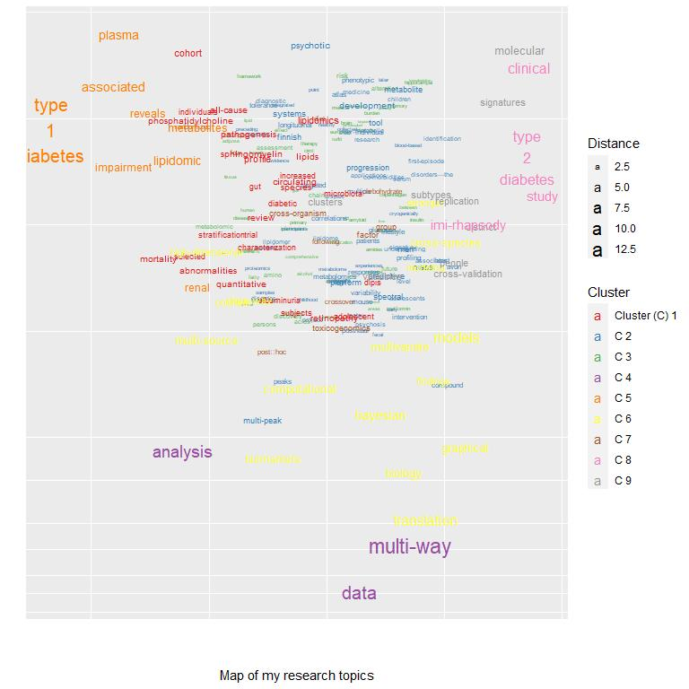

# Introduction

This is a tutorial script to producing an interactive visualization of words in a publication list extracted from [Google Scholar](https://scholar.google.com/). The appearance of the words is dependent on the frequency of their occurrence, and on which words they co-occur with in the titles of the listed articles.

The code is for R and it is, among others, based on packages [ggplot2](https://ggplot2.tidyverse.org/), [plotly](https://plotly.com/r/) and [htmlWidgets](https://www.htmlwidgets.org/).

This document is part of the Github repository [ScholarWordGraph](https://github.com/tommi-s/ScholarWordGraph) by [Tommi Suvitaival](https://tommi-s.com/).

<iframe 
  id="igraph" 
  scrolling="no" 
  style="border:none;" 
  seamless="seamless" 
  src="output-dark/index.html" 
  height="800" 
  width="800"
>
widget
</iframe>

# Preparations

1. Open a Google Scholar profile with browser (e.g., https://scholar.google.com/citations?user=SGgP0VQAAAAJ ).
1. Go to the bottom of the page and click "SHOW MORE" to show all entries on the page.
1. Go again to the bottom of the newly-expanded page.
1. Select everything in the table, starting from the year of the last entry (on the bottom-right corner) and ending at the title of the first entry (on the top-left corner).
1. Copy the selected text.
1. Paste the text to a text editor and save as "data/publications.txt" (see [example](https://github.com/tommi-s/ScholarWordGraph/blob/main/data/publications.txt) in the present repository).

# Load the Data


```r
data.loaded <- 
  readr::read_delim(
    file = "data/publications.txt",
    delim = "\t",
    escape_double = FALSE,
    col_names = FALSE,
    trim_ws = TRUE
  )
```

```
## Rows: 96 Columns: 1
```

```
## -- Column specification --------------------------------------------------------
## Delimiter: "\t"
## chr (1): X1
```

```
## 
## i Use `spec()` to retrieve the full column specification for this data.
## i Specify the column types or set `show_col_types = FALSE` to quiet this message.
```

# Format the Data

## Create a Data Frame of Articles

* Create a matrix with articles as rows and title, authors and journal as the three columns.
* Convert to a data frame.


```r
data <- unlist( data.loaded )
```

```
## Warning: One or more parsing issues, see `problems()` for details
```

```r
data <-
  matrix(
    data = unlist( data ),
    ncol = 3,
    byrow = TRUE
  )

colnames( data ) <-
  c(
    "Title",
    "Authors",
    "Journal"
  )

data <-
  data.frame(
    data,
    stringsAsFactors = FALSE
  )
```

## Convert Titles to Lower Case

* To match identical words with different case, convert all to lowercase.


```r
data$"Title.lower" <-
  tolower( data$"Title" )
```

## Define Multi-Word Terms

* Define word sequences that should be considered as a single term by adding replacing whitespace with underscore.
* E.g., "type 1 diabetes" is one term.


```r
data$"Title.lower" <-
  stringr::str_replace_all(
    string = data$"Title.lower",
    # pattern = "type 1 diabete",
    pattern = "type 1 diabetes",
    replacement = "type_1_diabetes"
  )

data$"Title.lower" <-
  stringr::str_replace_all(
    string = data$"Title.lower",
    pattern = "type 2 diabetes",
    replacement = "type_2_diabetes"
  )
```

## Omit Special Characters

* Omit punctuation and special characters from the titles.


```r
words <-
  stringr::str_split(
    string = data[ , "Title.lower" ],
    pattern = "\\s"
  )

words <- 
  lapply(
    X = words,
    FUN = tolower
  )

words <-
  lapply(
    X = words,
    FUN = stringr::str_replace_all,
    pattern = "(\\()|(\\))|(\\:)|(\\,)|(\\.)",
    replacement = ""
  )

table.words <- 
  sort(
    x = table( unlist( words ) ),
    decreasing = TRUE
  )

head( table.words )
```

```
## 
##   in   of  and  the with  for 
##   25   21   17   13   11    8
```

## Extract Unique Words

* List all unique words that appear in the titles.


```r
words.unique <-
  sort(
    unique(
      unlist( words ) )
  )
```

## Define List of Blocked Words

* List general words that are not of interest.
* Add plain numbers to this list.


```r
blocklist <-
  c(
    "and",
    "an",
    "after",
    "are",
    "as",
    "at",
    "based",
    "by",
    "do",
    "during",
    "for",
    "from",
    "in",
    "is",
    "of",
    "on",
    "not",
    "the",
    "to",
    "through",
    "with",
    "without",
    "...",
    letters
  )

blocklist <- 
  c(
    blocklist,
    words.unique[ grepl( x = words.unique, pattern = "^[0-9]+$" ) ]
  )
```

## Omit Blocked Words

* Omit the blocked words from the words list of each article.


```r
words <-
  lapply(
    X = words,
    FUN = function( x ) {
      x[ !( x %in% blocklist ) ]
    }
  )

table.words <- 
  sort(
    x = table( unlist( words ) ),
    decreasing = TRUE
  )

head( table.words )
```

```
## 
## type_1_diabetes        analysis      associated          plasma            data 
##               6               5               5               5               4 
##      lipidomics 
##               4
```

# Re-Extract Unique Words


```r
words.unique <-
  sort(
    unique(
      unlist( words ) )
  )
```

# Create the Words-by-Articles Occurrence Matrix

* Matrix that has value 1 if the word (row) appears in the article (column) and 0 otherwise.


```r
wba <-
  array(
    data = 0,
    dim = c( length( words.unique ), nrow( data ) )
  )

rownames( wba ) <- words.unique
colnames( wba ) <- data[ , "Title" ]

for ( i in 1:nrow( data ) ) {
  
  wba[ words[[ i ]], i ] <- 1
  
}
```

## Log-Transform the Occurrences

* Trasform the occurrences with log (1+x) for a more Gaussian-like distribution.


```r
wba.log1px <- log10( 1 + wba )
```

## Autoscale the Occurrence Profiles

* Scale the data for PCA.


```r
wba.norm <- scale( wba.log1px )
```

# Principal Component Analysis

## Compute PCA


```r
result.pca <-
  princomp(
    x = wba.norm
  )
```

## Plot PCA


```r
library( "ggfortify" )
```

```
## Warning: package 'ggfortify' was built under R version 4.0.5
```

```
## Loading required package: ggplot2
```

```
## Warning: package 'ggplot2' was built under R version 4.0.5
```

```r
plot <-
  autoplot( 
    result.pca
    # ,
    # loadings = TRUE,
    # loadings.label = TRUE
  )

print( plot )
```

<!-- -->

# Cluster the Words

* Using a fixed number of eight clusters for a suitable visual representation.


```r
result.clustering <-
  cluster::pam(
    x = wba.norm,
    k = 8
  )
```

# Figure

## Prepare Results for the Visualization

* Extract PCA-scores of the two first components.
* Extract cluster assignments for each data point.
* Compute each data point's Euclidean distance from the origin.
* Wrap multi-word terms to multiple lines for better visual impression.
* Create a text string listing all the article titles, where the term appears.


```r
data.plot <-
  data.frame(
    Word = rownames( result.pca$"scores" ),
    result.pca$"scores"
  )

data.plot$"Cluster" <- 
  factor(
    x = result.clustering$"clustering",
    levels = 1:length( unique( result.clustering$"clustering" ) ),
    labels = 
      c(
        "Cluster (C) 1",
        paste( "C", 2:length( unique( result.clustering$"clustering" ) ) )
      )
  )
  
data.plot$"Distance" <- 
  sqrt( data.plot$"Comp.1"^2 + data.plot$"Comp.2"^2 ) + 1

data.plot$"Term" <-
  stringr::str_replace_all(
    string = data.plot$"Word",
    pattern = "\\-",
    replacement = "-\n"
  )

data.plot$"Term" <-
  stringr::str_replace_all(
    string = data.plot$"Word",
    pattern = "\\_",
    replacement = "\n"
  )

data.plot$"Publications" <-
  apply(
    X = wba[ data.plot$"Word", ] == 1,
    MAR = 1,
    FUN = function( x ) {
      paste(
        "\n",
        names(
          which( x )
        ),
        collapse = "\n"
      )
    }
  )
```

## Define the Figure

* Visualization with ggplot2.
* PCA components 1 and 2, respectively, on the y- and x-axes.
* Term name as text label.
* Distance from origin as (increasing) size.
* Cluster assignment as color.
* Add jitter to reduce overlap of similar terms.
* Use pseudo-log-valued axes for reduced outliers.


```r
jitter <- 1

palette <- RColorBrewer::brewer.pal( n = 9, "Set1" )[ -6 ]
palette <- palette[ 1:nlevels( data.plot$"Cluster" ) ]

plot <-
  ggplot2::ggplot(
    data = data.plot,
    mapping =
      ggplot2::aes(
        x = Comp.2,
        y = Comp.1,
        label = Term,
        size = Distance,
        text = Publications
        ,
        color = Cluster,
      )
  ) +
  ggplot2::geom_text(
    position =
      ggplot2::position_jitter(
        height = jitter,
        width = jitter
      )
  ) +
  ggplot2::scale_x_continuous( trans = "pseudo_log" ) +
  ggplot2::scale_y_continuous( trans = "pseudo_log" ) +
  ggplot2::theme(
    axis.text.y = ggplot2::element_blank(),
    axis.ticks = ggplot2::element_blank()
  ) +
  ggplot2::xlab( label = "\n\n\nMap of my research topics" ) +
  ggplot2::ylab( label = "" ) +
  ggplot2::scale_color_manual( values = palette )
```

## Show the (Passive) Figure


```r
plot
```

<!-- -->

## Create the Interactive Figure

* Make ggplot2 figure interactive with the **ggplotly**-function from the **plotly**-package.
* Show the term and the articles, where it appears, as text (tooltip) when hovering over a data point.
* Use the layout-function for fine-tuning of the legend.


```r
library( tidyr )

plot.interactive <-
  plotly::ggplotly( 
    p = plot,
    tooltip = c( "label", "Publications" )
  ) %>%
  plotly::layout(
    legend = 
      list(
        orientation = "h",
        title = list( text = "Cluster<br>" ),
        x = quantile( x = data.plot$"Comp.2", probs = 0.67 ),
        y = min( data.plot$"Comp.1" )
      )
  )
```

## View the Interactive Figure


```r
plot.interactive
```

```{=html}
<div id="htmlwidget-bb14578f7c4f31a84088" style="width:768px;height:768px;" class="plotly html-widget"></div>
<script type="application/json" data-for="htmlwidget-bb14578f7c4f31a84088">{"x":{"data":[{"x":[0.335173868408869,0.693674403304524,-0.144339847346443,0.596202905570838,0.82405393387596,0.488775300631738,0.963987146070552,-0.747624011212635,0.357464659525406,-0.235425506220806,0.143228679927391,0.350301688598759,-0.482082839557576,0.392366730640036,-0.813528258787143],"y":[-0.156566674689883,1.04458568692765,-0.771384182044576,0.0264549350025207,-0.674255686470579,-0.359469587208845,-0.295085268219273,0.195749000522037,-0.120587497142415,0.957703070590933,1.17275981173544,-0.309242163965493,-0.69065606094272,0.0960582982438697,0.341293542056073],"text":["…","avon","blood-based","changes","childhood","development","early","evidence","experiences","integrated","later","longitudinal","point","preceding","proteomics"],"hovertext":["Term: …<br /><br /> Primary fatty amides in plasma associated with brain amyloid burden, hippocampal volume, and memory in the European Medical Information Framework for Alzheimer's Disease …<br /><br /> Metabolomic assessment reveals alteration in polyols and branched chain amino acids associated with present and future renal impairment in a discovery cohort of 637 persons …<br /><br /> Integrated lipidomics and proteomics point to early blood-based changes in childhood preceding later development of psychotic experiences: evidence from the Avon Longitudinal …","Term: avon<br /><br /> Identification of a plasma signature of psychotic disorder in children and adolescents from the Avon Longitudinal Study of Parents and Children (ALSPAC) cohort<br /><br /> Integrated lipidomics and proteomics point to early blood-based changes in childhood preceding later development of psychotic experiences: evidence from the Avon Longitudinal …","Term: blood-based<br /><br /> Integrated lipidomics and proteomics point to early blood-based changes in childhood preceding later development of psychotic experiences: evidence from the Avon Longitudinal …","Term: changes<br /><br /> Integrated lipidomics and proteomics point to early blood-based changes in childhood preceding later development of psychotic experiences: evidence from the Avon Longitudinal …<br /><br /> Changes in the lipidome in type 1 diabetes following low carbohydrate diet: Post-hoc analysis of a randomized crossover trial","Term: childhood<br /><br /> Integrated lipidomics and proteomics point to early blood-based changes in childhood preceding later development of psychotic experiences: evidence from the Avon Longitudinal …","Term: development<br /><br /> Serum metabolite profile associates with the development of metabolic co-morbidities in first-episode psychosis<br /><br /> Molecular Atlas of Postnatal Mouse Heart Development<br /><br /> Integrated lipidomics and proteomics point to early blood-based changes in childhood preceding later development of psychotic experiences: evidence from the Avon Longitudinal …","Term: early<br /><br /> Integrated lipidomics and proteomics point to early blood-based changes in childhood preceding later development of psychotic experiences: evidence from the Avon Longitudinal …","Term: evidence<br /><br /> Integrated lipidomics and proteomics point to early blood-based changes in childhood preceding later development of psychotic experiences: evidence from the Avon Longitudinal …","Term: experiences<br /><br /> Integrated lipidomics and proteomics point to early blood-based changes in childhood preceding later development of psychotic experiences: evidence from the Avon Longitudinal …","Term: integrated<br /><br /> Integrated lipidomics and proteomics point to early blood-based changes in childhood preceding later development of psychotic experiences: evidence from the Avon Longitudinal …","Term: later<br /><br /> Integrated lipidomics and proteomics point to early blood-based changes in childhood preceding later development of psychotic experiences: evidence from the Avon Longitudinal …","Term: longitudinal<br /><br /> Identification of a plasma signature of psychotic disorder in children and adolescents from the Avon Longitudinal Study of Parents and Children (ALSPAC) cohort<br /><br /> Integrated lipidomics and proteomics point to early blood-based changes in childhood preceding later development of psychotic experiences: evidence from the Avon Longitudinal …","Term: point<br /><br /> Integrated lipidomics and proteomics point to early blood-based changes in childhood preceding later development of psychotic experiences: evidence from the Avon Longitudinal …","Term: preceding<br /><br /> Integrated lipidomics and proteomics point to early blood-based changes in childhood preceding later development of psychotic experiences: evidence from the Avon Longitudinal …","Term: proteomics<br /><br /> Integrated lipidomics and proteomics point to early blood-based changes in childhood preceding later development of psychotic experiences: evidence from the Avon Longitudinal …"],"textfont":{"size":[8.92414011734841,8.36330791850921,6.28033846598011,7.44951416531748,6.28033846598011,9.98074916930306,6.28033846598011,6.28033846598011,6.28033846598011,6.28033846598011,6.28033846598011,8.36330791850921,6.28033846598011,6.28033846598011,6.28033846598011],"color":"rgba(228,26,28,1)"},"type":"scatter","mode":"text","hoveron":"points","name":"Cluster (C) 1","legendgroup":"Cluster (C) 1","showlegend":true,"xaxis":"x","yaxis":"y","hoverinfo":"text","frame":null},{"x":[-1.15539458199135,-0.246362600828116,-0.832044012250791,0.415733137419279,0.33808688097444,0.0795971762213072,-1.61713747615895,-0.115921759281339,0.354356065971251,-0.773573758898829,-1.20130457987638,-0.308631851675401,-0.813987177683567,0.0400283707351401,0.887452520605668,-0.186884112789153,0.293775179551502,-0.345071324581506,0.479382172271106,-0.628333688119838,-1.21477380383626,-1.34637919651,-1.0517282713005,-0.057334862863813,1.10922620654848,0.219565744488369,-1.27944947423592,2.20045249073405,0.468419650770364,-0.34439497552356,-0.871168026233234,0.593491766377859,0.235117717806939,0.408913953726886,0.0179116781566841,0.975632671893332,0.422152179359513,1.28775290823305,0.360444658452032,0.117358121782263,-0.798125073823767,0.355996875694113,0.187101301498433,-0.569327520420943,-1.04543214792252,-0.731023355156215,1.58674881487676,-1.04704400139157,-0.271257858746816,-0.789842144054306,0.717309989453899,-0.372523294503196,0.386844996646883,0.558984596509208,-0.216653970422749,0.153556145576685,-0.934738189381493,-0.788494090846632,-0.464287467590973,0.362442068066024,0.526055678387692,0.728374636497317,1.35713744032688,-0.195717697127987,-0.306026389571075,0.151390561810563,1.13571361981032,0.76865849570104,0.385304570828352,-1.443415488872,-1.32068071251914,-0.575007167883496,-0.721642873257764,1.45919282434289,0.419840223905535,-0.507700233622581,-0.68438348431294,-0.781074269095962,0.375219681926761,-0.175457131606658,-0.0606634219352939,0.363855300424295,0.512845955095876,0.250478128910971,-0.10139483940757,0.525072418328866,-0.0458315881047325,-0.413396351852578,0.998539672783773,0.0191762625917236,-0.863179048870814,0.00179538200419985,-0.413016417908589,-0.55447511993164,-0.00322160062124927,0.371202113307653,-0.628037336169337,-0.560079361134834,0.605880574436332,-0.771105565835069,0.660653141502782,0.00591185575132169,-0.72755528090388,-1.14301597596442,-0.578579815233143,0.0189568039753,-0.239136368217973,-0.486555176700572,-1.32149025542317,-0.721257015227605,0.0550495018412748,-0.888348423113974,-1.50877174772985,0.192344127857234,1.16460318239862,-0.263634185075791,0.867778036478547,-0.220970636987753,-0.668334319264062,-0.295776870390094,-1.21497078106281,-0.436775147961778,1.5540070657617,-0.8006449665224,0.250979201418666,-0.466464547103287,0.401502123079131,-0.803037356922815,0.0105060360186259,0.622231149646508,0.681430170054526,-0.818510311548571,-0.127573578842408,-1.80529447362148,0.963221372735474,1.85065009353435],"y":[0.0801077828962704,0.0288922264668058,-0.485194897321297,1.03300492098055,0.0615636319016132,0.811979130345535,0.934825176060605,0.508780648382476,-0.095246008647709,0.120188957495512,-2.28418903190413,0.0170483188282119,1.15015988698778,-0.350694382649551,0.502505252292268,-0.75904952189913,0.915387805509137,-0.493674616908144,-0.432916313772967,0.918383143334405,0.693384788880022,-0.253791237880291,0.905030222093583,0.820738876289349,0.411510005043915,-0.189521431179584,0.135373444947935,0.917704116169075,0.237803545800556,0.651562808460851,0.349450822355562,-0.289604926263872,-0.311942551243807,-0.890425613263111,0.940972890982537,-0.892581250011678,-0.14690477026982,-1.59556098691182,0.815016019666854,-0.241084999103845,-1.98296527025439,0.709356437906167,-0.520135593299569,-0.384903851379979,-0.232842199089109,0.342149441978059,-0.290696852820407,-0.252052937210782,0.0988154525851298,0.515049967929891,0.212356492695223,-0.294238959337685,-0.0557416617802187,0.763861929833143,1.10941460770172,-1.19549254723752,-1.24235297039507,1.21721791566084,-0.251455234209187,-1.15808952671099,0.073191124438064,0.512291889088324,1.43184696802662,0.427522482719342,-0.344279291988689,-0.359758965859057,0.547080681681128,1.11662089756701,-0.596492334712802,-0.789130645207173,1.13999854233075,0.274851603734492,-0.540634472143877,0.238739208885369,-0.794240273155908,0.499168119591744,0.461278857368414,-0.78018740849021,-0.481899589724596,0.49862423799759,-0.469797330939072,-1.16869297129585,-1.59848383634843,0.36673145006797,-0.644035194847327,0.219630185203515,-1.32008907314115,-0.449087719961046,-1.59706870662713,-0.770591074093933,-1.55759627238566,0.168309054253719,0.0424261544119915,-0.497976336527675,-0.853629570413138,-0.105033291949373,0.213150062082232,-0.179658807660979,-0.767611790498822,0.942223347558825,0.561796095376723,0.231343605191347,-0.545974973173915,1.56889380455933,-0.13792451833567,-0.696430019467238,-0.387034946207593,-0.422289660271595,0.176396123900263,-0.250114087577839,1.18532161884597,1.19221787080128,0.475912261217495,-0.316258968350339,1.11022721594881,1.19761332535194,-0.199059709420841,-0.288192495550555,-0.641304773033637,-0.899655517503213,0.897048194820114,0.151349597894411,1.30566411013837,-0.560567201064307,1.07645491654641,0.432988684259295,0.351455969082325,0.00569199067981707,0.00509511317023326,-0.0963380089810281,-2.60830624655315,0.213572871521259,-1.78201296112123,0.685324770537428,-0.318092985056846,-0.375011265700396],"text":["abnormalities","acids","adipose","adolescent","adolescents","albuminuria","all-cause","alspac","alteration","amino","analysis","areas","assessment","associates","atlas","bayesian","between","biology","biomarkers","body","branched","carbohydrate","chain","characterization","children","cimt","circulating","clinical","clusters","co-morbidities","cohort","collinear","compound","computational","copenhagen","correlations","cross-organism","cross-species","cross-validation","crossover","data","diabetic","diet","dipis","discovery","disorder","distinct","diversity","effect","factor","findings","finnish","first-episode","following","future","graphical","group","gut","heart","high-dimensional","human","identification","imi-rhapsody","impairment","increased","insulin","level","lipidome","lipidomer","lipidomic","lipids","low","mass","men","metabolic","metabolite","metabolites","metabolomic","metabolomics","metformin","microbiota","modeling","models","molecular","mortality","mouse","multi-peak","multi-source","multi-way","multiple","multivariate","parents","pathogenesis","patients","peaks","people","persons","phosphatidylcholine","polyols","post‐hoc","postnatal","predictive","present","profile","profiling","progression","psychosis","quantitative","randomized","renal","replication","retinopathy","review","selected","serum","signature","signatures","species","spectral","sphingomyelin","stratification","stronger","study","subjects","subtypes","targeted","therapy","tissue","tool","toxicogenomics","translation","trial","two-way","type<br />1<br />diabetes","understanding","variables"],"hovertext":["Term: abnormalities<br /><br /> Lipidomic Abnormalities During the Pathogenesis of Type 1 Diabetes: a Quantitative Review","Term: acids<br /><br /> Metabolomic assessment reveals alteration in polyols and branched chain amino acids associated with present and future renal impairment in a discovery cohort of 637 persons …","Term: adipose<br /><br /> Lipidomics of human adipose tissue reveals diversity between body areas","Term: adolescent<br /><br /> Characterization of plasma lipidomics in adolescent subjects with increased risk for type 1 diabetes in the DiPiS cohort","Term: adolescents<br /><br /> Identification of a plasma signature of psychotic disorder in children and adolescents from the Avon Longitudinal Study of Parents and Children (ALSPAC) cohort","Term: albuminuria<br /><br /> Gut microbiota profile and selected plasma metabolites in type 1 diabetes without and with stratification by albuminuria","Term: all-cause<br /><br /> Lipidomic analysis reveals sphingomyelin and phosphatidylcholine species associated with renal impairment and all-cause mortality in type 1 diabetes","Term: alspac<br /><br /> Identification of a plasma signature of psychotic disorder in children and adolescents from the Avon Longitudinal Study of Parents and Children (ALSPAC) cohort","Term: alteration<br /><br /> Metabolomic assessment reveals alteration in polyols and branched chain amino acids associated with present and future renal impairment in a discovery cohort of 637 persons …","Term: amino<br /><br /> Metabolomic assessment reveals alteration in polyols and branched chain amino acids associated with present and future renal impairment in a discovery cohort of 637 persons …","Term: analysis<br /><br /> Multivariate multi-way analysis of multi-source data<br /><br /> Two-way analysis of high-dimensional collinear data<br /><br /> Lipidomic analysis reveals sphingomyelin and phosphatidylcholine species associated with renal impairment and all-cause mortality in type 1 diabetes<br /><br /> Cross-organism toxicogenomics with group factor analysis<br /><br /> Changes in the lipidome in type 1 diabetes following low carbohydrate diet: Post-hoc analysis of a randomized crossover trial","Term: areas<br /><br /> Lipidomics of human adipose tissue reveals diversity between body areas","Term: assessment<br /><br /> Metabolomic assessment reveals alteration in polyols and branched chain amino acids associated with present and future renal impairment in a discovery cohort of 637 persons …","Term: associates<br /><br /> Serum metabolite profile associates with the development of metabolic co-morbidities in first-episode psychosis","Term: atlas<br /><br /> Molecular Atlas of Postnatal Mouse Heart Development","Term: bayesian<br /><br /> Stronger findings for metabolomics through Bayesian modeling of multiple peaks and compound correlations<br /><br /> Bayesian Multi-Way Models for Data Translation in Computational Biology","Term: between<br /><br /> Lipidomics of human adipose tissue reveals diversity between body areas","Term: biology<br /><br /> Bayesian Multi-Way Models for Data Translation in Computational Biology","Term: biomarkers<br /><br /> Cross-species translation of multi-way biomarkers","Term: body<br /><br /> Lipidomics of human adipose tissue reveals diversity between body areas","Term: branched<br /><br /> Metabolomic assessment reveals alteration in polyols and branched chain amino acids associated with present and future renal impairment in a discovery cohort of 637 persons …","Term: carbohydrate<br /><br /> Changes in the lipidome in type 1 diabetes following low carbohydrate diet: Post-hoc analysis of a randomized crossover trial","Term: chain<br /><br /> Metabolomic assessment reveals alteration in polyols and branched chain amino acids associated with present and future renal impairment in a discovery cohort of 637 persons …","Term: characterization<br /><br /> Characterization of plasma lipidomics in adolescent subjects with increased risk for type 1 diabetes in the DiPiS cohort","Term: children<br /><br /> Identification of a plasma signature of psychotic disorder in children and adolescents from the Avon Longitudinal Study of Parents and Children (ALSPAC) cohort","Term: cimt<br /><br /> Effect of metformin on plasma metabolite profile in the Copenhagen Insulin and Metformin Therapy (CIMT) trial","Term: circulating<br /><br /> Circulating metabolites and lipids are associated to diabetic retinopathy in individuals With type 1 diabetes","Term: clinical<br /><br /> Targeted Clinical Metabolite Profiling Platform for the Stratification of Diabetic Patients<br /><br /> Replication and cross-validation of type 2 diabetes subtypes based on clinical variables: an IMI-RHAPSODY study<br /><br /> Distinct molecular signatures of clinical clusters in people with type 2 diabetes: an IMI-RHAPSODY study","Term: clusters<br /><br /> Distinct molecular signatures of clinical clusters in people with type 2 diabetes: an IMI-RHAPSODY study","Term: co-morbidities<br /><br /> Serum metabolite profile associates with the development of metabolic co-morbidities in first-episode psychosis","Term: cohort<br /><br /> Identification of a plasma signature of psychotic disorder in children and adolescents from the Avon Longitudinal Study of Parents and Children (ALSPAC) cohort<br /><br /> Metabolomic assessment reveals alteration in polyols and branched chain amino acids associated with present and future renal impairment in a discovery cohort of 637 persons …<br /><br /> Characterization of plasma lipidomics in adolescent subjects with increased risk for type 1 diabetes in the DiPiS cohort","Term: collinear<br /><br /> Two-way analysis of high-dimensional collinear data","Term: compound<br /><br /> Stronger findings for metabolomics through Bayesian modeling of multiple peaks and compound correlations","Term: computational<br /><br /> Bayesian Multi-Way Models for Data Translation in Computational Biology","Term: copenhagen<br /><br /> Effect of metformin on plasma metabolite profile in the Copenhagen Insulin and Metformin Therapy (CIMT) trial","Term: correlations<br /><br /> Stronger findings for metabolomics through Bayesian modeling of multiple peaks and compound correlations","Term: cross-organism<br /><br /> Cross-organism toxicogenomics with group factor analysis","Term: cross-species<br /><br /> Cross-species translation of multi-way biomarkers","Term: cross-validation<br /><br /> Replication and cross-validation of type 2 diabetes subtypes based on clinical variables: an IMI-RHAPSODY study","Term: crossover<br /><br /> Changes in the lipidome in type 1 diabetes following low carbohydrate diet: Post-hoc analysis of a randomized crossover trial","Term: data<br /><br /> Multivariate multi-way analysis of multi-source data<br /><br /> Two-way analysis of high-dimensional collinear data<br /><br /> Stronger findings from mass spectral data through multi-peak modeling<br /><br /> Bayesian Multi-Way Models for Data Translation in Computational Biology","Term: diabetic<br /><br /> Targeted Clinical Metabolite Profiling Platform for the Stratification of Diabetic Patients<br /><br /> Circulating metabolites and lipids are associated to diabetic retinopathy in individuals With type 1 diabetes","Term: diet<br /><br /> Changes in the lipidome in type 1 diabetes following low carbohydrate diet: Post-hoc analysis of a randomized crossover trial","Term: dipis<br /><br /> Characterization of plasma lipidomics in adolescent subjects with increased risk for type 1 diabetes in the DiPiS cohort","Term: discovery<br /><br /> Metabolomic assessment reveals alteration in polyols and branched chain amino acids associated with present and future renal impairment in a discovery cohort of 637 persons …","Term: disorder<br /><br /> Identification of a plasma signature of psychotic disorder in children and adolescents from the Avon Longitudinal Study of Parents and Children (ALSPAC) cohort","Term: distinct<br /><br /> Distinct molecular signatures of clinical clusters in people with type 2 diabetes: an IMI-RHAPSODY study","Term: diversity<br /><br /> Lipidomics of human adipose tissue reveals diversity between body areas","Term: effect<br /><br /> Effect of metformin on plasma metabolite profile in the Copenhagen Insulin and Metformin Therapy (CIMT) trial","Term: factor<br /><br /> Cross-organism toxicogenomics with group factor analysis","Term: findings<br /><br /> Stronger findings from mass spectral data through multi-peak modeling<br /><br /> Stronger findings for metabolomics through Bayesian modeling of multiple peaks and compound correlations","Term: finnish<br /><br /> Lipidome as a predictive tool in progression to type 2 diabetes in Finnish men","Term: first-episode<br /><br /> Serum metabolite profile associates with the development of metabolic co-morbidities in first-episode psychosis","Term: following<br /><br /> Changes in the lipidome in type 1 diabetes following low carbohydrate diet: Post-hoc analysis of a randomized crossover trial","Term: future<br /><br /> Metabolomic assessment reveals alteration in polyols and branched chain amino acids associated with present and future renal impairment in a discovery cohort of 637 persons …","Term: graphical<br /><br /> Graphical multi-way models","Term: group<br /><br /> Cross-organism toxicogenomics with group factor analysis","Term: gut<br /><br /> Gut microbiota profile and selected plasma metabolites in type 1 diabetes without and with stratification by albuminuria","Term: heart<br /><br /> Molecular Atlas of Postnatal Mouse Heart Development","Term: high-dimensional<br /><br /> Two-way analysis of high-dimensional collinear data","Term: human<br /><br /> Lipidomics of human adipose tissue reveals diversity between body areas","Term: identification<br /><br /> Identification of a plasma signature of psychotic disorder in children and adolescents from the Avon Longitudinal Study of Parents and Children (ALSPAC) cohort","Term: imi-rhapsody<br /><br /> Replication and cross-validation of type 2 diabetes subtypes based on clinical variables: an IMI-RHAPSODY study<br /><br /> Distinct molecular signatures of clinical clusters in people with type 2 diabetes: an IMI-RHAPSODY study","Term: impairment<br /><br /> Lipidomic analysis reveals sphingomyelin and phosphatidylcholine species associated with renal impairment and all-cause mortality in type 1 diabetes<br /><br /> Metabolomic assessment reveals alteration in polyols and branched chain amino acids associated with present and future renal impairment in a discovery cohort of 637 persons …","Term: increased<br /><br /> Characterization of plasma lipidomics in adolescent subjects with increased risk for type 1 diabetes in the DiPiS cohort","Term: insulin<br /><br /> Effect of metformin on plasma metabolite profile in the Copenhagen Insulin and Metformin Therapy (CIMT) trial","Term: level<br /><br /> Understanding the Lipidome at the Systems Level with lipidomeR","Term: lipidome<br /><br /> Lipidome as a predictive tool in progression to type 2 diabetes in Finnish men<br /><br /> Understanding the Lipidome at the Systems Level with lipidomeR<br /><br /> Changes in the lipidome in type 1 diabetes following low carbohydrate diet: Post-hoc analysis of a randomized crossover trial","Term: lipidomer<br /><br /> Understanding the Lipidome at the Systems Level with lipidomeR","Term: lipidomic<br /><br /> Lipidomic analysis reveals sphingomyelin and phosphatidylcholine species associated with renal impairment and all-cause mortality in type 1 diabetes<br /><br /> Lipidomic Abnormalities During the Pathogenesis of Type 1 Diabetes: a Quantitative Review","Term: lipids<br /><br /> Circulating metabolites and lipids are associated to diabetic retinopathy in individuals With type 1 diabetes","Term: low<br /><br /> Changes in the lipidome in type 1 diabetes following low carbohydrate diet: Post-hoc analysis of a randomized crossover trial","Term: mass<br /><br /> Stronger findings from mass spectral data through multi-peak modeling","Term: men<br /><br /> Lipidome as a predictive tool in progression to type 2 diabetes in Finnish men","Term: metabolic<br /><br /> Serum metabolite profile associates with the development of metabolic co-morbidities in first-episode psychosis","Term: metabolite<br /><br /> Serum metabolite profile associates with the development of metabolic co-morbidities in first-episode psychosis<br /><br /> Effect of metformin on plasma metabolite profile in the Copenhagen Insulin and Metformin Therapy (CIMT) trial<br /><br /> Targeted Clinical Metabolite Profiling Platform for the Stratification of Diabetic Patients","Term: metabolites<br /><br /> Circulating metabolites and lipids are associated to diabetic retinopathy in individuals With type 1 diabetes<br /><br /> Gut microbiota profile and selected plasma metabolites in type 1 diabetes without and with stratification by albuminuria","Term: metabolomic<br /><br /> Metabolomic assessment reveals alteration in polyols and branched chain amino acids associated with present and future renal impairment in a discovery cohort of 637 persons …","Term: metabolomics<br /><br /> Stronger findings for metabolomics through Bayesian modeling of multiple peaks and compound correlations","Term: metformin<br /><br /> Effect of metformin on plasma metabolite profile in the Copenhagen Insulin and Metformin Therapy (CIMT) trial","Term: microbiota<br /><br /> Gut microbiota profile and selected plasma metabolites in type 1 diabetes without and with stratification by albuminuria","Term: modeling<br /><br /> Stronger findings from mass spectral data through multi-peak modeling<br /><br /> Stronger findings for metabolomics through Bayesian modeling of multiple peaks and compound correlations","Term: models<br /><br /> Graphical multi-way models<br /><br /> Bayesian Multi-Way Models for Data Translation in Computational Biology","Term: molecular<br /><br /> Molecular Atlas of Postnatal Mouse Heart Development<br /><br /> Distinct molecular signatures of clinical clusters in people with type 2 diabetes: an IMI-RHAPSODY study","Term: mortality<br /><br /> Lipidomic analysis reveals sphingomyelin and phosphatidylcholine species associated with renal impairment and all-cause mortality in type 1 diabetes","Term: mouse<br /><br /> Molecular Atlas of Postnatal Mouse Heart Development","Term: multi-peak<br /><br /> Stronger findings from mass spectral data through multi-peak modeling","Term: multi-source<br /><br /> Multivariate multi-way analysis of multi-source data","Term: multi-way<br /><br /> Multivariate multi-way analysis of multi-source data<br /><br /> Graphical multi-way models<br /><br /> Cross-species translation of multi-way biomarkers<br /><br /> Bayesian Multi-Way Models for Data Translation in Computational Biology","Term: multiple<br /><br /> Stronger findings for metabolomics through Bayesian modeling of multiple peaks and compound correlations","Term: multivariate<br /><br /> Multivariate multi-way analysis of multi-source data","Term: parents<br /><br /> Identification of a plasma signature of psychotic disorder in children and adolescents from the Avon Longitudinal Study of Parents and Children (ALSPAC) cohort","Term: pathogenesis<br /><br /> Lipidomic Abnormalities During the Pathogenesis of Type 1 Diabetes: a Quantitative Review","Term: patients<br /><br /> Targeted Clinical Metabolite Profiling Platform for the Stratification of Diabetic Patients","Term: peaks<br /><br /> Stronger findings for metabolomics through Bayesian modeling of multiple peaks and compound correlations","Term: people<br /><br /> Distinct molecular signatures of clinical clusters in people with type 2 diabetes: an IMI-RHAPSODY study","Term: persons<br /><br /> Metabolomic assessment reveals alteration in polyols and branched chain amino acids associated with present and future renal impairment in a discovery cohort of 637 persons …","Term: phosphatidylcholine<br /><br /> Lipidomic analysis reveals sphingomyelin and phosphatidylcholine species associated with renal impairment and all-cause mortality in type 1 diabetes","Term: polyols<br /><br /> Metabolomic assessment reveals alteration in polyols and branched chain amino acids associated with present and future renal impairment in a discovery cohort of 637 persons …","Term: post-hoc<br /><br /> Changes in the lipidome in type 1 diabetes following low carbohydrate diet: Post-hoc analysis of a randomized crossover trial","Term: postnatal<br /><br /> Molecular Atlas of Postnatal Mouse Heart Development","Term: predictive<br /><br /> Lipidome as a predictive tool in progression to type 2 diabetes in Finnish men","Term: present<br /><br /> Metabolomic assessment reveals alteration in polyols and branched chain amino acids associated with present and future renal impairment in a discovery cohort of 637 persons …","Term: profile<br /><br /> Serum metabolite profile associates with the development of metabolic co-morbidities in first-episode psychosis<br /><br /> Effect of metformin on plasma metabolite profile in the Copenhagen Insulin and Metformin Therapy (CIMT) trial<br /><br /> Gut microbiota profile and selected plasma metabolites in type 1 diabetes without and with stratification by albuminuria","Term: profiling<br /><br /> Targeted Clinical Metabolite Profiling Platform for the Stratification of Diabetic Patients","Term: progression<br /><br /> Lipidome as a predictive tool in progression to type 2 diabetes in Finnish men","Term: psychosis<br /><br /> Serum metabolite profile associates with the development of metabolic co-morbidities in first-episode psychosis","Term: quantitative<br /><br /> Lipidomic Abnormalities During the Pathogenesis of Type 1 Diabetes: a Quantitative Review","Term: randomized<br /><br /> Changes in the lipidome in type 1 diabetes following low carbohydrate diet: Post-hoc analysis of a randomized crossover trial","Term: renal<br /><br /> Lipidomic analysis reveals sphingomyelin and phosphatidylcholine species associated with renal impairment and all-cause mortality in type 1 diabetes<br /><br /> Metabolomic assessment reveals alteration in polyols and branched chain amino acids associated with present and future renal impairment in a discovery cohort of 637 persons …","Term: replication<br /><br /> Replication and cross-validation of type 2 diabetes subtypes based on clinical variables: an IMI-RHAPSODY study","Term: retinopathy<br /><br /> Circulating metabolites and lipids are associated to diabetic retinopathy in individuals With type 1 diabetes","Term: review<br /><br /> Lipidomic Abnormalities During the Pathogenesis of Type 1 Diabetes: a Quantitative Review","Term: selected<br /><br /> Gut microbiota profile and selected plasma metabolites in type 1 diabetes without and with stratification by albuminuria","Term: serum<br /><br /> Serum metabolite profile associates with the development of metabolic co-morbidities in first-episode psychosis","Term: signature<br /><br /> Identification of a plasma signature of psychotic disorder in children and adolescents from the Avon Longitudinal Study of Parents and Children (ALSPAC) cohort","Term: signatures<br /><br /> Distinct molecular signatures of clinical clusters in people with type 2 diabetes: an IMI-RHAPSODY study","Term: species<br /><br /> Lipidomic analysis reveals sphingomyelin and phosphatidylcholine species associated with renal impairment and all-cause mortality in type 1 diabetes","Term: spectral<br /><br /> Stronger findings from mass spectral data through multi-peak modeling","Term: sphingomyelin<br /><br /> Lipidomic analysis reveals sphingomyelin and phosphatidylcholine species associated with renal impairment and all-cause mortality in type 1 diabetes","Term: stratification<br /><br /> Targeted Clinical Metabolite Profiling Platform for the Stratification of Diabetic Patients<br /><br /> Gut microbiota profile and selected plasma metabolites in type 1 diabetes without and with stratification by albuminuria","Term: stronger<br /><br /> Stronger findings from mass spectral data through multi-peak modeling<br /><br /> Stronger findings for metabolomics through Bayesian modeling of multiple peaks and compound correlations","Term: study<br /><br /> Identification of a plasma signature of psychotic disorder in children and adolescents from the Avon Longitudinal Study of Parents and Children (ALSPAC) cohort<br /><br /> Replication and cross-validation of type 2 diabetes subtypes based on clinical variables: an IMI-RHAPSODY study<br /><br /> Distinct molecular signatures of clinical clusters in people with type 2 diabetes: an IMI-RHAPSODY study","Term: subjects<br /><br /> Characterization of plasma lipidomics in adolescent subjects with increased risk for type 1 diabetes in the DiPiS cohort","Term: subtypes<br /><br /> Replication and cross-validation of type 2 diabetes subtypes based on clinical variables: an IMI-RHAPSODY study","Term: targeted<br /><br /> Targeted Clinical Metabolite Profiling Platform for the Stratification of Diabetic Patients","Term: therapy<br /><br /> Effect of metformin on plasma metabolite profile in the Copenhagen Insulin and Metformin Therapy (CIMT) trial","Term: tissue<br /><br /> Lipidomics of human adipose tissue reveals diversity between body areas","Term: tool<br /><br /> Lipidome as a predictive tool in progression to type 2 diabetes in Finnish men","Term: toxicogenomics<br /><br /> Cross-organism toxicogenomics with group factor analysis","Term: translation<br /><br /> Cross-species translation of multi-way biomarkers<br /><br /> Bayesian Multi-Way Models for Data Translation in Computational Biology","Term: trial<br /><br /> Effect of metformin on plasma metabolite profile in the Copenhagen Insulin and Metformin Therapy (CIMT) trial<br /><br /> Changes in the lipidome in type 1 diabetes following low carbohydrate diet: Post-hoc analysis of a randomized crossover trial","Term: two-way<br /><br /> Two-way analysis of high-dimensional collinear data","Term: type<br />1<br />diabetes<br /><br /> Lipidomic analysis reveals sphingomyelin and phosphatidylcholine species associated with renal impairment and all-cause mortality in type 1 diabetes<br /><br /> Circulating metabolites and lipids are associated to diabetic retinopathy in individuals With type 1 diabetes<br /><br /> Gut microbiota profile and selected plasma metabolites in type 1 diabetes without and with stratification by albuminuria<br /><br /> Lipidomic Abnormalities During the Pathogenesis of Type 1 Diabetes: a Quantitative Review<br /><br /> Changes in the lipidome in type 1 diabetes following low carbohydrate diet: Post-hoc analysis of a randomized crossover trial<br /><br /> Characterization of plasma lipidomics in adolescent subjects with increased risk for type 1 diabetes in the DiPiS cohort","Term: understanding<br /><br /> Understanding the Lipidome at the Systems Level with lipidomeR","Term: variables<br /><br /> Replication and cross-validation of type 2 diabetes subtypes based on clinical variables: an IMI-RHAPSODY study"],"textfont":{"size":[10.0227562300786,6.86831884568736,5.2796184295226,8.67900209830133,7.16262442080878,9.24618494461737,10.2433622158286,7.16262442080878,6.86831884568736,6.86831884568736,19.2684559993431,5.2796184295226,6.86831884568736,6.511764177495,8.39404138157446,13.674224371609,5.2796184295226,12.5437114641505,12.2744429228418,5.2796184295226,6.86831884568736,7.89774846019875,6.86831884568736,8.67900209830133,7.16262442080878,6.23092615454284,9.79436965627137,15.4703955062867,11.3786268573125,6.511764177495,10.6258578201705,11.104557149373,7.7747130133892,12.5437114641505,6.23092615454284,7.7747130133892,8.74649302849887,12.2744429228418,11.4471158713255,7.89774846019875,20.2549018723122,9.27544247860767,7.89774846019875,8.67900209830133,6.86831884568736,7.16262442080878,11.3786268573125,5.2796184295226,6.23092615454284,8.74649302849887,10.8982491808933,9.04435097450964,6.511764177495,7.89774846019875,6.86831884568736,13.4120300727054,8.74649302849887,9.24618494461737,8.39404138157446,11.104557149373,5.2796184295226,7.16262442080878,14.7100211477783,11.7338996139862,8.67900209830133,6.23092615454284,6.68963511276678,6.50544941584095,6.68963511276678,13.5005737442335,9.79436965627137,7.89774846019875,9.08424340947336,9.04435097450964,6.511764177495,9.30324412776946,12.6656296655831,6.86831884568736,7.7747130133892,6.23092615454284,9.24618494461737,10.8982491808933,17.208630020291,12.8242526914013,10.2433622158286,8.39404138157446,9.08424340947336,13.0856658439002,22.6771653543307,7.7747130133892,13.0856658439002,7.16262442080878,10.0227562300786,7.79729215409558,7.7747130133892,11.3786268573125,6.86831884568736,10.2433622158286,6.86831884568736,7.89774846019875,8.39404138157446,9.04435097450964,6.86831884568736,10.6006891089719,7.79729215409558,9.04435097450964,6.511764177495,10.0227562300786,7.89774846019875,11.7338996139862,11.4471158713255,9.79436965627137,10.0227562300786,9.24618494461737,6.511764177495,7.16262442080878,11.3786268573125,10.2433622158286,9.08424340947336,10.2433622158286,9.00209143430284,10.8982491808933,15.1913643777023,8.67900209830133,11.4471158713255,7.79729215409558,6.23092615454284,5.2796184295226,9.04435097450964,8.74649302849887,16.4120163170569,9.01741614892878,11.104557149373,19.6199155085839,6.68963511276678,11.4471158713255],"color":"rgba(55,126,184,1)"},"type":"scatter","mode":"text","hoveron":"points","name":"C 2","legendgroup":"C 2","showlegend":true,"xaxis":"x","yaxis":"y","hoverinfo":"text","frame":null},{"x":[-0.209425459392296,0.918269086852743,-0.343412009775566,-1.31486013460346,0.654720867276265,1.15138510823257,0.9237612734922,0.695817584861143,0.316154662480584,1.04829295001931,1.79866017291461,-0.163699110280649],"y":[-0.60233952940668,0.167700442511188,0.659559691816168,0.604067136214853,0.940686858284818,0.41922945112695,-0.195838869989319,-0.200039994411571,0.023784939795026,-0.550620112076802,1.28391414977309,-0.680607462276174],"text":["account","glucose","high","individuals","inter-individual","intervention","lifestyle","responses","risk","tolerance","type<br />2<br />diabetes","variability"],"hovertext":["Term: account<br /><br /> Phenotypic Responses to a Lifestyle Intervention Do Not Account for Inter-Individual Variability in Glucose Tolerance for Individuals at High Risk of Type 2 Diabetes","Term: glucose<br /><br /> Phenotypic Responses to a Lifestyle Intervention Do Not Account for Inter-Individual Variability in Glucose Tolerance for Individuals at High Risk of Type 2 Diabetes","Term: high<br /><br /> Phenotypic Responses to a Lifestyle Intervention Do Not Account for Inter-Individual Variability in Glucose Tolerance for Individuals at High Risk of Type 2 Diabetes","Term: individuals<br /><br /> Circulating metabolites and lipids are associated to diabetic retinopathy in individuals With type 1 diabetes<br /><br /> Phenotypic Responses to a Lifestyle Intervention Do Not Account for Inter-Individual Variability in Glucose Tolerance for Individuals at High Risk of Type 2 Diabetes","Term: inter-individual<br /><br /> Phenotypic Responses to a Lifestyle Intervention Do Not Account for Inter-Individual Variability in Glucose Tolerance for Individuals at High Risk of Type 2 Diabetes","Term: intervention<br /><br /> Phenotypic Responses to a Lifestyle Intervention Do Not Account for Inter-Individual Variability in Glucose Tolerance for Individuals at High Risk of Type 2 Diabetes","Term: lifestyle<br /><br /> Phenotypic Responses to a Lifestyle Intervention Do Not Account for Inter-Individual Variability in Glucose Tolerance for Individuals at High Risk of Type 2 Diabetes","Term: responses<br /><br /> Phenotypic Responses to a Lifestyle Intervention Do Not Account for Inter-Individual Variability in Glucose Tolerance for Individuals at High Risk of Type 2 Diabetes","Term: risk<br /><br /> Phenotypic Responses to a Lifestyle Intervention Do Not Account for Inter-Individual Variability in Glucose Tolerance for Individuals at High Risk of Type 2 Diabetes<br /><br /> Characterization of plasma lipidomics in adolescent subjects with increased risk for type 1 diabetes in the DiPiS cohort","Term: tolerance<br /><br /> Phenotypic Responses to a Lifestyle Intervention Do Not Account for Inter-Individual Variability in Glucose Tolerance for Individuals at High Risk of Type 2 Diabetes","Term: type<br />2<br />diabetes<br /><br /> Lipidome as a predictive tool in progression to type 2 diabetes in Finnish men<br /><br /> Phenotypic Responses to a Lifestyle Intervention Do Not Account for Inter-Individual Variability in Glucose Tolerance for Individuals at High Risk of Type 2 Diabetes<br /><br /> Replication and cross-validation of type 2 diabetes subtypes based on clinical variables: an IMI-RHAPSODY study<br /><br /> Distinct molecular signatures of clinical clusters in people with type 2 diabetes: an IMI-RHAPSODY study","Term: variability<br /><br /> Phenotypic Responses to a Lifestyle Intervention Do Not Account for Inter-Individual Variability in Glucose Tolerance for Individuals at High Risk of Type 2 Diabetes"],"textfont":{"size":[7.56532227254429,7.56532227254429,7.56532227254429,8.9608783809658,7.56532227254429,7.56532227254429,7.56532227254429,7.56532227254429,8.19677691281695,7.56532227254429,16.6909245850854,7.56532227254429],"color":"rgba(77,175,74,1)"},"type":"scatter","mode":"text","hoveron":"points","name":"C 3","legendgroup":"C 3","showlegend":true,"xaxis":"x","yaxis":"y","hoverinfo":"text","frame":null},{"x":[-0.808043157063041,-0.305711593325797,0.706499721542385,0.53189402508029,-0.830066738962743,0.833267911024775,-0.823905405900989,-0.307968606473362,0.134731848411646,-0.100606358119545,-1.47032102715283,0.450500544779387],"y":[0.798275411101727,-0.534382788491698,0.948072800851165,0.764456830891518,0.424319671905337,-0.684337428332569,-0.742754987002613,1.28257469197913,0.187858748222439,-0.477329734890203,0.73254790347964,-0.0882579316657797],"text":["alcohol","ald","comprehensive","differences","hepatic","intoxication","lipid","lipidomics","nafld","phenotypic","reveals","turnover"],"hovertext":["Term: alcohol<br /><br /> Comprehensive lipidomics reveals phenotypic differences in hepatic lipid turnover in ALD and NAFLD during alcohol intoxication","Term: ald<br /><br /> Comprehensive lipidomics reveals phenotypic differences in hepatic lipid turnover in ALD and NAFLD during alcohol intoxication","Term: comprehensive<br /><br /> Comprehensive lipidomics reveals phenotypic differences in hepatic lipid turnover in ALD and NAFLD during alcohol intoxication","Term: differences<br /><br /> Comprehensive lipidomics reveals phenotypic differences in hepatic lipid turnover in ALD and NAFLD during alcohol intoxication","Term: hepatic<br /><br /> Comprehensive lipidomics reveals phenotypic differences in hepatic lipid turnover in ALD and NAFLD during alcohol intoxication","Term: intoxication<br /><br /> Comprehensive lipidomics reveals phenotypic differences in hepatic lipid turnover in ALD and NAFLD during alcohol intoxication","Term: lipid<br /><br /> Comprehensive lipidomics reveals phenotypic differences in hepatic lipid turnover in ALD and NAFLD during alcohol intoxication","Term: lipidomics<br /><br /> Integrated lipidomics and proteomics point to early blood-based changes in childhood preceding later development of psychotic experiences: evidence from the Avon Longitudinal …<br /><br /> Lipidomics of human adipose tissue reveals diversity between body areas<br /><br /> Comprehensive lipidomics reveals phenotypic differences in hepatic lipid turnover in ALD and NAFLD during alcohol intoxication<br /><br /> Characterization of plasma lipidomics in adolescent subjects with increased risk for type 1 diabetes in the DiPiS cohort","Term: nafld<br /><br /> Comprehensive lipidomics reveals phenotypic differences in hepatic lipid turnover in ALD and NAFLD during alcohol intoxication","Term: phenotypic<br /><br /> Phenotypic Responses to a Lifestyle Intervention Do Not Account for Inter-Individual Variability in Glucose Tolerance for Individuals at High Risk of Type 2 Diabetes<br /><br /> Comprehensive lipidomics reveals phenotypic differences in hepatic lipid turnover in ALD and NAFLD during alcohol intoxication","Term: reveals<br /><br /> Lipidomic analysis reveals sphingomyelin and phosphatidylcholine species associated with renal impairment and all-cause mortality in type 1 diabetes<br /><br /> Metabolomic assessment reveals alteration in polyols and branched chain amino acids associated with present and future renal impairment in a discovery cohort of 637 persons …<br /><br /> Lipidomics of human adipose tissue reveals diversity between body areas<br /><br /> Comprehensive lipidomics reveals phenotypic differences in hepatic lipid turnover in ALD and NAFLD during alcohol intoxication","Term: turnover<br /><br /> Comprehensive lipidomics reveals phenotypic differences in hepatic lipid turnover in ALD and NAFLD during alcohol intoxication"],"textfont":{"size":[4.67686510450572,4.67686510450572,4.67686510450572,4.67686510450572,4.67686510450572,4.67686510450572,4.67686510450572,10.7115110536004,4.67686510450572,7.5540948874866,12.8164634648796,4.67686510450572],"color":"rgba(152,78,163,1)"},"type":"scatter","mode":"text","hoveron":"points","name":"C 4","legendgroup":"C 4","showlegend":true,"xaxis":"x","yaxis":"y","hoverinfo":"text","frame":null},{"x":[-0.338668647367004,0.38048326442441,0.672628671717401,0.420403967001047,0.740085345548149,-0.61160096447492,-0.658338412321601,-0.847492189291362,-0.56291220398197,-0.408082648325209,-0.59557806202719,0.30833207009783,-0.763292292277757,-1.03928015699313,-0.0959957983861306,0.680737424497064],"y":[0.680486411999798,0.696309937376416,-0.335258410100007,-0.742419856853896,-0.393334480255955,1.00050939081971,-0.233356430914366,0.561411082025505,-0.0880057367236549,1.16607084844995,1.00106918274227,0.960303840439654,0.0761741685940688,0.630095922543333,0.426952127579487,0.00752146330464534],"text":["alzheimer's","amides","amyloid","brain","burden","disease","european","fatty","framework","hippocampal","information","medical","memory","plasma","primary","volume"],"hovertext":["Term: alzheimer's<br /><br /> Primary fatty amides in plasma associated with brain amyloid burden, hippocampal volume, and memory in the European Medical Information Framework for Alzheimer's Disease …","Term: amides<br /><br /> Primary fatty amides in plasma associated with brain amyloid burden, hippocampal volume, and memory in the European Medical Information Framework for Alzheimer's Disease …","Term: amyloid<br /><br /> Primary fatty amides in plasma associated with brain amyloid burden, hippocampal volume, and memory in the European Medical Information Framework for Alzheimer's Disease …","Term: brain<br /><br /> Primary fatty amides in plasma associated with brain amyloid burden, hippocampal volume, and memory in the European Medical Information Framework for Alzheimer's Disease …","Term: burden<br /><br /> Primary fatty amides in plasma associated with brain amyloid burden, hippocampal volume, and memory in the European Medical Information Framework for Alzheimer's Disease …","Term: disease<br /><br /> Primary fatty amides in plasma associated with brain amyloid burden, hippocampal volume, and memory in the European Medical Information Framework for Alzheimer's Disease …","Term: european<br /><br /> Primary fatty amides in plasma associated with brain amyloid burden, hippocampal volume, and memory in the European Medical Information Framework for Alzheimer's Disease …","Term: fatty<br /><br /> Primary fatty amides in plasma associated with brain amyloid burden, hippocampal volume, and memory in the European Medical Information Framework for Alzheimer's Disease …","Term: framework<br /><br /> Primary fatty amides in plasma associated with brain amyloid burden, hippocampal volume, and memory in the European Medical Information Framework for Alzheimer's Disease …","Term: hippocampal<br /><br /> Primary fatty amides in plasma associated with brain amyloid burden, hippocampal volume, and memory in the European Medical Information Framework for Alzheimer's Disease …","Term: information<br /><br /> Primary fatty amides in plasma associated with brain amyloid burden, hippocampal volume, and memory in the European Medical Information Framework for Alzheimer's Disease …","Term: medical<br /><br /> Primary fatty amides in plasma associated with brain amyloid burden, hippocampal volume, and memory in the European Medical Information Framework for Alzheimer's Disease …","Term: memory<br /><br /> Primary fatty amides in plasma associated with brain amyloid burden, hippocampal volume, and memory in the European Medical Information Framework for Alzheimer's Disease …","Term: plasma<br /><br /> Identification of a plasma signature of psychotic disorder in children and adolescents from the Avon Longitudinal Study of Parents and Children (ALSPAC) cohort<br /><br /> Primary fatty amides in plasma associated with brain amyloid burden, hippocampal volume, and memory in the European Medical Information Framework for Alzheimer's Disease …<br /><br /> Effect of metformin on plasma metabolite profile in the Copenhagen Insulin and Metformin Therapy (CIMT) trial<br /><br /> Gut microbiota profile and selected plasma metabolites in type 1 diabetes without and with stratification by albuminuria<br /><br /> Characterization of plasma lipidomics in adolescent subjects with increased risk for type 1 diabetes in the DiPiS cohort","Term: primary<br /><br /> Primary fatty amides in plasma associated with brain amyloid burden, hippocampal volume, and memory in the European Medical Information Framework for Alzheimer's Disease …","Term: volume<br /><br /> Primary fatty amides in plasma associated with brain amyloid burden, hippocampal volume, and memory in the European Medical Information Framework for Alzheimer's Disease …"],"textfont":{"size":[5.64600560912639,5.64600560912639,5.64600560912639,5.64600560912639,5.64600560912639,5.64600560912639,5.64600560912639,5.64600560912639,5.64600560912639,5.64600560912639,5.64600560912639,5.64600560912639,5.64600560912639,13.5327992522234,5.64600560912639,5.64600560912639],"color":"rgba(255,127,0,1)"},"type":"scatter","mode":"text","hoveron":"points","name":"C 5","legendgroup":"C 5","showlegend":true,"xaxis":"x","yaxis":"y","hoverinfo":"text","frame":null},{"x":[-0.26323042542403,-0.165543913028291,0.588407179222355,0.319414989438752,-0.550183507266542,1.12688164968479,0.100287177947262,0.961274556696639,0.264262552720407,-0.383041675694386],"y":[-0.81204844489285,-0.840894901562121,-0.659628271959361,0.290657281507168,-0.687288114703831,0.269122266821554,0.403124665938679,0.0554711795432695,0.844755176552001,-0.0109504222328676],"text":["applications","diagnostic","disorders—the","medicine","metsy","platform","project","psychotic","research","systems"],"hovertext":["Term: applications<br /><br /> Platform for systems medicine research and diagnostic applications in psychotic disorders—The METSY project","Term: diagnostic<br /><br /> Platform for systems medicine research and diagnostic applications in psychotic disorders—The METSY project","Term: disorders—the<br /><br /> Platform for systems medicine research and diagnostic applications in psychotic disorders—The METSY project","Term: medicine<br /><br /> Platform for systems medicine research and diagnostic applications in psychotic disorders—The METSY project","Term: metsy<br /><br /> Platform for systems medicine research and diagnostic applications in psychotic disorders—The METSY project","Term: platform<br /><br /> Targeted Clinical Metabolite Profiling Platform for the Stratification of Diabetic Patients<br /><br /> Platform for systems medicine research and diagnostic applications in psychotic disorders—The METSY project","Term: project<br /><br /> Platform for systems medicine research and diagnostic applications in psychotic disorders—The METSY project","Term: psychotic<br /><br /> Identification of a plasma signature of psychotic disorder in children and adolescents from the Avon Longitudinal Study of Parents and Children (ALSPAC) cohort<br /><br /> Integrated lipidomics and proteomics point to early blood-based changes in childhood preceding later development of psychotic experiences: evidence from the Avon Longitudinal …<br /><br /> Platform for systems medicine research and diagnostic applications in psychotic disorders—The METSY project","Term: research<br /><br /> Platform for systems medicine research and diagnostic applications in psychotic disorders—The METSY project","Term: systems<br /><br /> Platform for systems medicine research and diagnostic applications in psychotic disorders—The METSY project<br /><br /> Understanding the Lipidome at the Systems Level with lipidomeR"],"textfont":{"size":[7.2121917950828,7.2121917950828,7.2121917950828,7.2121917950828,7.2121917950828,9.30190863595287,7.2121917950828,9.63548771832759,7.2121917950828,8.57393433506607],"color":"rgba(166,86,40,1)"},"type":"scatter","mode":"text","hoveron":"points","name":"C 6","legendgroup":"C 6","showlegend":true,"xaxis":"x","yaxis":"y","hoverinfo":"text","frame":null},{"x":[-1.56860886766038,0.621365398975309,-0.238106633661095,-0.582964334295843,0.0811527048854491,-0.501939592076246,-0.175349346020971,-1.00019185350627,0.567199768373962,0.275938351979699,0.664981963454034],"y":[0.70439602639585,0.868886477417536,0.690681896741726,-0.348028879043422,-0.0207600657723469,0.904500709018894,0.0537432274885851,0.789833012606241,0.857839073623754,-0.818238317862861,0.638704334489294],"text":["associated","biopsies","deregulation","function","graft","liver","pathway","pre-transplant","purine","survival","transplantation"],"hovertext":["Term: associated<br /><br /> Primary fatty amides in plasma associated with brain amyloid burden, hippocampal volume, and memory in the European Medical Information Framework for Alzheimer's Disease …<br /><br /> Lipidomic analysis reveals sphingomyelin and phosphatidylcholine species associated with renal impairment and all-cause mortality in type 1 diabetes<br /><br /> Metabolomic assessment reveals alteration in polyols and branched chain amino acids associated with present and future renal impairment in a discovery cohort of 637 persons …<br /><br /> Circulating metabolites and lipids are associated to diabetic retinopathy in individuals With type 1 diabetes<br /><br /> Deregulation of the Purine Pathway in Pre-Transplant Liver Biopsies Is Associated with Graft Function and Survival after Transplantation","Term: biopsies<br /><br /> Deregulation of the Purine Pathway in Pre-Transplant Liver Biopsies Is Associated with Graft Function and Survival after Transplantation","Term: deregulation<br /><br /> Deregulation of the Purine Pathway in Pre-Transplant Liver Biopsies Is Associated with Graft Function and Survival after Transplantation","Term: function<br /><br /> Deregulation of the Purine Pathway in Pre-Transplant Liver Biopsies Is Associated with Graft Function and Survival after Transplantation","Term: graft<br /><br /> Deregulation of the Purine Pathway in Pre-Transplant Liver Biopsies Is Associated with Graft Function and Survival after Transplantation","Term: liver<br /><br /> Deregulation of the Purine Pathway in Pre-Transplant Liver Biopsies Is Associated with Graft Function and Survival after Transplantation","Term: pathway<br /><br /> Deregulation of the Purine Pathway in Pre-Transplant Liver Biopsies Is Associated with Graft Function and Survival after Transplantation","Term: pre-transplant<br /><br /> Deregulation of the Purine Pathway in Pre-Transplant Liver Biopsies Is Associated with Graft Function and Survival after Transplantation","Term: purine<br /><br /> Deregulation of the Purine Pathway in Pre-Transplant Liver Biopsies Is Associated with Graft Function and Survival after Transplantation","Term: survival<br /><br /> Deregulation of the Purine Pathway in Pre-Transplant Liver Biopsies Is Associated with Graft Function and Survival after Transplantation","Term: transplantation<br /><br /> Deregulation of the Purine Pathway in Pre-Transplant Liver Biopsies Is Associated with Graft Function and Survival after Transplantation"],"textfont":{"size":[15.4318806572183,3.77952755905512,3.77952755905512,3.77952755905512,3.77952755905512,3.77952755905512,3.77952755905512,3.77952755905512,3.77952755905512,3.77952755905512,3.77952755905512],"color":"rgba(247,129,191,1)"},"type":"scatter","mode":"text","hoveron":"points","name":"C 7","legendgroup":"C 7","showlegend":true,"xaxis":"x","yaxis":"y","hoverinfo":"text","frame":null},{"x":[0.0872037017987984,1.09980815772805,0.421746823777439,-0.585287290784536,0.113303770617576,1.18198862655926,1.15044142895284,0.204307859604241],"y":[0.301799455712208,-0.15588866401591,-0.494811436572453,-0.785680375938645,1.0607051011721,-0.173019051497212,0.451365467215547,-0.0906616975007264],"text":["collected","cryogenically","describing","fecal","healthy","metabolome","participants","samples"],"hovertext":["Term: collected<br /><br /> Describing the fecal metabolome in cryogenically collected samples from healthy participants","Term: cryogenically<br /><br /> Describing the fecal metabolome in cryogenically collected samples from healthy participants","Term: describing<br /><br /> Describing the fecal metabolome in cryogenically collected samples from healthy participants","Term: fecal<br /><br /> Describing the fecal metabolome in cryogenically collected samples from healthy participants","Term: healthy<br /><br /> Describing the fecal metabolome in cryogenically collected samples from healthy participants","Term: metabolome<br /><br /> Describing the fecal metabolome in cryogenically collected samples from healthy participants","Term: participants<br /><br /> Describing the fecal metabolome in cryogenically collected samples from healthy participants","Term: samples<br /><br /> Describing the fecal metabolome in cryogenically collected samples from healthy participants"],"textfont":{"size":6.10014971150858,"color":"rgba(153,153,153,1)"},"type":"scatter","mode":"text","hoveron":"points","name":"C 8","legendgroup":"C 8","showlegend":true,"xaxis":"x","yaxis":"y","hoverinfo":"text","frame":null}],"layout":{"margin":{"t":23.3059360730594,"r":7.30593607305936,"b":37.2602739726027,"l":10.958904109589},"plot_bgcolor":"rgba(235,235,235,1)","paper_bgcolor":"rgba(255,255,255,1)","font":{"color":"rgba(0,0,0,1)","family":"","size":14.6118721461187},"xaxis":{"domain":[0,1],"automargin":true,"type":"linear","autorange":false,"range":[-2.00558182183926,2.40073983895182],"tickmode":"array","ticktext":["-5","0","5","10"],"tickvals":[-1.6472311463711,0,1.6472311463711,2.31243834127275],"categoryorder":"array","categoryarray":["-5","0","5","10"],"nticks":null,"ticks":"","tickcolor":null,"ticklen":3.65296803652968,"tickwidth":0,"showticklabels":true,"tickfont":{"color":"rgba(77,77,77,1)","family":"","size":11.689497716895},"tickangle":-0,"showline":false,"linecolor":null,"linewidth":0,"showgrid":true,"gridcolor":"rgba(255,255,255,1)","gridwidth":0.66417600664176,"zeroline":false,"anchor":"y","title":{"text":"<br /><br /><br />Map of my research topics","font":{"color":"rgba(0,0,0,1)","family":"","size":14.6118721461187}},"hoverformat":".2f"},"yaxis":{"domain":[0,1],"automargin":true,"type":"linear","autorange":false,"range":[-2.81716624910877,1.77775380711495],"tickmode":"array","ticktext":["-15","-10","-5","0","5"],"tickvals":[-2.71246530518434,-2.31243834127275,-1.6472311463711,0,1.6472311463711],"categoryorder":"array","categoryarray":["-15","-10","-5","0","5"],"nticks":null,"ticks":"","tickcolor":null,"ticklen":3.65296803652968,"tickwidth":0,"showticklabels":false,"tickfont":{"color":null,"family":null,"size":0},"tickangle":-0,"showline":false,"linecolor":null,"linewidth":0,"showgrid":true,"gridcolor":"rgba(255,255,255,1)","gridwidth":0.66417600664176,"zeroline":false,"anchor":"x","title":{"text":"","font":{"color":"rgba(0,0,0,1)","family":"","size":14.6118721461187}},"hoverformat":".2f"},"shapes":[{"type":"rect","fillcolor":null,"line":{"color":null,"width":0,"linetype":[]},"yref":"paper","xref":"paper","x0":0,"x1":1,"y0":0,"y1":1}],"showlegend":true,"legend":{"bgcolor":"rgba(255,255,255,1)","bordercolor":"transparent","borderwidth":1.88976377952756,"font":{"color":"rgba(0,0,0,1)","family":"","size":11.689497716895},"y":-11.7902098622378,"orientation":"h","title":{"text":"Cluster<br>"},"x":0.458383569834937},"annotations":[{"text":"Distance<br />Cluster","x":1.02,"y":1,"showarrow":false,"ax":0,"ay":0,"font":{"color":"rgba(0,0,0,1)","family":"","size":14.6118721461187},"xref":"paper","yref":"paper","textangle":-0,"xanchor":"left","yanchor":"bottom","legendTitle":true}],"hovermode":"closest","barmode":"relative"},"config":{"doubleClick":"reset","showSendToCloud":false},"source":"A","attrs":{"33f4a8059fe":{"x":{},"y":{},"label":{},"size":{},"text":{},"colour":{},"type":"scatter"}},"cur_data":"33f4a8059fe","visdat":{"33f4a8059fe":["function (y) ","x"]},"highlight":{"on":"plotly_click","persistent":false,"dynamic":false,"selectize":false,"opacityDim":0.2,"selected":{"opacity":1},"debounce":0},"shinyEvents":["plotly_hover","plotly_click","plotly_selected","plotly_relayout","plotly_brushed","plotly_brushing","plotly_clickannotation","plotly_doubleclick","plotly_deselect","plotly_afterplot","plotly_sunburstclick"],"base_url":"https://plot.ly"},"evals":[],"jsHooks":[]}</script>
```

## Export HTML Widget

* Create a stand-alone html-widget of the figure with the **partial_bundle** function from the **plotly**-package.
* Save the widget with the **saveWidget**-function from the **htmlWidgets**-package.


```r
widget <- plotly::partial_bundle( plot.interactive )

# dir.create( "output" )

# htmlwidgets::saveWidget( widget, "output/index.html" )
```

# View the Exported Widget

* View the exported (saved) stand-alone widget with in an **iframe** in a html-document.

<iframe 
  id="igraph" 
  scrolling="no" 
  style="border:none;" 
  seamless="seamless" 
  src="output/index.html" 
  height="800" 
  width="800"
>
widget
</iframe>

# Figure with a Dark Layout

## Define the Figure

* Create the same figure with a dark layout, suitable for dark webpages.


```r
plot.dark <-
  plot +
  ggplot2::theme(
    axis.text = ggplot2::element_blank(),
    axis.ticks = ggplot2::element_blank(),
    axis.title = ggplot2::element_text( color = "gray" ),
    legend.background = ggplot2::element_rect( color = NA, fill = "black" ),
    legend.key = ggplot2::element_rect( color = "gray",  fill = "gray" ),      
    legend.text = ggplot2::element_text( color = "gray" ),
    legend.title = ggplot2::element_text( color = "gray" ),
    panel.background = ggplot2::element_rect( fill = "black", color  = NA ),
    panel.grid = ggplot2::element_blank(),
    plot.background = ggplot2::element_rect( color = "black", fill = "black" )
  )
```

## Show the (Passive) Figure


```r
plot.dark
```

<!-- -->

## Create the Interactive Figure


```r
library( tidyr )

plot.dark.interactive <-
  plotly::ggplotly( 
    p = plot.dark,
    tooltip = c( "label", "Publications" )
  ) %>%
  plotly::layout(
    legend = 
      list(
        orientation = "h",
        title = list( text = "Cluster<br>" ),
        x = quantile( x = data.plot$"Comp.2", probs = 0.67 ),
        y = min( data.plot$"Comp.1" )
      )
  )
```

## View the Interactive Figure


```r
plot.dark.interactive
```

```{=html}
<div id="htmlwidget-1969058932ce8c1ba48b" style="width:768px;height:768px;" class="plotly html-widget"></div>
<script type="application/json" data-for="htmlwidget-1969058932ce8c1ba48b">{"x":{"data":[{"x":[-0.467163215556671,-0.197790209142201,-0.181612097160566,-0.675802762804803,0.700792343853366,1.02905279242105,-0.399266804070818,0.967947953878295,1.04547594630564,-0.2532451436535,0.336522076310915,-0.00159657460980916,0.613485408047539,0.177887385277402,-0.600153189586151],"y":[0.650920624510264,-0.411275333905607,0.599278581670214,-0.906478441633835,-0.106937282842855,0.282664589824013,0.748317686716755,0.261542771353115,-0.0947899451789365,-0.456691712265174,0.664378761189718,0.579402822820455,-0.694930115373145,0.303477560045858,0.793227217967351],"text":["…","avon","blood-based","changes","childhood","development","early","evidence","experiences","integrated","later","longitudinal","point","preceding","proteomics"],"hovertext":["Term: …<br /><br /> Primary fatty amides in plasma associated with brain amyloid burden, hippocampal volume, and memory in the European Medical Information Framework for Alzheimer's Disease …<br /><br /> Metabolomic assessment reveals alteration in polyols and branched chain amino acids associated with present and future renal impairment in a discovery cohort of 637 persons …<br /><br /> Integrated lipidomics and proteomics point to early blood-based changes in childhood preceding later development of psychotic experiences: evidence from the Avon Longitudinal …","Term: avon<br /><br /> Identification of a plasma signature of psychotic disorder in children and adolescents from the Avon Longitudinal Study of Parents and Children (ALSPAC) cohort<br /><br /> Integrated lipidomics and proteomics point to early blood-based changes in childhood preceding later development of psychotic experiences: evidence from the Avon Longitudinal …","Term: blood-based<br /><br /> Integrated lipidomics and proteomics point to early blood-based changes in childhood preceding later development of psychotic experiences: evidence from the Avon Longitudinal …","Term: changes<br /><br /> Integrated lipidomics and proteomics point to early blood-based changes in childhood preceding later development of psychotic experiences: evidence from the Avon Longitudinal …<br /><br /> Changes in the lipidome in type 1 diabetes following low carbohydrate diet: Post-hoc analysis of a randomized crossover trial","Term: childhood<br /><br /> Integrated lipidomics and proteomics point to early blood-based changes in childhood preceding later development of psychotic experiences: evidence from the Avon Longitudinal …","Term: development<br /><br /> Serum metabolite profile associates with the development of metabolic co-morbidities in first-episode psychosis<br /><br /> Molecular Atlas of Postnatal Mouse Heart Development<br /><br /> Integrated lipidomics and proteomics point to early blood-based changes in childhood preceding later development of psychotic experiences: evidence from the Avon Longitudinal …","Term: early<br /><br /> Integrated lipidomics and proteomics point to early blood-based changes in childhood preceding later development of psychotic experiences: evidence from the Avon Longitudinal …","Term: evidence<br /><br /> Integrated lipidomics and proteomics point to early blood-based changes in childhood preceding later development of psychotic experiences: evidence from the Avon Longitudinal …","Term: experiences<br /><br /> Integrated lipidomics and proteomics point to early blood-based changes in childhood preceding later development of psychotic experiences: evidence from the Avon Longitudinal …","Term: integrated<br /><br /> Integrated lipidomics and proteomics point to early blood-based changes in childhood preceding later development of psychotic experiences: evidence from the Avon Longitudinal …","Term: later<br /><br /> Integrated lipidomics and proteomics point to early blood-based changes in childhood preceding later development of psychotic experiences: evidence from the Avon Longitudinal …","Term: longitudinal<br /><br /> Identification of a plasma signature of psychotic disorder in children and adolescents from the Avon Longitudinal Study of Parents and Children (ALSPAC) cohort<br /><br /> Integrated lipidomics and proteomics point to early blood-based changes in childhood preceding later development of psychotic experiences: evidence from the Avon Longitudinal …","Term: point<br /><br /> Integrated lipidomics and proteomics point to early blood-based changes in childhood preceding later development of psychotic experiences: evidence from the Avon Longitudinal …","Term: preceding<br /><br /> Integrated lipidomics and proteomics point to early blood-based changes in childhood preceding later development of psychotic experiences: evidence from the Avon Longitudinal …","Term: proteomics<br /><br /> Integrated lipidomics and proteomics point to early blood-based changes in childhood preceding later development of psychotic experiences: evidence from the Avon Longitudinal …"],"textfont":{"size":[8.92414011734841,8.36330791850921,6.28033846598011,7.44951416531748,6.28033846598011,9.98074916930306,6.28033846598011,6.28033846598011,6.28033846598011,6.28033846598011,6.28033846598011,8.36330791850921,6.28033846598011,6.28033846598011,6.28033846598011],"color":"rgba(228,26,28,1)"},"type":"scatter","mode":"text","hoveron":"points","name":"Cluster (C) 1","legendgroup":"Cluster (C) 1","showlegend":true,"xaxis":"x","yaxis":"y","hoverinfo":"text","frame":null},{"x":[-0.129424819636265,0.170888797958787,-0.505545963405112,0.389327700966801,0.607467561725496,-0.804899663030062,-1.2167562593796,-0.707774955082716,0.344703244624133,0.705285257772948,-1.99364503638448,0.311554002238025,0.417228036673214,0.941831876342089,1.30028057488476,-0.433708530518083,-0.127432084048579,0.510661284936366,0.533139734573159,-0.715845018031488,-1.09974080964789,-0.616360268328617,0.708095437960173,-0.116506860340182,-0.430780385855617,-0.384940965590199,-0.126996353903713,2.05349279150937,0.435555990054844,-0.119275931450634,-1.47411964740432,-0.729139106572098,0.860267038152311,0.28721156114131,-0.466602728259881,0.155549639531169,0.527816263559329,0.136174016210679,0.241545559854565,-0.963973379932622,-1.01501955515488,-0.502343884067519,-0.787419588078092,-0.430444020526652,-0.818864378499393,0.789604642193733,1.43990798826852,0.0560936798691354,0.379687885264735,0.436616034313159,0.1704284711272,-0.319577614518209,0.545543930311592,-0.906738968804757,-1.09280196752266,0.694128429831862,-1.25844069656817,-0.344473915005926,0.89524846122463,-0.583367238045163,-0.884241659997443,0.104732233330576,2.17437512669273,-1.49793138923429,-1.21066840433532,0.138852920825462,-0.633560911121991,0.679668424843932,-0.421371554791208,-1.62148961453817,-0.483692063188108,-1.01099355868651,0.330338764927916,0.303903801625268,0.670059516844244,-0.624260831060946,-2.03459466366251,0.112976708096857,-0.575052412065919,0.82097384657232,0.302232935262021,0.610715606668639,0.611973649594624,0.848199142151487,0.0992973090059388,-0.207518716632829,0.509661778799824,-0.67445386608423,1.552726291205,0.918686983336453,0.341860215763438,0.391032636396555,-0.266850133339981,0.205258008895426,0.267330575429593,0.477601728602884,0.438775323910113,-0.816085350988127,-0.547797570823287,-1.01730298181651,-0.536447125777111,0.819039807913498,-0.298961092139189,-1.1030498313654,0.735568946098892,1.18653450140511,0.754981795144172,-0.745061411901484,-0.68957941816775,-0.162296306438078,0.452438787573335,0.317772797605095,-0.136383261445085,0.197760655713376,-0.419422134938745,0.462830970294742,0.42944213116133,-1.19317981908999,0.736677164669715,0.160559771759741,-1.17410312692177,1.30399623136004,1.86561164939763,0.469685644162651,1.28311325518167,0.56886614753118,0.630138147133271,-0.536243646277527,0.529049557892279,-0.69615382089181,0.490742312486262,-0.257720271483968,-1.16463184611914,-2.31006044145995,0.101101143915925,-0.0597081458965859],"y":[-0.433823699668388,0.357632056759567,-0.389906294686033,0.372952195866626,-0.0649784045199838,-0.232749129676121,-0.853053962658685,0.742392202289871,0.830642446825178,0.123473252119393,-1.9125759694516,0.283981075468229,-0.797413073530524,0.476304307959338,0.0984290723371134,-1.50720875025755,0.621056472840475,-1.54535500576855,-0.81332679408597,0.291774827944802,0.498978055031867,0.250144847969709,-0.496455817999421,-0.337396200229752,0.665768704759053,0.446051916850864,0.343460155371166,-0.329625251621296,0.462996619773615,0.147915034934242,1.01671301144581,-1.1153951247837,-0.77285672394162,-0.136291972008954,1.2122087220644,0.693520124577229,0.138609568137846,-0.773334144977798,0.048046886032734,0.795085408094524,-2.98313181541078,0.812665773093245,0.549058087005465,0.31347749433912,-0.0288438704368759,0.947509846100679,1.15152731912356,0.797018099534081,0.0486941573192764,0.384223495625129,0.00868339492456149,1.09135511760497,0.106633590448011,-0.441708791700007,-0.693949068015544,-0.681992621858815,0.205289999969474,0.321801708980602,0.140583659211062,-0.242830025745514,-0.276059520473017,0.670548056634239,-0.219498736655548,0.499531029161136,0.927849287218076,-0.166929152050854,0.814826317153366,0.787188548380619,0.0448566605555432,-0.216582135631747,-0.08415227085393,-0.247479579110445,-0.499689578765112,-0.753280200894091,-0.0880833259715542,1.44460358443958,0.542455707381849,0.0501709053720247,0.614971323911344,-0.0939480510557603,-0.516361827992695,-0.542229732214649,-0.915710757090976,0.398179702567073,0.438117720339853,0.118188144327961,-1.11043253004276,-1.47023085743838,-2.88280965770328,-0.27703779698884,-1.53548824374282,0.848554213447592,0.576662700086494,0.555930741231829,-0.334631677675749,1.11401311729248,0.503360451614381,0.524599776290763,0.376277962183477,-0.827042909038068,0.853091446371637,0.196590817634848,-0.707583489412545,0.471850704746167,0.421837254993558,-0.336107772207919,1.12818901325326,0.783278217933734,-0.0255166242614402,0.00312537271163904,-0.685421471440878,-0.473290866986328,-0.735761697009544,1.25007344825859,0.54695065543737,-0.626535486513653,-0.157465435544442,-0.615291202287715,-1.31211326479636,-0.52475680861209,-0.50794846804621,-0.0288383031219142,0.327445137455418,-0.380851648697037,-0.0651058959343397,-0.345343376409322,0.329084927493839,-0.319527586498542,0.599452950627443,-1.04188257500885,-1.5442642082689,-0.133686649963116,-1.03763218714479,0.305570263554565,1.04392043223927,0.266785874074612],"text":["abnormalities","acids","adipose","adolescent","adolescents","albuminuria","all-cause","alspac","alteration","amino","analysis","areas","assessment","associates","atlas","bayesian","between","biology","biomarkers","body","branched","carbohydrate","chain","characterization","children","cimt","circulating","clinical","clusters","co-morbidities","cohort","collinear","compound","computational","copenhagen","correlations","cross-organism","cross-species","cross-validation","crossover","data","diabetic","diet","dipis","discovery","disorder","distinct","diversity","effect","factor","findings","finnish","first-episode","following","future","graphical","group","gut","heart","high-dimensional","human","identification","imi-rhapsody","impairment","increased","insulin","level","lipidome","lipidomer","lipidomic","lipids","low","mass","men","metabolic","metabolite","metabolites","metabolomic","metabolomics","metformin","microbiota","modeling","models","molecular","mortality","mouse","multi-peak","multi-source","multi-way","multiple","multivariate","parents","pathogenesis","patients","peaks","people","persons","phosphatidylcholine","polyols","post‐hoc","postnatal","predictive","present","profile","profiling","progression","psychosis","quantitative","randomized","renal","replication","retinopathy","review","selected","serum","signature","signatures","species","spectral","sphingomyelin","stratification","stronger","study","subjects","subtypes","targeted","therapy","tissue","tool","toxicogenomics","translation","trial","two-way","type<br />1<br />diabetes","understanding","variables"],"hovertext":["Term: abnormalities<br /><br /> Lipidomic Abnormalities During the Pathogenesis of Type 1 Diabetes: a Quantitative Review","Term: acids<br /><br /> Metabolomic assessment reveals alteration in polyols and branched chain amino acids associated with present and future renal impairment in a discovery cohort of 637 persons …","Term: adipose<br /><br /> Lipidomics of human adipose tissue reveals diversity between body areas","Term: adolescent<br /><br /> Characterization of plasma lipidomics in adolescent subjects with increased risk for type 1 diabetes in the DiPiS cohort","Term: adolescents<br /><br /> Identification of a plasma signature of psychotic disorder in children and adolescents from the Avon Longitudinal Study of Parents and Children (ALSPAC) cohort","Term: albuminuria<br /><br /> Gut microbiota profile and selected plasma metabolites in type 1 diabetes without and with stratification by albuminuria","Term: all-cause<br /><br /> Lipidomic analysis reveals sphingomyelin and phosphatidylcholine species associated with renal impairment and all-cause mortality in type 1 diabetes","Term: alspac<br /><br /> Identification of a plasma signature of psychotic disorder in children and adolescents from the Avon Longitudinal Study of Parents and Children (ALSPAC) cohort","Term: alteration<br /><br /> Metabolomic assessment reveals alteration in polyols and branched chain amino acids associated with present and future renal impairment in a discovery cohort of 637 persons …","Term: amino<br /><br /> Metabolomic assessment reveals alteration in polyols and branched chain amino acids associated with present and future renal impairment in a discovery cohort of 637 persons …","Term: analysis<br /><br /> Multivariate multi-way analysis of multi-source data<br /><br /> Two-way analysis of high-dimensional collinear data<br /><br /> Lipidomic analysis reveals sphingomyelin and phosphatidylcholine species associated with renal impairment and all-cause mortality in type 1 diabetes<br /><br /> Cross-organism toxicogenomics with group factor analysis<br /><br /> Changes in the lipidome in type 1 diabetes following low carbohydrate diet: Post-hoc analysis of a randomized crossover trial","Term: areas<br /><br /> Lipidomics of human adipose tissue reveals diversity between body areas","Term: assessment<br /><br /> Metabolomic assessment reveals alteration in polyols and branched chain amino acids associated with present and future renal impairment in a discovery cohort of 637 persons …","Term: associates<br /><br /> Serum metabolite profile associates with the development of metabolic co-morbidities in first-episode psychosis","Term: atlas<br /><br /> Molecular Atlas of Postnatal Mouse Heart Development","Term: bayesian<br /><br /> Stronger findings for metabolomics through Bayesian modeling of multiple peaks and compound correlations<br /><br /> Bayesian Multi-Way Models for Data Translation in Computational Biology","Term: between<br /><br /> Lipidomics of human adipose tissue reveals diversity between body areas","Term: biology<br /><br /> Bayesian Multi-Way Models for Data Translation in Computational Biology","Term: biomarkers<br /><br /> Cross-species translation of multi-way biomarkers","Term: body<br /><br /> Lipidomics of human adipose tissue reveals diversity between body areas","Term: branched<br /><br /> Metabolomic assessment reveals alteration in polyols and branched chain amino acids associated with present and future renal impairment in a discovery cohort of 637 persons …","Term: carbohydrate<br /><br /> Changes in the lipidome in type 1 diabetes following low carbohydrate diet: Post-hoc analysis of a randomized crossover trial","Term: chain<br /><br /> Metabolomic assessment reveals alteration in polyols and branched chain amino acids associated with present and future renal impairment in a discovery cohort of 637 persons …","Term: characterization<br /><br /> Characterization of plasma lipidomics in adolescent subjects with increased risk for type 1 diabetes in the DiPiS cohort","Term: children<br /><br /> Identification of a plasma signature of psychotic disorder in children and adolescents from the Avon Longitudinal Study of Parents and Children (ALSPAC) cohort","Term: cimt<br /><br /> Effect of metformin on plasma metabolite profile in the Copenhagen Insulin and Metformin Therapy (CIMT) trial","Term: circulating<br /><br /> Circulating metabolites and lipids are associated to diabetic retinopathy in individuals With type 1 diabetes","Term: clinical<br /><br /> Targeted Clinical Metabolite Profiling Platform for the Stratification of Diabetic Patients<br /><br /> Replication and cross-validation of type 2 diabetes subtypes based on clinical variables: an IMI-RHAPSODY study<br /><br /> Distinct molecular signatures of clinical clusters in people with type 2 diabetes: an IMI-RHAPSODY study","Term: clusters<br /><br /> Distinct molecular signatures of clinical clusters in people with type 2 diabetes: an IMI-RHAPSODY study","Term: co-morbidities<br /><br /> Serum metabolite profile associates with the development of metabolic co-morbidities in first-episode psychosis","Term: cohort<br /><br /> Identification of a plasma signature of psychotic disorder in children and adolescents from the Avon Longitudinal Study of Parents and Children (ALSPAC) cohort<br /><br /> Metabolomic assessment reveals alteration in polyols and branched chain amino acids associated with present and future renal impairment in a discovery cohort of 637 persons …<br /><br /> Characterization of plasma lipidomics in adolescent subjects with increased risk for type 1 diabetes in the DiPiS cohort","Term: collinear<br /><br /> Two-way analysis of high-dimensional collinear data","Term: compound<br /><br /> Stronger findings for metabolomics through Bayesian modeling of multiple peaks and compound correlations","Term: computational<br /><br /> Bayesian Multi-Way Models for Data Translation in Computational Biology","Term: copenhagen<br /><br /> Effect of metformin on plasma metabolite profile in the Copenhagen Insulin and Metformin Therapy (CIMT) trial","Term: correlations<br /><br /> Stronger findings for metabolomics through Bayesian modeling of multiple peaks and compound correlations","Term: cross-organism<br /><br /> Cross-organism toxicogenomics with group factor analysis","Term: cross-species<br /><br /> Cross-species translation of multi-way biomarkers","Term: cross-validation<br /><br /> Replication and cross-validation of type 2 diabetes subtypes based on clinical variables: an IMI-RHAPSODY study","Term: crossover<br /><br /> Changes in the lipidome in type 1 diabetes following low carbohydrate diet: Post-hoc analysis of a randomized crossover trial","Term: data<br /><br /> Multivariate multi-way analysis of multi-source data<br /><br /> Two-way analysis of high-dimensional collinear data<br /><br /> Stronger findings from mass spectral data through multi-peak modeling<br /><br /> Bayesian Multi-Way Models for Data Translation in Computational Biology","Term: diabetic<br /><br /> Targeted Clinical Metabolite Profiling Platform for the Stratification of Diabetic Patients<br /><br /> Circulating metabolites and lipids are associated to diabetic retinopathy in individuals With type 1 diabetes","Term: diet<br /><br /> Changes in the lipidome in type 1 diabetes following low carbohydrate diet: Post-hoc analysis of a randomized crossover trial","Term: dipis<br /><br /> Characterization of plasma lipidomics in adolescent subjects with increased risk for type 1 diabetes in the DiPiS cohort","Term: discovery<br /><br /> Metabolomic assessment reveals alteration in polyols and branched chain amino acids associated with present and future renal impairment in a discovery cohort of 637 persons …","Term: disorder<br /><br /> Identification of a plasma signature of psychotic disorder in children and adolescents from the Avon Longitudinal Study of Parents and Children (ALSPAC) cohort","Term: distinct<br /><br /> Distinct molecular signatures of clinical clusters in people with type 2 diabetes: an IMI-RHAPSODY study","Term: diversity<br /><br /> Lipidomics of human adipose tissue reveals diversity between body areas","Term: effect<br /><br /> Effect of metformin on plasma metabolite profile in the Copenhagen Insulin and Metformin Therapy (CIMT) trial","Term: factor<br /><br /> Cross-organism toxicogenomics with group factor analysis","Term: findings<br /><br /> Stronger findings from mass spectral data through multi-peak modeling<br /><br /> Stronger findings for metabolomics through Bayesian modeling of multiple peaks and compound correlations","Term: finnish<br /><br /> Lipidome as a predictive tool in progression to type 2 diabetes in Finnish men","Term: first-episode<br /><br /> Serum metabolite profile associates with the development of metabolic co-morbidities in first-episode psychosis","Term: following<br /><br /> Changes in the lipidome in type 1 diabetes following low carbohydrate diet: Post-hoc analysis of a randomized crossover trial","Term: future<br /><br /> Metabolomic assessment reveals alteration in polyols and branched chain amino acids associated with present and future renal impairment in a discovery cohort of 637 persons …","Term: graphical<br /><br /> Graphical multi-way models","Term: group<br /><br /> Cross-organism toxicogenomics with group factor analysis","Term: gut<br /><br /> Gut microbiota profile and selected plasma metabolites in type 1 diabetes without and with stratification by albuminuria","Term: heart<br /><br /> Molecular Atlas of Postnatal Mouse Heart Development","Term: high-dimensional<br /><br /> Two-way analysis of high-dimensional collinear data","Term: human<br /><br /> Lipidomics of human adipose tissue reveals diversity between body areas","Term: identification<br /><br /> Identification of a plasma signature of psychotic disorder in children and adolescents from the Avon Longitudinal Study of Parents and Children (ALSPAC) cohort","Term: imi-rhapsody<br /><br /> Replication and cross-validation of type 2 diabetes subtypes based on clinical variables: an IMI-RHAPSODY study<br /><br /> Distinct molecular signatures of clinical clusters in people with type 2 diabetes: an IMI-RHAPSODY study","Term: impairment<br /><br /> Lipidomic analysis reveals sphingomyelin and phosphatidylcholine species associated with renal impairment and all-cause mortality in type 1 diabetes<br /><br /> Metabolomic assessment reveals alteration in polyols and branched chain amino acids associated with present and future renal impairment in a discovery cohort of 637 persons …","Term: increased<br /><br /> Characterization of plasma lipidomics in adolescent subjects with increased risk for type 1 diabetes in the DiPiS cohort","Term: insulin<br /><br /> Effect of metformin on plasma metabolite profile in the Copenhagen Insulin and Metformin Therapy (CIMT) trial","Term: level<br /><br /> Understanding the Lipidome at the Systems Level with lipidomeR","Term: lipidome<br /><br /> Lipidome as a predictive tool in progression to type 2 diabetes in Finnish men<br /><br /> Understanding the Lipidome at the Systems Level with lipidomeR<br /><br /> Changes in the lipidome in type 1 diabetes following low carbohydrate diet: Post-hoc analysis of a randomized crossover trial","Term: lipidomer<br /><br /> Understanding the Lipidome at the Systems Level with lipidomeR","Term: lipidomic<br /><br /> Lipidomic analysis reveals sphingomyelin and phosphatidylcholine species associated with renal impairment and all-cause mortality in type 1 diabetes<br /><br /> Lipidomic Abnormalities During the Pathogenesis of Type 1 Diabetes: a Quantitative Review","Term: lipids<br /><br /> Circulating metabolites and lipids are associated to diabetic retinopathy in individuals With type 1 diabetes","Term: low<br /><br /> Changes in the lipidome in type 1 diabetes following low carbohydrate diet: Post-hoc analysis of a randomized crossover trial","Term: mass<br /><br /> Stronger findings from mass spectral data through multi-peak modeling","Term: men<br /><br /> Lipidome as a predictive tool in progression to type 2 diabetes in Finnish men","Term: metabolic<br /><br /> Serum metabolite profile associates with the development of metabolic co-morbidities in first-episode psychosis","Term: metabolite<br /><br /> Serum metabolite profile associates with the development of metabolic co-morbidities in first-episode psychosis<br /><br /> Effect of metformin on plasma metabolite profile in the Copenhagen Insulin and Metformin Therapy (CIMT) trial<br /><br /> Targeted Clinical Metabolite Profiling Platform for the Stratification of Diabetic Patients","Term: metabolites<br /><br /> Circulating metabolites and lipids are associated to diabetic retinopathy in individuals With type 1 diabetes<br /><br /> Gut microbiota profile and selected plasma metabolites in type 1 diabetes without and with stratification by albuminuria","Term: metabolomic<br /><br /> Metabolomic assessment reveals alteration in polyols and branched chain amino acids associated with present and future renal impairment in a discovery cohort of 637 persons …","Term: metabolomics<br /><br /> Stronger findings for metabolomics through Bayesian modeling of multiple peaks and compound correlations","Term: metformin<br /><br /> Effect of metformin on plasma metabolite profile in the Copenhagen Insulin and Metformin Therapy (CIMT) trial","Term: microbiota<br /><br /> Gut microbiota profile and selected plasma metabolites in type 1 diabetes without and with stratification by albuminuria","Term: modeling<br /><br /> Stronger findings from mass spectral data through multi-peak modeling<br /><br /> Stronger findings for metabolomics through Bayesian modeling of multiple peaks and compound correlations","Term: models<br /><br /> Graphical multi-way models<br /><br /> Bayesian Multi-Way Models for Data Translation in Computational Biology","Term: molecular<br /><br /> Molecular Atlas of Postnatal Mouse Heart Development<br /><br /> Distinct molecular signatures of clinical clusters in people with type 2 diabetes: an IMI-RHAPSODY study","Term: mortality<br /><br /> Lipidomic analysis reveals sphingomyelin and phosphatidylcholine species associated with renal impairment and all-cause mortality in type 1 diabetes","Term: mouse<br /><br /> Molecular Atlas of Postnatal Mouse Heart Development","Term: multi-peak<br /><br /> Stronger findings from mass spectral data through multi-peak modeling","Term: multi-source<br /><br /> Multivariate multi-way analysis of multi-source data","Term: multi-way<br /><br /> Multivariate multi-way analysis of multi-source data<br /><br /> Graphical multi-way models<br /><br /> Cross-species translation of multi-way biomarkers<br /><br /> Bayesian Multi-Way Models for Data Translation in Computational Biology","Term: multiple<br /><br /> Stronger findings for metabolomics through Bayesian modeling of multiple peaks and compound correlations","Term: multivariate<br /><br /> Multivariate multi-way analysis of multi-source data","Term: parents<br /><br /> Identification of a plasma signature of psychotic disorder in children and adolescents from the Avon Longitudinal Study of Parents and Children (ALSPAC) cohort","Term: pathogenesis<br /><br /> Lipidomic Abnormalities During the Pathogenesis of Type 1 Diabetes: a Quantitative Review","Term: patients<br /><br /> Targeted Clinical Metabolite Profiling Platform for the Stratification of Diabetic Patients","Term: peaks<br /><br /> Stronger findings for metabolomics through Bayesian modeling of multiple peaks and compound correlations","Term: people<br /><br /> Distinct molecular signatures of clinical clusters in people with type 2 diabetes: an IMI-RHAPSODY study","Term: persons<br /><br /> Metabolomic assessment reveals alteration in polyols and branched chain amino acids associated with present and future renal impairment in a discovery cohort of 637 persons …","Term: phosphatidylcholine<br /><br /> Lipidomic analysis reveals sphingomyelin and phosphatidylcholine species associated with renal impairment and all-cause mortality in type 1 diabetes","Term: polyols<br /><br /> Metabolomic assessment reveals alteration in polyols and branched chain amino acids associated with present and future renal impairment in a discovery cohort of 637 persons …","Term: post-hoc<br /><br /> Changes in the lipidome in type 1 diabetes following low carbohydrate diet: Post-hoc analysis of a randomized crossover trial","Term: postnatal<br /><br /> Molecular Atlas of Postnatal Mouse Heart Development","Term: predictive<br /><br /> Lipidome as a predictive tool in progression to type 2 diabetes in Finnish men","Term: present<br /><br /> Metabolomic assessment reveals alteration in polyols and branched chain amino acids associated with present and future renal impairment in a discovery cohort of 637 persons …","Term: profile<br /><br /> Serum metabolite profile associates with the development of metabolic co-morbidities in first-episode psychosis<br /><br /> Effect of metformin on plasma metabolite profile in the Copenhagen Insulin and Metformin Therapy (CIMT) trial<br /><br /> Gut microbiota profile and selected plasma metabolites in type 1 diabetes without and with stratification by albuminuria","Term: profiling<br /><br /> Targeted Clinical Metabolite Profiling Platform for the Stratification of Diabetic Patients","Term: progression<br /><br /> Lipidome as a predictive tool in progression to type 2 diabetes in Finnish men","Term: psychosis<br /><br /> Serum metabolite profile associates with the development of metabolic co-morbidities in first-episode psychosis","Term: quantitative<br /><br /> Lipidomic Abnormalities During the Pathogenesis of Type 1 Diabetes: a Quantitative Review","Term: randomized<br /><br /> Changes in the lipidome in type 1 diabetes following low carbohydrate diet: Post-hoc analysis of a randomized crossover trial","Term: renal<br /><br /> Lipidomic analysis reveals sphingomyelin and phosphatidylcholine species associated with renal impairment and all-cause mortality in type 1 diabetes<br /><br /> Metabolomic assessment reveals alteration in polyols and branched chain amino acids associated with present and future renal impairment in a discovery cohort of 637 persons …","Term: replication<br /><br /> Replication and cross-validation of type 2 diabetes subtypes based on clinical variables: an IMI-RHAPSODY study","Term: retinopathy<br /><br /> Circulating metabolites and lipids are associated to diabetic retinopathy in individuals With type 1 diabetes","Term: review<br /><br /> Lipidomic Abnormalities During the Pathogenesis of Type 1 Diabetes: a Quantitative Review","Term: selected<br /><br /> Gut microbiota profile and selected plasma metabolites in type 1 diabetes without and with stratification by albuminuria","Term: serum<br /><br /> Serum metabolite profile associates with the development of metabolic co-morbidities in first-episode psychosis","Term: signature<br /><br /> Identification of a plasma signature of psychotic disorder in children and adolescents from the Avon Longitudinal Study of Parents and Children (ALSPAC) cohort","Term: signatures<br /><br /> Distinct molecular signatures of clinical clusters in people with type 2 diabetes: an IMI-RHAPSODY study","Term: species<br /><br /> Lipidomic analysis reveals sphingomyelin and phosphatidylcholine species associated with renal impairment and all-cause mortality in type 1 diabetes","Term: spectral<br /><br /> Stronger findings from mass spectral data through multi-peak modeling","Term: sphingomyelin<br /><br /> Lipidomic analysis reveals sphingomyelin and phosphatidylcholine species associated with renal impairment and all-cause mortality in type 1 diabetes","Term: stratification<br /><br /> Targeted Clinical Metabolite Profiling Platform for the Stratification of Diabetic Patients<br /><br /> Gut microbiota profile and selected plasma metabolites in type 1 diabetes without and with stratification by albuminuria","Term: stronger<br /><br /> Stronger findings from mass spectral data through multi-peak modeling<br /><br /> Stronger findings for metabolomics through Bayesian modeling of multiple peaks and compound correlations","Term: study<br /><br /> Identification of a plasma signature of psychotic disorder in children and adolescents from the Avon Longitudinal Study of Parents and Children (ALSPAC) cohort<br /><br /> Replication and cross-validation of type 2 diabetes subtypes based on clinical variables: an IMI-RHAPSODY study<br /><br /> Distinct molecular signatures of clinical clusters in people with type 2 diabetes: an IMI-RHAPSODY study","Term: subjects<br /><br /> Characterization of plasma lipidomics in adolescent subjects with increased risk for type 1 diabetes in the DiPiS cohort","Term: subtypes<br /><br /> Replication and cross-validation of type 2 diabetes subtypes based on clinical variables: an IMI-RHAPSODY study","Term: targeted<br /><br /> Targeted Clinical Metabolite Profiling Platform for the Stratification of Diabetic Patients","Term: therapy<br /><br /> Effect of metformin on plasma metabolite profile in the Copenhagen Insulin and Metformin Therapy (CIMT) trial","Term: tissue<br /><br /> Lipidomics of human adipose tissue reveals diversity between body areas","Term: tool<br /><br /> Lipidome as a predictive tool in progression to type 2 diabetes in Finnish men","Term: toxicogenomics<br /><br /> Cross-organism toxicogenomics with group factor analysis","Term: translation<br /><br /> Cross-species translation of multi-way biomarkers<br /><br /> Bayesian Multi-Way Models for Data Translation in Computational Biology","Term: trial<br /><br /> Effect of metformin on plasma metabolite profile in the Copenhagen Insulin and Metformin Therapy (CIMT) trial<br /><br /> Changes in the lipidome in type 1 diabetes following low carbohydrate diet: Post-hoc analysis of a randomized crossover trial","Term: two-way<br /><br /> Two-way analysis of high-dimensional collinear data","Term: type<br />1<br />diabetes<br /><br /> Lipidomic analysis reveals sphingomyelin and phosphatidylcholine species associated with renal impairment and all-cause mortality in type 1 diabetes<br /><br /> Circulating metabolites and lipids are associated to diabetic retinopathy in individuals With type 1 diabetes<br /><br /> Gut microbiota profile and selected plasma metabolites in type 1 diabetes without and with stratification by albuminuria<br /><br /> Lipidomic Abnormalities During the Pathogenesis of Type 1 Diabetes: a Quantitative Review<br /><br /> Changes in the lipidome in type 1 diabetes following low carbohydrate diet: Post-hoc analysis of a randomized crossover trial<br /><br /> Characterization of plasma lipidomics in adolescent subjects with increased risk for type 1 diabetes in the DiPiS cohort","Term: understanding<br /><br /> Understanding the Lipidome at the Systems Level with lipidomeR","Term: variables<br /><br /> Replication and cross-validation of type 2 diabetes subtypes based on clinical variables: an IMI-RHAPSODY study"],"textfont":{"size":[10.0227562300786,6.86831884568736,5.2796184295226,8.67900209830133,7.16262442080878,9.24618494461737,10.2433622158286,7.16262442080878,6.86831884568736,6.86831884568736,19.2684559993431,5.2796184295226,6.86831884568736,6.511764177495,8.39404138157446,13.674224371609,5.2796184295226,12.5437114641505,12.2744429228418,5.2796184295226,6.86831884568736,7.89774846019875,6.86831884568736,8.67900209830133,7.16262442080878,6.23092615454284,9.79436965627137,15.4703955062867,11.3786268573125,6.511764177495,10.6258578201705,11.104557149373,7.7747130133892,12.5437114641505,6.23092615454284,7.7747130133892,8.74649302849887,12.2744429228418,11.4471158713255,7.89774846019875,20.2549018723122,9.27544247860767,7.89774846019875,8.67900209830133,6.86831884568736,7.16262442080878,11.3786268573125,5.2796184295226,6.23092615454284,8.74649302849887,10.8982491808933,9.04435097450964,6.511764177495,7.89774846019875,6.86831884568736,13.4120300727054,8.74649302849887,9.24618494461737,8.39404138157446,11.104557149373,5.2796184295226,7.16262442080878,14.7100211477783,11.7338996139862,8.67900209830133,6.23092615454284,6.68963511276678,6.50544941584095,6.68963511276678,13.5005737442335,9.79436965627137,7.89774846019875,9.08424340947336,9.04435097450964,6.511764177495,9.30324412776946,12.6656296655831,6.86831884568736,7.7747130133892,6.23092615454284,9.24618494461737,10.8982491808933,17.208630020291,12.8242526914013,10.2433622158286,8.39404138157446,9.08424340947336,13.0856658439002,22.6771653543307,7.7747130133892,13.0856658439002,7.16262442080878,10.0227562300786,7.79729215409558,7.7747130133892,11.3786268573125,6.86831884568736,10.2433622158286,6.86831884568736,7.89774846019875,8.39404138157446,9.04435097450964,6.86831884568736,10.6006891089719,7.79729215409558,9.04435097450964,6.511764177495,10.0227562300786,7.89774846019875,11.7338996139862,11.4471158713255,9.79436965627137,10.0227562300786,9.24618494461737,6.511764177495,7.16262442080878,11.3786268573125,10.2433622158286,9.08424340947336,10.2433622158286,9.00209143430284,10.8982491808933,15.1913643777023,8.67900209830133,11.4471158713255,7.79729215409558,6.23092615454284,5.2796184295226,9.04435097450964,8.74649302849887,16.4120163170569,9.01741614892878,11.104557149373,19.6199155085839,6.68963511276678,11.4471158713255],"color":"rgba(55,126,184,1)"},"type":"scatter","mode":"text","hoveron":"points","name":"C 2","legendgroup":"C 2","showlegend":true,"xaxis":"x","yaxis":"y","hoverinfo":"text","frame":null},{"x":[-0.627098993174659,0.890766074638887,0.601282525099887,-1.08497263186984,0.406065687760784,0.0692465554364755,1.27105155656122,0.501451754700465,-0.842331848146388,0.822971907202227,1.99587470136721,0.303169896118416],"y":[0.58473687435274,-0.355671849541767,0.265948304466503,0.991509651912183,0.917720019377368,0.527829890165078,-0.313495201964332,-0.798354204718424,-0.29164954634454,0.678949019431667,0.338226312340021,0.00102394868393427],"text":["account","glucose","high","individuals","inter-individual","intervention","lifestyle","responses","risk","tolerance","type<br />2<br />diabetes","variability"],"hovertext":["Term: account<br /><br /> Phenotypic Responses to a Lifestyle Intervention Do Not Account for Inter-Individual Variability in Glucose Tolerance for Individuals at High Risk of Type 2 Diabetes","Term: glucose<br /><br /> Phenotypic Responses to a Lifestyle Intervention Do Not Account for Inter-Individual Variability in Glucose Tolerance for Individuals at High Risk of Type 2 Diabetes","Term: high<br /><br /> Phenotypic Responses to a Lifestyle Intervention Do Not Account for Inter-Individual Variability in Glucose Tolerance for Individuals at High Risk of Type 2 Diabetes","Term: individuals<br /><br /> Circulating metabolites and lipids are associated to diabetic retinopathy in individuals With type 1 diabetes<br /><br /> Phenotypic Responses to a Lifestyle Intervention Do Not Account for Inter-Individual Variability in Glucose Tolerance for Individuals at High Risk of Type 2 Diabetes","Term: inter-individual<br /><br /> Phenotypic Responses to a Lifestyle Intervention Do Not Account for Inter-Individual Variability in Glucose Tolerance for Individuals at High Risk of Type 2 Diabetes","Term: intervention<br /><br /> Phenotypic Responses to a Lifestyle Intervention Do Not Account for Inter-Individual Variability in Glucose Tolerance for Individuals at High Risk of Type 2 Diabetes","Term: lifestyle<br /><br /> Phenotypic Responses to a Lifestyle Intervention Do Not Account for Inter-Individual Variability in Glucose Tolerance for Individuals at High Risk of Type 2 Diabetes","Term: responses<br /><br /> Phenotypic Responses to a Lifestyle Intervention Do Not Account for Inter-Individual Variability in Glucose Tolerance for Individuals at High Risk of Type 2 Diabetes","Term: risk<br /><br /> Phenotypic Responses to a Lifestyle Intervention Do Not Account for Inter-Individual Variability in Glucose Tolerance for Individuals at High Risk of Type 2 Diabetes<br /><br /> Characterization of plasma lipidomics in adolescent subjects with increased risk for type 1 diabetes in the DiPiS cohort","Term: tolerance<br /><br /> Phenotypic Responses to a Lifestyle Intervention Do Not Account for Inter-Individual Variability in Glucose Tolerance for Individuals at High Risk of Type 2 Diabetes","Term: type<br />2<br />diabetes<br /><br /> Lipidome as a predictive tool in progression to type 2 diabetes in Finnish men<br /><br /> Phenotypic Responses to a Lifestyle Intervention Do Not Account for Inter-Individual Variability in Glucose Tolerance for Individuals at High Risk of Type 2 Diabetes<br /><br /> Replication and cross-validation of type 2 diabetes subtypes based on clinical variables: an IMI-RHAPSODY study<br /><br /> Distinct molecular signatures of clinical clusters in people with type 2 diabetes: an IMI-RHAPSODY study","Term: variability<br /><br /> Phenotypic Responses to a Lifestyle Intervention Do Not Account for Inter-Individual Variability in Glucose Tolerance for Individuals at High Risk of Type 2 Diabetes"],"textfont":{"size":[7.56532227254429,7.56532227254429,7.56532227254429,8.9608783809658,7.56532227254429,7.56532227254429,7.56532227254429,7.56532227254429,8.19677691281695,7.56532227254429,16.6909245850854,7.56532227254429],"color":"rgba(77,175,74,1)"},"type":"scatter","mode":"text","hoveron":"points","name":"C 3","legendgroup":"C 3","showlegend":true,"xaxis":"x","yaxis":"y","hoverinfo":"text","frame":null},{"x":[0.659262746725615,-0.116908438816283,0.013153148036834,0.416194244441029,0.593089691982057,-0.0441613200452065,-0.269739131290082,-1.6121203296347,0.499298979215708,0.131939879177812,-0.914367705174376,-0.0470116546708977],"y":[-0.23752172340572,-0.686725914039911,0.313404660179017,-0.751474583083095,0.479977231911121,0.961942992145865,0.131202340564428,1.61276295425548,0.500622988185583,0.00765673425938612,-0.285901968321199,-0.449249777970167],"text":["alcohol","ald","comprehensive","differences","hepatic","intoxication","lipid","lipidomics","nafld","phenotypic","reveals","turnover"],"hovertext":["Term: alcohol<br /><br /> Comprehensive lipidomics reveals phenotypic differences in hepatic lipid turnover in ALD and NAFLD during alcohol intoxication","Term: ald<br /><br /> Comprehensive lipidomics reveals phenotypic differences in hepatic lipid turnover in ALD and NAFLD during alcohol intoxication","Term: comprehensive<br /><br /> Comprehensive lipidomics reveals phenotypic differences in hepatic lipid turnover in ALD and NAFLD during alcohol intoxication","Term: differences<br /><br /> Comprehensive lipidomics reveals phenotypic differences in hepatic lipid turnover in ALD and NAFLD during alcohol intoxication","Term: hepatic<br /><br /> Comprehensive lipidomics reveals phenotypic differences in hepatic lipid turnover in ALD and NAFLD during alcohol intoxication","Term: intoxication<br /><br /> Comprehensive lipidomics reveals phenotypic differences in hepatic lipid turnover in ALD and NAFLD during alcohol intoxication","Term: lipid<br /><br /> Comprehensive lipidomics reveals phenotypic differences in hepatic lipid turnover in ALD and NAFLD during alcohol intoxication","Term: lipidomics<br /><br /> Integrated lipidomics and proteomics point to early blood-based changes in childhood preceding later development of psychotic experiences: evidence from the Avon Longitudinal …<br /><br /> Lipidomics of human adipose tissue reveals diversity between body areas<br /><br /> Comprehensive lipidomics reveals phenotypic differences in hepatic lipid turnover in ALD and NAFLD during alcohol intoxication<br /><br /> Characterization of plasma lipidomics in adolescent subjects with increased risk for type 1 diabetes in the DiPiS cohort","Term: nafld<br /><br /> Comprehensive lipidomics reveals phenotypic differences in hepatic lipid turnover in ALD and NAFLD during alcohol intoxication","Term: phenotypic<br /><br /> Phenotypic Responses to a Lifestyle Intervention Do Not Account for Inter-Individual Variability in Glucose Tolerance for Individuals at High Risk of Type 2 Diabetes<br /><br /> Comprehensive lipidomics reveals phenotypic differences in hepatic lipid turnover in ALD and NAFLD during alcohol intoxication","Term: reveals<br /><br /> Lipidomic analysis reveals sphingomyelin and phosphatidylcholine species associated with renal impairment and all-cause mortality in type 1 diabetes<br /><br /> Metabolomic assessment reveals alteration in polyols and branched chain amino acids associated with present and future renal impairment in a discovery cohort of 637 persons …<br /><br /> Lipidomics of human adipose tissue reveals diversity between body areas<br /><br /> Comprehensive lipidomics reveals phenotypic differences in hepatic lipid turnover in ALD and NAFLD during alcohol intoxication","Term: turnover<br /><br /> Comprehensive lipidomics reveals phenotypic differences in hepatic lipid turnover in ALD and NAFLD during alcohol intoxication"],"textfont":{"size":[4.67686510450572,4.67686510450572,4.67686510450572,4.67686510450572,4.67686510450572,4.67686510450572,4.67686510450572,10.7115110536004,4.67686510450572,7.5540948874866,12.8164634648796,4.67686510450572],"color":"rgba(152,78,163,1)"},"type":"scatter","mode":"text","hoveron":"points","name":"C 4","legendgroup":"C 4","showlegend":true,"xaxis":"x","yaxis":"y","hoverinfo":"text","frame":null},{"x":[0.713017175760623,-0.293452856741343,-0.834574871841315,-0.177943986519668,-1.00411493764767,-0.165367659791801,0.754342376575377,-0.172565104118977,0.635636166058984,0.764179180231448,0.200201631844547,0.7650790017513,-0.974330559052024,-0.856775917035349,-1.07813378391365,0.785429989308622],"y":[-0.704986288465672,-0.444236236877852,-0.136537724893653,-0.300962103784197,-0.436968032058441,-0.151876165785008,-0.270922403570377,0.687455093700326,0.748006328686959,0.239850444000102,-0.787959411528074,0.627971013754493,1.11308700100321,0.926827974772678,-0.266481602817887,-0.33614509065833],"text":["alzheimer's","amides","amyloid","brain","burden","disease","european","fatty","framework","hippocampal","information","medical","memory","plasma","primary","volume"],"hovertext":["Term: alzheimer's<br /><br /> Primary fatty amides in plasma associated with brain amyloid burden, hippocampal volume, and memory in the European Medical Information Framework for Alzheimer's Disease …","Term: amides<br /><br /> Primary fatty amides in plasma associated with brain amyloid burden, hippocampal volume, and memory in the European Medical Information Framework for Alzheimer's Disease …","Term: amyloid<br /><br /> Primary fatty amides in plasma associated with brain amyloid burden, hippocampal volume, and memory in the European Medical Information Framework for Alzheimer's Disease …","Term: brain<br /><br /> Primary fatty amides in plasma associated with brain amyloid burden, hippocampal volume, and memory in the European Medical Information Framework for Alzheimer's Disease …","Term: burden<br /><br /> Primary fatty amides in plasma associated with brain amyloid burden, hippocampal volume, and memory in the European Medical Information Framework for Alzheimer's Disease …","Term: disease<br /><br /> Primary fatty amides in plasma associated with brain amyloid burden, hippocampal volume, and memory in the European Medical Information Framework for Alzheimer's Disease …","Term: european<br /><br /> Primary fatty amides in plasma associated with brain amyloid burden, hippocampal volume, and memory in the European Medical Information Framework for Alzheimer's Disease …","Term: fatty<br /><br /> Primary fatty amides in plasma associated with brain amyloid burden, hippocampal volume, and memory in the European Medical Information Framework for Alzheimer's Disease …","Term: framework<br /><br /> Primary fatty amides in plasma associated with brain amyloid burden, hippocampal volume, and memory in the European Medical Information Framework for Alzheimer's Disease …","Term: hippocampal<br /><br /> Primary fatty amides in plasma associated with brain amyloid burden, hippocampal volume, and memory in the European Medical Information Framework for Alzheimer's Disease …","Term: information<br /><br /> Primary fatty amides in plasma associated with brain amyloid burden, hippocampal volume, and memory in the European Medical Information Framework for Alzheimer's Disease …","Term: medical<br /><br /> Primary fatty amides in plasma associated with brain amyloid burden, hippocampal volume, and memory in the European Medical Information Framework for Alzheimer's Disease …","Term: memory<br /><br /> Primary fatty amides in plasma associated with brain amyloid burden, hippocampal volume, and memory in the European Medical Information Framework for Alzheimer's Disease …","Term: plasma<br /><br /> Identification of a plasma signature of psychotic disorder in children and adolescents from the Avon Longitudinal Study of Parents and Children (ALSPAC) cohort<br /><br /> Primary fatty amides in plasma associated with brain amyloid burden, hippocampal volume, and memory in the European Medical Information Framework for Alzheimer's Disease …<br /><br /> Effect of metformin on plasma metabolite profile in the Copenhagen Insulin and Metformin Therapy (CIMT) trial<br /><br /> Gut microbiota profile and selected plasma metabolites in type 1 diabetes without and with stratification by albuminuria<br /><br /> Characterization of plasma lipidomics in adolescent subjects with increased risk for type 1 diabetes in the DiPiS cohort","Term: primary<br /><br /> Primary fatty amides in plasma associated with brain amyloid burden, hippocampal volume, and memory in the European Medical Information Framework for Alzheimer's Disease …","Term: volume<br /><br /> Primary fatty amides in plasma associated with brain amyloid burden, hippocampal volume, and memory in the European Medical Information Framework for Alzheimer's Disease …"],"textfont":{"size":[5.64600560912639,5.64600560912639,5.64600560912639,5.64600560912639,5.64600560912639,5.64600560912639,5.64600560912639,5.64600560912639,5.64600560912639,5.64600560912639,5.64600560912639,5.64600560912639,5.64600560912639,13.5327992522234,5.64600560912639,5.64600560912639],"color":"rgba(255,127,0,1)"},"type":"scatter","mode":"text","hoveron":"points","name":"C 5","legendgroup":"C 5","showlegend":true,"xaxis":"x","yaxis":"y","hoverinfo":"text","frame":null},{"x":[1.09343967761184,-0.694196141443303,-0.312499175897887,-0.179960059586069,0.584256369967857,-0.0127547625781265,-0.687554944424978,1.16699970175721,0.521579913676629,0.137814667515357],"y":[-0.712435928076145,-0.296037388402608,0.338722039111319,0.0894161929417285,0.450240687564376,-0.55812287036703,-0.669140241942939,1.18169595301358,0.394103272449586,-0.157922318989308],"text":["applications","diagnostic","disorders—the","medicine","metsy","platform","project","psychotic","research","systems"],"hovertext":["Term: applications<br /><br /> Platform for systems medicine research and diagnostic applications in psychotic disorders—The METSY project","Term: diagnostic<br /><br /> Platform for systems medicine research and diagnostic applications in psychotic disorders—The METSY project","Term: disorders—the<br /><br /> Platform for systems medicine research and diagnostic applications in psychotic disorders—The METSY project","Term: medicine<br /><br /> Platform for systems medicine research and diagnostic applications in psychotic disorders—The METSY project","Term: metsy<br /><br /> Platform for systems medicine research and diagnostic applications in psychotic disorders—The METSY project","Term: platform<br /><br /> Targeted Clinical Metabolite Profiling Platform for the Stratification of Diabetic Patients<br /><br /> Platform for systems medicine research and diagnostic applications in psychotic disorders—The METSY project","Term: project<br /><br /> Platform for systems medicine research and diagnostic applications in psychotic disorders—The METSY project","Term: psychotic<br /><br /> Identification of a plasma signature of psychotic disorder in children and adolescents from the Avon Longitudinal Study of Parents and Children (ALSPAC) cohort<br /><br /> Integrated lipidomics and proteomics point to early blood-based changes in childhood preceding later development of psychotic experiences: evidence from the Avon Longitudinal …<br /><br /> Platform for systems medicine research and diagnostic applications in psychotic disorders—The METSY project","Term: research<br /><br /> Platform for systems medicine research and diagnostic applications in psychotic disorders—The METSY project","Term: systems<br /><br /> Platform for systems medicine research and diagnostic applications in psychotic disorders—The METSY project<br /><br /> Understanding the Lipidome at the Systems Level with lipidomeR"],"textfont":{"size":[7.2121917950828,7.2121917950828,7.2121917950828,7.2121917950828,7.2121917950828,9.30190863595287,7.2121917950828,9.63548771832759,7.2121917950828,8.57393433506607],"color":"rgba(166,86,40,1)"},"type":"scatter","mode":"text","hoveron":"points","name":"C 6","legendgroup":"C 6","showlegend":true,"xaxis":"x","yaxis":"y","hoverinfo":"text","frame":null},{"x":[-2.22327835923455,-0.118255362039212,-1.03819326370374,0.192893859805759,0.34806495613068,-0.248075917022083,-0.396973475007121,0.106763570910539,-0.605869685889933,-0.234830929556642,0.361604802185889],"y":[0.416112684365951,0.988967443919964,1.11191451233927,-0.562014710985832,1.0975978943624,-0.186810874742232,-0.763533027273379,0.325990826926418,0.856478803894706,0.775836123257168,1.07296913034398],"text":["associated","biopsies","deregulation","function","graft","liver","pathway","pre-transplant","purine","survival","transplantation"],"hovertext":["Term: associated<br /><br /> Primary fatty amides in plasma associated with brain amyloid burden, hippocampal volume, and memory in the European Medical Information Framework for Alzheimer's Disease …<br /><br /> Lipidomic analysis reveals sphingomyelin and phosphatidylcholine species associated with renal impairment and all-cause mortality in type 1 diabetes<br /><br /> Metabolomic assessment reveals alteration in polyols and branched chain amino acids associated with present and future renal impairment in a discovery cohort of 637 persons …<br /><br /> Circulating metabolites and lipids are associated to diabetic retinopathy in individuals With type 1 diabetes<br /><br /> Deregulation of the Purine Pathway in Pre-Transplant Liver Biopsies Is Associated with Graft Function and Survival after Transplantation","Term: biopsies<br /><br /> Deregulation of the Purine Pathway in Pre-Transplant Liver Biopsies Is Associated with Graft Function and Survival after Transplantation","Term: deregulation<br /><br /> Deregulation of the Purine Pathway in Pre-Transplant Liver Biopsies Is Associated with Graft Function and Survival after Transplantation","Term: function<br /><br /> Deregulation of the Purine Pathway in Pre-Transplant Liver Biopsies Is Associated with Graft Function and Survival after Transplantation","Term: graft<br /><br /> Deregulation of the Purine Pathway in Pre-Transplant Liver Biopsies Is Associated with Graft Function and Survival after Transplantation","Term: liver<br /><br /> Deregulation of the Purine Pathway in Pre-Transplant Liver Biopsies Is Associated with Graft Function and Survival after Transplantation","Term: pathway<br /><br /> Deregulation of the Purine Pathway in Pre-Transplant Liver Biopsies Is Associated with Graft Function and Survival after Transplantation","Term: pre-transplant<br /><br /> Deregulation of the Purine Pathway in Pre-Transplant Liver Biopsies Is Associated with Graft Function and Survival after Transplantation","Term: purine<br /><br /> Deregulation of the Purine Pathway in Pre-Transplant Liver Biopsies Is Associated with Graft Function and Survival after Transplantation","Term: survival<br /><br /> Deregulation of the Purine Pathway in Pre-Transplant Liver Biopsies Is Associated with Graft Function and Survival after Transplantation","Term: transplantation<br /><br /> Deregulation of the Purine Pathway in Pre-Transplant Liver Biopsies Is Associated with Graft Function and Survival after Transplantation"],"textfont":{"size":[15.4318806572183,3.77952755905512,3.77952755905512,3.77952755905512,3.77952755905512,3.77952755905512,3.77952755905512,3.77952755905512,3.77952755905512,3.77952755905512,3.77952755905512],"color":"rgba(247,129,191,1)"},"type":"scatter","mode":"text","hoveron":"points","name":"C 7","legendgroup":"C 7","showlegend":true,"xaxis":"x","yaxis":"y","hoverinfo":"text","frame":null},{"x":[-0.39309106131178,-0.16752530510631,0.334088141405018,0.997490709488274,-0.46716763979849,0.423746589877637,-0.414386234871117,-0.277679798352538],"y":[-0.763410011251798,-0.874335203730842,0.453649883678773,0.80927072657145,-0.750495517106136,-0.564162107595584,-0.884053275400182,0.854972028228113],"text":["collected","cryogenically","describing","fecal","healthy","metabolome","participants","samples"],"hovertext":["Term: collected<br /><br /> Describing the fecal metabolome in cryogenically collected samples from healthy participants","Term: cryogenically<br /><br /> Describing the fecal metabolome in cryogenically collected samples from healthy participants","Term: describing<br /><br /> Describing the fecal metabolome in cryogenically collected samples from healthy participants","Term: fecal<br /><br /> Describing the fecal metabolome in cryogenically collected samples from healthy participants","Term: healthy<br /><br /> Describing the fecal metabolome in cryogenically collected samples from healthy participants","Term: metabolome<br /><br /> Describing the fecal metabolome in cryogenically collected samples from healthy participants","Term: participants<br /><br /> Describing the fecal metabolome in cryogenically collected samples from healthy participants","Term: samples<br /><br /> Describing the fecal metabolome in cryogenically collected samples from healthy participants"],"textfont":{"size":6.10014971150858,"color":"rgba(153,153,153,1)"},"type":"scatter","mode":"text","hoveron":"points","name":"C 8","legendgroup":"C 8","showlegend":true,"xaxis":"x","yaxis":"y","hoverinfo":"text","frame":null}],"layout":{"margin":{"t":23.3059360730594,"r":7.30593607305936,"b":25.5707762557078,"l":10.958904109589},"plot_bgcolor":"rgba(0,0,0,1)","paper_bgcolor":"rgba(0,0,0,1)","font":{"color":"rgba(0,0,0,1)","family":"","size":14.6118721461187},"xaxis":{"domain":[0,1],"automargin":true,"type":"linear","autorange":false,"range":[-2.53428221986758,2.39859690510036],"tickmode":"array","ticktext":["-10","-5","0","5","10"],"tickvals":[-2.31243834127275,-1.6472311463711,0,1.6472311463711,2.31243834127275],"categoryorder":"array","categoryarray":["-10","-5","0","5","10"],"nticks":null,"ticks":"","tickcolor":null,"ticklen":3.65296803652968,"tickwidth":0,"showticklabels":false,"tickfont":{"color":null,"family":null,"size":0},"tickangle":-0,"showline":false,"linecolor":null,"linewidth":0,"showgrid":false,"gridcolor":null,"gridwidth":0,"zeroline":false,"anchor":"y","title":{"text":"<br /><br /><br />Map of my research topics","font":{"color":"rgba(190,190,190,1)","family":"","size":14.6118721461187}},"hoverformat":".2f"},"yaxis":{"domain":[0,1],"automargin":true,"type":"linear","autorange":false,"range":[-3.21292655389409,1.84255769273879],"tickmode":"array","ticktext":["-20","-15","-10","-5","0","5"],"tickvals":[-2.99822295029797,-2.71246530518434,-2.31243834127275,-1.6472311463711,0,1.6472311463711],"categoryorder":"array","categoryarray":["-20","-15","-10","-5","0","5"],"nticks":null,"ticks":"","tickcolor":null,"ticklen":3.65296803652968,"tickwidth":0,"showticklabels":false,"tickfont":{"color":null,"family":null,"size":0},"tickangle":-0,"showline":false,"linecolor":null,"linewidth":0,"showgrid":false,"gridcolor":null,"gridwidth":0,"zeroline":false,"anchor":"x","title":{"text":"","font":{"color":"rgba(190,190,190,1)","family":"","size":14.6118721461187}},"hoverformat":".2f"},"shapes":[{"type":"rect","fillcolor":null,"line":{"color":null,"width":0,"linetype":[]},"yref":"paper","xref":"paper","x0":0,"x1":1,"y0":0,"y1":1}],"showlegend":true,"legend":{"bgcolor":"rgba(0,0,0,1)","bordercolor":"transparent","borderwidth":1.88976377952756,"font":{"color":"rgba(190,190,190,1)","family":"","size":11.689497716895},"y":-11.7902098622378,"orientation":"h","title":{"text":"Cluster<br>"},"x":0.458383569834937},"annotations":[{"text":"Distance<br />Cluster","x":1.02,"y":1,"showarrow":false,"ax":0,"ay":0,"font":{"color":"rgba(190,190,190,1)","family":"","size":14.6118721461187},"xref":"paper","yref":"paper","textangle":-0,"xanchor":"left","yanchor":"bottom","legendTitle":true}],"hovermode":"closest","barmode":"relative"},"config":{"doubleClick":"reset","showSendToCloud":false},"source":"A","attrs":{"33f478b13932":{"x":{},"y":{},"label":{},"size":{},"text":{},"colour":{},"type":"scatter"}},"cur_data":"33f478b13932","visdat":{"33f478b13932":["function (y) ","x"]},"highlight":{"on":"plotly_click","persistent":false,"dynamic":false,"selectize":false,"opacityDim":0.2,"selected":{"opacity":1},"debounce":0},"shinyEvents":["plotly_hover","plotly_click","plotly_selected","plotly_relayout","plotly_brushed","plotly_brushing","plotly_clickannotation","plotly_doubleclick","plotly_deselect","plotly_afterplot","plotly_sunburstclick"],"base_url":"https://plot.ly"},"evals":[],"jsHooks":[]}</script>
```

## Export HTLM Widget


```r
widget <- plotly::partial_bundle( plot.dark.interactive )

# dir.create( "output-dark" )

# htmlwidgets::saveWidget( widget, "output-dark/index.html" )
```

## View the Exported Widget

<iframe 
  id="igraph" 
  scrolling="no" 
  style="border:none;" 
  seamless="seamless" 
  src="output-dark/index.html" 
  height="800" 
  width="800"
>
widget
</iframe>

# SessionInfo


```r
utils::sessionInfo()
```

```
## R version 4.0.4 (2021-02-15)
## Platform: x86_64-w64-mingw32/x64 (64-bit)
## Running under: Windows 10 x64 (build 19042)
## 
## Matrix products: default
## 
## locale:
## [1] LC_COLLATE=English_United States.1252 
## [2] LC_CTYPE=English_United States.1252   
## [3] LC_MONETARY=English_United States.1252
## [4] LC_NUMERIC=C                          
## [5] LC_TIME=English_United States.1252    
## 
## attached base packages:
## [1] stats     graphics  grDevices utils     datasets  methods   base     
## 
## other attached packages:
## [1] tidyr_1.1.2      ggfortify_0.4.12 ggplot2_3.3.5   
## 
## loaded via a namespace (and not attached):
##  [1] tidyselect_1.1.1   xfun_0.27          purrr_0.3.4        colorspace_2.0-0  
##  [5] vctrs_0.3.8        generics_0.1.0     htmltools_0.5.1.1  viridisLite_0.4.0 
##  [9] yaml_2.2.1         utf8_1.1.4         plotly_4.9.4.1     rlang_0.4.11      
## [13] jquerylib_0.1.4    pillar_1.6.2       glue_1.4.2         withr_2.4.2       
## [17] bit64_4.0.5        RColorBrewer_1.1-2 lifecycle_1.0.0    stringr_1.4.0     
## [21] munsell_0.5.0      gtable_0.3.0       htmlwidgets_1.5.4  evaluate_0.14     
## [25] labeling_0.4.2     knitr_1.34         tzdb_0.1.2         crosstalk_1.1.1   
## [29] curl_4.3           parallel_4.0.4     fansi_0.4.2        highr_0.9         
## [33] readr_2.0.1        scales_1.1.1       vroom_1.5.5        jsonlite_1.7.2    
## [37] farver_2.1.0       bit_4.0.4          gridExtra_2.3      hms_1.1.0         
## [41] digest_0.6.27      stringi_1.5.3      dplyr_1.0.4        grid_4.0.4        
## [45] cli_3.0.1          tools_4.0.4        magrittr_2.0.1     lazyeval_0.2.2    
## [49] tibble_3.0.6       cluster_2.1.2      crayon_1.4.1       pkgconfig_2.0.3   
## [53] ellipsis_0.3.2     data.table_1.13.6  rmarkdown_2.11     httr_1.4.2        
## [57] rstudioapi_0.13    R6_2.5.1           compiler_4.0.4
```

# Appendix

* Copy README.html to index.html to view this script on Github Pages.


```r
if ( file.exists( "README.html" ) ) {
  
  system( command = "cp README.html index.html" )
  
}
```

```
## [1] 0
```
