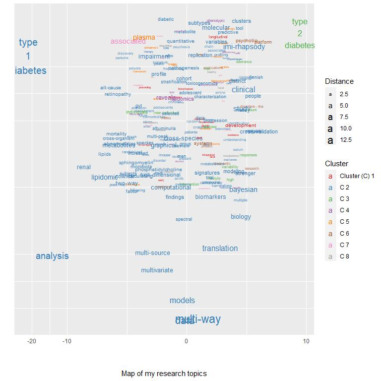
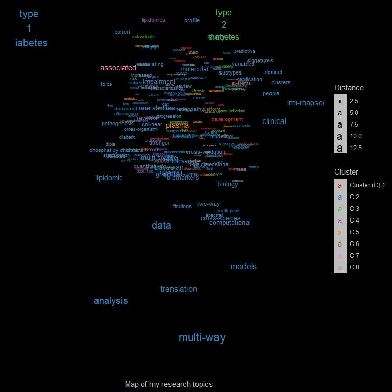

# Introduction

This is a tutorial script to producing an interactive visualization of words in a publication list extracted from [Google Scholar](https://scholar.google.com/). The appearance of the words is dependent on the frequency of their occurrence, and on which words they co-occur with in the titles of the listed articles.

The code is for R and it is, among others, based on packages [ggplot2](https://ggplot2.tidyverse.org/), [plotly](https://plotly.com/r/) and [htmlWidgets](https://www.htmlwidgets.org/).

This document is part of the Github repository [ScholarWordGraph](https://github.com/tommi-s/ScholarWordGraph) by [Tommi Suvitaival](https://tommi-s.com/).

<iframe 
  id="igraph" 
  scrolling="no" 
  style="border:none;" 
  seamless="seamless" 
  src="output-dark/index.html" 
  height="800" 
  width="800"
>
widget
</iframe>

# Preparations

1. Open a Google Scholar profile with browser (e.g., https://scholar.google.com/citations?user=SGgP0VQAAAAJ ).
1. Go to the bottom of the page and click "SHOW MORE" to show all entries on the page.
1. Go again to the bottom of the newly-expanded page.
1. Select everything in the table, starting from the year of the last entry (on the bottom-right corner) and ending at the title of the first entry (on the top-left corner).
1. Copy the selected text.
1. Paste the text to a text editor and save as "data/publications.txt" (see [example](https://github.com/tommi-s/ScholarWordGraph/blob/main/data/publications.txt) in the present repository).

# Load the Data


```r
data.loaded <- 
  readr::read_delim(
    file = "data/publications.txt",
    delim = "\t",
    escape_double = FALSE,
    col_names = FALSE,
    trim_ws = TRUE
  )
```

```
## Rows: 96 Columns: 1
```

```
## -- Column specification --------------------------------------------------------
## Delimiter: "\t"
## chr (1): X1
```

```
## 
## i Use `spec()` to retrieve the full column specification for this data.
## i Specify the column types or set `show_col_types = FALSE` to quiet this message.
```

# Format the Data

## Create a Data Frame of Articles

* Create a matrix with articles as rows and title, authors and journal as the three columns.
* Convert to a data frame.


```r
data <- unlist( data.loaded )
```

```
## Warning: One or more parsing issues, see `problems()` for details
```

```r
data <-
  matrix(
    data = unlist( data ),
    ncol = 3,
    byrow = TRUE
  )

colnames( data ) <-
  c(
    "Title",
    "Authors",
    "Journal"
  )

data <-
  data.frame(
    data,
    stringsAsFactors = FALSE
  )
```

## Convert Titles to Lower Case

* To match identical words with different case, convert all to lowercase.


```r
data$"Title.lower" <-
  tolower( data$"Title" )
```

## Define Multi-Word Terms

* Define word sequences that should be considered as a single term by adding replacing whitespace with underscore.
* E.g., "type 1 diabetes" is one term.


```r
data$"Title.lower" <-
  stringr::str_replace_all(
    string = data$"Title.lower",
    # pattern = "type 1 diabete",
    pattern = "type 1 diabetes",
    replacement = "type_1_diabetes"
  )

data$"Title.lower" <-
  stringr::str_replace_all(
    string = data$"Title.lower",
    pattern = "type 2 diabetes",
    replacement = "type_2_diabetes"
  )
```

## Omit Special Characters

* Omit punctuation and special characters from the titles.


```r
words <-
  stringr::str_split(
    string = data[ , "Title.lower" ],
    pattern = "\\s"
  )

words <- 
  lapply(
    X = words,
    FUN = tolower
  )

words <-
  lapply(
    X = words,
    FUN = stringr::str_replace_all,
    pattern = "(\\()|(\\))|(\\:)|(\\,)|(\\.)",
    replacement = ""
  )

table.words <- 
  sort(
    x = table( unlist( words ) ),
    decreasing = TRUE
  )

head( table.words )
```

```
## 
##   in   of  and  the with  for 
##   25   21   17   13   11    8
```

## Extract Unique Words

* List all unique words that appear in the titles.


```r
words.unique <-
  sort(
    unique(
      unlist( words ) )
  )
```

## Define List of Blocked Words

* List general words that are not of interest.
* Add plain numbers to this list.


```r
blocklist <-
  c(
    "and",
    "an",
    "after",
    "are",
    "as",
    "at",
    "based",
    "by",
    "do",
    "during",
    "for",
    "from",
    "in",
    "is",
    "of",
    "on",
    "not",
    "the",
    "to",
    "through",
    "with",
    "without",
    "...",
    letters
  )

blocklist <- 
  c(
    blocklist,
    words.unique[ grepl( x = words.unique, pattern = "^[0-9]+$" ) ]
  )
```

## Omit Blocked Words

* Omit the blocked words from the words list of each article.


```r
words <-
  lapply(
    X = words,
    FUN = function( x ) {
      x[ !( x %in% blocklist ) ]
    }
  )

table.words <- 
  sort(
    x = table( unlist( words ) ),
    decreasing = TRUE
  )

head( table.words )
```

```
## 
## type_1_diabetes        analysis      associated          plasma            data 
##               6               5               5               5               4 
##      lipidomics 
##               4
```

# Re-Extract Unique Words


```r
words.unique <-
  sort(
    unique(
      unlist( words ) )
  )
```

# Create the Words-by-Articles Occurrence Matrix

* Matrix that has value 1 if the word (row) appears in the article (column) and 0 otherwise.


```r
wba <-
  array(
    data = 0,
    dim = c( length( words.unique ), nrow( data ) )
  )

rownames( wba ) <- words.unique
colnames( wba ) <- data[ , "Title" ]

for ( i in 1:nrow( data ) ) {
  
  wba[ words[[ i ]], i ] <- 1
  
}
```

## Log-Transform the Occurrences

* Trasform the occurrences with log (1+x) for a more Gaussian-like distribution.


```r
wba.log1px <- log10( 1 + wba )
```

## Autoscale the Occurrence Profiles

* Scale the data for PCA.


```r
wba.norm <- scale( wba.log1px )
```

# Principal Component Analysis

## Compute PCA


```r
result.pca <-
  princomp(
    x = wba.norm
  )
```

## Plot PCA


```r
library( "ggfortify" )
```

```
## Warning: package 'ggfortify' was built under R version 4.0.5
```

```
## Loading required package: ggplot2
```

```
## Warning: package 'ggplot2' was built under R version 4.0.5
```

```r
plot <-
  autoplot( 
    result.pca
    # ,
    # loadings = TRUE,
    # loadings.label = TRUE
  )

print( plot )
```

<!-- -->

# Cluster the Words

* Using a fixed number of eight clusters for a suitable visual representation.


```r
result.clustering <-
  cluster::pam(
    x = wba.norm,
    k = 8
  )
```

# Figure

## Prepare Results for the Visualization

* Extract PCA-scores of the two first components.
* Extract cluster assignments for each data point.
* Compute each data point's Euclidean distance from the origin.
* Wrap multi-word terms to multiple lines for better visual impression.
* Create a text string listing all the article titles, where the term appears.


```r
data.plot <-
  data.frame(
    Word = rownames( result.pca$"scores" ),
    result.pca$"scores"
  )

data.plot$"Cluster" <- 
  factor(
    x = result.clustering$"clustering",
    levels = 1:length( unique( result.clustering$"clustering" ) ),
    labels = 
      c(
        "Cluster (C) 1",
        paste( "C", 2:length( unique( result.clustering$"clustering" ) ) )
      )
  )
  
data.plot$"Distance" <- 
  sqrt( data.plot$"Comp.1"^2 + data.plot$"Comp.2"^2 ) + 1

data.plot$"Term" <-
  stringr::str_replace_all(
    string = data.plot$"Word",
    pattern = "\\-",
    replacement = "-\n"
  )

data.plot$"Term" <-
  stringr::str_replace_all(
    string = data.plot$"Word",
    pattern = "\\_",
    replacement = "\n"
  )

data.plot$"Publications" <-
  apply(
    X = wba[ data.plot$"Word", ] == 1,
    MAR = 1,
    FUN = function( x ) {
      paste(
        "\n",
        names(
          which( x )
        ),
        collapse = "\n"
      )
    }
  )
```

## Define the Figure

* Visualization with ggplot2.
* PCA components 1 and 2, respectively, on the y- and x-axes.
* Term name as text label.
* Distance from origin as (increasing) size.
* Cluster assignment as color.
* Add jitter to reduce overlap of similar terms.
* Use pseudo-log-valued axes for reduced outliers.


```r
jitter <- 1

palette <- RColorBrewer::brewer.pal( n = 9, "Set1" )[ -6 ]
palette <- palette[ 1:nlevels( data.plot$"Cluster" ) ]

plot <-
  ggplot2::ggplot(
    data = data.plot,
    mapping =
      ggplot2::aes(
        x = Comp.2,
        y = Comp.1,
        label = Term,
        size = Distance,
        text = Publications
        ,
        color = Cluster,
      )
  ) +
  ggplot2::geom_text(
    position =
      ggplot2::position_jitter(
        height = jitter,
        width = jitter
      )
  ) +
  ggplot2::scale_x_continuous( trans = "pseudo_log" ) +
  ggplot2::scale_y_continuous( trans = "pseudo_log" ) +
  ggplot2::theme(
    axis.text.y = ggplot2::element_blank(),
    axis.ticks = ggplot2::element_blank()
  ) +
  ggplot2::xlab( label = "\n\n\nMap of my research topics" ) +
  ggplot2::ylab( label = "" ) +
  ggplot2::scale_color_manual( values = palette )
```

## Show the (Passive) Figure


```r
plot
```

<!-- -->

## Create the Interactive Figure

* Make ggplot2 figure interactive with the **ggplotly**-function from the **plotly**-package.
* Show the term and the articles, where it appears, as text (tooltip) when hovering over a data point.
* Use the layout-function for fine-tuning of the legend.


```r
library( tidyr )

plot.interactive <-
  plotly::ggplotly( 
    p = plot,
    tooltip = c( "label", "Publications" )
  ) %>%
  plotly::layout(
    legend = 
      list(
        orientation = "h",
        title = list( text = "Cluster<br>" ),
        x = quantile( x = data.plot$"Comp.2", probs = 0.67 ),
        y = min( data.plot$"Comp.1" )
      )
  )
```

## View the Interactive Figure


```r
plot.interactive
```

```{=html}
<div id="htmlwidget-6102180cd7c559177d9c" style="width:768px;height:768px;" class="plotly html-widget"></div>
<script type="application/json" data-for="htmlwidget-6102180cd7c559177d9c">{"x":{"data":[{"x":[-1.2815476434096,0.598970877534069,-0.59585021991809,0.621529809014621,0.871084923422289,0.997853428895092,-0.118932892070758,0.943380001964372,-0.755891866484332,-0.40825024057706,0.233553366767567,-0.135945017853462,0.0616634544305027,0.0833991999126494,-0.2914491290838],"y":[0.927585125100678,-0.480511878797799,0.442075129939903,-0.25279512473996,-0.170012087685327,1.17865926656672,-0.309820930597644,-0.442705503789048,-0.664561891586791,-0.0152587794077502,1.00711588875084,0.997266904735923,0.289466773035665,1.11370627383395,1.11103401786341],"text":["…","avon","blood-based","changes","childhood","development","early","evidence","experiences","integrated","later","longitudinal","point","preceding","proteomics"],"hovertext":["Term: …<br /><br /> Primary fatty amides in plasma associated with brain amyloid burden, hippocampal volume, and memory in the European Medical Information Framework for Alzheimer's Disease …<br /><br /> Metabolomic assessment reveals alteration in polyols and branched chain amino acids associated with present and future renal impairment in a discovery cohort of 637 persons …<br /><br /> Integrated lipidomics and proteomics point to early blood-based changes in childhood preceding later development of psychotic experiences: evidence from the Avon Longitudinal …","Term: avon<br /><br /> Identification of a plasma signature of psychotic disorder in children and adolescents from the Avon Longitudinal Study of Parents and Children (ALSPAC) cohort<br /><br /> Integrated lipidomics and proteomics point to early blood-based changes in childhood preceding later development of psychotic experiences: evidence from the Avon Longitudinal …","Term: blood-based<br /><br /> Integrated lipidomics and proteomics point to early blood-based changes in childhood preceding later development of psychotic experiences: evidence from the Avon Longitudinal …","Term: changes<br /><br /> Integrated lipidomics and proteomics point to early blood-based changes in childhood preceding later development of psychotic experiences: evidence from the Avon Longitudinal …<br /><br /> Changes in the lipidome in type 1 diabetes following low carbohydrate diet: Post-hoc analysis of a randomized crossover trial","Term: childhood<br /><br /> Integrated lipidomics and proteomics point to early blood-based changes in childhood preceding later development of psychotic experiences: evidence from the Avon Longitudinal …","Term: development<br /><br /> Serum metabolite profile associates with the development of metabolic co-morbidities in first-episode psychosis<br /><br /> Molecular Atlas of Postnatal Mouse Heart Development<br /><br /> Integrated lipidomics and proteomics point to early blood-based changes in childhood preceding later development of psychotic experiences: evidence from the Avon Longitudinal …","Term: early<br /><br /> Integrated lipidomics and proteomics point to early blood-based changes in childhood preceding later development of psychotic experiences: evidence from the Avon Longitudinal …","Term: evidence<br /><br /> Integrated lipidomics and proteomics point to early blood-based changes in childhood preceding later development of psychotic experiences: evidence from the Avon Longitudinal …","Term: experiences<br /><br /> Integrated lipidomics and proteomics point to early blood-based changes in childhood preceding later development of psychotic experiences: evidence from the Avon Longitudinal …","Term: integrated<br /><br /> Integrated lipidomics and proteomics point to early blood-based changes in childhood preceding later development of psychotic experiences: evidence from the Avon Longitudinal …","Term: later<br /><br /> Integrated lipidomics and proteomics point to early blood-based changes in childhood preceding later development of psychotic experiences: evidence from the Avon Longitudinal …","Term: longitudinal<br /><br /> Identification of a plasma signature of psychotic disorder in children and adolescents from the Avon Longitudinal Study of Parents and Children (ALSPAC) cohort<br /><br /> Integrated lipidomics and proteomics point to early blood-based changes in childhood preceding later development of psychotic experiences: evidence from the Avon Longitudinal …","Term: point<br /><br /> Integrated lipidomics and proteomics point to early blood-based changes in childhood preceding later development of psychotic experiences: evidence from the Avon Longitudinal …","Term: preceding<br /><br /> Integrated lipidomics and proteomics point to early blood-based changes in childhood preceding later development of psychotic experiences: evidence from the Avon Longitudinal …","Term: proteomics<br /><br /> Integrated lipidomics and proteomics point to early blood-based changes in childhood preceding later development of psychotic experiences: evidence from the Avon Longitudinal …"],"textfont":{"size":[8.92414011734841,8.36330791850921,6.28033846598011,7.44951416531748,6.28033846598011,9.98074916930306,6.28033846598011,6.28033846598011,6.28033846598011,6.28033846598011,6.28033846598011,8.36330791850921,6.28033846598011,6.28033846598011,6.28033846598011],"color":"rgba(228,26,28,1)"},"type":"scatter","mode":"text","hoveron":"points","name":"Cluster (C) 1","legendgroup":"Cluster (C) 1","showlegend":true,"xaxis":"x","yaxis":"y","hoverinfo":"text","frame":null},{"x":[-1.46950189900316,-0.340517035106723,0.481006617320289,-0.804952687798236,0.614142839096455,-1.18158192124114,-1.2352501012475,0.795068154342441,-0.469308379924451,-0.052318017816697,-2.48748000643777,0.166989824862739,0.291049279851313,0.971497789774926,0.597673261713728,-0.208644300366609,-1.0235363211133,-0.0495787057711206,0.310212137221787,-0.769031196704546,-1.20160798949987,-0.363431937299947,-0.91076331900299,-0.297405002387409,-0.488997208189251,-0.231623332970907,-1.37562796909541,1.91947334588144,0.514651882197348,0.432395273172201,-1.51461625797502,-0.737321225218899,0.409265378650967,0.226244966065285,-0.513871189695914,-0.0189994627863725,0.58022730431618,0.0291938083688352,0.88997500577694,-1.3582137294638,-0.288688950750666,-1.35598405669807,-1.2479486011493,-0.718348880978469,-0.0445823291116997,0.877947766099094,1.10848097057605,-0.835801663214753,-0.687287187692841,-0.334257698086036,0.932222832413065,0.335259014067845,0.930455883317532,-1.35330148297949,0.437019327302869,0.451796656323521,-0.687661342256648,-0.136746388225708,0.511763925374045,0.606791749372654,-0.882325210946093,0.84629769553241,0.705317263580188,-0.312837386600007,-0.70061494338343,-0.666467869677712,0.876627660521094,-0.0328018663384667,-0.534573152031031,-1.52184594358436,-1.3525407302025,0.300016122165789,0.551400533869497,-0.0771477946288427,0.90675079105878,-0.424313893909693,-1.49339494692316,-0.874065109881167,0.963756992176865,0.205362695711533,0.11012815747514,0.0483823702201719,0.697146092779625,0.977228263867063,-1.64544431381828,0.104898121383532,0.186016071114324,0.542251417531508,0.899313463448744,0.784687744614426,0.546582449811387,-0.217228170253368,-1.20041519394807,0.895369429944067,-0.486382224901821,1.85439735857361,-0.155537374204551,0.111256125094675,-1.13063706865401,0.577410275809188,0.459501190286621,1.53134655466084,-0.868253321273778,-0.894339001172386,-0.0189631973747327,1.0293788935781,0.230081829992028,-0.543719159818361,-1.21636755229561,-1.80491262218289,0.638434019421546,0.0396654571574907,0.173660144762029,-0.438072294293795,0.510615625702681,1.01612110924718,0.785912156771509,-0.782394480714269,0.736838352858655,-0.89873817824728,-0.703794427742331,-0.307492766110552,0.900458012986796,-0.0779764500727695,0.0519540468392351,0.905746804421751,-0.399436575849672,-0.528478888201008,-0.290105628056779,-0.726918346182389,0.187977628058733,-1.53434689891056,-0.98441484825728,-2.65446673423373,0.971749365960035,1.24380775263285],"y":[-0.119299276337365,0.606597945043714,0.801337359896617,0.154039713139307,0.986257661981604,0.94223627258758,0.585494458362866,0.741076440466664,0.691035424308748,1.14494762797457,-0.871636267730531,-0.00430277320115102,0.538051197254927,0.0554394148358301,-0.739765944270529,-0.965249161841627,-0.60507495938359,-1.14910415617884,-0.327162236338427,-0.253543154844327,-0.270197460478275,0.83026602661535,-0.339105213577031,-0.548850511149842,-0.068397989580312,-0.142537675054611,0.159775942749865,1.56115036139981,-0.110724205596786,-0.605190961242358,-0.00592375882495122,-0.059127701694104,0.128371414304023,-0.546361911689352,-0.0372252414951634,0.617428585462515,-0.0158052504843263,-1.55575574086042,0.562696393156711,0.860755084383486,-2.81667997661196,0.120923523328742,0.463809797841309,-0.395012807050127,0.241049434939296,0.118813807061038,0.498840687816549,1.06428921404736,0.513315332865475,-0.645356412496248,-0.414009894891818,-0.769015141195718,1.16111839321192,-0.465935776640476,1.11954701500562,-0.382439551175783,0.371952743284574,-0.414487795469212,0.176657283833139,-1.80121229241225,0.704606051980274,0.934347027363351,0.56487581565769,0.326520357184182,0.113560818652284,0.691867577655374,0.330728908091279,0.225443091495072,-0.396224834003059,0.294006626252972,0.511073745041675,-1.00184986989647,-0.667983911686617,0.531248278551635,0.0184056739390984,1.33227690096301,0.185090398586724,-0.476944984452902,0.262601924635713,-0.236829280109943,-0.183131565836119,-0.864564475785186,-1.48819195905261,-0.196359509961543,0.0928988570016209,0.629400470914207,-0.0784266183497787,-1.69534975389668,-1.7049960774436,-0.455906983889396,-0.580355783986835,-0.529151293067166,0.673006380371412,-0.698160948596954,-0.796270634937788,-0.167990433963429,0.455142375031383,-0.999634330007773,0.739981724830241,-0.115837314796449,0.41468263013836,0.702062129610118,0.590443241825224,-0.263097400898268,0.000767163101524165,0.413575464495358,-0.390242933381985,-0.79071293126453,-0.873345324002953,1.05841022999592,0.976673544427667,0.915980247500873,-0.414192495473067,-0.0655129673265396,-0.645935398147146,0.414633278185597,1.1353814397208,0.712621889695931,-0.870465136353898,0.211768523943085,0.131373820753821,0.211395323094736,1.13163743694435,0.249382649599236,0.662452803502146,-0.260057795692295,-0.0221481301839065,0.926476479000168,-0.715697477470252,-0.448095175422558,-1.94460961010733,0.700744016211624,-0.871782984366599,0.954230591793767,-0.448339043628929,0.286665720908258],"text":["abnormalities","acids","adipose","adolescent","adolescents","albuminuria","all-cause","alspac","alteration","amino","analysis","areas","assessment","associates","atlas","bayesian","between","biology","biomarkers","body","branched","carbohydrate","chain","characterization","children","cimt","circulating","clinical","clusters","co-morbidities","cohort","collinear","compound","computational","copenhagen","correlations","cross-organism","cross-species","cross-validation","crossover","data","diabetic","diet","dipis","discovery","disorder","distinct","diversity","effect","factor","findings","finnish","first-episode","following","future","graphical","group","gut","heart","high-dimensional","human","identification","imi-rhapsody","impairment","increased","insulin","level","lipidome","lipidomer","lipidomic","lipids","low","mass","men","metabolic","metabolite","metabolites","metabolomic","metabolomics","metformin","microbiota","modeling","models","molecular","mortality","mouse","multi-peak","multi-source","multi-way","multiple","multivariate","parents","pathogenesis","patients","peaks","people","persons","phosphatidylcholine","polyols","post‐hoc","postnatal","predictive","present","profile","profiling","progression","psychosis","quantitative","randomized","renal","replication","retinopathy","review","selected","serum","signature","signatures","species","spectral","sphingomyelin","stratification","stronger","study","subjects","subtypes","targeted","therapy","tissue","tool","toxicogenomics","translation","trial","two-way","type<br />1<br />diabetes","understanding","variables"],"hovertext":["Term: abnormalities<br /><br /> Lipidomic Abnormalities During the Pathogenesis of Type 1 Diabetes: a Quantitative Review","Term: acids<br /><br /> Metabolomic assessment reveals alteration in polyols and branched chain amino acids associated with present and future renal impairment in a discovery cohort of 637 persons …","Term: adipose<br /><br /> Lipidomics of human adipose tissue reveals diversity between body areas","Term: adolescent<br /><br /> Characterization of plasma lipidomics in adolescent subjects with increased risk for type 1 diabetes in the DiPiS cohort","Term: adolescents<br /><br /> Identification of a plasma signature of psychotic disorder in children and adolescents from the Avon Longitudinal Study of Parents and Children (ALSPAC) cohort","Term: albuminuria<br /><br /> Gut microbiota profile and selected plasma metabolites in type 1 diabetes without and with stratification by albuminuria","Term: all-cause<br /><br /> Lipidomic analysis reveals sphingomyelin and phosphatidylcholine species associated with renal impairment and all-cause mortality in type 1 diabetes","Term: alspac<br /><br /> Identification of a plasma signature of psychotic disorder in children and adolescents from the Avon Longitudinal Study of Parents and Children (ALSPAC) cohort","Term: alteration<br /><br /> Metabolomic assessment reveals alteration in polyols and branched chain amino acids associated with present and future renal impairment in a discovery cohort of 637 persons …","Term: amino<br /><br /> Metabolomic assessment reveals alteration in polyols and branched chain amino acids associated with present and future renal impairment in a discovery cohort of 637 persons …","Term: analysis<br /><br /> Multivariate multi-way analysis of multi-source data<br /><br /> Two-way analysis of high-dimensional collinear data<br /><br /> Lipidomic analysis reveals sphingomyelin and phosphatidylcholine species associated with renal impairment and all-cause mortality in type 1 diabetes<br /><br /> Cross-organism toxicogenomics with group factor analysis<br /><br /> Changes in the lipidome in type 1 diabetes following low carbohydrate diet: Post-hoc analysis of a randomized crossover trial","Term: areas<br /><br /> Lipidomics of human adipose tissue reveals diversity between body areas","Term: assessment<br /><br /> Metabolomic assessment reveals alteration in polyols and branched chain amino acids associated with present and future renal impairment in a discovery cohort of 637 persons …","Term: associates<br /><br /> Serum metabolite profile associates with the development of metabolic co-morbidities in first-episode psychosis","Term: atlas<br /><br /> Molecular Atlas of Postnatal Mouse Heart Development","Term: bayesian<br /><br /> Stronger findings for metabolomics through Bayesian modeling of multiple peaks and compound correlations<br /><br /> Bayesian Multi-Way Models for Data Translation in Computational Biology","Term: between<br /><br /> Lipidomics of human adipose tissue reveals diversity between body areas","Term: biology<br /><br /> Bayesian Multi-Way Models for Data Translation in Computational Biology","Term: biomarkers<br /><br /> Cross-species translation of multi-way biomarkers","Term: body<br /><br /> Lipidomics of human adipose tissue reveals diversity between body areas","Term: branched<br /><br /> Metabolomic assessment reveals alteration in polyols and branched chain amino acids associated with present and future renal impairment in a discovery cohort of 637 persons …","Term: carbohydrate<br /><br /> Changes in the lipidome in type 1 diabetes following low carbohydrate diet: Post-hoc analysis of a randomized crossover trial","Term: chain<br /><br /> Metabolomic assessment reveals alteration in polyols and branched chain amino acids associated with present and future renal impairment in a discovery cohort of 637 persons …","Term: characterization<br /><br /> Characterization of plasma lipidomics in adolescent subjects with increased risk for type 1 diabetes in the DiPiS cohort","Term: children<br /><br /> Identification of a plasma signature of psychotic disorder in children and adolescents from the Avon Longitudinal Study of Parents and Children (ALSPAC) cohort","Term: cimt<br /><br /> Effect of metformin on plasma metabolite profile in the Copenhagen Insulin and Metformin Therapy (CIMT) trial","Term: circulating<br /><br /> Circulating metabolites and lipids are associated to diabetic retinopathy in individuals With type 1 diabetes","Term: clinical<br /><br /> Targeted Clinical Metabolite Profiling Platform for the Stratification of Diabetic Patients<br /><br /> Replication and cross-validation of type 2 diabetes subtypes based on clinical variables: an IMI-RHAPSODY study<br /><br /> Distinct molecular signatures of clinical clusters in people with type 2 diabetes: an IMI-RHAPSODY study","Term: clusters<br /><br /> Distinct molecular signatures of clinical clusters in people with type 2 diabetes: an IMI-RHAPSODY study","Term: co-morbidities<br /><br /> Serum metabolite profile associates with the development of metabolic co-morbidities in first-episode psychosis","Term: cohort<br /><br /> Identification of a plasma signature of psychotic disorder in children and adolescents from the Avon Longitudinal Study of Parents and Children (ALSPAC) cohort<br /><br /> Metabolomic assessment reveals alteration in polyols and branched chain amino acids associated with present and future renal impairment in a discovery cohort of 637 persons …<br /><br /> Characterization of plasma lipidomics in adolescent subjects with increased risk for type 1 diabetes in the DiPiS cohort","Term: collinear<br /><br /> Two-way analysis of high-dimensional collinear data","Term: compound<br /><br /> Stronger findings for metabolomics through Bayesian modeling of multiple peaks and compound correlations","Term: computational<br /><br /> Bayesian Multi-Way Models for Data Translation in Computational Biology","Term: copenhagen<br /><br /> Effect of metformin on plasma metabolite profile in the Copenhagen Insulin and Metformin Therapy (CIMT) trial","Term: correlations<br /><br /> Stronger findings for metabolomics through Bayesian modeling of multiple peaks and compound correlations","Term: cross-organism<br /><br /> Cross-organism toxicogenomics with group factor analysis","Term: cross-species<br /><br /> Cross-species translation of multi-way biomarkers","Term: cross-validation<br /><br /> Replication and cross-validation of type 2 diabetes subtypes based on clinical variables: an IMI-RHAPSODY study","Term: crossover<br /><br /> Changes in the lipidome in type 1 diabetes following low carbohydrate diet: Post-hoc analysis of a randomized crossover trial","Term: data<br /><br /> Multivariate multi-way analysis of multi-source data<br /><br /> Two-way analysis of high-dimensional collinear data<br /><br /> Stronger findings from mass spectral data through multi-peak modeling<br /><br /> Bayesian Multi-Way Models for Data Translation in Computational Biology","Term: diabetic<br /><br /> Targeted Clinical Metabolite Profiling Platform for the Stratification of Diabetic Patients<br /><br /> Circulating metabolites and lipids are associated to diabetic retinopathy in individuals With type 1 diabetes","Term: diet<br /><br /> Changes in the lipidome in type 1 diabetes following low carbohydrate diet: Post-hoc analysis of a randomized crossover trial","Term: dipis<br /><br /> Characterization of plasma lipidomics in adolescent subjects with increased risk for type 1 diabetes in the DiPiS cohort","Term: discovery<br /><br /> Metabolomic assessment reveals alteration in polyols and branched chain amino acids associated with present and future renal impairment in a discovery cohort of 637 persons …","Term: disorder<br /><br /> Identification of a plasma signature of psychotic disorder in children and adolescents from the Avon Longitudinal Study of Parents and Children (ALSPAC) cohort","Term: distinct<br /><br /> Distinct molecular signatures of clinical clusters in people with type 2 diabetes: an IMI-RHAPSODY study","Term: diversity<br /><br /> Lipidomics of human adipose tissue reveals diversity between body areas","Term: effect<br /><br /> Effect of metformin on plasma metabolite profile in the Copenhagen Insulin and Metformin Therapy (CIMT) trial","Term: factor<br /><br /> Cross-organism toxicogenomics with group factor analysis","Term: findings<br /><br /> Stronger findings from mass spectral data through multi-peak modeling<br /><br /> Stronger findings for metabolomics through Bayesian modeling of multiple peaks and compound correlations","Term: finnish<br /><br /> Lipidome as a predictive tool in progression to type 2 diabetes in Finnish men","Term: first-episode<br /><br /> Serum metabolite profile associates with the development of metabolic co-morbidities in first-episode psychosis","Term: following<br /><br /> Changes in the lipidome in type 1 diabetes following low carbohydrate diet: Post-hoc analysis of a randomized crossover trial","Term: future<br /><br /> Metabolomic assessment reveals alteration in polyols and branched chain amino acids associated with present and future renal impairment in a discovery cohort of 637 persons …","Term: graphical<br /><br /> Graphical multi-way models","Term: group<br /><br /> Cross-organism toxicogenomics with group factor analysis","Term: gut<br /><br /> Gut microbiota profile and selected plasma metabolites in type 1 diabetes without and with stratification by albuminuria","Term: heart<br /><br /> Molecular Atlas of Postnatal Mouse Heart Development","Term: high-dimensional<br /><br /> Two-way analysis of high-dimensional collinear data","Term: human<br /><br /> Lipidomics of human adipose tissue reveals diversity between body areas","Term: identification<br /><br /> Identification of a plasma signature of psychotic disorder in children and adolescents from the Avon Longitudinal Study of Parents and Children (ALSPAC) cohort","Term: imi-rhapsody<br /><br /> Replication and cross-validation of type 2 diabetes subtypes based on clinical variables: an IMI-RHAPSODY study<br /><br /> Distinct molecular signatures of clinical clusters in people with type 2 diabetes: an IMI-RHAPSODY study","Term: impairment<br /><br /> Lipidomic analysis reveals sphingomyelin and phosphatidylcholine species associated with renal impairment and all-cause mortality in type 1 diabetes<br /><br /> Metabolomic assessment reveals alteration in polyols and branched chain amino acids associated with present and future renal impairment in a discovery cohort of 637 persons …","Term: increased<br /><br /> Characterization of plasma lipidomics in adolescent subjects with increased risk for type 1 diabetes in the DiPiS cohort","Term: insulin<br /><br /> Effect of metformin on plasma metabolite profile in the Copenhagen Insulin and Metformin Therapy (CIMT) trial","Term: level<br /><br /> Understanding the Lipidome at the Systems Level with lipidomeR","Term: lipidome<br /><br /> Lipidome as a predictive tool in progression to type 2 diabetes in Finnish men<br /><br /> Understanding the Lipidome at the Systems Level with lipidomeR<br /><br /> Changes in the lipidome in type 1 diabetes following low carbohydrate diet: Post-hoc analysis of a randomized crossover trial","Term: lipidomer<br /><br /> Understanding the Lipidome at the Systems Level with lipidomeR","Term: lipidomic<br /><br /> Lipidomic analysis reveals sphingomyelin and phosphatidylcholine species associated with renal impairment and all-cause mortality in type 1 diabetes<br /><br /> Lipidomic Abnormalities During the Pathogenesis of Type 1 Diabetes: a Quantitative Review","Term: lipids<br /><br /> Circulating metabolites and lipids are associated to diabetic retinopathy in individuals With type 1 diabetes","Term: low<br /><br /> Changes in the lipidome in type 1 diabetes following low carbohydrate diet: Post-hoc analysis of a randomized crossover trial","Term: mass<br /><br /> Stronger findings from mass spectral data through multi-peak modeling","Term: men<br /><br /> Lipidome as a predictive tool in progression to type 2 diabetes in Finnish men","Term: metabolic<br /><br /> Serum metabolite profile associates with the development of metabolic co-morbidities in first-episode psychosis","Term: metabolite<br /><br /> Serum metabolite profile associates with the development of metabolic co-morbidities in first-episode psychosis<br /><br /> Effect of metformin on plasma metabolite profile in the Copenhagen Insulin and Metformin Therapy (CIMT) trial<br /><br /> Targeted Clinical Metabolite Profiling Platform for the Stratification of Diabetic Patients","Term: metabolites<br /><br /> Circulating metabolites and lipids are associated to diabetic retinopathy in individuals With type 1 diabetes<br /><br /> Gut microbiota profile and selected plasma metabolites in type 1 diabetes without and with stratification by albuminuria","Term: metabolomic<br /><br /> Metabolomic assessment reveals alteration in polyols and branched chain amino acids associated with present and future renal impairment in a discovery cohort of 637 persons …","Term: metabolomics<br /><br /> Stronger findings for metabolomics through Bayesian modeling of multiple peaks and compound correlations","Term: metformin<br /><br /> Effect of metformin on plasma metabolite profile in the Copenhagen Insulin and Metformin Therapy (CIMT) trial","Term: microbiota<br /><br /> Gut microbiota profile and selected plasma metabolites in type 1 diabetes without and with stratification by albuminuria","Term: modeling<br /><br /> Stronger findings from mass spectral data through multi-peak modeling<br /><br /> Stronger findings for metabolomics through Bayesian modeling of multiple peaks and compound correlations","Term: models<br /><br /> Graphical multi-way models<br /><br /> Bayesian Multi-Way Models for Data Translation in Computational Biology","Term: molecular<br /><br /> Molecular Atlas of Postnatal Mouse Heart Development<br /><br /> Distinct molecular signatures of clinical clusters in people with type 2 diabetes: an IMI-RHAPSODY study","Term: mortality<br /><br /> Lipidomic analysis reveals sphingomyelin and phosphatidylcholine species associated with renal impairment and all-cause mortality in type 1 diabetes","Term: mouse<br /><br /> Molecular Atlas of Postnatal Mouse Heart Development","Term: multi-peak<br /><br /> Stronger findings from mass spectral data through multi-peak modeling","Term: multi-source<br /><br /> Multivariate multi-way analysis of multi-source data","Term: multi-way<br /><br /> Multivariate multi-way analysis of multi-source data<br /><br /> Graphical multi-way models<br /><br /> Cross-species translation of multi-way biomarkers<br /><br /> Bayesian Multi-Way Models for Data Translation in Computational Biology","Term: multiple<br /><br /> Stronger findings for metabolomics through Bayesian modeling of multiple peaks and compound correlations","Term: multivariate<br /><br /> Multivariate multi-way analysis of multi-source data","Term: parents<br /><br /> Identification of a plasma signature of psychotic disorder in children and adolescents from the Avon Longitudinal Study of Parents and Children (ALSPAC) cohort","Term: pathogenesis<br /><br /> Lipidomic Abnormalities During the Pathogenesis of Type 1 Diabetes: a Quantitative Review","Term: patients<br /><br /> Targeted Clinical Metabolite Profiling Platform for the Stratification of Diabetic Patients","Term: peaks<br /><br /> Stronger findings for metabolomics through Bayesian modeling of multiple peaks and compound correlations","Term: people<br /><br /> Distinct molecular signatures of clinical clusters in people with type 2 diabetes: an IMI-RHAPSODY study","Term: persons<br /><br /> Metabolomic assessment reveals alteration in polyols and branched chain amino acids associated with present and future renal impairment in a discovery cohort of 637 persons …","Term: phosphatidylcholine<br /><br /> Lipidomic analysis reveals sphingomyelin and phosphatidylcholine species associated with renal impairment and all-cause mortality in type 1 diabetes","Term: polyols<br /><br /> Metabolomic assessment reveals alteration in polyols and branched chain amino acids associated with present and future renal impairment in a discovery cohort of 637 persons …","Term: post-hoc<br /><br /> Changes in the lipidome in type 1 diabetes following low carbohydrate diet: Post-hoc analysis of a randomized crossover trial","Term: postnatal<br /><br /> Molecular Atlas of Postnatal Mouse Heart Development","Term: predictive<br /><br /> Lipidome as a predictive tool in progression to type 2 diabetes in Finnish men","Term: present<br /><br /> Metabolomic assessment reveals alteration in polyols and branched chain amino acids associated with present and future renal impairment in a discovery cohort of 637 persons …","Term: profile<br /><br /> Serum metabolite profile associates with the development of metabolic co-morbidities in first-episode psychosis<br /><br /> Effect of metformin on plasma metabolite profile in the Copenhagen Insulin and Metformin Therapy (CIMT) trial<br /><br /> Gut microbiota profile and selected plasma metabolites in type 1 diabetes without and with stratification by albuminuria","Term: profiling<br /><br /> Targeted Clinical Metabolite Profiling Platform for the Stratification of Diabetic Patients","Term: progression<br /><br /> Lipidome as a predictive tool in progression to type 2 diabetes in Finnish men","Term: psychosis<br /><br /> Serum metabolite profile associates with the development of metabolic co-morbidities in first-episode psychosis","Term: quantitative<br /><br /> Lipidomic Abnormalities During the Pathogenesis of Type 1 Diabetes: a Quantitative Review","Term: randomized<br /><br /> Changes in the lipidome in type 1 diabetes following low carbohydrate diet: Post-hoc analysis of a randomized crossover trial","Term: renal<br /><br /> Lipidomic analysis reveals sphingomyelin and phosphatidylcholine species associated with renal impairment and all-cause mortality in type 1 diabetes<br /><br /> Metabolomic assessment reveals alteration in polyols and branched chain amino acids associated with present and future renal impairment in a discovery cohort of 637 persons …","Term: replication<br /><br /> Replication and cross-validation of type 2 diabetes subtypes based on clinical variables: an IMI-RHAPSODY study","Term: retinopathy<br /><br /> Circulating metabolites and lipids are associated to diabetic retinopathy in individuals With type 1 diabetes","Term: review<br /><br /> Lipidomic Abnormalities During the Pathogenesis of Type 1 Diabetes: a Quantitative Review","Term: selected<br /><br /> Gut microbiota profile and selected plasma metabolites in type 1 diabetes without and with stratification by albuminuria","Term: serum<br /><br /> Serum metabolite profile associates with the development of metabolic co-morbidities in first-episode psychosis","Term: signature<br /><br /> Identification of a plasma signature of psychotic disorder in children and adolescents from the Avon Longitudinal Study of Parents and Children (ALSPAC) cohort","Term: signatures<br /><br /> Distinct molecular signatures of clinical clusters in people with type 2 diabetes: an IMI-RHAPSODY study","Term: species<br /><br /> Lipidomic analysis reveals sphingomyelin and phosphatidylcholine species associated with renal impairment and all-cause mortality in type 1 diabetes","Term: spectral<br /><br /> Stronger findings from mass spectral data through multi-peak modeling","Term: sphingomyelin<br /><br /> Lipidomic analysis reveals sphingomyelin and phosphatidylcholine species associated with renal impairment and all-cause mortality in type 1 diabetes","Term: stratification<br /><br /> Targeted Clinical Metabolite Profiling Platform for the Stratification of Diabetic Patients<br /><br /> Gut microbiota profile and selected plasma metabolites in type 1 diabetes without and with stratification by albuminuria","Term: stronger<br /><br /> Stronger findings from mass spectral data through multi-peak modeling<br /><br /> Stronger findings for metabolomics through Bayesian modeling of multiple peaks and compound correlations","Term: study<br /><br /> Identification of a plasma signature of psychotic disorder in children and adolescents from the Avon Longitudinal Study of Parents and Children (ALSPAC) cohort<br /><br /> Replication and cross-validation of type 2 diabetes subtypes based on clinical variables: an IMI-RHAPSODY study<br /><br /> Distinct molecular signatures of clinical clusters in people with type 2 diabetes: an IMI-RHAPSODY study","Term: subjects<br /><br /> Characterization of plasma lipidomics in adolescent subjects with increased risk for type 1 diabetes in the DiPiS cohort","Term: subtypes<br /><br /> Replication and cross-validation of type 2 diabetes subtypes based on clinical variables: an IMI-RHAPSODY study","Term: targeted<br /><br /> Targeted Clinical Metabolite Profiling Platform for the Stratification of Diabetic Patients","Term: therapy<br /><br /> Effect of metformin on plasma metabolite profile in the Copenhagen Insulin and Metformin Therapy (CIMT) trial","Term: tissue<br /><br /> Lipidomics of human adipose tissue reveals diversity between body areas","Term: tool<br /><br /> Lipidome as a predictive tool in progression to type 2 diabetes in Finnish men","Term: toxicogenomics<br /><br /> Cross-organism toxicogenomics with group factor analysis","Term: translation<br /><br /> Cross-species translation of multi-way biomarkers<br /><br /> Bayesian Multi-Way Models for Data Translation in Computational Biology","Term: trial<br /><br /> Effect of metformin on plasma metabolite profile in the Copenhagen Insulin and Metformin Therapy (CIMT) trial<br /><br /> Changes in the lipidome in type 1 diabetes following low carbohydrate diet: Post-hoc analysis of a randomized crossover trial","Term: two-way<br /><br /> Two-way analysis of high-dimensional collinear data","Term: type<br />1<br />diabetes<br /><br /> Lipidomic analysis reveals sphingomyelin and phosphatidylcholine species associated with renal impairment and all-cause mortality in type 1 diabetes<br /><br /> Circulating metabolites and lipids are associated to diabetic retinopathy in individuals With type 1 diabetes<br /><br /> Gut microbiota profile and selected plasma metabolites in type 1 diabetes without and with stratification by albuminuria<br /><br /> Lipidomic Abnormalities During the Pathogenesis of Type 1 Diabetes: a Quantitative Review<br /><br /> Changes in the lipidome in type 1 diabetes following low carbohydrate diet: Post-hoc analysis of a randomized crossover trial<br /><br /> Characterization of plasma lipidomics in adolescent subjects with increased risk for type 1 diabetes in the DiPiS cohort","Term: understanding<br /><br /> Understanding the Lipidome at the Systems Level with lipidomeR","Term: variables<br /><br /> Replication and cross-validation of type 2 diabetes subtypes based on clinical variables: an IMI-RHAPSODY study"],"textfont":{"size":[10.0227562300786,6.86831884568736,5.2796184295226,8.67900209830133,7.16262442080878,9.24618494461737,10.2433622158286,7.16262442080878,6.86831884568736,6.86831884568736,19.2684559993431,5.2796184295226,6.86831884568736,6.511764177495,8.39404138157446,13.674224371609,5.2796184295226,12.5437114641505,12.2744429228418,5.2796184295226,6.86831884568736,7.89774846019875,6.86831884568736,8.67900209830133,7.16262442080878,6.23092615454284,9.79436965627137,15.4703955062867,11.3786268573125,6.511764177495,10.6258578201705,11.104557149373,7.7747130133892,12.5437114641505,6.23092615454284,7.7747130133892,8.74649302849887,12.2744429228418,11.4471158713255,7.89774846019875,20.2549018723122,9.27544247860767,7.89774846019875,8.67900209830133,6.86831884568736,7.16262442080878,11.3786268573125,5.2796184295226,6.23092615454284,8.74649302849887,10.8982491808933,9.04435097450964,6.511764177495,7.89774846019875,6.86831884568736,13.4120300727054,8.74649302849887,9.24618494461737,8.39404138157446,11.104557149373,5.2796184295226,7.16262442080878,14.7100211477783,11.7338996139862,8.67900209830133,6.23092615454284,6.68963511276678,6.50544941584095,6.68963511276678,13.5005737442335,9.79436965627137,7.89774846019875,9.08424340947336,9.04435097450964,6.511764177495,9.30324412776946,12.6656296655831,6.86831884568736,7.7747130133892,6.23092615454284,9.24618494461737,10.8982491808933,17.208630020291,12.8242526914013,10.2433622158286,8.39404138157446,9.08424340947336,13.0856658439002,22.6771653543307,7.7747130133892,13.0856658439002,7.16262442080878,10.0227562300786,7.79729215409558,7.7747130133892,11.3786268573125,6.86831884568736,10.2433622158286,6.86831884568736,7.89774846019875,8.39404138157446,9.04435097450964,6.86831884568736,10.6006891089719,7.79729215409558,9.04435097450964,6.511764177495,10.0227562300786,7.89774846019875,11.7338996139862,11.4471158713255,9.79436965627137,10.0227562300786,9.24618494461737,6.511764177495,7.16262442080878,11.3786268573125,10.2433622158286,9.08424340947336,10.2433622158286,9.00209143430284,10.8982491808933,15.1913643777023,8.67900209830133,11.4471158713255,7.79729215409558,6.23092615454284,5.2796184295226,9.04435097450964,8.74649302849887,16.4120163170569,9.01741614892878,11.104557149373,19.6199155085839,6.68963511276678,11.4471158713255],"color":"rgba(55,126,184,1)"},"type":"scatter","mode":"text","hoveron":"points","name":"C 2","legendgroup":"C 2","showlegend":true,"xaxis":"x","yaxis":"y","hoverinfo":"text","frame":null},{"x":[0.97685103978969,-0.109399998802619,0.0722771610506608,-1.25946499335953,0.637288159448726,-0.530533821098434,1.08628434384249,-0.333544682953434,-0.219071011563757,0.459574209749772,1.81801684696366,-0.0110221800952421],"y":[0.978435982975708,0.567804354268657,-0.454810318045719,1.17500197063926,-0.805275776863499,-0.111191207051678,0.538024643461751,0.69010264615302,0.595168317797819,-0.726458173219515,1.39744908552316,0.709613748386102],"text":["account","glucose","high","individuals","inter-individual","intervention","lifestyle","responses","risk","tolerance","type<br />2<br />diabetes","variability"],"hovertext":["Term: account<br /><br /> Phenotypic Responses to a Lifestyle Intervention Do Not Account for Inter-Individual Variability in Glucose Tolerance for Individuals at High Risk of Type 2 Diabetes","Term: glucose<br /><br /> Phenotypic Responses to a Lifestyle Intervention Do Not Account for Inter-Individual Variability in Glucose Tolerance for Individuals at High Risk of Type 2 Diabetes","Term: high<br /><br /> Phenotypic Responses to a Lifestyle Intervention Do Not Account for Inter-Individual Variability in Glucose Tolerance for Individuals at High Risk of Type 2 Diabetes","Term: individuals<br /><br /> Circulating metabolites and lipids are associated to diabetic retinopathy in individuals With type 1 diabetes<br /><br /> Phenotypic Responses to a Lifestyle Intervention Do Not Account for Inter-Individual Variability in Glucose Tolerance for Individuals at High Risk of Type 2 Diabetes","Term: inter-individual<br /><br /> Phenotypic Responses to a Lifestyle Intervention Do Not Account for Inter-Individual Variability in Glucose Tolerance for Individuals at High Risk of Type 2 Diabetes","Term: intervention<br /><br /> Phenotypic Responses to a Lifestyle Intervention Do Not Account for Inter-Individual Variability in Glucose Tolerance for Individuals at High Risk of Type 2 Diabetes","Term: lifestyle<br /><br /> Phenotypic Responses to a Lifestyle Intervention Do Not Account for Inter-Individual Variability in Glucose Tolerance for Individuals at High Risk of Type 2 Diabetes","Term: responses<br /><br /> Phenotypic Responses to a Lifestyle Intervention Do Not Account for Inter-Individual Variability in Glucose Tolerance for Individuals at High Risk of Type 2 Diabetes","Term: risk<br /><br /> Phenotypic Responses to a Lifestyle Intervention Do Not Account for Inter-Individual Variability in Glucose Tolerance for Individuals at High Risk of Type 2 Diabetes<br /><br /> Characterization of plasma lipidomics in adolescent subjects with increased risk for type 1 diabetes in the DiPiS cohort","Term: tolerance<br /><br /> Phenotypic Responses to a Lifestyle Intervention Do Not Account for Inter-Individual Variability in Glucose Tolerance for Individuals at High Risk of Type 2 Diabetes","Term: type<br />2<br />diabetes<br /><br /> Lipidome as a predictive tool in progression to type 2 diabetes in Finnish men<br /><br /> Phenotypic Responses to a Lifestyle Intervention Do Not Account for Inter-Individual Variability in Glucose Tolerance for Individuals at High Risk of Type 2 Diabetes<br /><br /> Replication and cross-validation of type 2 diabetes subtypes based on clinical variables: an IMI-RHAPSODY study<br /><br /> Distinct molecular signatures of clinical clusters in people with type 2 diabetes: an IMI-RHAPSODY study","Term: variability<br /><br /> Phenotypic Responses to a Lifestyle Intervention Do Not Account for Inter-Individual Variability in Glucose Tolerance for Individuals at High Risk of Type 2 Diabetes"],"textfont":{"size":[7.56532227254429,7.56532227254429,7.56532227254429,8.9608783809658,7.56532227254429,7.56532227254429,7.56532227254429,7.56532227254429,8.19677691281695,7.56532227254429,16.6909245850854,7.56532227254429],"color":"rgba(77,175,74,1)"},"type":"scatter","mode":"text","hoveron":"points","name":"C 3","legendgroup":"C 3","showlegend":true,"xaxis":"x","yaxis":"y","hoverinfo":"text","frame":null},{"x":[-0.0966686441894507,-0.377278785068158,-0.955239582653705,-0.293689789563034,0.0516845622699821,-0.0758913628157115,-0.377270700256888,-0.760097641264504,-0.355840522177134,-0.628437483658341,-1.01907466543897,-0.989760272051755],"y":[0.611944837468414,-0.52948501569152,-0.828471027341934,-0.283578439177276,0.802532351548521,0.923065404380409,0.862239171723573,0.800093277061273,-0.293781029087754,0.435384112232883,0.24310732544363,-0.227746155605914],"text":["alcohol","ald","comprehensive","differences","hepatic","intoxication","lipid","lipidomics","nafld","phenotypic","reveals","turnover"],"hovertext":["Term: alcohol<br /><br /> Comprehensive lipidomics reveals phenotypic differences in hepatic lipid turnover in ALD and NAFLD during alcohol intoxication","Term: ald<br /><br /> Comprehensive lipidomics reveals phenotypic differences in hepatic lipid turnover in ALD and NAFLD during alcohol intoxication","Term: comprehensive<br /><br /> Comprehensive lipidomics reveals phenotypic differences in hepatic lipid turnover in ALD and NAFLD during alcohol intoxication","Term: differences<br /><br /> Comprehensive lipidomics reveals phenotypic differences in hepatic lipid turnover in ALD and NAFLD during alcohol intoxication","Term: hepatic<br /><br /> Comprehensive lipidomics reveals phenotypic differences in hepatic lipid turnover in ALD and NAFLD during alcohol intoxication","Term: intoxication<br /><br /> Comprehensive lipidomics reveals phenotypic differences in hepatic lipid turnover in ALD and NAFLD during alcohol intoxication","Term: lipid<br /><br /> Comprehensive lipidomics reveals phenotypic differences in hepatic lipid turnover in ALD and NAFLD during alcohol intoxication","Term: lipidomics<br /><br /> Integrated lipidomics and proteomics point to early blood-based changes in childhood preceding later development of psychotic experiences: evidence from the Avon Longitudinal …<br /><br /> Lipidomics of human adipose tissue reveals diversity between body areas<br /><br /> Comprehensive lipidomics reveals phenotypic differences in hepatic lipid turnover in ALD and NAFLD during alcohol intoxication<br /><br /> Characterization of plasma lipidomics in adolescent subjects with increased risk for type 1 diabetes in the DiPiS cohort","Term: nafld<br /><br /> Comprehensive lipidomics reveals phenotypic differences in hepatic lipid turnover in ALD and NAFLD during alcohol intoxication","Term: phenotypic<br /><br /> Phenotypic Responses to a Lifestyle Intervention Do Not Account for Inter-Individual Variability in Glucose Tolerance for Individuals at High Risk of Type 2 Diabetes<br /><br /> Comprehensive lipidomics reveals phenotypic differences in hepatic lipid turnover in ALD and NAFLD during alcohol intoxication","Term: reveals<br /><br /> Lipidomic analysis reveals sphingomyelin and phosphatidylcholine species associated with renal impairment and all-cause mortality in type 1 diabetes<br /><br /> Metabolomic assessment reveals alteration in polyols and branched chain amino acids associated with present and future renal impairment in a discovery cohort of 637 persons …<br /><br /> Lipidomics of human adipose tissue reveals diversity between body areas<br /><br /> Comprehensive lipidomics reveals phenotypic differences in hepatic lipid turnover in ALD and NAFLD during alcohol intoxication","Term: turnover<br /><br /> Comprehensive lipidomics reveals phenotypic differences in hepatic lipid turnover in ALD and NAFLD during alcohol intoxication"],"textfont":{"size":[4.67686510450572,4.67686510450572,4.67686510450572,4.67686510450572,4.67686510450572,4.67686510450572,4.67686510450572,10.7115110536004,4.67686510450572,7.5540948874866,12.8164634648796,4.67686510450572],"color":"rgba(152,78,163,1)"},"type":"scatter","mode":"text","hoveron":"points","name":"C 4","legendgroup":"C 4","showlegend":true,"xaxis":"x","yaxis":"y","hoverinfo":"text","frame":null},{"x":[0.835952334426846,-0.418712779093031,0.43957313089123,-0.983360431767497,0.0965458455910347,0.375591052551325,0.145538382553067,-0.197602553903554,-0.48881819765592,-0.970846234034244,-0.73036746369252,-0.958978425856177,0.401866578352209,-1.4301616213441,-0.793301956872884,0.655186753575262],"y":[0.224770349196977,0.976399408399946,0.116855192676074,-0.475877780255043,-0.56252742584061,0.828244233716167,-0.00125337231170483,-0.429206169929468,0.567025614183283,1.01263369221974,-0.69792518603813,-0.818637975745016,1.00271477850888,0.0168660629230001,1.00317621345434,-0.676911574110502],"text":["alzheimer's","amides","amyloid","brain","burden","disease","european","fatty","framework","hippocampal","information","medical","memory","plasma","primary","volume"],"hovertext":["Term: alzheimer's<br /><br /> Primary fatty amides in plasma associated with brain amyloid burden, hippocampal volume, and memory in the European Medical Information Framework for Alzheimer's Disease …","Term: amides<br /><br /> Primary fatty amides in plasma associated with brain amyloid burden, hippocampal volume, and memory in the European Medical Information Framework for Alzheimer's Disease …","Term: amyloid<br /><br /> Primary fatty amides in plasma associated with brain amyloid burden, hippocampal volume, and memory in the European Medical Information Framework for Alzheimer's Disease …","Term: brain<br /><br /> Primary fatty amides in plasma associated with brain amyloid burden, hippocampal volume, and memory in the European Medical Information Framework for Alzheimer's Disease …","Term: burden<br /><br /> Primary fatty amides in plasma associated with brain amyloid burden, hippocampal volume, and memory in the European Medical Information Framework for Alzheimer's Disease …","Term: disease<br /><br /> Primary fatty amides in plasma associated with brain amyloid burden, hippocampal volume, and memory in the European Medical Information Framework for Alzheimer's Disease …","Term: european<br /><br /> Primary fatty amides in plasma associated with brain amyloid burden, hippocampal volume, and memory in the European Medical Information Framework for Alzheimer's Disease …","Term: fatty<br /><br /> Primary fatty amides in plasma associated with brain amyloid burden, hippocampal volume, and memory in the European Medical Information Framework for Alzheimer's Disease …","Term: framework<br /><br /> Primary fatty amides in plasma associated with brain amyloid burden, hippocampal volume, and memory in the European Medical Information Framework for Alzheimer's Disease …","Term: hippocampal<br /><br /> Primary fatty amides in plasma associated with brain amyloid burden, hippocampal volume, and memory in the European Medical Information Framework for Alzheimer's Disease …","Term: information<br /><br /> Primary fatty amides in plasma associated with brain amyloid burden, hippocampal volume, and memory in the European Medical Information Framework for Alzheimer's Disease …","Term: medical<br /><br /> Primary fatty amides in plasma associated with brain amyloid burden, hippocampal volume, and memory in the European Medical Information Framework for Alzheimer's Disease …","Term: memory<br /><br /> Primary fatty amides in plasma associated with brain amyloid burden, hippocampal volume, and memory in the European Medical Information Framework for Alzheimer's Disease …","Term: plasma<br /><br /> Identification of a plasma signature of psychotic disorder in children and adolescents from the Avon Longitudinal Study of Parents and Children (ALSPAC) cohort<br /><br /> Primary fatty amides in plasma associated with brain amyloid burden, hippocampal volume, and memory in the European Medical Information Framework for Alzheimer's Disease …<br /><br /> Effect of metformin on plasma metabolite profile in the Copenhagen Insulin and Metformin Therapy (CIMT) trial<br /><br /> Gut microbiota profile and selected plasma metabolites in type 1 diabetes without and with stratification by albuminuria<br /><br /> Characterization of plasma lipidomics in adolescent subjects with increased risk for type 1 diabetes in the DiPiS cohort","Term: primary<br /><br /> Primary fatty amides in plasma associated with brain amyloid burden, hippocampal volume, and memory in the European Medical Information Framework for Alzheimer's Disease …","Term: volume<br /><br /> Primary fatty amides in plasma associated with brain amyloid burden, hippocampal volume, and memory in the European Medical Information Framework for Alzheimer's Disease …"],"textfont":{"size":[5.64600560912639,5.64600560912639,5.64600560912639,5.64600560912639,5.64600560912639,5.64600560912639,5.64600560912639,5.64600560912639,5.64600560912639,5.64600560912639,5.64600560912639,5.64600560912639,5.64600560912639,13.5327992522234,5.64600560912639,5.64600560912639],"color":"rgba(255,127,0,1)"},"type":"scatter","mode":"text","hoveron":"points","name":"C 5","legendgroup":"C 5","showlegend":true,"xaxis":"x","yaxis":"y","hoverinfo":"text","frame":null},{"x":[0.639752845627168,0.775201640439132,0.148862348285416,-0.211245170912793,1.29290927981297,0.727405453999225,1.15335658832724,-0.248423985324576,0.39729549025456,1.10542253122841],"y":[0.315275582582119,0.812677679680649,-0.0120554872747627,-0.225098105981585,-0.482540273941692,0.863085272867223,0.416481083821866,-0.394953182430731,-0.368580682105955,-0.508430975807728],"text":["applications","diagnostic","disorders—the","medicine","metsy","platform","project","psychotic","research","systems"],"hovertext":["Term: applications<br /><br /> Platform for systems medicine research and diagnostic applications in psychotic disorders—The METSY project","Term: diagnostic<br /><br /> Platform for systems medicine research and diagnostic applications in psychotic disorders—The METSY project","Term: disorders—the<br /><br /> Platform for systems medicine research and diagnostic applications in psychotic disorders—The METSY project","Term: medicine<br /><br /> Platform for systems medicine research and diagnostic applications in psychotic disorders—The METSY project","Term: metsy<br /><br /> Platform for systems medicine research and diagnostic applications in psychotic disorders—The METSY project","Term: platform<br /><br /> Targeted Clinical Metabolite Profiling Platform for the Stratification of Diabetic Patients<br /><br /> Platform for systems medicine research and diagnostic applications in psychotic disorders—The METSY project","Term: project<br /><br /> Platform for systems medicine research and diagnostic applications in psychotic disorders—The METSY project","Term: psychotic<br /><br /> Identification of a plasma signature of psychotic disorder in children and adolescents from the Avon Longitudinal Study of Parents and Children (ALSPAC) cohort<br /><br /> Integrated lipidomics and proteomics point to early blood-based changes in childhood preceding later development of psychotic experiences: evidence from the Avon Longitudinal …<br /><br /> Platform for systems medicine research and diagnostic applications in psychotic disorders—The METSY project","Term: research<br /><br /> Platform for systems medicine research and diagnostic applications in psychotic disorders—The METSY project","Term: systems<br /><br /> Platform for systems medicine research and diagnostic applications in psychotic disorders—The METSY project<br /><br /> Understanding the Lipidome at the Systems Level with lipidomeR"],"textfont":{"size":[7.2121917950828,7.2121917950828,7.2121917950828,7.2121917950828,7.2121917950828,9.30190863595287,7.2121917950828,9.63548771832759,7.2121917950828,8.57393433506607],"color":"rgba(166,86,40,1)"},"type":"scatter","mode":"text","hoveron":"points","name":"C 6","legendgroup":"C 6","showlegend":true,"xaxis":"x","yaxis":"y","hoverinfo":"text","frame":null},{"x":[-2.30966055039711,0.645445458932068,0.530772035816904,-0.278353890063021,0.311195052569952,0.0965315111598334,-0.0701119463273921,-0.0992439949268141,-0.831208718599532,-0.456747023513321,-0.289210754105602],"y":[-0.16851689182163,-0.37815110049095,0.391214710298218,-0.282626204089038,0.671956664986201,-0.531302976318411,0.787165097995885,0.407792471918501,-0.23751996540349,-0.806774971903078,-0.426040050004385],"text":["associated","biopsies","deregulation","function","graft","liver","pathway","pre-transplant","purine","survival","transplantation"],"hovertext":["Term: associated<br /><br /> Primary fatty amides in plasma associated with brain amyloid burden, hippocampal volume, and memory in the European Medical Information Framework for Alzheimer's Disease …<br /><br /> Lipidomic analysis reveals sphingomyelin and phosphatidylcholine species associated with renal impairment and all-cause mortality in type 1 diabetes<br /><br /> Metabolomic assessment reveals alteration in polyols and branched chain amino acids associated with present and future renal impairment in a discovery cohort of 637 persons …<br /><br /> Circulating metabolites and lipids are associated to diabetic retinopathy in individuals With type 1 diabetes<br /><br /> Deregulation of the Purine Pathway in Pre-Transplant Liver Biopsies Is Associated with Graft Function and Survival after Transplantation","Term: biopsies<br /><br /> Deregulation of the Purine Pathway in Pre-Transplant Liver Biopsies Is Associated with Graft Function and Survival after Transplantation","Term: deregulation<br /><br /> Deregulation of the Purine Pathway in Pre-Transplant Liver Biopsies Is Associated with Graft Function and Survival after Transplantation","Term: function<br /><br /> Deregulation of the Purine Pathway in Pre-Transplant Liver Biopsies Is Associated with Graft Function and Survival after Transplantation","Term: graft<br /><br /> Deregulation of the Purine Pathway in Pre-Transplant Liver Biopsies Is Associated with Graft Function and Survival after Transplantation","Term: liver<br /><br /> Deregulation of the Purine Pathway in Pre-Transplant Liver Biopsies Is Associated with Graft Function and Survival after Transplantation","Term: pathway<br /><br /> Deregulation of the Purine Pathway in Pre-Transplant Liver Biopsies Is Associated with Graft Function and Survival after Transplantation","Term: pre-transplant<br /><br /> Deregulation of the Purine Pathway in Pre-Transplant Liver Biopsies Is Associated with Graft Function and Survival after Transplantation","Term: purine<br /><br /> Deregulation of the Purine Pathway in Pre-Transplant Liver Biopsies Is Associated with Graft Function and Survival after Transplantation","Term: survival<br /><br /> Deregulation of the Purine Pathway in Pre-Transplant Liver Biopsies Is Associated with Graft Function and Survival after Transplantation","Term: transplantation<br /><br /> Deregulation of the Purine Pathway in Pre-Transplant Liver Biopsies Is Associated with Graft Function and Survival after Transplantation"],"textfont":{"size":[15.4318806572183,3.77952755905512,3.77952755905512,3.77952755905512,3.77952755905512,3.77952755905512,3.77952755905512,3.77952755905512,3.77952755905512,3.77952755905512,3.77952755905512],"color":"rgba(247,129,191,1)"},"type":"scatter","mode":"text","hoveron":"points","name":"C 7","legendgroup":"C 7","showlegend":true,"xaxis":"x","yaxis":"y","hoverinfo":"text","frame":null},{"x":[0.911776972775342,0.871077467062505,0.418820839681657,-0.71824793254119,0.277388767645689,1.06915552339423,0.280446016536089,0.739921083048912],"y":[0.0469350931780727,0.0423833123023005,-0.806315074154517,0.886357015984723,0.392431616837749,-0.32484165247657,0.933127048479983,0.411452716271052],"text":["collected","cryogenically","describing","fecal","healthy","metabolome","participants","samples"],"hovertext":["Term: collected<br /><br /> Describing the fecal metabolome in cryogenically collected samples from healthy participants","Term: cryogenically<br /><br /> Describing the fecal metabolome in cryogenically collected samples from healthy participants","Term: describing<br /><br /> Describing the fecal metabolome in cryogenically collected samples from healthy participants","Term: fecal<br /><br /> Describing the fecal metabolome in cryogenically collected samples from healthy participants","Term: healthy<br /><br /> Describing the fecal metabolome in cryogenically collected samples from healthy participants","Term: metabolome<br /><br /> Describing the fecal metabolome in cryogenically collected samples from healthy participants","Term: participants<br /><br /> Describing the fecal metabolome in cryogenically collected samples from healthy participants","Term: samples<br /><br /> Describing the fecal metabolome in cryogenically collected samples from healthy participants"],"textfont":{"size":6.10014971150858,"color":"rgba(153,153,153,1)"},"type":"scatter","mode":"text","hoveron":"points","name":"C 8","legendgroup":"C 8","showlegend":true,"xaxis":"x","yaxis":"y","hoverinfo":"text","frame":null}],"layout":{"margin":{"t":23.3059360730594,"r":7.30593607305936,"b":37.2602739726027,"l":10.958904109589},"plot_bgcolor":"rgba(235,235,235,1)","paper_bgcolor":"rgba(255,255,255,1)","font":{"color":"rgba(0,0,0,1)","family":"","size":14.6118721461187},"xaxis":{"domain":[0,1],"automargin":true,"type":"linear","autorange":false,"range":[-2.88316373823949,2.1481703498872],"tickmode":"array","ticktext":["-10","0"],"tickvals":[-2.31243834127275,0],"categoryorder":"array","categoryarray":["-10","0"],"nticks":null,"ticks":"","tickcolor":null,"ticklen":3.65296803652968,"tickwidth":0,"showticklabels":true,"tickfont":{"color":"rgba(77,77,77,1)","family":"","size":11.689497716895},"tickangle":-0,"showline":false,"linecolor":null,"linewidth":0,"showgrid":true,"gridcolor":"rgba(255,255,255,1)","gridwidth":0.66417600664176,"zeroline":false,"anchor":"y","title":{"text":"<br /><br /><br />Map of my research topics","font":{"color":"rgba(0,0,0,1)","family":"","size":14.6118721461187}},"hoverformat":".2f"},"yaxis":{"domain":[0,1],"automargin":true,"type":"linear","autorange":false,"range":[-3.03557149351255,1.7800418783004],"tickmode":"array","ticktext":["-20","-15","-10","-5","0","5"],"tickvals":[-2.99822295029797,-2.71246530518434,-2.31243834127275,-1.6472311463711,0,1.6472311463711],"categoryorder":"array","categoryarray":["-20","-15","-10","-5","0","5"],"nticks":null,"ticks":"","tickcolor":null,"ticklen":3.65296803652968,"tickwidth":0,"showticklabels":false,"tickfont":{"color":null,"family":null,"size":0},"tickangle":-0,"showline":false,"linecolor":null,"linewidth":0,"showgrid":true,"gridcolor":"rgba(255,255,255,1)","gridwidth":0.66417600664176,"zeroline":false,"anchor":"x","title":{"text":"","font":{"color":"rgba(0,0,0,1)","family":"","size":14.6118721461187}},"hoverformat":".2f"},"shapes":[{"type":"rect","fillcolor":null,"line":{"color":null,"width":0,"linetype":[]},"yref":"paper","xref":"paper","x0":0,"x1":1,"y0":0,"y1":1}],"showlegend":true,"legend":{"bgcolor":"rgba(255,255,255,1)","bordercolor":"transparent","borderwidth":1.88976377952756,"font":{"color":"rgba(0,0,0,1)","family":"","size":11.689497716895},"y":-11.7902098622378,"orientation":"h","title":{"text":"Cluster<br>"},"x":0.458383569834937},"annotations":[{"text":"Distance<br />Cluster","x":1.02,"y":1,"showarrow":false,"ax":0,"ay":0,"font":{"color":"rgba(0,0,0,1)","family":"","size":14.6118721461187},"xref":"paper","yref":"paper","textangle":-0,"xanchor":"left","yanchor":"bottom","legendTitle":true}],"hovermode":"closest","barmode":"relative"},"config":{"doubleClick":"reset","showSendToCloud":false},"source":"A","attrs":{"ff8d0f5bf":{"x":{},"y":{},"label":{},"size":{},"text":{},"colour":{},"type":"scatter"}},"cur_data":"ff8d0f5bf","visdat":{"ff8d0f5bf":["function (y) ","x"]},"highlight":{"on":"plotly_click","persistent":false,"dynamic":false,"selectize":false,"opacityDim":0.2,"selected":{"opacity":1},"debounce":0},"shinyEvents":["plotly_hover","plotly_click","plotly_selected","plotly_relayout","plotly_brushed","plotly_brushing","plotly_clickannotation","plotly_doubleclick","plotly_deselect","plotly_afterplot","plotly_sunburstclick"],"base_url":"https://plot.ly"},"evals":[],"jsHooks":[]}</script>
```

## Export HTML Widget

* Create a stand-alone html-widget of the figure with the **partial_bundle** function from the **plotly**-package.
* Save the widget with the **saveWidget**-function from the **htmlWidgets**-package.


```r
widget <- plotly::partial_bundle( plot.interactive )

# dir.create( "output" )

# htmlwidgets::saveWidget( widget, "output/index.html" )
```

# View the Exported Widget

* View the exported (saved) stand-alone widget with in an **iframe** in a html-document.

<iframe 
  id="igraph" 
  scrolling="no" 
  style="border:none;" 
  seamless="seamless" 
  src="output/index.html" 
  height="800" 
  width="800"
>
widget
</iframe>

# Figure with a Dark Layout

## Define the Figure

* Create the same figure with a dark layout, suitable for dark webpages.


```r
plot.dark <-
  plot +
  ggplot2::theme(
    axis.text = ggplot2::element_blank(),
    axis.ticks = ggplot2::element_blank(),
    axis.title = ggplot2::element_text( color = "gray" ),
    legend.background = ggplot2::element_rect( color = NA, fill = "black" ),
    legend.key = ggplot2::element_rect( color = "gray",  fill = "gray" ),      
    legend.text = ggplot2::element_text( color = "gray" ),
    legend.title = ggplot2::element_text( color = "gray" ),
    panel.background = ggplot2::element_rect( fill = "black", color  = NA ),
    panel.grid = ggplot2::element_blank(),
    plot.background = ggplot2::element_rect( color = "black", fill = "black" )
  )
```

## Show the (Passive) Figure


```r
plot.dark
```

<!-- -->

## Create the Interactive Figure


```r
library( tidyr )

plot.dark.interactive <-
  plotly::ggplotly( 
    p = plot.dark,
    tooltip = c( "label", "Publications" )
  ) %>%
  plotly::layout(
    legend = 
      list(
        orientation = "h",
        title = list( text = "Cluster<br>" ),
        x = quantile( x = data.plot$"Comp.2", probs = 0.67 ),
        y = min( data.plot$"Comp.1" )
      )
  )
```

## View the Interactive Figure


```r
plot.dark.interactive
```

```{=html}
<div id="htmlwidget-bfc133469e4d5b817961" style="width:768px;height:768px;" class="plotly html-widget"></div>
<script type="application/json" data-for="htmlwidget-bfc133469e4d5b817961">{"x":{"data":[{"x":[-0.808639941436727,-0.508370874853515,-0.334753408530402,-1.04042798718276,0.805783534454507,-0.0629140503458019,0.0655105053767085,-0.643778972295719,0.972003911653858,1.02291618896122,0.512416731598181,0.0825081505498955,0.104995365286571,0.316810133433294,-0.560858965819377],"y":[-0.26580925039866,0.421351976046324,-0.314037871671181,-0.393744906258389,1.0479656740713,-0.42337358206711,-0.0930332598586486,-0.295533708420853,-0.0902141310584651,0.90917456789567,0.102010277907093,0.482806028617531,0.961481845813532,0.156582600312967,-0.535466798239659],"text":["…","avon","blood-based","changes","childhood","development","early","evidence","experiences","integrated","later","longitudinal","point","preceding","proteomics"],"hovertext":["Term: …<br /><br /> Primary fatty amides in plasma associated with brain amyloid burden, hippocampal volume, and memory in the European Medical Information Framework for Alzheimer's Disease …<br /><br /> Metabolomic assessment reveals alteration in polyols and branched chain amino acids associated with present and future renal impairment in a discovery cohort of 637 persons …<br /><br /> Integrated lipidomics and proteomics point to early blood-based changes in childhood preceding later development of psychotic experiences: evidence from the Avon Longitudinal …","Term: avon<br /><br /> Identification of a plasma signature of psychotic disorder in children and adolescents from the Avon Longitudinal Study of Parents and Children (ALSPAC) cohort<br /><br /> Integrated lipidomics and proteomics point to early blood-based changes in childhood preceding later development of psychotic experiences: evidence from the Avon Longitudinal …","Term: blood-based<br /><br /> Integrated lipidomics and proteomics point to early blood-based changes in childhood preceding later development of psychotic experiences: evidence from the Avon Longitudinal …","Term: changes<br /><br /> Integrated lipidomics and proteomics point to early blood-based changes in childhood preceding later development of psychotic experiences: evidence from the Avon Longitudinal …<br /><br /> Changes in the lipidome in type 1 diabetes following low carbohydrate diet: Post-hoc analysis of a randomized crossover trial","Term: childhood<br /><br /> Integrated lipidomics and proteomics point to early blood-based changes in childhood preceding later development of psychotic experiences: evidence from the Avon Longitudinal …","Term: development<br /><br /> Serum metabolite profile associates with the development of metabolic co-morbidities in first-episode psychosis<br /><br /> Molecular Atlas of Postnatal Mouse Heart Development<br /><br /> Integrated lipidomics and proteomics point to early blood-based changes in childhood preceding later development of psychotic experiences: evidence from the Avon Longitudinal …","Term: early<br /><br /> Integrated lipidomics and proteomics point to early blood-based changes in childhood preceding later development of psychotic experiences: evidence from the Avon Longitudinal …","Term: evidence<br /><br /> Integrated lipidomics and proteomics point to early blood-based changes in childhood preceding later development of psychotic experiences: evidence from the Avon Longitudinal …","Term: experiences<br /><br /> Integrated lipidomics and proteomics point to early blood-based changes in childhood preceding later development of psychotic experiences: evidence from the Avon Longitudinal …","Term: integrated<br /><br /> Integrated lipidomics and proteomics point to early blood-based changes in childhood preceding later development of psychotic experiences: evidence from the Avon Longitudinal …","Term: later<br /><br /> Integrated lipidomics and proteomics point to early blood-based changes in childhood preceding later development of psychotic experiences: evidence from the Avon Longitudinal …","Term: longitudinal<br /><br /> Identification of a plasma signature of psychotic disorder in children and adolescents from the Avon Longitudinal Study of Parents and Children (ALSPAC) cohort<br /><br /> Integrated lipidomics and proteomics point to early blood-based changes in childhood preceding later development of psychotic experiences: evidence from the Avon Longitudinal …","Term: point<br /><br /> Integrated lipidomics and proteomics point to early blood-based changes in childhood preceding later development of psychotic experiences: evidence from the Avon Longitudinal …","Term: preceding<br /><br /> Integrated lipidomics and proteomics point to early blood-based changes in childhood preceding later development of psychotic experiences: evidence from the Avon Longitudinal …","Term: proteomics<br /><br /> Integrated lipidomics and proteomics point to early blood-based changes in childhood preceding later development of psychotic experiences: evidence from the Avon Longitudinal …"],"textfont":{"size":[8.92414011734841,8.36330791850921,6.28033846598011,7.44951416531748,6.28033846598011,9.98074916930306,6.28033846598011,6.28033846598011,6.28033846598011,6.28033846598011,6.28033846598011,8.36330791850921,6.28033846598011,6.28033846598011,6.28033846598011],"color":"rgba(228,26,28,1)"},"type":"scatter","mode":"text","hoveron":"points","name":"Cluster (C) 1","legendgroup":"Cluster (C) 1","showlegend":true,"xaxis":"x","yaxis":"y","hoverinfo":"text","frame":null},{"x":[-0.617281086656372,-1.15932946501166,-0.0586659180581966,-0.681880430067126,-0.688023287571998,0.15672329597279,-0.262149805491484,-0.671038991540702,-1.07433140499384,-0.315881165562724,-1.39852725460755,-0.344320947641919,0.0117224525859908,-0.719840241312145,0.83561286673744,-0.104538222442238,-0.773397395259181,0.690748491355924,-0.168148333162573,0.52796925104927,-1.24309330841393,-0.313617799669783,-0.200829905344699,-0.695128343748097,0.851877760373025,-0.795060304016938,0.191187864465712,2.29142002763797,0.138537059273211,-0.269224860421477,-0.416075584942617,0.481738883312368,0.576041315377448,0.867629694783834,0.632574316090773,1.199112265066,-1.35237482975139,0.481417936782781,-0.0132147357637605,0.158037245966216,-0.481546232521223,0.138200457809584,-1.34777470608828,0.143888659095224,-0.615526314246063,0.178030905544726,1.55981041324848,-0.882466785481612,-0.101467804541011,-0.450744807654006,0.752658791793185,-0.356892333573057,0.191373063535334,-0.485322696395497,-1.19333273161069,-0.229349785169662,-0.592294361841811,-0.677333960140947,0.715814970609292,-0.297353800610132,0.168561326467951,1.00489048543197,0.743215628057048,-0.956122108365674,-0.354435905097221,0.500679549272041,0.248450628180776,-0.219026894115721,0.743297543541316,-0.691157767373395,-0.167906819080861,0.571993750281354,-0.426712648950882,-0.272753447035654,0.27648044685358,-0.275034791226626,-1.3949722454526,0.690816590675558,0.875267340496872,0.793466303474138,0.399126941041198,0.818590487306612,1.40947047039463,0.70295695076601,-0.268545139869369,0.208125337668254,-0.686548336882509,0.161402850064325,0.25095995617212,0.528772848819141,-0.754547797025305,-0.0800311181247548,-0.437714524480621,0.634305244183151,0.135769294270072,0.967079719263701,0.261633528509583,-0.170995006626166,-1.00196476967872,-0.820198722888063,1.33615097327952,1.46547100392883,-0.872218171487157,-0.409365779620759,1.15653055148384,1.16290423858692,0.326963829626234,-1.34477290595613,-0.920811461057792,-0.891204068999071,0.0715239532453397,-0.106443083083185,-0.600506322837541,-0.428090105130229,-0.556419790904133,-0.605934966590287,1.65387531762534,-0.682134940111704,-0.243938311942287,-1.35654488560713,-0.763882794943719,0.977492073503929,1.9768254941328,0.456702459389176,0.108115208351372,-0.65345893999377,0.1627020863582,-1.00873537255679,-0.450312870296045,-1.35487874450995,0.612166299692334,-1.33843389654995,0.512516112308525,-1.21626604345017,1.2380999956995,0.595019340531287],"y":[0.49895467881452,0.709831920402021,1.05501735159637,-0.620344503731805,-0.0653438582922306,1.07043221403579,-0.660675847749751,0.609480046117774,-0.386328837419032,0.699940258121015,-2.14967330775925,-0.477491916199459,-0.578727152714609,-0.638843283609192,1.00078533698421,-1.98918891153326,0.843162116552459,-0.210928376877169,-1.33692237119185,-0.73806118876232,0.276728504286976,0.570226164370029,0.836203344115884,1.17235020553194,0.298347487961969,0.184751452690123,0.290318037103451,1.52692056827963,0.069805147612054,0.954384857702364,0.462827911967748,-1.71074891208294,-0.322696347214039,-2.07458812009678,0.226537331750749,-0.642171213362123,0.463541365709326,-1.58383292508306,-0.224765161009219,0.890052366371451,-3.17707884657346,0.59931147750794,0.699061126749216,1.00347906263046,0.858952651681275,-0.584180693225839,1.17940438307967,-0.093544761692418,-0.250232076926024,-0.247296131200918,-0.378492876137783,-0.26527119417778,-0.416645264339338,-0.481657033485176,1.15993746737567,-0.314175443024585,-0.378177565041759,1.22882838590736,1.01786587589037,-1.18494950119961,0.221056517171429,1.25047153878035,1.10040048150139,0.189411120858113,0.282678460287523,-0.426768162010105,0.158679985463114,-0.307321945885086,-0.81556163912317,0.0729842070871524,1.23671442707959,-0.439171162598581,-1.50256118712671,0.789246423737046,0.58853496416222,0.278744168312372,0.781803148038123,0.897468843912603,0.570431923534964,0.913297522159426,0.855993892501247,-0.452278067539622,-2.25417902234503,0.522187321553143,0.543674182765592,0.750332739824317,-0.86660859290235,-0.85762151709476,-2.96752161030391,-0.94469074342003,-1.74498211505541,-0.102409720970222,-0.206352515682916,-0.0951964197606444,-0.289093194022532,-0.626750506906252,1.08505234862295,0.412704479102451,-0.419955401266097,-0.762138906099649,0.107406360717379,-0.589300242151234,-0.521014331424712,0.0999573337564564,0.899963324990064,-0.783973857193354,-0.0588637083700701,-0.186602073792706,-1.04525746933818,-0.340103240780462,-0.177050712940928,-0.405626134295427,0.542221456229349,-0.447588631913858,1.04572934043344,-0.715960892932394,-0.591906302122813,0.864290977050025,-0.501952846755314,-0.73464103353728,0.514012600688317,-1.28011042177229,0.883122708323702,0.612912633041513,-0.69437360014179,0.0945708263739348,0.101543580459564,0.153408622792678,0.169802611795154,0.29119430251064,-1.45635162687355,0.638325393315549,-0.419801599593791,0.83314188164588,-0.233032041673122,1.01866616918362],"text":["abnormalities","acids","adipose","adolescent","adolescents","albuminuria","all-cause","alspac","alteration","amino","analysis","areas","assessment","associates","atlas","bayesian","between","biology","biomarkers","body","branched","carbohydrate","chain","characterization","children","cimt","circulating","clinical","clusters","co-morbidities","cohort","collinear","compound","computational","copenhagen","correlations","cross-organism","cross-species","cross-validation","crossover","data","diabetic","diet","dipis","discovery","disorder","distinct","diversity","effect","factor","findings","finnish","first-episode","following","future","graphical","group","gut","heart","high-dimensional","human","identification","imi-rhapsody","impairment","increased","insulin","level","lipidome","lipidomer","lipidomic","lipids","low","mass","men","metabolic","metabolite","metabolites","metabolomic","metabolomics","metformin","microbiota","modeling","models","molecular","mortality","mouse","multi-peak","multi-source","multi-way","multiple","multivariate","parents","pathogenesis","patients","peaks","people","persons","phosphatidylcholine","polyols","post‐hoc","postnatal","predictive","present","profile","profiling","progression","psychosis","quantitative","randomized","renal","replication","retinopathy","review","selected","serum","signature","signatures","species","spectral","sphingomyelin","stratification","stronger","study","subjects","subtypes","targeted","therapy","tissue","tool","toxicogenomics","translation","trial","two-way","type<br />1<br />diabetes","understanding","variables"],"hovertext":["Term: abnormalities<br /><br /> Lipidomic Abnormalities During the Pathogenesis of Type 1 Diabetes: a Quantitative Review","Term: acids<br /><br /> Metabolomic assessment reveals alteration in polyols and branched chain amino acids associated with present and future renal impairment in a discovery cohort of 637 persons …","Term: adipose<br /><br /> Lipidomics of human adipose tissue reveals diversity between body areas","Term: adolescent<br /><br /> Characterization of plasma lipidomics in adolescent subjects with increased risk for type 1 diabetes in the DiPiS cohort","Term: adolescents<br /><br /> Identification of a plasma signature of psychotic disorder in children and adolescents from the Avon Longitudinal Study of Parents and Children (ALSPAC) cohort","Term: albuminuria<br /><br /> Gut microbiota profile and selected plasma metabolites in type 1 diabetes without and with stratification by albuminuria","Term: all-cause<br /><br /> Lipidomic analysis reveals sphingomyelin and phosphatidylcholine species associated with renal impairment and all-cause mortality in type 1 diabetes","Term: alspac<br /><br /> Identification of a plasma signature of psychotic disorder in children and adolescents from the Avon Longitudinal Study of Parents and Children (ALSPAC) cohort","Term: alteration<br /><br /> Metabolomic assessment reveals alteration in polyols and branched chain amino acids associated with present and future renal impairment in a discovery cohort of 637 persons …","Term: amino<br /><br /> Metabolomic assessment reveals alteration in polyols and branched chain amino acids associated with present and future renal impairment in a discovery cohort of 637 persons …","Term: analysis<br /><br /> Multivariate multi-way analysis of multi-source data<br /><br /> Two-way analysis of high-dimensional collinear data<br /><br /> Lipidomic analysis reveals sphingomyelin and phosphatidylcholine species associated with renal impairment and all-cause mortality in type 1 diabetes<br /><br /> Cross-organism toxicogenomics with group factor analysis<br /><br /> Changes in the lipidome in type 1 diabetes following low carbohydrate diet: Post-hoc analysis of a randomized crossover trial","Term: areas<br /><br /> Lipidomics of human adipose tissue reveals diversity between body areas","Term: assessment<br /><br /> Metabolomic assessment reveals alteration in polyols and branched chain amino acids associated with present and future renal impairment in a discovery cohort of 637 persons …","Term: associates<br /><br /> Serum metabolite profile associates with the development of metabolic co-morbidities in first-episode psychosis","Term: atlas<br /><br /> Molecular Atlas of Postnatal Mouse Heart Development","Term: bayesian<br /><br /> Stronger findings for metabolomics through Bayesian modeling of multiple peaks and compound correlations<br /><br /> Bayesian Multi-Way Models for Data Translation in Computational Biology","Term: between<br /><br /> Lipidomics of human adipose tissue reveals diversity between body areas","Term: biology<br /><br /> Bayesian Multi-Way Models for Data Translation in Computational Biology","Term: biomarkers<br /><br /> Cross-species translation of multi-way biomarkers","Term: body<br /><br /> Lipidomics of human adipose tissue reveals diversity between body areas","Term: branched<br /><br /> Metabolomic assessment reveals alteration in polyols and branched chain amino acids associated with present and future renal impairment in a discovery cohort of 637 persons …","Term: carbohydrate<br /><br /> Changes in the lipidome in type 1 diabetes following low carbohydrate diet: Post-hoc analysis of a randomized crossover trial","Term: chain<br /><br /> Metabolomic assessment reveals alteration in polyols and branched chain amino acids associated with present and future renal impairment in a discovery cohort of 637 persons …","Term: characterization<br /><br /> Characterization of plasma lipidomics in adolescent subjects with increased risk for type 1 diabetes in the DiPiS cohort","Term: children<br /><br /> Identification of a plasma signature of psychotic disorder in children and adolescents from the Avon Longitudinal Study of Parents and Children (ALSPAC) cohort","Term: cimt<br /><br /> Effect of metformin on plasma metabolite profile in the Copenhagen Insulin and Metformin Therapy (CIMT) trial","Term: circulating<br /><br /> Circulating metabolites and lipids are associated to diabetic retinopathy in individuals With type 1 diabetes","Term: clinical<br /><br /> Targeted Clinical Metabolite Profiling Platform for the Stratification of Diabetic Patients<br /><br /> Replication and cross-validation of type 2 diabetes subtypes based on clinical variables: an IMI-RHAPSODY study<br /><br /> Distinct molecular signatures of clinical clusters in people with type 2 diabetes: an IMI-RHAPSODY study","Term: clusters<br /><br /> Distinct molecular signatures of clinical clusters in people with type 2 diabetes: an IMI-RHAPSODY study","Term: co-morbidities<br /><br /> Serum metabolite profile associates with the development of metabolic co-morbidities in first-episode psychosis","Term: cohort<br /><br /> Identification of a plasma signature of psychotic disorder in children and adolescents from the Avon Longitudinal Study of Parents and Children (ALSPAC) cohort<br /><br /> Metabolomic assessment reveals alteration in polyols and branched chain amino acids associated with present and future renal impairment in a discovery cohort of 637 persons …<br /><br /> Characterization of plasma lipidomics in adolescent subjects with increased risk for type 1 diabetes in the DiPiS cohort","Term: collinear<br /><br /> Two-way analysis of high-dimensional collinear data","Term: compound<br /><br /> Stronger findings for metabolomics through Bayesian modeling of multiple peaks and compound correlations","Term: computational<br /><br /> Bayesian Multi-Way Models for Data Translation in Computational Biology","Term: copenhagen<br /><br /> Effect of metformin on plasma metabolite profile in the Copenhagen Insulin and Metformin Therapy (CIMT) trial","Term: correlations<br /><br /> Stronger findings for metabolomics through Bayesian modeling of multiple peaks and compound correlations","Term: cross-organism<br /><br /> Cross-organism toxicogenomics with group factor analysis","Term: cross-species<br /><br /> Cross-species translation of multi-way biomarkers","Term: cross-validation<br /><br /> Replication and cross-validation of type 2 diabetes subtypes based on clinical variables: an IMI-RHAPSODY study","Term: crossover<br /><br /> Changes in the lipidome in type 1 diabetes following low carbohydrate diet: Post-hoc analysis of a randomized crossover trial","Term: data<br /><br /> Multivariate multi-way analysis of multi-source data<br /><br /> Two-way analysis of high-dimensional collinear data<br /><br /> Stronger findings from mass spectral data through multi-peak modeling<br /><br /> Bayesian Multi-Way Models for Data Translation in Computational Biology","Term: diabetic<br /><br /> Targeted Clinical Metabolite Profiling Platform for the Stratification of Diabetic Patients<br /><br /> Circulating metabolites and lipids are associated to diabetic retinopathy in individuals With type 1 diabetes","Term: diet<br /><br /> Changes in the lipidome in type 1 diabetes following low carbohydrate diet: Post-hoc analysis of a randomized crossover trial","Term: dipis<br /><br /> Characterization of plasma lipidomics in adolescent subjects with increased risk for type 1 diabetes in the DiPiS cohort","Term: discovery<br /><br /> Metabolomic assessment reveals alteration in polyols and branched chain amino acids associated with present and future renal impairment in a discovery cohort of 637 persons …","Term: disorder<br /><br /> Identification of a plasma signature of psychotic disorder in children and adolescents from the Avon Longitudinal Study of Parents and Children (ALSPAC) cohort","Term: distinct<br /><br /> Distinct molecular signatures of clinical clusters in people with type 2 diabetes: an IMI-RHAPSODY study","Term: diversity<br /><br /> Lipidomics of human adipose tissue reveals diversity between body areas","Term: effect<br /><br /> Effect of metformin on plasma metabolite profile in the Copenhagen Insulin and Metformin Therapy (CIMT) trial","Term: factor<br /><br /> Cross-organism toxicogenomics with group factor analysis","Term: findings<br /><br /> Stronger findings from mass spectral data through multi-peak modeling<br /><br /> Stronger findings for metabolomics through Bayesian modeling of multiple peaks and compound correlations","Term: finnish<br /><br /> Lipidome as a predictive tool in progression to type 2 diabetes in Finnish men","Term: first-episode<br /><br /> Serum metabolite profile associates with the development of metabolic co-morbidities in first-episode psychosis","Term: following<br /><br /> Changes in the lipidome in type 1 diabetes following low carbohydrate diet: Post-hoc analysis of a randomized crossover trial","Term: future<br /><br /> Metabolomic assessment reveals alteration in polyols and branched chain amino acids associated with present and future renal impairment in a discovery cohort of 637 persons …","Term: graphical<br /><br /> Graphical multi-way models","Term: group<br /><br /> Cross-organism toxicogenomics with group factor analysis","Term: gut<br /><br /> Gut microbiota profile and selected plasma metabolites in type 1 diabetes without and with stratification by albuminuria","Term: heart<br /><br /> Molecular Atlas of Postnatal Mouse Heart Development","Term: high-dimensional<br /><br /> Two-way analysis of high-dimensional collinear data","Term: human<br /><br /> Lipidomics of human adipose tissue reveals diversity between body areas","Term: identification<br /><br /> Identification of a plasma signature of psychotic disorder in children and adolescents from the Avon Longitudinal Study of Parents and Children (ALSPAC) cohort","Term: imi-rhapsody<br /><br /> Replication and cross-validation of type 2 diabetes subtypes based on clinical variables: an IMI-RHAPSODY study<br /><br /> Distinct molecular signatures of clinical clusters in people with type 2 diabetes: an IMI-RHAPSODY study","Term: impairment<br /><br /> Lipidomic analysis reveals sphingomyelin and phosphatidylcholine species associated with renal impairment and all-cause mortality in type 1 diabetes<br /><br /> Metabolomic assessment reveals alteration in polyols and branched chain amino acids associated with present and future renal impairment in a discovery cohort of 637 persons …","Term: increased<br /><br /> Characterization of plasma lipidomics in adolescent subjects with increased risk for type 1 diabetes in the DiPiS cohort","Term: insulin<br /><br /> Effect of metformin on plasma metabolite profile in the Copenhagen Insulin and Metformin Therapy (CIMT) trial","Term: level<br /><br /> Understanding the Lipidome at the Systems Level with lipidomeR","Term: lipidome<br /><br /> Lipidome as a predictive tool in progression to type 2 diabetes in Finnish men<br /><br /> Understanding the Lipidome at the Systems Level with lipidomeR<br /><br /> Changes in the lipidome in type 1 diabetes following low carbohydrate diet: Post-hoc analysis of a randomized crossover trial","Term: lipidomer<br /><br /> Understanding the Lipidome at the Systems Level with lipidomeR","Term: lipidomic<br /><br /> Lipidomic analysis reveals sphingomyelin and phosphatidylcholine species associated with renal impairment and all-cause mortality in type 1 diabetes<br /><br /> Lipidomic Abnormalities During the Pathogenesis of Type 1 Diabetes: a Quantitative Review","Term: lipids<br /><br /> Circulating metabolites and lipids are associated to diabetic retinopathy in individuals With type 1 diabetes","Term: low<br /><br /> Changes in the lipidome in type 1 diabetes following low carbohydrate diet: Post-hoc analysis of a randomized crossover trial","Term: mass<br /><br /> Stronger findings from mass spectral data through multi-peak modeling","Term: men<br /><br /> Lipidome as a predictive tool in progression to type 2 diabetes in Finnish men","Term: metabolic<br /><br /> Serum metabolite profile associates with the development of metabolic co-morbidities in first-episode psychosis","Term: metabolite<br /><br /> Serum metabolite profile associates with the development of metabolic co-morbidities in first-episode psychosis<br /><br /> Effect of metformin on plasma metabolite profile in the Copenhagen Insulin and Metformin Therapy (CIMT) trial<br /><br /> Targeted Clinical Metabolite Profiling Platform for the Stratification of Diabetic Patients","Term: metabolites<br /><br /> Circulating metabolites and lipids are associated to diabetic retinopathy in individuals With type 1 diabetes<br /><br /> Gut microbiota profile and selected plasma metabolites in type 1 diabetes without and with stratification by albuminuria","Term: metabolomic<br /><br /> Metabolomic assessment reveals alteration in polyols and branched chain amino acids associated with present and future renal impairment in a discovery cohort of 637 persons …","Term: metabolomics<br /><br /> Stronger findings for metabolomics through Bayesian modeling of multiple peaks and compound correlations","Term: metformin<br /><br /> Effect of metformin on plasma metabolite profile in the Copenhagen Insulin and Metformin Therapy (CIMT) trial","Term: microbiota<br /><br /> Gut microbiota profile and selected plasma metabolites in type 1 diabetes without and with stratification by albuminuria","Term: modeling<br /><br /> Stronger findings from mass spectral data through multi-peak modeling<br /><br /> Stronger findings for metabolomics through Bayesian modeling of multiple peaks and compound correlations","Term: models<br /><br /> Graphical multi-way models<br /><br /> Bayesian Multi-Way Models for Data Translation in Computational Biology","Term: molecular<br /><br /> Molecular Atlas of Postnatal Mouse Heart Development<br /><br /> Distinct molecular signatures of clinical clusters in people with type 2 diabetes: an IMI-RHAPSODY study","Term: mortality<br /><br /> Lipidomic analysis reveals sphingomyelin and phosphatidylcholine species associated with renal impairment and all-cause mortality in type 1 diabetes","Term: mouse<br /><br /> Molecular Atlas of Postnatal Mouse Heart Development","Term: multi-peak<br /><br /> Stronger findings from mass spectral data through multi-peak modeling","Term: multi-source<br /><br /> Multivariate multi-way analysis of multi-source data","Term: multi-way<br /><br /> Multivariate multi-way analysis of multi-source data<br /><br /> Graphical multi-way models<br /><br /> Cross-species translation of multi-way biomarkers<br /><br /> Bayesian Multi-Way Models for Data Translation in Computational Biology","Term: multiple<br /><br /> Stronger findings for metabolomics through Bayesian modeling of multiple peaks and compound correlations","Term: multivariate<br /><br /> Multivariate multi-way analysis of multi-source data","Term: parents<br /><br /> Identification of a plasma signature of psychotic disorder in children and adolescents from the Avon Longitudinal Study of Parents and Children (ALSPAC) cohort","Term: pathogenesis<br /><br /> Lipidomic Abnormalities During the Pathogenesis of Type 1 Diabetes: a Quantitative Review","Term: patients<br /><br /> Targeted Clinical Metabolite Profiling Platform for the Stratification of Diabetic Patients","Term: peaks<br /><br /> Stronger findings for metabolomics through Bayesian modeling of multiple peaks and compound correlations","Term: people<br /><br /> Distinct molecular signatures of clinical clusters in people with type 2 diabetes: an IMI-RHAPSODY study","Term: persons<br /><br /> Metabolomic assessment reveals alteration in polyols and branched chain amino acids associated with present and future renal impairment in a discovery cohort of 637 persons …","Term: phosphatidylcholine<br /><br /> Lipidomic analysis reveals sphingomyelin and phosphatidylcholine species associated with renal impairment and all-cause mortality in type 1 diabetes","Term: polyols<br /><br /> Metabolomic assessment reveals alteration in polyols and branched chain amino acids associated with present and future renal impairment in a discovery cohort of 637 persons …","Term: post-hoc<br /><br /> Changes in the lipidome in type 1 diabetes following low carbohydrate diet: Post-hoc analysis of a randomized crossover trial","Term: postnatal<br /><br /> Molecular Atlas of Postnatal Mouse Heart Development","Term: predictive<br /><br /> Lipidome as a predictive tool in progression to type 2 diabetes in Finnish men","Term: present<br /><br /> Metabolomic assessment reveals alteration in polyols and branched chain amino acids associated with present and future renal impairment in a discovery cohort of 637 persons …","Term: profile<br /><br /> Serum metabolite profile associates with the development of metabolic co-morbidities in first-episode psychosis<br /><br /> Effect of metformin on plasma metabolite profile in the Copenhagen Insulin and Metformin Therapy (CIMT) trial<br /><br /> Gut microbiota profile and selected plasma metabolites in type 1 diabetes without and with stratification by albuminuria","Term: profiling<br /><br /> Targeted Clinical Metabolite Profiling Platform for the Stratification of Diabetic Patients","Term: progression<br /><br /> Lipidome as a predictive tool in progression to type 2 diabetes in Finnish men","Term: psychosis<br /><br /> Serum metabolite profile associates with the development of metabolic co-morbidities in first-episode psychosis","Term: quantitative<br /><br /> Lipidomic Abnormalities During the Pathogenesis of Type 1 Diabetes: a Quantitative Review","Term: randomized<br /><br /> Changes in the lipidome in type 1 diabetes following low carbohydrate diet: Post-hoc analysis of a randomized crossover trial","Term: renal<br /><br /> Lipidomic analysis reveals sphingomyelin and phosphatidylcholine species associated with renal impairment and all-cause mortality in type 1 diabetes<br /><br /> Metabolomic assessment reveals alteration in polyols and branched chain amino acids associated with present and future renal impairment in a discovery cohort of 637 persons …","Term: replication<br /><br /> Replication and cross-validation of type 2 diabetes subtypes based on clinical variables: an IMI-RHAPSODY study","Term: retinopathy<br /><br /> Circulating metabolites and lipids are associated to diabetic retinopathy in individuals With type 1 diabetes","Term: review<br /><br /> Lipidomic Abnormalities During the Pathogenesis of Type 1 Diabetes: a Quantitative Review","Term: selected<br /><br /> Gut microbiota profile and selected plasma metabolites in type 1 diabetes without and with stratification by albuminuria","Term: serum<br /><br /> Serum metabolite profile associates with the development of metabolic co-morbidities in first-episode psychosis","Term: signature<br /><br /> Identification of a plasma signature of psychotic disorder in children and adolescents from the Avon Longitudinal Study of Parents and Children (ALSPAC) cohort","Term: signatures<br /><br /> Distinct molecular signatures of clinical clusters in people with type 2 diabetes: an IMI-RHAPSODY study","Term: species<br /><br /> Lipidomic analysis reveals sphingomyelin and phosphatidylcholine species associated with renal impairment and all-cause mortality in type 1 diabetes","Term: spectral<br /><br /> Stronger findings from mass spectral data through multi-peak modeling","Term: sphingomyelin<br /><br /> Lipidomic analysis reveals sphingomyelin and phosphatidylcholine species associated with renal impairment and all-cause mortality in type 1 diabetes","Term: stratification<br /><br /> Targeted Clinical Metabolite Profiling Platform for the Stratification of Diabetic Patients<br /><br /> Gut microbiota profile and selected plasma metabolites in type 1 diabetes without and with stratification by albuminuria","Term: stronger<br /><br /> Stronger findings from mass spectral data through multi-peak modeling<br /><br /> Stronger findings for metabolomics through Bayesian modeling of multiple peaks and compound correlations","Term: study<br /><br /> Identification of a plasma signature of psychotic disorder in children and adolescents from the Avon Longitudinal Study of Parents and Children (ALSPAC) cohort<br /><br /> Replication and cross-validation of type 2 diabetes subtypes based on clinical variables: an IMI-RHAPSODY study<br /><br /> Distinct molecular signatures of clinical clusters in people with type 2 diabetes: an IMI-RHAPSODY study","Term: subjects<br /><br /> Characterization of plasma lipidomics in adolescent subjects with increased risk for type 1 diabetes in the DiPiS cohort","Term: subtypes<br /><br /> Replication and cross-validation of type 2 diabetes subtypes based on clinical variables: an IMI-RHAPSODY study","Term: targeted<br /><br /> Targeted Clinical Metabolite Profiling Platform for the Stratification of Diabetic Patients","Term: therapy<br /><br /> Effect of metformin on plasma metabolite profile in the Copenhagen Insulin and Metformin Therapy (CIMT) trial","Term: tissue<br /><br /> Lipidomics of human adipose tissue reveals diversity between body areas","Term: tool<br /><br /> Lipidome as a predictive tool in progression to type 2 diabetes in Finnish men","Term: toxicogenomics<br /><br /> Cross-organism toxicogenomics with group factor analysis","Term: translation<br /><br /> Cross-species translation of multi-way biomarkers<br /><br /> Bayesian Multi-Way Models for Data Translation in Computational Biology","Term: trial<br /><br /> Effect of metformin on plasma metabolite profile in the Copenhagen Insulin and Metformin Therapy (CIMT) trial<br /><br /> Changes in the lipidome in type 1 diabetes following low carbohydrate diet: Post-hoc analysis of a randomized crossover trial","Term: two-way<br /><br /> Two-way analysis of high-dimensional collinear data","Term: type<br />1<br />diabetes<br /><br /> Lipidomic analysis reveals sphingomyelin and phosphatidylcholine species associated with renal impairment and all-cause mortality in type 1 diabetes<br /><br /> Circulating metabolites and lipids are associated to diabetic retinopathy in individuals With type 1 diabetes<br /><br /> Gut microbiota profile and selected plasma metabolites in type 1 diabetes without and with stratification by albuminuria<br /><br /> Lipidomic Abnormalities During the Pathogenesis of Type 1 Diabetes: a Quantitative Review<br /><br /> Changes in the lipidome in type 1 diabetes following low carbohydrate diet: Post-hoc analysis of a randomized crossover trial<br /><br /> Characterization of plasma lipidomics in adolescent subjects with increased risk for type 1 diabetes in the DiPiS cohort","Term: understanding<br /><br /> Understanding the Lipidome at the Systems Level with lipidomeR","Term: variables<br /><br /> Replication and cross-validation of type 2 diabetes subtypes based on clinical variables: an IMI-RHAPSODY study"],"textfont":{"size":[10.0227562300786,6.86831884568736,5.2796184295226,8.67900209830133,7.16262442080878,9.24618494461737,10.2433622158286,7.16262442080878,6.86831884568736,6.86831884568736,19.2684559993431,5.2796184295226,6.86831884568736,6.511764177495,8.39404138157446,13.674224371609,5.2796184295226,12.5437114641505,12.2744429228418,5.2796184295226,6.86831884568736,7.89774846019875,6.86831884568736,8.67900209830133,7.16262442080878,6.23092615454284,9.79436965627137,15.4703955062867,11.3786268573125,6.511764177495,10.6258578201705,11.104557149373,7.7747130133892,12.5437114641505,6.23092615454284,7.7747130133892,8.74649302849887,12.2744429228418,11.4471158713255,7.89774846019875,20.2549018723122,9.27544247860767,7.89774846019875,8.67900209830133,6.86831884568736,7.16262442080878,11.3786268573125,5.2796184295226,6.23092615454284,8.74649302849887,10.8982491808933,9.04435097450964,6.511764177495,7.89774846019875,6.86831884568736,13.4120300727054,8.74649302849887,9.24618494461737,8.39404138157446,11.104557149373,5.2796184295226,7.16262442080878,14.7100211477783,11.7338996139862,8.67900209830133,6.23092615454284,6.68963511276678,6.50544941584095,6.68963511276678,13.5005737442335,9.79436965627137,7.89774846019875,9.08424340947336,9.04435097450964,6.511764177495,9.30324412776946,12.6656296655831,6.86831884568736,7.7747130133892,6.23092615454284,9.24618494461737,10.8982491808933,17.208630020291,12.8242526914013,10.2433622158286,8.39404138157446,9.08424340947336,13.0856658439002,22.6771653543307,7.7747130133892,13.0856658439002,7.16262442080878,10.0227562300786,7.79729215409558,7.7747130133892,11.3786268573125,6.86831884568736,10.2433622158286,6.86831884568736,7.89774846019875,8.39404138157446,9.04435097450964,6.86831884568736,10.6006891089719,7.79729215409558,9.04435097450964,6.511764177495,10.0227562300786,7.89774846019875,11.7338996139862,11.4471158713255,9.79436965627137,10.0227562300786,9.24618494461737,6.511764177495,7.16262442080878,11.3786268573125,10.2433622158286,9.08424340947336,10.2433622158286,9.00209143430284,10.8982491808933,15.1913643777023,8.67900209830133,11.4471158713255,7.79729215409558,6.23092615454284,5.2796184295226,9.04435097450964,8.74649302849887,16.4120163170569,9.01741614892878,11.104557149373,19.6199155085839,6.68963511276678,11.4471158713255],"color":"rgba(55,126,184,1)"},"type":"scatter","mode":"text","hoveron":"points","name":"C 2","legendgroup":"C 2","showlegend":true,"xaxis":"x","yaxis":"y","hoverinfo":"text","frame":null},{"x":[0.384061285518183,0.347113508954717,0.557789886593892,-0.465968667747459,0.201247222013844,0.834793394189401,0.98392023354776,0.638724223468526,0.776040018962702,0.713491151798589,0.926448326391621,0.520264856740905],"y":[0.648141507550674,0.48750392769237,0.0207450678828824,1.28710004748571,0.795651959746676,0.776101257677721,-0.375818508185847,-0.462153718781127,1.1972966190793,0.16721908936982,1.1508742384955,-0.432357721005036],"text":["account","glucose","high","individuals","inter-individual","intervention","lifestyle","responses","risk","tolerance","type<br />2<br />diabetes","variability"],"hovertext":["Term: account<br /><br /> Phenotypic Responses to a Lifestyle Intervention Do Not Account for Inter-Individual Variability in Glucose Tolerance for Individuals at High Risk of Type 2 Diabetes","Term: glucose<br /><br /> Phenotypic Responses to a Lifestyle Intervention Do Not Account for Inter-Individual Variability in Glucose Tolerance for Individuals at High Risk of Type 2 Diabetes","Term: high<br /><br /> Phenotypic Responses to a Lifestyle Intervention Do Not Account for Inter-Individual Variability in Glucose Tolerance for Individuals at High Risk of Type 2 Diabetes","Term: individuals<br /><br /> Circulating metabolites and lipids are associated to diabetic retinopathy in individuals With type 1 diabetes<br /><br /> Phenotypic Responses to a Lifestyle Intervention Do Not Account for Inter-Individual Variability in Glucose Tolerance for Individuals at High Risk of Type 2 Diabetes","Term: inter-individual<br /><br /> Phenotypic Responses to a Lifestyle Intervention Do Not Account for Inter-Individual Variability in Glucose Tolerance for Individuals at High Risk of Type 2 Diabetes","Term: intervention<br /><br /> Phenotypic Responses to a Lifestyle Intervention Do Not Account for Inter-Individual Variability in Glucose Tolerance for Individuals at High Risk of Type 2 Diabetes","Term: lifestyle<br /><br /> Phenotypic Responses to a Lifestyle Intervention Do Not Account for Inter-Individual Variability in Glucose Tolerance for Individuals at High Risk of Type 2 Diabetes","Term: responses<br /><br /> Phenotypic Responses to a Lifestyle Intervention Do Not Account for Inter-Individual Variability in Glucose Tolerance for Individuals at High Risk of Type 2 Diabetes","Term: risk<br /><br /> Phenotypic Responses to a Lifestyle Intervention Do Not Account for Inter-Individual Variability in Glucose Tolerance for Individuals at High Risk of Type 2 Diabetes<br /><br /> Characterization of plasma lipidomics in adolescent subjects with increased risk for type 1 diabetes in the DiPiS cohort","Term: tolerance<br /><br /> Phenotypic Responses to a Lifestyle Intervention Do Not Account for Inter-Individual Variability in Glucose Tolerance for Individuals at High Risk of Type 2 Diabetes","Term: type<br />2<br />diabetes<br /><br /> Lipidome as a predictive tool in progression to type 2 diabetes in Finnish men<br /><br /> Phenotypic Responses to a Lifestyle Intervention Do Not Account for Inter-Individual Variability in Glucose Tolerance for Individuals at High Risk of Type 2 Diabetes<br /><br /> Replication and cross-validation of type 2 diabetes subtypes based on clinical variables: an IMI-RHAPSODY study<br /><br /> Distinct molecular signatures of clinical clusters in people with type 2 diabetes: an IMI-RHAPSODY study","Term: variability<br /><br /> Phenotypic Responses to a Lifestyle Intervention Do Not Account for Inter-Individual Variability in Glucose Tolerance for Individuals at High Risk of Type 2 Diabetes"],"textfont":{"size":[7.56532227254429,7.56532227254429,7.56532227254429,8.9608783809658,7.56532227254429,7.56532227254429,7.56532227254429,7.56532227254429,8.19677691281695,7.56532227254429,16.6909245850854,7.56532227254429],"color":"rgba(77,175,74,1)"},"type":"scatter","mode":"text","hoveron":"points","name":"C 3","legendgroup":"C 3","showlegend":true,"xaxis":"x","yaxis":"y","hoverinfo":"text","frame":null},{"x":[-0.734204459316645,0.645747051727411,-0.844294074769679,0.394194388915237,-0.762647250048432,-0.573944343100849,-0.989917186867062,-0.215647488133466,-0.533585242308292,-0.417424910211262,-1.28126030746906,0.112635799836751],"y":[-0.29848739414409,0.186509063905774,-0.611013958257885,0.394313347964285,0.71428136804208,0.717966225902288,0.90940026144564,1.00630999233751,-0.773054871269764,0.593289824490954,-0.436472522514309,0.970616205568163],"text":["alcohol","ald","comprehensive","differences","hepatic","intoxication","lipid","lipidomics","nafld","phenotypic","reveals","turnover"],"hovertext":["Term: alcohol<br /><br /> Comprehensive lipidomics reveals phenotypic differences in hepatic lipid turnover in ALD and NAFLD during alcohol intoxication","Term: ald<br /><br /> Comprehensive lipidomics reveals phenotypic differences in hepatic lipid turnover in ALD and NAFLD during alcohol intoxication","Term: comprehensive<br /><br /> Comprehensive lipidomics reveals phenotypic differences in hepatic lipid turnover in ALD and NAFLD during alcohol intoxication","Term: differences<br /><br /> Comprehensive lipidomics reveals phenotypic differences in hepatic lipid turnover in ALD and NAFLD during alcohol intoxication","Term: hepatic<br /><br /> Comprehensive lipidomics reveals phenotypic differences in hepatic lipid turnover in ALD and NAFLD during alcohol intoxication","Term: intoxication<br /><br /> Comprehensive lipidomics reveals phenotypic differences in hepatic lipid turnover in ALD and NAFLD during alcohol intoxication","Term: lipid<br /><br /> Comprehensive lipidomics reveals phenotypic differences in hepatic lipid turnover in ALD and NAFLD during alcohol intoxication","Term: lipidomics<br /><br /> Integrated lipidomics and proteomics point to early blood-based changes in childhood preceding later development of psychotic experiences: evidence from the Avon Longitudinal …<br /><br /> Lipidomics of human adipose tissue reveals diversity between body areas<br /><br /> Comprehensive lipidomics reveals phenotypic differences in hepatic lipid turnover in ALD and NAFLD during alcohol intoxication<br /><br /> Characterization of plasma lipidomics in adolescent subjects with increased risk for type 1 diabetes in the DiPiS cohort","Term: nafld<br /><br /> Comprehensive lipidomics reveals phenotypic differences in hepatic lipid turnover in ALD and NAFLD during alcohol intoxication","Term: phenotypic<br /><br /> Phenotypic Responses to a Lifestyle Intervention Do Not Account for Inter-Individual Variability in Glucose Tolerance for Individuals at High Risk of Type 2 Diabetes<br /><br /> Comprehensive lipidomics reveals phenotypic differences in hepatic lipid turnover in ALD and NAFLD during alcohol intoxication","Term: reveals<br /><br /> Lipidomic analysis reveals sphingomyelin and phosphatidylcholine species associated with renal impairment and all-cause mortality in type 1 diabetes<br /><br /> Metabolomic assessment reveals alteration in polyols and branched chain amino acids associated with present and future renal impairment in a discovery cohort of 637 persons …<br /><br /> Lipidomics of human adipose tissue reveals diversity between body areas<br /><br /> Comprehensive lipidomics reveals phenotypic differences in hepatic lipid turnover in ALD and NAFLD during alcohol intoxication","Term: turnover<br /><br /> Comprehensive lipidomics reveals phenotypic differences in hepatic lipid turnover in ALD and NAFLD during alcohol intoxication"],"textfont":{"size":[4.67686510450572,4.67686510450572,4.67686510450572,4.67686510450572,4.67686510450572,4.67686510450572,4.67686510450572,10.7115110536004,4.67686510450572,7.5540948874866,12.8164634648796,4.67686510450572],"color":"rgba(152,78,163,1)"},"type":"scatter","mode":"text","hoveron":"points","name":"C 4","legendgroup":"C 4","showlegend":true,"xaxis":"x","yaxis":"y","hoverinfo":"text","frame":null},{"x":[-1.0459416985097,-0.150066516972575,0.0831905411039851,-0.698038223809991,-0.966908652014528,0.465480360057708,-0.82703359346414,-0.556623412906621,0.691411789827552,0.513287078444417,0.293433285173532,-0.94753152286211,-1.03724674941549,-0.712240391333409,-0.505469900700692,-1.02551250313917],"y":[0.796089813791103,-0.28484155263018,-0.589089572683089,0.61884485113237,-0.366196865003669,-0.0178892708123858,-0.808668146628999,-0.141610300887489,0.123786856632567,-0.48783772184711,0.789416938301063,-0.643036830026769,-0.444334290709459,0.0945087449314453,0.00252985183883361,0.804497193757332],"text":["alzheimer's","amides","amyloid","brain","burden","disease","european","fatty","framework","hippocampal","information","medical","memory","plasma","primary","volume"],"hovertext":["Term: alzheimer's<br /><br /> Primary fatty amides in plasma associated with brain amyloid burden, hippocampal volume, and memory in the European Medical Information Framework for Alzheimer's Disease …","Term: amides<br /><br /> Primary fatty amides in plasma associated with brain amyloid burden, hippocampal volume, and memory in the European Medical Information Framework for Alzheimer's Disease …","Term: amyloid<br /><br /> Primary fatty amides in plasma associated with brain amyloid burden, hippocampal volume, and memory in the European Medical Information Framework for Alzheimer's Disease …","Term: brain<br /><br /> Primary fatty amides in plasma associated with brain amyloid burden, hippocampal volume, and memory in the European Medical Information Framework for Alzheimer's Disease …","Term: burden<br /><br /> Primary fatty amides in plasma associated with brain amyloid burden, hippocampal volume, and memory in the European Medical Information Framework for Alzheimer's Disease …","Term: disease<br /><br /> Primary fatty amides in plasma associated with brain amyloid burden, hippocampal volume, and memory in the European Medical Information Framework for Alzheimer's Disease …","Term: european<br /><br /> Primary fatty amides in plasma associated with brain amyloid burden, hippocampal volume, and memory in the European Medical Information Framework for Alzheimer's Disease …","Term: fatty<br /><br /> Primary fatty amides in plasma associated with brain amyloid burden, hippocampal volume, and memory in the European Medical Information Framework for Alzheimer's Disease …","Term: framework<br /><br /> Primary fatty amides in plasma associated with brain amyloid burden, hippocampal volume, and memory in the European Medical Information Framework for Alzheimer's Disease …","Term: hippocampal<br /><br /> Primary fatty amides in plasma associated with brain amyloid burden, hippocampal volume, and memory in the European Medical Information Framework for Alzheimer's Disease …","Term: information<br /><br /> Primary fatty amides in plasma associated with brain amyloid burden, hippocampal volume, and memory in the European Medical Information Framework for Alzheimer's Disease …","Term: medical<br /><br /> Primary fatty amides in plasma associated with brain amyloid burden, hippocampal volume, and memory in the European Medical Information Framework for Alzheimer's Disease …","Term: memory<br /><br /> Primary fatty amides in plasma associated with brain amyloid burden, hippocampal volume, and memory in the European Medical Information Framework for Alzheimer's Disease …","Term: plasma<br /><br /> Identification of a plasma signature of psychotic disorder in children and adolescents from the Avon Longitudinal Study of Parents and Children (ALSPAC) cohort<br /><br /> Primary fatty amides in plasma associated with brain amyloid burden, hippocampal volume, and memory in the European Medical Information Framework for Alzheimer's Disease …<br /><br /> Effect of metformin on plasma metabolite profile in the Copenhagen Insulin and Metformin Therapy (CIMT) trial<br /><br /> Gut microbiota profile and selected plasma metabolites in type 1 diabetes without and with stratification by albuminuria<br /><br /> Characterization of plasma lipidomics in adolescent subjects with increased risk for type 1 diabetes in the DiPiS cohort","Term: primary<br /><br /> Primary fatty amides in plasma associated with brain amyloid burden, hippocampal volume, and memory in the European Medical Information Framework for Alzheimer's Disease …","Term: volume<br /><br /> Primary fatty amides in plasma associated with brain amyloid burden, hippocampal volume, and memory in the European Medical Information Framework for Alzheimer's Disease …"],"textfont":{"size":[5.64600560912639,5.64600560912639,5.64600560912639,5.64600560912639,5.64600560912639,5.64600560912639,5.64600560912639,5.64600560912639,5.64600560912639,5.64600560912639,5.64600560912639,5.64600560912639,5.64600560912639,13.5327992522234,5.64600560912639,5.64600560912639],"color":"rgba(255,127,0,1)"},"type":"scatter","mode":"text","hoveron":"points","name":"C 5","legendgroup":"C 5","showlegend":true,"xaxis":"x","yaxis":"y","hoverinfo":"text","frame":null},{"x":[0.377246618152508,0.810123868168244,-0.0597853526725379,-0.343903031318536,0.360596205920825,0.268302017324302,-0.304819432671269,0.452912147969231,0.748700067748228,-0.3092716313229],"y":[0.332116085201863,0.0514050061855349,-0.825252753585216,-0.57283498430216,0.00359951109102696,1.18270204184203,0.87410561284459,0.874498876279426,0.170427377898607,-0.734727107772501],"text":["applications","diagnostic","disorders—the","medicine","metsy","platform","project","psychotic","research","systems"],"hovertext":["Term: applications<br /><br /> Platform for systems medicine research and diagnostic applications in psychotic disorders—The METSY project","Term: diagnostic<br /><br /> Platform for systems medicine research and diagnostic applications in psychotic disorders—The METSY project","Term: disorders—the<br /><br /> Platform for systems medicine research and diagnostic applications in psychotic disorders—The METSY project","Term: medicine<br /><br /> Platform for systems medicine research and diagnostic applications in psychotic disorders—The METSY project","Term: metsy<br /><br /> Platform for systems medicine research and diagnostic applications in psychotic disorders—The METSY project","Term: platform<br /><br /> Targeted Clinical Metabolite Profiling Platform for the Stratification of Diabetic Patients<br /><br /> Platform for systems medicine research and diagnostic applications in psychotic disorders—The METSY project","Term: project<br /><br /> Platform for systems medicine research and diagnostic applications in psychotic disorders—The METSY project","Term: psychotic<br /><br /> Identification of a plasma signature of psychotic disorder in children and adolescents from the Avon Longitudinal Study of Parents and Children (ALSPAC) cohort<br /><br /> Integrated lipidomics and proteomics point to early blood-based changes in childhood preceding later development of psychotic experiences: evidence from the Avon Longitudinal …<br /><br /> Platform for systems medicine research and diagnostic applications in psychotic disorders—The METSY project","Term: research<br /><br /> Platform for systems medicine research and diagnostic applications in psychotic disorders—The METSY project","Term: systems<br /><br /> Platform for systems medicine research and diagnostic applications in psychotic disorders—The METSY project<br /><br /> Understanding the Lipidome at the Systems Level with lipidomeR"],"textfont":{"size":[7.2121917950828,7.2121917950828,7.2121917950828,7.2121917950828,7.2121917950828,9.30190863595287,7.2121917950828,9.63548771832759,7.2121917950828,8.57393433506607],"color":"rgba(166,86,40,1)"},"type":"scatter","mode":"text","hoveron":"points","name":"C 6","legendgroup":"C 6","showlegend":true,"xaxis":"x","yaxis":"y","hoverinfo":"text","frame":null},{"x":[-1.69221689524523,-0.889228793451343,-0.994430281812105,0.812070556326058,-0.517715663308058,-0.36717964767829,-0.173473760144565,-0.00999201520696669,-0.0918419176095763,0.846919908063706,-0.367689238985781],"y":[-0.402767786569305,0.512531771893837,0.753148669014909,-0.663056292933188,-0.78896035057377,-0.462339101721309,-0.781670422655307,0.538904773175009,-0.264054454759471,0.495025807629563,-0.700837230671905],"text":["associated","biopsies","deregulation","function","graft","liver","pathway","pre-transplant","purine","survival","transplantation"],"hovertext":["Term: associated<br /><br /> Primary fatty amides in plasma associated with brain amyloid burden, hippocampal volume, and memory in the European Medical Information Framework for Alzheimer's Disease …<br /><br /> Lipidomic analysis reveals sphingomyelin and phosphatidylcholine species associated with renal impairment and all-cause mortality in type 1 diabetes<br /><br /> Metabolomic assessment reveals alteration in polyols and branched chain amino acids associated with present and future renal impairment in a discovery cohort of 637 persons …<br /><br /> Circulating metabolites and lipids are associated to diabetic retinopathy in individuals With type 1 diabetes<br /><br /> Deregulation of the Purine Pathway in Pre-Transplant Liver Biopsies Is Associated with Graft Function and Survival after Transplantation","Term: biopsies<br /><br /> Deregulation of the Purine Pathway in Pre-Transplant Liver Biopsies Is Associated with Graft Function and Survival after Transplantation","Term: deregulation<br /><br /> Deregulation of the Purine Pathway in Pre-Transplant Liver Biopsies Is Associated with Graft Function and Survival after Transplantation","Term: function<br /><br /> Deregulation of the Purine Pathway in Pre-Transplant Liver Biopsies Is Associated with Graft Function and Survival after Transplantation","Term: graft<br /><br /> Deregulation of the Purine Pathway in Pre-Transplant Liver Biopsies Is Associated with Graft Function and Survival after Transplantation","Term: liver<br /><br /> Deregulation of the Purine Pathway in Pre-Transplant Liver Biopsies Is Associated with Graft Function and Survival after Transplantation","Term: pathway<br /><br /> Deregulation of the Purine Pathway in Pre-Transplant Liver Biopsies Is Associated with Graft Function and Survival after Transplantation","Term: pre-transplant<br /><br /> Deregulation of the Purine Pathway in Pre-Transplant Liver Biopsies Is Associated with Graft Function and Survival after Transplantation","Term: purine<br /><br /> Deregulation of the Purine Pathway in Pre-Transplant Liver Biopsies Is Associated with Graft Function and Survival after Transplantation","Term: survival<br /><br /> Deregulation of the Purine Pathway in Pre-Transplant Liver Biopsies Is Associated with Graft Function and Survival after Transplantation","Term: transplantation<br /><br /> Deregulation of the Purine Pathway in Pre-Transplant Liver Biopsies Is Associated with Graft Function and Survival after Transplantation"],"textfont":{"size":[15.4318806572183,3.77952755905512,3.77952755905512,3.77952755905512,3.77952755905512,3.77952755905512,3.77952755905512,3.77952755905512,3.77952755905512,3.77952755905512,3.77952755905512],"color":"rgba(247,129,191,1)"},"type":"scatter","mode":"text","hoveron":"points","name":"C 7","legendgroup":"C 7","showlegend":true,"xaxis":"x","yaxis":"y","hoverinfo":"text","frame":null},{"x":[0.844138849367382,0.429193503529759,1.09831354797724,0.834648852542968,0.895962056078942,0.783295120418997,-0.458378733295022,-0.545708471137105],"y":[0.244117234888145,0.96009746385611,0.978642855359832,-0.538457547725519,-0.232822074500254,-0.190502284971407,0.86975233774505,-0.0308223678184359],"text":["collected","cryogenically","describing","fecal","healthy","metabolome","participants","samples"],"hovertext":["Term: collected<br /><br /> Describing the fecal metabolome in cryogenically collected samples from healthy participants","Term: cryogenically<br /><br /> Describing the fecal metabolome in cryogenically collected samples from healthy participants","Term: describing<br /><br /> Describing the fecal metabolome in cryogenically collected samples from healthy participants","Term: fecal<br /><br /> Describing the fecal metabolome in cryogenically collected samples from healthy participants","Term: healthy<br /><br /> Describing the fecal metabolome in cryogenically collected samples from healthy participants","Term: metabolome<br /><br /> Describing the fecal metabolome in cryogenically collected samples from healthy participants","Term: participants<br /><br /> Describing the fecal metabolome in cryogenically collected samples from healthy participants","Term: samples<br /><br /> Describing the fecal metabolome in cryogenically collected samples from healthy participants"],"textfont":{"size":6.10014971150858,"color":"rgba(153,153,153,1)"},"type":"scatter","mode":"text","hoveron":"points","name":"C 8","legendgroup":"C 8","showlegend":true,"xaxis":"x","yaxis":"y","hoverinfo":"text","frame":null}],"layout":{"margin":{"t":23.3059360730594,"r":7.30593607305936,"b":25.5707762557078,"l":10.958904109589},"plot_bgcolor":"rgba(0,0,0,1)","paper_bgcolor":"rgba(0,0,0,1)","font":{"color":"rgba(0,0,0,1)","family":"","size":14.6118721461187},"xaxis":{"domain":[0,1],"automargin":true,"type":"linear","autorange":false,"range":[-1.89139874138939,2.49060187378213],"tickmode":"array","ticktext":["-5","0","5","10"],"tickvals":[-1.6472311463711,0,1.6472311463711,2.31243834127275],"categoryorder":"array","categoryarray":["-5","0","5","10"],"nticks":null,"ticks":"","tickcolor":null,"ticklen":3.65296803652968,"tickwidth":0,"showticklabels":false,"tickfont":{"color":null,"family":null,"size":0},"tickangle":-0,"showline":false,"linecolor":null,"linewidth":0,"showgrid":false,"gridcolor":null,"gridwidth":0,"zeroline":false,"anchor":"y","title":{"text":"<br /><br /><br />Map of my research topics","font":{"color":"rgba(190,190,190,1)","family":"","size":14.6118721461187}},"hoverformat":".2f"},"yaxis":{"domain":[0,1],"automargin":true,"type":"linear","autorange":false,"range":[-3.41227881731611,1.76212053902229],"tickmode":"array","ticktext":["-30","-20","-10","0"],"tickvals":[-3.40230664548059,-2.99822295029797,-2.31243834127275,0],"categoryorder":"array","categoryarray":["-30","-20","-10","0"],"nticks":null,"ticks":"","tickcolor":null,"ticklen":3.65296803652968,"tickwidth":0,"showticklabels":false,"tickfont":{"color":null,"family":null,"size":0},"tickangle":-0,"showline":false,"linecolor":null,"linewidth":0,"showgrid":false,"gridcolor":null,"gridwidth":0,"zeroline":false,"anchor":"x","title":{"text":"","font":{"color":"rgba(190,190,190,1)","family":"","size":14.6118721461187}},"hoverformat":".2f"},"shapes":[{"type":"rect","fillcolor":null,"line":{"color":null,"width":0,"linetype":[]},"yref":"paper","xref":"paper","x0":0,"x1":1,"y0":0,"y1":1}],"showlegend":true,"legend":{"bgcolor":"rgba(0,0,0,1)","bordercolor":"transparent","borderwidth":1.88976377952756,"font":{"color":"rgba(190,190,190,1)","family":"","size":11.689497716895},"y":-11.7902098622378,"orientation":"h","title":{"text":"Cluster<br>"},"x":0.458383569834937},"annotations":[{"text":"Distance<br />Cluster","x":1.02,"y":1,"showarrow":false,"ax":0,"ay":0,"font":{"color":"rgba(190,190,190,1)","family":"","size":14.6118721461187},"xref":"paper","yref":"paper","textangle":-0,"xanchor":"left","yanchor":"bottom","legendTitle":true}],"hovermode":"closest","barmode":"relative"},"config":{"doubleClick":"reset","showSendToCloud":false},"source":"A","attrs":{"ff869db4b18":{"x":{},"y":{},"label":{},"size":{},"text":{},"colour":{},"type":"scatter"}},"cur_data":"ff869db4b18","visdat":{"ff869db4b18":["function (y) ","x"]},"highlight":{"on":"plotly_click","persistent":false,"dynamic":false,"selectize":false,"opacityDim":0.2,"selected":{"opacity":1},"debounce":0},"shinyEvents":["plotly_hover","plotly_click","plotly_selected","plotly_relayout","plotly_brushed","plotly_brushing","plotly_clickannotation","plotly_doubleclick","plotly_deselect","plotly_afterplot","plotly_sunburstclick"],"base_url":"https://plot.ly"},"evals":[],"jsHooks":[]}</script>
```

## Export HTLM Widget


```r
widget <- plotly::partial_bundle( plot.dark.interactive )

# dir.create( "output-dark" )

# htmlwidgets::saveWidget( widget, "output-dark/index.html" )
```

## View the Exported Widget

<iframe 
  id="igraph" 
  scrolling="no" 
  style="border:none;" 
  seamless="seamless" 
  src="output-dark/index.html" 
  height="800" 
  width="800"
>
widget
</iframe>

# SessionInfo


```r
utils::sessionInfo()
```

```
## R version 4.0.4 (2021-02-15)
## Platform: x86_64-w64-mingw32/x64 (64-bit)
## Running under: Windows 10 x64 (build 19042)
## 
## Matrix products: default
## 
## locale:
## [1] LC_COLLATE=English_United States.1252 
## [2] LC_CTYPE=English_United States.1252   
## [3] LC_MONETARY=English_United States.1252
## [4] LC_NUMERIC=C                          
## [5] LC_TIME=English_United States.1252    
## 
## attached base packages:
## [1] stats     graphics  grDevices utils     datasets  methods   base     
## 
## other attached packages:
## [1] tidyr_1.1.2      ggfortify_0.4.12 ggplot2_3.3.5   
## 
## loaded via a namespace (and not attached):
##  [1] tidyselect_1.1.1   xfun_0.27          purrr_0.3.4        colorspace_2.0-0  
##  [5] vctrs_0.3.8        generics_0.1.0     htmltools_0.5.1.1  viridisLite_0.4.0 
##  [9] yaml_2.2.1         utf8_1.1.4         plotly_4.9.4.1     rlang_0.4.11      
## [13] jquerylib_0.1.4    pillar_1.6.2       glue_1.4.2         withr_2.4.2       
## [17] bit64_4.0.5        RColorBrewer_1.1-2 lifecycle_1.0.0    stringr_1.4.0     
## [21] munsell_0.5.0      gtable_0.3.0       htmlwidgets_1.5.4  evaluate_0.14     
## [25] labeling_0.4.2     knitr_1.34         tzdb_0.1.2         crosstalk_1.1.1   
## [29] curl_4.3           parallel_4.0.4     fansi_0.4.2        highr_0.9         
## [33] readr_2.0.1        scales_1.1.1       vroom_1.5.5        jsonlite_1.7.2    
## [37] farver_2.1.0       bit_4.0.4          gridExtra_2.3      hms_1.1.0         
## [41] digest_0.6.27      stringi_1.5.3      dplyr_1.0.4        grid_4.0.4        
## [45] cli_3.0.1          tools_4.0.4        magrittr_2.0.1     lazyeval_0.2.2    
## [49] tibble_3.0.6       cluster_2.1.2      crayon_1.4.1       pkgconfig_2.0.3   
## [53] ellipsis_0.3.2     data.table_1.13.6  rmarkdown_2.11     httr_1.4.2        
## [57] rstudioapi_0.13    R6_2.5.1           compiler_4.0.4
```
